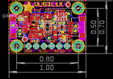
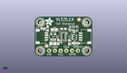
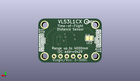
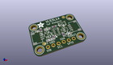

Contents
========

* [PROJ-ADAF-3967-STAN-01>Adafruit VL53L1X PCB](#proj-adaf-3967-stan-01adafruit-vl53l1x-pcb)
	* [Images](#images)
	* [Interactive BOM](#interactive-bom)
	* [OOMP Parts](#oomp-parts)
	* [Tags](#tags)
  
![][im]
# PROJ-ADAF-3967-STAN-01>Adafruit VL53L1X PCB

- ID: PROJ-ADAF-3967-STAN-01
- Hex ID: PRA3967
- Name: Adafruit VL53L1X PCB
- Description: 

## Images
  
  

|eagleImage|kicadPcb3dFront|kicadPcb3dBack|kicadPcb3d|
| :---: | :---: | :---: | :---: |
|||||

## Interactive BOM

- Interactive BOM page: [ibom.html](kicad/bom/ibom.html)

## OOMP Parts
  

|OOMP Parts|
| :---: |
|CAPC-0805-X-UNMATCHED-01, C4, 8.001, 5.715, 0,C4, 10uF, 0805-NO, microbuilder, (0.315, 0.225), R0|
|CAPC-0805-X-UNMATCHED-01, C5, 8.636000000000001, 11.937999999999999, 0,C5, 10uF, 0805-NO, microbuilder, (0.34, 0.47), R0|
|<table><tr><td></td><td> C6</td><td>[CAPC-0603-X-NF100-V50 SMD (0603) 100 nF Capacitor (Ceramic) 50v](https://github.com/oomlout/oomlout_OOMP_parts/tree/main/CAPC-0603-X-NF100-V50/)</td><td>[C6N100](https://github.com/oomlout/oomlout_OOMP_parts/tree/main/CAPC-0603-X-NF100-V50/)</td></tr></table>|
|UNMATCHED-UNMATCHED-X-UNMATCHED-01, CONN3, 22.733, 8.889999999999999, 90,CONN3, STEMMA_I2C_QT, JST_SH4, microbuilder, (0.895, 0.35), R90|
|UNMATCHED-UNMATCHED-X-UNMATCHED-01, CONN4, 2.667, 8.889999999999999, 270,CONN4, STEMMA_I2C_QT, JST_SH4, microbuilder, (0.105, 0.35), R270|
|UNMATCHED-UNMATCHED-X-UNMATCHED-01, D1, 18.160999999999998, 5.842, 180,D1, 1N4148, SOD-323, microbuilder, (0.715, 0.23), R180|
|UNMATCHED-UNMATCHED-X-UNMATCHED-01, D2, 3.6829999999999994, 12.572999999999999, 90,D2, GREEN, CHIPLED_0603_NOOUTLINE, microbuilder, (0.145, 0.495), R90|
|<table><tr><td></td><td> JP2</td><td>[HEAD-I01-X-PI06-01 2.54 mm 6 Pin Header](https://github.com/oomlout/oomlout_OOMP_parts/tree/main/HEAD-I01-X-PI06-01/)</td><td>[H06](https://github.com/oomlout/oomlout_OOMP_parts/tree/main/HEAD-I01-X-PI06-01/)</td></tr></table>|
|UNMATCHED-UNMATCHED-X-UNMATCHED-01, Q3, 17.525999999999996, 8.636000000000001, 90,Q3, BSS138, SOT363, microbuilder, (0.69, 0.34), R90|
|<table><tr><td></td><td> R1</td><td>[RESE-0603-X-O103-01 SMD (0603) 10k Ohm Resistor](https://github.com/oomlout/oomlout_OOMP_parts/tree/main/RESE-0603-X-O103-01/)</td><td>[R6103](https://github.com/oomlout/oomlout_OOMP_parts/tree/main/RESE-0603-X-O103-01/)</td></tr></table>|
|<table><tr><td></td><td> R2</td><td>[RESE-0603-X-O103-01 SMD (0603) 10k Ohm Resistor](https://github.com/oomlout/oomlout_OOMP_parts/tree/main/RESE-0603-X-O103-01/)</td><td>[R6103](https://github.com/oomlout/oomlout_OOMP_parts/tree/main/RESE-0603-X-O103-01/)</td></tr></table>|
|<table><tr><td></td><td> R3</td><td>[RESE-0603-X-O103-01 SMD (0603) 10k Ohm Resistor](https://github.com/oomlout/oomlout_OOMP_parts/tree/main/RESE-0603-X-O103-01/)</td><td>[R6103](https://github.com/oomlout/oomlout_OOMP_parts/tree/main/RESE-0603-X-O103-01/)</td></tr></table>|
|RESE-UNMATCHED-X-O103-01, R7, 17.145, 12.446, 180,R7, 10K, RESPACK_4X0603, microbuilder, (0.675, 0.49), R180|
|UNMATCHED-UNMATCHED-X-UNMATCHED-01, U1, 12.7, 8.889999999999999, 270,U1, VL53L0X, LGA12_ST, microbuilder, (0.5, 0.35), R270|
|UNMATCHED-UNMATCHED-X-UNMATCHED-01, U3, 8.128, 8.762999999999998, 0,U3, LP5907-2.8, SOT23-5, microbuilder, (0.32, 0.345), R0|

## Tags

- hexID: PRA3967
- oompType: PROJ
- oompSize: ADAF
- oompColor: 3967
- oompDesc: STAN
- oompIndex: 01
- oompName: Adafruit VL53L1X PCB
- sources: All source files from https://github.com/adafruit/Adafruit-VL53L1X-PCB (source licence details in srcLicense.md)
- linkBuyPage: http://www.adafruit.com/products/3967
- oompPart: CAPC-0805-X-UNMATCHED-01, C4, 8.001, 5.715, 0
- oompPart: CAPC-0805-X-UNMATCHED-01, C5, 8.636000000000001, 11.937999999999999, 0
- oompPart: CAPC-0603-X-NF100-V50, C6, 10.413999999999998, 6.476999999999999, 270
- oompPart: UNMATCHED-UNMATCHED-X-UNMATCHED-01, CONN3, 22.733, 8.889999999999999, 90
- oompPart: UNMATCHED-UNMATCHED-X-UNMATCHED-01, CONN4, 2.667, 8.889999999999999, 270
- oompPart: UNMATCHED-UNMATCHED-X-UNMATCHED-01, D1, 18.160999999999998, 5.842, 180
- oompPart: UNMATCHED-UNMATCHED-X-UNMATCHED-01, D2, 3.6829999999999994, 12.572999999999999, 90
- oompPart: SKIP-UNMATCHED-X-UNMATCHED-01, FID1, 5.206999999999999, 4.699, 0
- oompPart: SKIP-UNMATCHED-X-UNMATCHED-01, FID4, 19.558, 16.509999999999998, 0
- oompPart: HEAD-I01-X-PI06-01, JP2, 12.7, 2.54, 0
- oompPart: UNMATCHED-UNMATCHED-X-UNMATCHED-01, Q3, 17.525999999999996, 8.636000000000001, 90
- oompPart: RESE-0603-X-O103-01, R1, 12.7, 12.318999999999999, 0
- oompPart: RESE-0603-X-O103-01, R2, 15.239999999999998, 6.35, 90
- oompPart: RESE-0603-X-O103-01, R3, 5.715, 12.446, 270
- oompPart: RESE-UNMATCHED-X-O103-01, R7, 17.145, 12.446, 180
- oompPart: SKIP-UNMATCHED-X-UNMATCHED-01, SJ1, 4.953, 9.779, M0
- oompPart: SKIP-UNMATCHED-X-UNMATCHED-01, U$30, 2.54, 15.239999999999998, 0
- oompPart: SKIP-UNMATCHED-X-UNMATCHED-01, U$31, 22.86, 15.239999999999998, 0
- oompPart: SKIP-UNMATCHED-X-UNMATCHED-01, U$33, 2.54, 2.54, 0
- oompPart: SKIP-UNMATCHED-X-UNMATCHED-01, U$34, 22.86, 2.54, 0
- oompPart: UNMATCHED-UNMATCHED-X-UNMATCHED-01, U1, 12.7, 8.889999999999999, 270
- oompPart: UNMATCHED-UNMATCHED-X-UNMATCHED-01, U3, 8.128, 8.762999999999998, 0
- rawPart: C4, 10uF, 0805-NO, microbuilder, (0.315, 0.225), R0
- rawPart: C5, 10uF, 0805-NO, microbuilder, (0.34, 0.47), R0
- rawPart: C6, 0.1uF, 0603-NO, microbuilder, (0.41, 0.255), R270
- rawPart: CONN3, STEMMA_I2C_QT, JST_SH4, microbuilder, (0.895, 0.35), R90
- rawPart: CONN4, STEMMA_I2C_QT, JST_SH4, microbuilder, (0.105, 0.35), R270
- rawPart: D1, 1N4148, SOD-323, microbuilder, (0.715, 0.23), R180
- rawPart: D2, GREEN, CHIPLED_0603_NOOUTLINE, microbuilder, (0.145, 0.495), R90
- rawPart: FID1, FIDUCIAL_1MM, FIDUCIAL_1MM, microbuilder, (0.205, 0.185), R0
- rawPart: FID4, FIDUCIAL_1MM, FIDUCIAL_1MM, microbuilder, (0.77, 0.65), R0
- rawPart: JP2, 1X06_ROUND_70, microbuilder, (0.5, 0.1), R0
- rawPart: Q3, BSS138, SOT363, microbuilder, (0.69, 0.34), R90
- rawPart: R1, 10K, 0603-NO, microbuilder, (0.5, 0.485), R0
- rawPart: R2, 10K, 0603-NO, microbuilder, (0.6, 0.25), R90
- rawPart: R3, 10K, 0603-NO, microbuilder, (0.225, 0.49), R270
- rawPart: R7, 10K, RESPACK_4X0603, microbuilder, (0.675, 0.49), R180
- rawPart: SJ1, SOLDERJUMPER_CLOSEDWIRE, microbuilder, (0.195, 0.385), MR0
- rawPart: U$30, MOUNTINGHOLE2.5, MOUNTINGHOLE_2.5_PLATED, microbuilder, (0.1, 0.6), R0
- rawPart: U$31, MOUNTINGHOLE2.5, MOUNTINGHOLE_2.5_PLATED, microbuilder, (0.9, 0.6), R0
- rawPart: U$33, MOUNTINGHOLE2.5, MOUNTINGHOLE_2.5_PLATED, microbuilder, (0.1, 0.1), R0
- rawPart: U$34, MOUNTINGHOLE2.5, MOUNTINGHOLE_2.5_PLATED, microbuilder, (0.9, 0.1), R0
- rawPart: U1, VL53L0X, LGA12_ST, microbuilder, (0.5, 0.35), R270
- rawPart: U3, LP5907-2.8, SOT23-5, microbuilder, (0.32, 0.345), R0
- oompID: PROJ-ADAF-3967-STAN-01

[im]: kicadPcb3d_450.png
