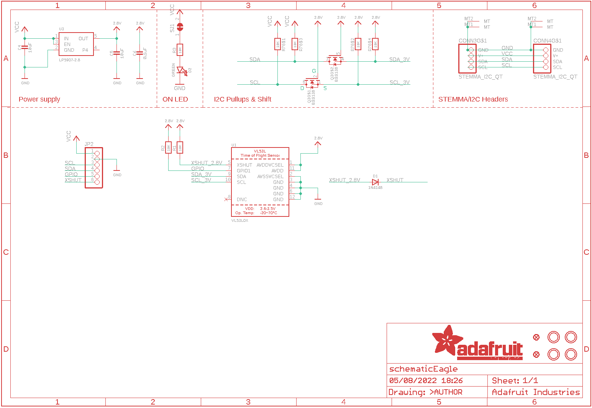
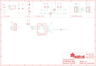

Contents
========

* [PRA3967 > Adafruit](#pra3967--adafruit)
	* [Schematic](#schematic)
	* [Interactive BOM](#interactive-bom)
	* [OOMP Parts](#oomp-parts)
	* [Images](#images)
	* [Tags](#tags)
  
![][im]
# PRA3967 > Adafruit

- ID: PROJ-ADAF-3967-STAN-01
- Hex ID: PRA3967
- Name: Adafruit
- Description: Adafruit
- Long Link: [http://oom.lt/PROJ-ADAF-3967-STAN-01](http://oom.lt/PROJ-ADAF-3967-STAN-01)
- Short Link: [http://oom.lt/PRA3967](http://oom.lt/PRA3967)

## Schematic
  

## Interactive BOM

- Interactive BOM page: [ibom.html](https://htmlpreview.github.io/?https://github.com/oomlout/oomlout_OOMP_projects/blob/main/PROJ-ADAF-3967-STAN-01/kicad/bom/ibom.html)

## OOMP Parts
  

|OOMP Parts|
| :---: |
|C4,CAPC-0805-X-UF10-V10,C4,10uF,CAP_CERAMIC0805-NOOUTLINE,0805-NO,Ceramic Capacitors,,|
|C5,CAPC-0805-X-UF10-V10,C5,10uF,CAP_CERAMIC0805-NOOUTLINE,0805-NO,Ceramic Capacitors,,|
|C6,CAPC-0603-X-NF100-V50,C6,0.1uF,CAP_CERAMIC0603_NO,0603-NO,Ceramic Capacitors,,|
|CONN3,UNMATCHED-UNMATCHED-X-UNMATCHED-01,CONN3,STEMMA_I2C_QT,STEMMA_I2C_QT,JST_SH4,,,|
|CONN4,UNMATCHED-UNMATCHED-X-UNMATCHED-01,CONN4,STEMMA_I2C_QT,STEMMA_I2C_QT,JST_SH4,,,|
|D1,DIOD-S323-X-K4148-01,D1,1N4148,DIODESOD-323,SOD-323,Diode,,|
|D2,LEDS-0603-G-STAN-01,D2,GREEN,LED0603_NOOUTLINE,CHIPLED_0603_NOOUTLINE,LED,,|
|JP2,HEAD-I01-X-PI06-01,FID1,FIDUCIAL_1MM,FIDUCIAL_1MM,FIDUCIAL_1MM,Fiducial Alignment Points,EXCLUDE,|
|Q3,MOSN-SO363-X-KBSS138-01,FID4,FIDUCIAL_1MM,FIDUCIAL_1MM,FIDUCIAL_1MM,Fiducial Alignment Points,EXCLUDE,|
|R1,RESE-0603-X-O103-01,JP2,,HEADER-1X670MIL,1X06_ROUND_70,PIN HEADER,,|
|R2,RESE-0603-X-O103-01,Q3,BSS138,MOSFET-N_DUAL,SOT363,Dual N-Channel MOSFET,,|
|R3,RESE-0603-X-O103-01,R1,10K,RESISTOR_0603_NOOUT,0603-NO,Resistors,,|
|R7,RESE-UNMATCHED-X-O103-01,R2,10K,RESISTOR_0603_NOOUT,0603-NO,Resistors,,|
|U1,UNMATCHED-UNMATCHED-X-UNMATCHED-01,R3,10K,RESISTOR_0603_NOOUT,0603-NO,Resistors,,|
|U3,UNMATCHED-SO235-X-UNMATCHED-01,R7,10K,RESISTOR_4PACK,RESPACK_4X0603,Resistor Packs (4 resistors),,|

## Images
  
  

|kicadPcb3d|kicadPcb3dFront|kicadPcb3dBack|eagleImage|eagleSchemImage|
| :---: | :---: | :---: | :---: | :---: |
||||||

## Tags

- hexID: PRA3967
- oompType: PROJ
- oompSize: ADAF
- oompColor: 3967
- oompDesc: STAN
- oompIndex: 01
- oompName: Adafruit VL53L1X PCB
- sources: All source files from https://github.com/adafruit/Adafruit-VL53L1X-PCB (source licence details in srcLicense.md)
- linkBuyPage: http://www.adafruit.com/products/3967
- oompID: PROJ-ADAF-3967-STAN-01
- oompParts: C4,CAPC-0805-X-UF10-V10
- oompParts: C5,CAPC-0805-X-UF10-V10
- oompParts: C6,CAPC-0603-X-NF100-V50
- oompParts: CONN3,UNMATCHED-UNMATCHED-X-UNMATCHED-01
- oompParts: CONN4,UNMATCHED-UNMATCHED-X-UNMATCHED-01
- oompParts: D1,DIOD-S323-X-K4148-01
- oompParts: D2,LEDS-0603-G-STAN-01
- oompParts: JP2,HEAD-I01-X-PI06-01
- oompParts: Q3,MOSN-SO363-X-KBSS138-01
- oompParts: R1,RESE-0603-X-O103-01
- oompParts: R2,RESE-0603-X-O103-01
- oompParts: R3,RESE-0603-X-O103-01
- oompParts: R7,RESE-UNMATCHED-X-O103-01
- oompParts: U1,UNMATCHED-UNMATCHED-X-UNMATCHED-01
- oompParts: U3,UNMATCHED-SO235-X-UNMATCHED-01
- rawParts: C4,10uF,CAP_CERAMIC0805-NOOUTLINE,0805-NO,Ceramic Capacitors,,
- rawParts: C5,10uF,CAP_CERAMIC0805-NOOUTLINE,0805-NO,Ceramic Capacitors,,
- rawParts: C6,0.1uF,CAP_CERAMIC0603_NO,0603-NO,Ceramic Capacitors,,
- rawParts: CONN3,STEMMA_I2C_QT,STEMMA_I2C_QT,JST_SH4,,,
- rawParts: CONN4,STEMMA_I2C_QT,STEMMA_I2C_QT,JST_SH4,,,
- rawParts: D1,1N4148,DIODESOD-323,SOD-323,Diode,,
- rawParts: D2,GREEN,LED0603_NOOUTLINE,CHIPLED_0603_NOOUTLINE,LED,,
- rawParts: FID1,FIDUCIAL_1MM,FIDUCIAL_1MM,FIDUCIAL_1MM,Fiducial Alignment Points,EXCLUDE,
- rawParts: FID4,FIDUCIAL_1MM,FIDUCIAL_1MM,FIDUCIAL_1MM,Fiducial Alignment Points,EXCLUDE,
- rawParts: JP2,,HEADER-1X670MIL,1X06_ROUND_70,PIN HEADER,,
- rawParts: Q3,BSS138,MOSFET-N_DUAL,SOT363,Dual N-Channel MOSFET,,
- rawParts: R1,10K,RESISTOR_0603_NOOUT,0603-NO,Resistors,,
- rawParts: R2,10K,RESISTOR_0603_NOOUT,0603-NO,Resistors,,
- rawParts: R3,10K,RESISTOR_0603_NOOUT,0603-NO,Resistors,,
- rawParts: R7,10K,RESISTOR_4PACK,RESPACK_4X0603,Resistor Packs (4 resistors),,
- rawParts: SJ1,,SOLDERJUMPER_CLOSED,SOLDERJUMPER_CLOSEDWIRE,Solder Jumper - Closed,,
- rawParts: U$30,MOUNTINGHOLE2.5,MOUNTINGHOLE2.5,MOUNTINGHOLE_2.5_PLATED,Mounting Hole,EXCLUDE,
- rawParts: U$31,MOUNTINGHOLE2.5,MOUNTINGHOLE2.5,MOUNTINGHOLE_2.5_PLATED,Mounting Hole,EXCLUDE,
- rawParts: U$33,MOUNTINGHOLE2.5,MOUNTINGHOLE2.5,MOUNTINGHOLE_2.5_PLATED,Mounting Hole,EXCLUDE,
- rawParts: U$34,MOUNTINGHOLE2.5,MOUNTINGHOLE2.5,MOUNTINGHOLE_2.5_PLATED,Mounting Hole,EXCLUDE,
- rawParts: U1,VL53L0X,VL53L0X,LGA12_ST,VL53L0X - Laser Time of Flight Sensor (2M range),,
- rawParts: U3,LP5907-2.8,VREG_SOT23-5,SOT23-5,SOT23-5 Fixed Voltage Regulators,,

[im]: kicadPcb3d_450.png
