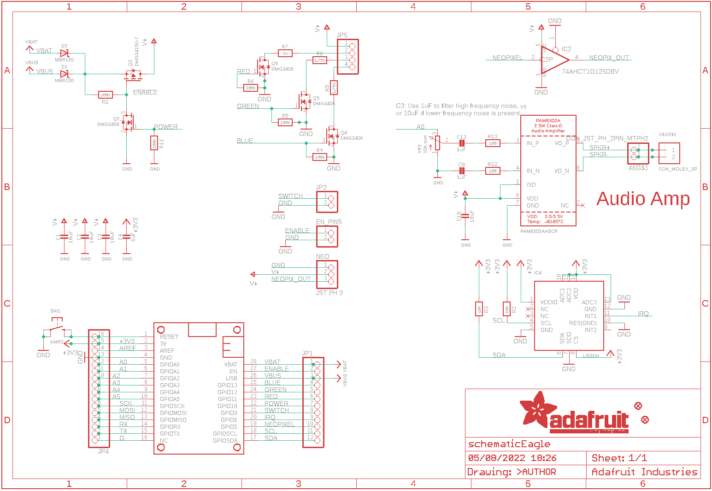
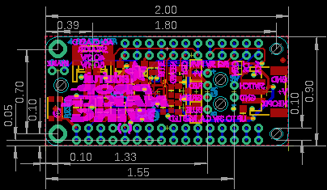
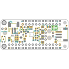
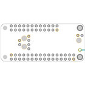
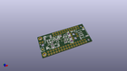
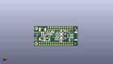
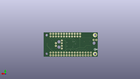
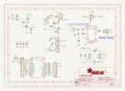
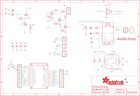

Contents
========

* [PRA3988 > Adafruit Prop Maker FeatherWing PCB](#pra3988--adafruit-prop-maker-featherwing-pcb)
	* [Schematic](#schematic)
	* [PCB](#pcb)
	* [Interactive BOM](#interactive-bom)
	* [OOMP Parts](#oomp-parts)
	* [Images](#images)
	* [Tags](#tags)
  
![][im]
# PRA3988 > Adafruit Prop Maker FeatherWing PCB

- ID: PROJ-ADAF-3988-STAN-01
- Hex ID: PRA3988
- Name: Adafruit 3988
- Description: Adafruit 3988
- Long Link: [http://oom.lt/PROJ-ADAF-3988-STAN-01](http://oom.lt/PROJ-ADAF-3988-STAN-01)
- Short Link: [http://oom.lt/PRA3988](http://oom.lt/PRA3988)

## Schematic
  

## PCB
  

## Interactive BOM

- Interactive BOM page: [ibom.html](https://htmlpreview.github.io/?https://github.com/oomlout/oomlout_OOMP_projects/blob/main/PROJ-ADAF-3988-STAN-01/kicad/bom/ibom.html)

## OOMP Parts
  

|OOMP ID|Name|Identifier|
| :---: | :---: | :---: |
|[CAPC-0805-X-UF10-V10](https://github.com/oomlout/oomlout_OOMP_parts/tree/main/CAPC-0805-X-UF10-V10/)|[SMD (0805) 10 uF Capacitor (Ceramic) 10v](https://github.com/oomlout/oomlout_OOMP_parts/tree/main/CAPC-0805-X-UF10-V10/)|[C1, C2, C3, C15](https://github.com/oomlout/oomlout_OOMP_parts/tree/main/CAPC-0805-X-UF10-V10/)|
|[CAPC-0603-X-UF1-V25](https://github.com/oomlout/oomlout_OOMP_parts/tree/main/CAPC-0603-X-UF1-V25/)|[SMD (0603) 1 uF Capacitor (Ceramic) 25v](https://github.com/oomlout/oomlout_OOMP_parts/tree/main/CAPC-0603-X-UF1-V25/)|[C4, C9, C13](https://github.com/oomlout/oomlout_OOMP_parts/tree/main/CAPC-0603-X-UF1-V25/)|
|[DIOD-S123-X-KMBR120-01](https://github.com/oomlout/oomlout_OOMP_parts/tree/main/DIOD-S123-X-KMBR120-01/)|[SMD (SOD-123) MBR120 Diode](https://github.com/oomlout/oomlout_OOMP_parts/tree/main/DIOD-S123-X-KMBR120-01/)|[D1, D2](https://github.com/oomlout/oomlout_OOMP_parts/tree/main/DIOD-S123-X-KMBR120-01/)|
|[HEAD-I01-X-PI02-01](https://github.com/oomlout/oomlout_OOMP_parts/tree/main/HEAD-I01-X-PI02-01/)|[2.54 mm 2 Pin Header](https://github.com/oomlout/oomlout_OOMP_parts/tree/main/HEAD-I01-X-PI02-01/)|[EN_PINS, JP2](https://github.com/oomlout/oomlout_OOMP_parts/tree/main/HEAD-I01-X-PI02-01/)|
|UNMATCHED-SO235-X-UNMATCHED-01||IC2|
|UNMATCHED-UNMATCHED-X-UNMATCHED-01||IC4, MS1, NEO, U$1, U5, VR2, X6|
|[HEAD-I01-X-PI12-01](https://github.com/oomlout/oomlout_OOMP_parts/tree/main/HEAD-I01-X-PI12-01/)|[2.54 mm 12 Pin Header](https://github.com/oomlout/oomlout_OOMP_parts/tree/main/HEAD-I01-X-PI12-01/)|[JP1](https://github.com/oomlout/oomlout_OOMP_parts/tree/main/HEAD-I01-X-PI12-01/)|
|[HEAD-I01-X-PI16-01](https://github.com/oomlout/oomlout_OOMP_parts/tree/main/HEAD-I01-X-PI16-01/)|[2.54 mm 16 Pin Header](https://github.com/oomlout/oomlout_OOMP_parts/tree/main/HEAD-I01-X-PI16-01/)|[JP4](https://github.com/oomlout/oomlout_OOMP_parts/tree/main/HEAD-I01-X-PI16-01/)|
|[HEAD-I01-X-PI04-01](https://github.com/oomlout/oomlout_OOMP_parts/tree/main/HEAD-I01-X-PI04-01/)|[2.54 mm 4 Pin Header](https://github.com/oomlout/oomlout_OOMP_parts/tree/main/HEAD-I01-X-PI04-01/)|[JP5](https://github.com/oomlout/oomlout_OOMP_parts/tree/main/HEAD-I01-X-PI04-01/)|
|MOSN-SO23-X-UNMATCHED-01||Q2, Q4, Q5, Q6|
|MOSP-SO23-X-UNMATCHED-01||Q3|
|RESE-0603-X-O1003-01||R1, R4, R5, R6, R11|
|[RESE-0603-X-O103-01](https://github.com/oomlout/oomlout_OOMP_parts/tree/main/RESE-0603-X-O103-01/)|[SMD (0603) 10k Ohm Resistor](https://github.com/oomlout/oomlout_OOMP_parts/tree/main/RESE-0603-X-O103-01/)|[R2, R3](https://github.com/oomlout/oomlout_OOMP_parts/tree/main/RESE-0603-X-O103-01/)|
|RESE-1206-X-UNMATCHED-01||R7, R8, R9|
|[RESE-0603-X-O101-01](https://github.com/oomlout/oomlout_OOMP_parts/tree/main/RESE-0603-X-O101-01/)|[SMD (0603) 100 Ohm Resistor](https://github.com/oomlout/oomlout_OOMP_parts/tree/main/RESE-0603-X-O101-01/)|[R12, R13](https://github.com/oomlout/oomlout_OOMP_parts/tree/main/RESE-0603-X-O101-01/)|
|[BUTA-4628-X-STAN-01](https://github.com/oomlout/oomlout_OOMP_parts/tree/main/BUTA-4628-X-STAN-01/)|[SMD (4628) Pushbutton (Tactile)](https://github.com/oomlout/oomlout_OOMP_parts/tree/main/BUTA-4628-X-STAN-01/)|[SW1](https://github.com/oomlout/oomlout_OOMP_parts/tree/main/BUTA-4628-X-STAN-01/)|

## Images
  
  

|bominteractivefront|bominteractiveback|kicadPcb3d|kicadPcb3dFront|kicadPcb3dBack|kicadSchem|eagleImage|eagleSchemImage|pcbdraw|pcbdrawback|
| :---: | :---: | :---: | :---: | :---: | :---: | :---: | :---: | :---: | :---: |
|||||||||||

## Tags

- hexID: PRA3988
- oompType: PROJ
- oompSize: ADAF
- oompColor: 3988
- oompDesc: STAN
- oompIndex: 01
- oompName: Adafruit Prop Maker FeatherWing PCB
- sources: All source files from https://github.com/adafruit/Adafruit-Prop-Maker-FeatherWing-PCB (source licence details in srcLicense.md)
- linkBuyPage: http://www.adafruit.com/products/3988
- oompID: PROJ-ADAF-3988-STAN-01
- oompParts: C1,CAPC-0805-X-UF10-V10
- oompParts: C2,CAPC-0805-X-UF10-V10
- oompParts: C3,CAPC-0805-X-UF10-V10
- oompParts: C4,CAPC-0603-X-UF1-V25
- oompParts: C9,CAPC-0603-X-UF1-V25
- oompParts: C13,CAPC-0603-X-UF1-V25
- oompParts: C15,CAPC-0805-X-UF10-V10
- oompParts: D1,DIOD-S123-X-KMBR120-01
- oompParts: D2,DIOD-S123-X-KMBR120-01
- oompParts: EN_PINS,HEAD-I01-X-PI02-01
- oompParts: IC2,UNMATCHED-SO235-X-UNMATCHED-01
- oompParts: IC4,UNMATCHED-UNMATCHED-X-UNMATCHED-01
- oompParts: JP1,HEAD-I01-X-PI12-01
- oompParts: JP2,HEAD-I01-X-PI02-01
- oompParts: JP4,HEAD-I01-X-PI16-01
- oompParts: JP5,HEAD-I01-X-PI04-01
- oompParts: MS1,UNMATCHED-UNMATCHED-X-UNMATCHED-01
- oompParts: NEO,UNMATCHED-UNMATCHED-X-UNMATCHED-01
- oompParts: Q2,MOSN-SO23-X-UNMATCHED-01
- oompParts: Q3,MOSP-SO23-X-UNMATCHED-01
- oompParts: Q4,MOSN-SO23-X-UNMATCHED-01
- oompParts: Q5,MOSN-SO23-X-UNMATCHED-01
- oompParts: Q6,MOSN-SO23-X-UNMATCHED-01
- oompParts: R1,RESE-0603-X-O1003-01
- oompParts: R2,RESE-0603-X-O103-01
- oompParts: R3,RESE-0603-X-O103-01
- oompParts: R4,RESE-0603-X-O1003-01
- oompParts: R5,RESE-0603-X-O1003-01
- oompParts: R6,RESE-0603-X-O1003-01
- oompParts: R7,RESE-1206-X-UNMATCHED-01
- oompParts: R8,RESE-1206-X-UNMATCHED-01
- oompParts: R9,RESE-1206-X-UNMATCHED-01
- oompParts: R11,RESE-0603-X-O1003-01
- oompParts: R12,RESE-0603-X-O101-01
- oompParts: R13,RESE-0603-X-O101-01
- oompParts: SW1,BUTA-4628-X-STAN-01
- oompParts: U$1,UNMATCHED-UNMATCHED-X-UNMATCHED-01
- oompParts: U5,UNMATCHED-UNMATCHED-X-UNMATCHED-01
- oompParts: VR2,UNMATCHED-UNMATCHED-X-UNMATCHED-01
- oompParts: X6,UNMATCHED-UNMATCHED-X-UNMATCHED-01
- rawParts: C1,10uF,CAP_CERAMIC0805-NOOUTLINE,0805-NO,Ceramic Capacitors,,
- rawParts: C2,10uF,CAP_CERAMIC0805-NOOUTLINE,0805-NO,Ceramic Capacitors,,
- rawParts: C3,10uF,CAP_CERAMIC0805-NOOUTLINE,0805-NO,Ceramic Capacitors,,
- rawParts: C4,1uF,CAP_CERAMIC0603_NO,0603-NO,Ceramic Capacitors,,
- rawParts: C9,1uF,CAP_CERAMIC0603_NO,0603-NO,Ceramic Capacitors,,
- rawParts: C13,1uF,CAP_CERAMIC0603_NO,0603-NO,Ceramic Capacitors,,
- rawParts: C15,10uF,CAP_CERAMIC0805-NOOUTLINE,0805-NO,Ceramic Capacitors,,
- rawParts: D1,MBR120,DIODE-SCHOTTKYSOD-123,SOD-123,,,
- rawParts: D2,MBR120,DIODE-SCHOTTKYSOD-123,SOD-123,,,
- rawParts: EN_PINS,,HEADER-1X2ROUND,1X02_ROUND,PIN HEADER,,
- rawParts: FID1,FIDUCIAL_1MM,FIDUCIAL_1MM,FIDUCIAL_1MM,Fiducial Alignment Points,EXCLUDE,
- rawParts: FID3,FIDUCIAL_1MM,FIDUCIAL_1MM,FIDUCIAL_1MM,Fiducial Alignment Points,EXCLUDE,
- rawParts: IC2,74AHCT1G125DBV,74AHCT1G125DBV,SOT23-5,Single Bus Buffer Gate with 3-State Output,,
- rawParts: IC4,LIS3DH,ACCEL_LIS3DHTR,LGA16_3X3MM,LIS3DHTR 3-Axis Accelerometer with I2C/SPI Interface,,
- rawParts: JP1,,HEADER-1X12,1X12_ROUND,,,
- rawParts: JP2,,HEADER-1X2ROUND,1X02_ROUND,PIN HEADER,,
- rawParts: JP4,,HEADER-1X16ROUND,1X16_ROUND,PIN HEADER,,
- rawParts: JP5,,HEADER-1X4ROUND,1X04_ROUND,PIN HEADER,,
- rawParts: MS1,FEATHERWING,FEATHERWING,FEATHERWING,,,
- rawParts: NEO,JST PH 3,CON_JST_PH_3PIN,JSTPH3,,,
- rawParts: Q2,DMG3406,MOSFET-NWIDE,SOT23-WIDE,N-Channel Mosfet,,
- rawParts: Q3,DMG3415U-7,MOSFET-PWIDE,SOT23-WIDE,P-Channel Mosfet,,
- rawParts: Q4,DMG3406,MOSFET-NWIDE,SOT23-WIDE,N-Channel Mosfet,,
- rawParts: Q5,DMG3406,MOSFET-NWIDE,SOT23-WIDE,N-Channel Mosfet,,
- rawParts: Q6,DMG3406,MOSFET-NWIDE,SOT23-WIDE,N-Channel Mosfet,,
- rawParts: R1,100k,RESISTOR_0603_NOOUT,0603-NO,Resistors,,
- rawParts: R2,10K,RESISTOR_0603_NOOUT,0603-NO,Resistors,,
- rawParts: R3,10K,RESISTOR_0603_NOOUT,0603-NO,Resistors,,
- rawParts: R4,100k,RESISTOR_0603_NOOUT,0603-NO,Resistors,,
- rawParts: R5,100k,RESISTOR_0603_NOOUT,0603-NO,Resistors,,
- rawParts: R6,100k,RESISTOR_0603_NOOUT,0603-NO,Resistors,,
- rawParts: R7,3o,RESISTOR_1206,_1206,Resistors,,
- rawParts: R8,1.75o,RESISTOR_1206,_1206,Resistors,,
- rawParts: R9,1.75o,RESISTOR_1206,_1206,Resistors,,
- rawParts: R11,100K,RESISTOR_0603_NOOUT,0603-NO,Resistors,,
- rawParts: R12,100,RESISTOR_0603_NOOUT,0603-NO,Resistors,,
- rawParts: R13,100,RESISTOR_0603_NOOUT,0603-NO,Resistors,,
- rawParts: SW1,KMR2,SWITCH_TACT_SMT4.6X2.8,BTN_KMR2_4.6X2.8,SMT Tact Switches,,
- rawParts: U$1,CON_MOLEX_2P,CON_MOLEX_2P,53398-0271,,,
- rawParts: U5,PAM8302AASCR,AUDIOAMP_PAM8302A,MSOP8_0.65MM,PAM8302A - 2.5W Class-D Mono Audio Amplifier,,
- rawParts: VR2,10K trim,TRIMPOT3303W/X,TRIMPOT_BOURNS_3303W,3-Pin SMT Trimpots,,
- rawParts: X6,CON_JST_PH_2PIN_MTPH2,CON_JST_PH_2PIN_MTPH2,JSTPH2,,,

[im]: kicadPcb3d_450.png
