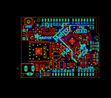

Contents
========

* [PROJ-ADAF-4000-STAN-01>Adafruit Metro M4 Express AirLift PCB](#proj-adaf-4000-stan-01adafruit-metro-m4-express-airlift-pcb)
	* [Images](#images)
	* [Interactive BOM](#interactive-bom)
	* [OOMP Parts](#oomp-parts)
	* [Tags](#tags)
  
![][im]
# PROJ-ADAF-4000-STAN-01>Adafruit Metro M4 Express AirLift PCB

- ID: PROJ-ADAF-4000-STAN-01
- Hex ID: PRA4000
- Name: Adafruit Metro M4 Express AirLift PCB
- Description: 

## Images
  
  

|eagleImage|
| :---: |
||

## Interactive BOM

- Interactive BOM page: [ibom.html](kicad/bom/ibom.html)

## OOMP Parts
  

|OOMP Parts|
| :---: |
|UNMATCHED-UNMATCHED-X-UNMATCHED-01, AD, 57.15, 2.54, 0,AD, 20609, 1X06_OVALWAVE, microbuilder, (2.25, 0.1), R0|
|<table><tr><td></td><td> C1</td><td>[CAPC-0805-X-UF10-V25 SMD (0805) 10 uF Capacitor (Ceramic) 25v](https://github.com/oomlout/oomlout_OOMP_parts/tree/main/CAPC-0805-X-UF10-V25/)</td><td>[C85U010](https://github.com/oomlout/oomlout_OOMP_parts/tree/main/CAPC-0805-X-UF10-V25/)</td></tr></table>|
|<table><tr><td></td><td> C2</td><td>[CAPC-0805-X-NF100-V50 SMD (0805) 100 nF Capacitor (Ceramic) 50v](https://github.com/oomlout/oomlout_OOMP_parts/tree/main/CAPC-0805-X-NF100-V50/)</td><td>[C85N100](https://github.com/oomlout/oomlout_OOMP_parts/tree/main/CAPC-0805-X-NF100-V50/)</td></tr></table>|
|<table><tr><td></td><td> C3</td><td>[CAPC-0805-X-UF10-V25 SMD (0805) 10 uF Capacitor (Ceramic) 25v](https://github.com/oomlout/oomlout_OOMP_parts/tree/main/CAPC-0805-X-UF10-V25/)</td><td>[C85U010](https://github.com/oomlout/oomlout_OOMP_parts/tree/main/CAPC-0805-X-UF10-V25/)</td></tr></table>|
|CAPC-0603-X-UNMATCHED-01, C4, 47.7774, 23.2918, 315,C4, .1u, 0603-NO, microbuilder, (1.881, 0.917), R315|
|CAPE-0603-X-PF22-01, C5, 43.2562, 19.9644, 0,C5, 22pF, 0603-NO, microbuilder, (1.703, 0.786), R0|
|CAPC-0603-X-UNMATCHED-01, C6, 44.233200077999996, 9.246565708, 180,C6, .1u, 0603-NO, microbuilder, (1.74146457, 0.36403802), R180|
|CAPE-0603-X-PF22-01, C7, 46.2534, 19.8628, 180,C7, 22pF, 0603-NO, microbuilder, (1.821, 0.782), R180|
|CAPC-0603-X-UNMATCHED-01, C8, 37.814218757999996, 27.592587436, 135,C8, .1u, 0603-NO, microbuilder, (1.48874877, 1.08632234), R135|
|CAPC-0603-X-UNMATCHED-01, C9, 33.746609418, 24.573596776, 225,C9, 1uF, 0603-NO, microbuilder, (1.32860667, 0.96746444), R225|
|CAPC-0603-X-UNMATCHED-01, C10, 44.209606271999995, 40.902187436, 225,C10, .1u, 0603-NO, microbuilder, (1.74053568, 1.61032234), R225|
|CAPC-0603-X-UNMATCHED-01, C11, 36.917996776, 33.719403224, 315,C11, .1u, 0603-NO, microbuilder, (1.45346444, 1.32753556), R315|
|<table><tr><td></td><td> C12</td><td>[CAPC-0603-X-NF100-V50 SMD (0603) 100 nF Capacitor (Ceramic) 50v](https://github.com/oomlout/oomlout_OOMP_parts/tree/main/CAPC-0603-X-NF100-V50/)</td><td>[C6N100](https://github.com/oomlout/oomlout_OOMP_parts/tree/main/CAPC-0603-X-NF100-V50/)</td></tr></table>|
|<table><tr><td></td><td> C13</td><td>[CAPC-0603-X-NF100-V50 SMD (0603) 100 nF Capacitor (Ceramic) 50v](https://github.com/oomlout/oomlout_OOMP_parts/tree/main/CAPC-0603-X-NF100-V50/)</td><td>[C6N100](https://github.com/oomlout/oomlout_OOMP_parts/tree/main/CAPC-0603-X-NF100-V50/)</td></tr></table>|
|CAPC-0603-X-UNMATCHED-01, C14, 13.739596854, 11.700368776, 180,C14, .1u, 0603-NO, microbuilder, (0.54092901, 0.46064444), R180|
|CAPC-0603-X-UNMATCHED-01, C15, 50.596799999999995, 25.681206194, 135,C15, .1u, 0603-NO, microbuilder, (1.992, 1.01107111), R135|
|CAPC-0603-X-UNMATCHED-01, C16, 58.7756, 31.6738, 270,C16, .1u, 0603-NO, microbuilder, (2.314, 1.247), R270|
|<table><tr><td></td><td> C17</td><td>[CAPC-0603-X-NF100-V50 SMD (0603) 100 nF Capacitor (Ceramic) 50v](https://github.com/oomlout/oomlout_OOMP_parts/tree/main/CAPC-0603-X-NF100-V50/)</td><td>[C6N100](https://github.com/oomlout/oomlout_OOMP_parts/tree/main/CAPC-0603-X-NF100-V50/)</td></tr></table>|
|<table><tr><td></td><td> C18</td><td>[CAPC-0805-X-UF10-V25 SMD (0805) 10 uF Capacitor (Ceramic) 25v](https://github.com/oomlout/oomlout_OOMP_parts/tree/main/CAPC-0805-X-UF10-V25/)</td><td>[C85U010](https://github.com/oomlout/oomlout_OOMP_parts/tree/main/CAPC-0805-X-UF10-V25/)</td></tr></table>|
|<table><tr><td></td><td> C19</td><td>[CAPC-0805-X-UF10-V25 SMD (0805) 10 uF Capacitor (Ceramic) 25v](https://github.com/oomlout/oomlout_OOMP_parts/tree/main/CAPC-0805-X-UF10-V25/)</td><td>[C85U010](https://github.com/oomlout/oomlout_OOMP_parts/tree/main/CAPC-0805-X-UF10-V25/)</td></tr></table>|
|<table><tr><td></td><td> C20</td><td>[CAPC-0805-X-UF10-V25 SMD (0805) 10 uF Capacitor (Ceramic) 25v](https://github.com/oomlout/oomlout_OOMP_parts/tree/main/CAPC-0805-X-UF10-V25/)</td><td>[C85U010](https://github.com/oomlout/oomlout_OOMP_parts/tree/main/CAPC-0805-X-UF10-V25/)</td></tr></table>|
|UNMATCHED-UNMATCHED-X-UNMATCHED-01, D1, 18.415, 7.467599999999999, 180,D1, MBR120, SOD-123, microbuilder, (0.725, 0.294), R180|
|UNMATCHED-UNMATCHED-X-UNMATCHED-01, ECC1, 22.86, 41.91, 270,ECC1, ATECC108, SOIC8, cryptotronix, (0.9, 1.65), R270|
|UNMATCHED-UNMATCHED-X-UNMATCHED-01, F2, 9.1694, 40.386, 0,F2, FUSE, R1206, adafruit, (0.361, 1.59), R0|
|UNMATCHED-0805-X-UNMATCHED-01, FB2, 1.778, 44.830999999999996, 270,FB2, FERRITE, 0805-NO, microbuilder, (0.07, 1.765), R270|
|UNMATCHED-UNMATCHED-X-UNMATCHED-01, FD1, 1.397, 49.529999999999994, 0,FD1, FIDUCIAL_1MM, FIDUCIAL_1MM, microbuilder, (0.055, 1.95), R0|
|UNMATCHED-UNMATCHED-X-UNMATCHED-01, FD2, 66.159000016, 4.549000046, 0,FD2, FIDUCIAL_1MM, FIDUCIAL_1MM, microbuilder, (2.60468504, 0.17909449), R0|
|UNMATCHED-UNMATCHED-X-UNMATCHED-01, FD3, 1.6725999059999999, 1.8606000379999998, 0,FD3, FIDUCIAL_1MM, FIDUCIAL_1MM, microbuilder, (0.06585039, 0.07325197), R0|
|UNMATCHED-UNMATCHED-X-UNMATCHED-01, GROUND1, 7.112, 44.704, M180,GROUND1, SOLDERJUMPER_CLOSEDWIRE, microbuilder, (0.28, 1.76), MR180|
|UNMATCHED-UNMATCHED-X-UNMATCHED-01, IC1, 9.524999999999999, 35.05199999999999, 0,IC1, 74AHC1G125, SOT23-5L, adafruit, (0.375, 1.38), R0|
|UNMATCHED-UNMATCHED-X-UNMATCHED-01, IC3, 28.524199999999997, 27.762199999999996, 270,IC3, 74LVC1G125D, SOT23-5, 74xx-little-de, (1.123, 1.093), R270|
|ERROR, ICSP 3x2 M, 0, 0, 0,ICSP, 3x2, M, 2X03_ROUND_70MIL, microbuilder, (2.545, 1.1), R270|
|UNMATCHED-UNMATCHED-X-UNMATCHED-01, IOH, 30.225999999999996, 50.8, 0,IOH, 20611, 1X10_OVALWAVE, microbuilder, (1.19, 2), R0|
|UNMATCHED-UNMATCHED-X-UNMATCHED-01, IOL, 54.60999999999999, 50.8, 0,IOL, 20610, 1X08_OVALWAVE, microbuilder, (2.15, 2), R0|
|UNMATCHED-UNMATCHED-X-UNMATCHED-01, JP1, 22.224999999999998, 8.737599999999999, 0,JP1, 1X01_ROUND, microbuilder, (0.875, 0.344), R0|
|UNMATCHED-UNMATCHED-X-UNMATCHED-01, L, 64.2874, 13.2334, 270,L, RED, CHIPLED_0805_NOOUTLINE, microbuilder, (2.531, 0.521), R270|
|UNMATCHED-UNMATCHED-X-UNMATCHED-01, L1, 36.527003146, 26.138403145999995, 315,L1, 10uH, INDUCTOR_1007, microbuilder, (1.43807099, 1.02907099), R315|
|UNMATCHED-UNMATCHED-X-UNMATCHED-01, LED1, 14.477999999999998, 42.799, 180,LED1, WS2812B3535, LED3535, microbuilder, (0.57, 1.685), R180|
|UNMATCHED-UNMATCHED-X-UNMATCHED-01, ON, 64.2874, 20.3454, 90,ON, GREEN, CHIPLED_0805_NOOUTLINE, microbuilder, (2.531, 0.801), R90|
|UNMATCHED-UNMATCHED-X-UNMATCHED-01, PC1, 28.0924, 11.049, 90,PC1, 47uF/25V, PANASONIC_D, microbuilder, (1.106, 0.435), R90|
|UNMATCHED-UNMATCHED-X-UNMATCHED-01, PC2, 31.267400000000002, 19.2278, 0,PC2, 47uF+/6.3V+, PANASONIC_D, microbuilder, (1.231, 0.757), R0|
|UNMATCHED-UNMATCHED-X-UNMATCHED-01, POWER, 36.83, 2.54, 0,POWER, 20610, 1X08_OVALWAVE, microbuilder, (1.45, 0.1), R0|
|RESE-UNMATCHED-X-O104-01, R1, 31.978599999999997, 27.406599999999997, 90,R1, 100K, RESPACK_4X0603, microbuilder, (1.259, 1.079), R90|
|RESE-UNMATCHED-X-O102-01, R2, 58.82639999999999, 19.0754, 90,R2, 1K, RESPACK_4X0603, microbuilder, (2.316, 0.751), R90|
|<table><tr><td></td><td> R4</td><td>[RESE-0603-X-O102-01 SMD (0603) 1k Ohm Resistor](https://github.com/oomlout/oomlout_OOMP_parts/tree/main/RESE-0603-X-O102-01/)</td><td>[R6102](https://github.com/oomlout/oomlout_OOMP_parts/tree/main/RESE-0603-X-O102-01/)</td></tr></table>|
|<table><tr><td></td><td> R5</td><td>[RESE-0603-X-O103-01 SMD (0603) 10k Ohm Resistor](https://github.com/oomlout/oomlout_OOMP_parts/tree/main/RESE-0603-X-O103-01/)</td><td>[R6103](https://github.com/oomlout/oomlout_OOMP_parts/tree/main/RESE-0603-X-O103-01/)</td></tr></table>|
|<table><tr><td></td><td> R7</td><td>[RESE-0603-X-O103-01 SMD (0603) 10k Ohm Resistor](https://github.com/oomlout/oomlout_OOMP_parts/tree/main/RESE-0603-X-O103-01/)</td><td>[R6103](https://github.com/oomlout/oomlout_OOMP_parts/tree/main/RESE-0603-X-O103-01/)</td></tr></table>|
|RESE-UNMATCHED-X-O103-01, R10, 28.828999999999997, 41.401999999999994, 90,R10, 10K, RESPACK_4X0603, microbuilder, (1.135, 1.63), R90|
|RESE-0603-X-UNMATCHED-01, R11, 28.2448, 30.5054, 0,R11, 330R, 0603-NO, microbuilder, (1.112, 1.201), R0|
|<table><tr><td></td><td> R15</td><td>[RESE-0603-X-O103-01 SMD (0603) 10k Ohm Resistor](https://github.com/oomlout/oomlout_OOMP_parts/tree/main/RESE-0603-X-O103-01/)</td><td>[R6103](https://github.com/oomlout/oomlout_OOMP_parts/tree/main/RESE-0603-X-O103-01/)</td></tr></table>|
|ERROR, RESET EVQQ 6mm, 0, 0, 0,RESET, EVQQ, 6mm, EVQ-Q2_SMALLER, microbuilder, (0.25, 1.945), R180|
|UNMATCHED-UNMATCHED-X-UNMATCHED-01, RXLED, 64.2874, 15.5194, 90,RXLED, YELLOW, CHIPLED_0805_NOOUTLINE, microbuilder, (2.531, 0.611), R90|
|UNMATCHED-UNMATCHED-X-UNMATCHED-01, SJ1, 50.762799922, 22.298115678, 225,SJ1, AREF_3V, SOLDERJUMPER_CLOSEDWIRE, microbuilder, (1.99853543, 0.87787857), R225|
|UNMATCHED-UNMATCHED-X-UNMATCHED-01, SW1, 21.9456, 2.8447999999999998, 0,SW1, SPDT_SMT_SSSS811101, microbuilder, (0.864, 0.112), R0|
|UNMATCHED-UNMATCHED-X-UNMATCHED-01, T2, 19.685, 9.906, 90,T2, DMP3098L-7, SOT-23, zetex, (0.775, 0.39), R90|
|UNMATCHED-UNMATCHED-X-UNMATCHED-01, TR1, 29.108399999999996, 24.231599999999997, 270,TR1, DMP3098L-7, SOT-23, Transistors, (1.146, 0.954), R270|
|UNMATCHED-UNMATCHED-X-UNMATCHED-01, TXLED, 64.2874, 17.8054, 90,TXLED, YELLOW, CHIPLED_0805_NOOUTLINE, microbuilder, (2.531, 0.701), R90|
|UNMATCHED-UNMATCHED-X-UNMATCHED-01, U1, 35.66159999999999, 11.049, 270,U1, NCP1117ST50T3G, SOT223-R, microbuilder, (1.404, 0.435), R270|
|UNMATCHED-UNMATCHED-X-UNMATCHED-01, U2, 43.815, 11.43, 270,U2, AP2112K-3.3, SOT23-DBV, SmartPrj, (1.725, 0.45), R270|
|UNMATCHED-UNMATCHED-X-UNMATCHED-01, U3, 55.52439999999999, 34.5948, 180,U3, GD25Q16, SOIC8_208MIL, microbuilder, (2.186, 1.362), R180|
|ERROR, X2 2x5 0.05, 0, 0, 0,X2, 2x5, 0.05, SWD, 2X05_1.27MM_BOX_POSTS, microbuilder, (2.16, 0.505), R0|
|UNMATCHED-UNMATCHED-X-UNMATCHED-01, X3, 4.3180000000000005, 38.099999999999994, 270,X3, 20329, 4UCONN_20329_V2, microbuilder, (0.17, 1.5), R270|
|UNMATCHED-UNMATCHED-X-UNMATCHED-01, X4, 44.6532, 21.8694, 180,X4, 32.768, XTAL3215, adafruit2, (1.758, 0.861), R180|
|UNMATCHED-UNMATCHED-X-UNMATCHED-01, X5, -3.302, 7.746999999999999, 0,X5, 2.1mm, DCJACK_2MM_PTH, microbuilder, (-0.13, 0.305), R0|
|UNMATCHED-UNMATCHED-X-UNMATCHED-01, X6, 12.6238, 22.8854, 90,X6, ESP32_WROOM32, WROOM32, microbuilder, (0.497, 0.901), R90|

## Tags

- hexID: PRA4000
- oompType: PROJ
- oompSize: ADAF
- oompColor: 4000
- oompDesc: STAN
- oompIndex: 01
- oompName: Adafruit Metro M4 Express AirLift PCB
- sources: All source files from https://github.com/adafruit/Adafruit-Metro-M4-Express-AirLift-PCB (source licence details in srcLicense.md)
- linkBuyPage: http://www.adafruit.com/products/4000
- oompPart: UNMATCHED-UNMATCHED-X-UNMATCHED-01, AD, 57.15, 2.54, 0
- oompPart: CAPC-0805-X-UF10-V25, C1, 34.87780934, 23.3426, 225
- oompPart: CAPC-0805-X-NF100-V50, C2, 36.57599999999999, 16.128999999999998, 180
- oompPart: CAPC-0805-X-UF10-V25, C3, 46.99, 11.43, 90
- oompPart: CAPC-0603-X-UNMATCHED-01, C4, 47.7774, 23.2918, 315
- oompPart: CAPE-0603-X-PF22-01, C5, 43.2562, 19.9644, 0
- oompPart: CAPC-0603-X-UNMATCHED-01, C6, 44.233200077999996, 9.246565708, 180
- oompPart: CAPE-0603-X-PF22-01, C7, 46.2534, 19.8628, 180
- oompPart: CAPC-0603-X-UNMATCHED-01, C8, 37.814218757999996, 27.592587436, 135
- oompPart: CAPC-0603-X-UNMATCHED-01, C9, 33.746609418, 24.573596776, 225
- oompPart: CAPC-0603-X-UNMATCHED-01, C10, 44.209606271999995, 40.902187436, 225
- oompPart: CAPC-0603-X-UNMATCHED-01, C11, 36.917996776, 33.719403224, 315
- oompPart: CAPC-0603-X-NF100-V50, C12, 23.9776, 9.5504, 270
- oompPart: CAPC-0603-X-NF100-V50, C13, 18.034, 42.799, 270
- oompPart: CAPC-0603-X-UNMATCHED-01, C14, 13.739596854, 11.700368776, 180
- oompPart: CAPC-0603-X-UNMATCHED-01, C15, 50.596799999999995, 25.681206194, 135
- oompPart: CAPC-0603-X-UNMATCHED-01, C16, 58.7756, 31.6738, 270
- oompPart: CAPC-0603-X-NF100-V50, C17, 11.4046, 49.428399999999996, 270
- oompPart: CAPC-0805-X-UF10-V25, C18, 13.843, 10.16, 0
- oompPart: CAPC-0805-X-UF10-V25, C19, 13.843, 8.254999999999999, 0
- oompPart: CAPC-0805-X-UF10-V25, C20, 13.843, 6.35, 0
- oompPart: UNMATCHED-UNMATCHED-X-UNMATCHED-01, D1, 18.415, 7.467599999999999, 180
- oompPart: UNMATCHED-UNMATCHED-X-UNMATCHED-01, ECC1, 22.86, 41.91, 270
- oompPart: UNMATCHED-UNMATCHED-X-UNMATCHED-01, F2, 9.1694, 40.386, 0
- oompPart: UNMATCHED-0805-X-UNMATCHED-01, FB2, 1.778, 44.830999999999996, 270
- oompPart: UNMATCHED-UNMATCHED-X-UNMATCHED-01, FD1, 1.397, 49.529999999999994, 0
- oompPart: UNMATCHED-UNMATCHED-X-UNMATCHED-01, FD2, 66.159000016, 4.549000046, 0
- oompPart: UNMATCHED-UNMATCHED-X-UNMATCHED-01, FD3, 1.6725999059999999, 1.8606000379999998, 0
- oompPart: UNMATCHED-UNMATCHED-X-UNMATCHED-01, GROUND1, 7.112, 44.704, M180
- oompPart: UNMATCHED-UNMATCHED-X-UNMATCHED-01, IC1, 9.524999999999999, 35.05199999999999, 0
- oompPart: UNMATCHED-UNMATCHED-X-UNMATCHED-01, IC3, 28.524199999999997, 27.762199999999996, 270
- oompPart: ERROR, ICSP 3x2 M, 0, 0, 0
- oompPart: UNMATCHED-UNMATCHED-X-UNMATCHED-01, IOH, 30.225999999999996, 50.8, 0
- oompPart: UNMATCHED-UNMATCHED-X-UNMATCHED-01, IOL, 54.60999999999999, 50.8, 0
- oompPart: UNMATCHED-UNMATCHED-X-UNMATCHED-01, JP1, 22.224999999999998, 8.737599999999999, 0
- oompPart: UNMATCHED-UNMATCHED-X-UNMATCHED-01, L, 64.2874, 13.2334, 270
- oompPart: UNMATCHED-UNMATCHED-X-UNMATCHED-01, L1, 36.527003146, 26.138403145999995, 315
- oompPart: UNMATCHED-UNMATCHED-X-UNMATCHED-01, LED1, 14.477999999999998, 42.799, 180
- oompPart: UNMATCHED-UNMATCHED-X-UNMATCHED-01, ON, 64.2874, 20.3454, 90
- oompPart: UNMATCHED-UNMATCHED-X-UNMATCHED-01, PC1, 28.0924, 11.049, 90
- oompPart: UNMATCHED-UNMATCHED-X-UNMATCHED-01, PC2, 31.267400000000002, 19.2278, 0
- oompPart: UNMATCHED-UNMATCHED-X-UNMATCHED-01, POWER, 36.83, 2.54, 0
- oompPart: RESE-UNMATCHED-X-O104-01, R1, 31.978599999999997, 27.406599999999997, 90
- oompPart: RESE-UNMATCHED-X-O102-01, R2, 58.82639999999999, 19.0754, 90
- oompPart: RESE-0603-X-O102-01, R4, 50.038, 16.256, 180
- oompPart: RESE-0603-X-O103-01, R5, 58.7502, 35.331399999999995, 270
- oompPart: RESE-0603-X-O103-01, R7, 17.018, 9.906, 270
- oompPart: RESE-UNMATCHED-X-O103-01, R10, 28.828999999999997, 41.401999999999994, 90
- oompPart: RESE-0603-X-UNMATCHED-01, R11, 28.2448, 30.5054, 0
- oompPart: RESE-0603-X-O103-01, R15, 44.932599999999994, 16.357599999999998, 180
- oompPart: ERROR, RESET EVQQ 6mm, 0, 0, 0
- oompPart: UNMATCHED-UNMATCHED-X-UNMATCHED-01, RXLED, 64.2874, 15.5194, 90
- oompPart: UNMATCHED-UNMATCHED-X-UNMATCHED-01, SJ1, 50.762799922, 22.298115678, 225
- oompPart: UNMATCHED-UNMATCHED-X-UNMATCHED-01, SW1, 21.9456, 2.8447999999999998, 0
- oompPart: UNMATCHED-UNMATCHED-X-UNMATCHED-01, T2, 19.685, 9.906, 90
- oompPart: UNMATCHED-UNMATCHED-X-UNMATCHED-01, TR1, 29.108399999999996, 24.231599999999997, 270
- oompPart: UNMATCHED-UNMATCHED-X-UNMATCHED-01, TXLED, 64.2874, 17.8054, 90
- oompPart: SKIP-UNMATCHED-X-UNMATCHED-01, U$1, 44.905396853999996, 32.314212485999995, 135
- oompPart: UNMATCHED-UNMATCHED-X-UNMATCHED-01, U1, 35.66159999999999, 11.049, 270
- oompPart: UNMATCHED-UNMATCHED-X-UNMATCHED-01, U2, 43.815, 11.43, 270
- oompPart: UNMATCHED-UNMATCHED-X-UNMATCHED-01, U3, 55.52439999999999, 34.5948, 180
- oompPart: ERROR, X2 2x5 0.05, 0, 0, 0
- oompPart: UNMATCHED-UNMATCHED-X-UNMATCHED-01, X3, 4.3180000000000005, 38.099999999999994, 270
- oompPart: UNMATCHED-UNMATCHED-X-UNMATCHED-01, X4, 44.6532, 21.8694, 180
- oompPart: UNMATCHED-UNMATCHED-X-UNMATCHED-01, X5, -3.302, 7.746999999999999, 0
- oompPart: UNMATCHED-UNMATCHED-X-UNMATCHED-01, X6, 12.6238, 22.8854, 90
- rawPart: AD, 20609, 1X06_OVALWAVE, microbuilder, (2.25, 0.1), R0
- rawPart: C1, 10uF, 0805-NO, microbuilder, (1.3731421, 0.919), R225
- rawPart: C2, 0.1uF, 0805-NO, microbuilder, (1.44, 0.635), R180
- rawPart: C3, 10uF, 0805-NO, microbuilder, (1.85, 0.45), R90
- rawPart: C4, .1u, 0603-NO, microbuilder, (1.881, 0.917), R315
- rawPart: C5, 22pF, 0603-NO, microbuilder, (1.703, 0.786), R0
- rawPart: C6, .1u, 0603-NO, microbuilder, (1.74146457, 0.36403802), R180
- rawPart: C7, 22pF, 0603-NO, microbuilder, (1.821, 0.782), R180
- rawPart: C8, .1u, 0603-NO, microbuilder, (1.48874877, 1.08632234), R135
- rawPart: C9, 1uF, 0603-NO, microbuilder, (1.32860667, 0.96746444), R225
- rawPart: C10, .1u, 0603-NO, microbuilder, (1.74053568, 1.61032234), R225
- rawPart: C11, .1u, 0603-NO, microbuilder, (1.45346444, 1.32753556), R315
- rawPart: C12, 0.1uF, 0603-NO, microbuilder, (0.944, 0.376), R270
- rawPart: C13, 0.1uF, 0603-NO, microbuilder, (0.71, 1.685), R270
- rawPart: C14, .1u, 0603-NO, microbuilder, (0.54092901, 0.46064444), R180
- rawPart: C15, .1u, 0603-NO, microbuilder, (1.992, 1.01107111), R135
- rawPart: C16, .1u, 0603-NO, microbuilder, (2.314, 1.247), R270
- rawPart: C17, 0.1uF, 0603-NO, microbuilder, (0.449, 1.946), R270
- rawPart: C18, 10uF, 0805-NO, microbuilder, (0.545, 0.4), R0
- rawPart: C19, 10uF, 0805-NO, microbuilder, (0.545, 0.325), R0
- rawPart: C20, 10uF, 0805-NO, microbuilder, (0.545, 0.25), R0
- rawPart: D1, MBR120, SOD-123, microbuilder, (0.725, 0.294), R180
- rawPart: ECC1, ATECC108, SOIC8, cryptotronix, (0.9, 1.65), R270
- rawPart: F2, FUSE, R1206, adafruit, (0.361, 1.59), R0
- rawPart: FB2, FERRITE, 0805-NO, microbuilder, (0.07, 1.765), R270
- rawPart: FD1, FIDUCIAL_1MM, FIDUCIAL_1MM, microbuilder, (0.055, 1.95), R0
- rawPart: FD2, FIDUCIAL_1MM, FIDUCIAL_1MM, microbuilder, (2.60468504, 0.17909449), R0
- rawPart: FD3, FIDUCIAL_1MM, FIDUCIAL_1MM, microbuilder, (0.06585039, 0.07325197), R0
- rawPart: GROUND1, SOLDERJUMPER_CLOSEDWIRE, microbuilder, (0.28, 1.76), MR180
- rawPart: IC1, 74AHC1G125, SOT23-5L, adafruit, (0.375, 1.38), R0
- rawPart: IC3, 74LVC1G125D, SOT23-5, 74xx-little-de, (1.123, 1.093), R270
- rawPart: ICSP, 3x2, M, 2X03_ROUND_70MIL, microbuilder, (2.545, 1.1), R270
- rawPart: IOH, 20611, 1X10_OVALWAVE, microbuilder, (1.19, 2), R0
- rawPart: IOL, 20610, 1X08_OVALWAVE, microbuilder, (2.15, 2), R0
- rawPart: JP1, 1X01_ROUND, microbuilder, (0.875, 0.344), R0
- rawPart: L, RED, CHIPLED_0805_NOOUTLINE, microbuilder, (2.531, 0.521), R270
- rawPart: L1, 10uH, INDUCTOR_1007, microbuilder, (1.43807099, 1.02907099), R315
- rawPart: LED1, WS2812B3535, LED3535, microbuilder, (0.57, 1.685), R180
- rawPart: ON, GREEN, CHIPLED_0805_NOOUTLINE, microbuilder, (2.531, 0.801), R90
- rawPart: PC1, 47uF/25V, PANASONIC_D, microbuilder, (1.106, 0.435), R90
- rawPart: PC2, 47uF+/6.3V+, PANASONIC_D, microbuilder, (1.231, 0.757), R0
- rawPart: POWER, 20610, 1X08_OVALWAVE, microbuilder, (1.45, 0.1), R0
- rawPart: R1, 100K, RESPACK_4X0603, microbuilder, (1.259, 1.079), R90
- rawPart: R2, 1K, RESPACK_4X0603, microbuilder, (2.316, 0.751), R90
- rawPart: R4, 1K, 0603-NO, microbuilder, (1.97, 0.64), R180
- rawPart: R5, 10K, 0603-NO, microbuilder, (2.313, 1.391), R270
- rawPart: R7, 10K, 0603-NO, microbuilder, (0.67, 0.39), R270
- rawPart: R10, 10K, RESPACK_4X0603, microbuilder, (1.135, 1.63), R90
- rawPart: R11, 330R, 0603-NO, microbuilder, (1.112, 1.201), R0
- rawPart: R15, 10K, 0603-NO, microbuilder, (1.769, 0.644), R180
- rawPart: RESET, EVQQ, 6mm, EVQ-Q2_SMALLER, microbuilder, (0.25, 1.945), R180
- rawPart: RXLED, YELLOW, CHIPLED_0805_NOOUTLINE, microbuilder, (2.531, 0.611), R90
- rawPart: SJ1, AREF_3V, SOLDERJUMPER_CLOSEDWIRE, microbuilder, (1.99853543, 0.87787857), R225
- rawPart: SW1, SPDT_SMT_SSSS811101, microbuilder, (0.864, 0.112), R0
- rawPart: T2, DMP3098L-7, SOT-23, zetex, (0.775, 0.39), R90
- rawPart: TR1, DMP3098L-7, SOT-23, Transistors, (1.146, 0.954), R270
- rawPart: TXLED, YELLOW, CHIPLED_0805_NOOUTLINE, microbuilder, (2.531, 0.701), R90
- rawPart: U$1, ATSAMD51J19, PQFN64-1, microbuilder, (1.76792901, 1.27221309), R135
- rawPart: U1, NCP1117ST50T3G, SOT223-R, microbuilder, (1.404, 0.435), R270
- rawPart: U2, AP2112K-3.3, SOT23-DBV, SmartPrj, (1.725, 0.45), R270
- rawPart: U3, GD25Q16, SOIC8_208MIL, microbuilder, (2.186, 1.362), R180
- rawPart: X2, 2x5, 0.05, SWD, 2X05_1.27MM_BOX_POSTS, microbuilder, (2.16, 0.505), R0
- rawPart: X3, 20329, 4UCONN_20329_V2, microbuilder, (0.17, 1.5), R270
- rawPart: X4, 32.768, XTAL3215, adafruit2, (1.758, 0.861), R180
- rawPart: X5, 2.1mm, DCJACK_2MM_PTH, microbuilder, (-0.13, 0.305), R0
- rawPart: X6, ESP32_WROOM32, WROOM32, microbuilder, (0.497, 0.901), R90

[im]: eagleImage_450.png
