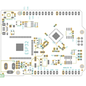
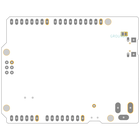
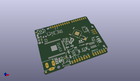
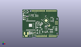
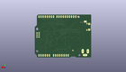
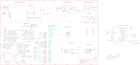
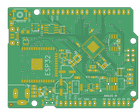
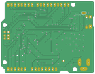

Contents
========

* [PRA4000 > Adafruit Metro M4 Express AirLift PCB](#pra4000--adafruit-metro-m4-express-airlift-pcb)
	* [Schematic](#schematic)
	* [PCB](#pcb)
	* [Interactive BOM](#interactive-bom)
	* [OOMP Parts](#oomp-parts)
	* [Images](#images)
	* [Tags](#tags)
  
![][im]
# PRA4000 > Adafruit Metro M4 Express AirLift PCB

- ID: PROJ-ADAF-4000-STAN-01
- Hex ID: PRA4000
- Name: Adafruit
- Description: Adafruit
- Long Link: [http://oom.lt/PROJ-ADAF-4000-STAN-01](http://oom.lt/PROJ-ADAF-4000-STAN-01)
- Short Link: [http://oom.lt/PRA4000](http://oom.lt/PRA4000)

## Schematic
  

## PCB
  

## Interactive BOM

- Interactive BOM page: [ibom.html](https://htmlpreview.github.io/?https://github.com/oomlout/oomlout_OOMP_projects/blob/main/PROJ-ADAF-4000-STAN-01/kicad/bom/ibom.html)

## OOMP Parts
  

|OOMP Parts|
| :---: |
|[HEAD-I01-X-PI06-01  2.54 mm 6 Pin Header  AD](https://github.com/oomlout/oomlout_OOMP_parts/tree/main/HEAD-I01-X-PI06-01/)|
|[CAPC-0805-X-UF10-V10  SMD (0805) 10 uF Capacitor (Ceramic) 10v  C1, C3, C18, C19, C20](https://github.com/oomlout/oomlout_OOMP_parts/tree/main/CAPC-0805-X-UF10-V10/)|
|[CAPC-0805-X-NF100-V50  SMD (0805) 100 nF Capacitor (Ceramic) 50v  C2](https://github.com/oomlout/oomlout_OOMP_parts/tree/main/CAPC-0805-X-NF100-V50/)|
|[CAPC-0603-X-NF100-V50  SMD (0603) 100 nF Capacitor (Ceramic) 50v  C4, C6, C8, C10, C11, C12, C13, C14, C15, C16, C17](https://github.com/oomlout/oomlout_OOMP_parts/tree/main/CAPC-0603-X-NF100-V50/)|
|[CAPC-0603-X-PF22-V50  SMD (0603) 22 pF Capacitor (Ceramic) 50v  C5, C7](https://github.com/oomlout/oomlout_OOMP_parts/tree/main/CAPC-0603-X-PF22-V50/)|
|[CAPC-0603-X-UF1-V25  SMD (0603) 1 uF Capacitor (Ceramic) 25v  C9](https://github.com/oomlout/oomlout_OOMP_parts/tree/main/CAPC-0603-X-UF1-V25/)|
|[DIOD-S123-X-KMBR120-01  SMD (SOD-123) MBR120 Diode  D1](https://github.com/oomlout/oomlout_OOMP_parts/tree/main/DIOD-S123-X-KMBR120-01/)|
|UNMATCHED-UNMATCHED-X-UNMATCHED-01 ECC1, L1, SW1, T2, TR1, U$1, U1, U3, X2, X3, X4, X5, X6|
|UNMATCHED-1206-X-UNMATCHED-01 F2|
|FERB-0805-X-UNMATCHED-01 FB2|
|UNMATCHED-SO235-X-UNMATCHED-01 IC1, IC3|
|[HEAD-I01-X-PI2X03-01  2.54 mm 6 Pin (2x3) Header  ICSP](https://github.com/oomlout/oomlout_OOMP_parts/tree/main/HEAD-I01-X-PI2X03-01/)|
|[HEAD-I01-X-PI10-01  2.54 mm 10 Pin Header  IOH](https://github.com/oomlout/oomlout_OOMP_parts/tree/main/HEAD-I01-X-PI10-01/)|
|[HEAD-I01-X-PI08-01  2.54 mm 8 Pin Header  IOL, POWER](https://github.com/oomlout/oomlout_OOMP_parts/tree/main/HEAD-I01-X-PI08-01/)|
|HEAD-I01-X-PI01-01 JP1|
|[LEDS-0805-R-STAN-01  SMD (0805) Red LED  L](https://github.com/oomlout/oomlout_OOMP_parts/tree/main/LEDS-0805-R-STAN-01/)|
|[LEDS-3535-RGB-K2812-01  SMD (3535) Smart Controller (WS2812B) RGB LED  LED1](https://github.com/oomlout/oomlout_OOMP_parts/tree/main/LEDS-3535-RGB-K2812-01/)|
|[LEDS-0805-G-STAN-01  SMD (0805) Green LED  ON](https://github.com/oomlout/oomlout_OOMP_parts/tree/main/LEDS-0805-G-STAN-01/)|
|[CAPE-PAND-X-UF47-V25  SMD (6.3 mm) (Panasonic D) 47 uF Capacitor (Electrolytic) 25v  PC1](https://github.com/oomlout/oomlout_OOMP_parts/tree/main/CAPE-PAND-X-UF47-V25/)|
|CAPE-PAND-X-UF47-V63D PC2|
|RESA-06038-X-O1003X4-01 R1|
|RESA-06038-X-O102X4-01 R2|
|[RESE-0603-X-O102-01  SMD (0603) 1k Ohm Resistor  R4](https://github.com/oomlout/oomlout_OOMP_parts/tree/main/RESE-0603-X-O102-01/)|
|[RESE-0603-X-O103-01  SMD (0603) 10k Ohm Resistor  R5, R7, R15](https://github.com/oomlout/oomlout_OOMP_parts/tree/main/RESE-0603-X-O103-01/)|
|RESA-06038-X-O103X4-01 R10|
|RESE-0603-X-UNMATCHED-01 R11|
|[BUTA-6060-X-STAN-01  SMD (6060) Pushbutton (Tactile)  RESET](https://github.com/oomlout/oomlout_OOMP_parts/tree/main/BUTA-6060-X-STAN-01/)|
|[LEDS-0805-Y-STAN-01  SMD (0805) Yellow LED  RXLED, TXLED](https://github.com/oomlout/oomlout_OOMP_parts/tree/main/LEDS-0805-Y-STAN-01/)|
|VREG-SO23-X-KAP2112K-01 U2|

## Images
  
  

|bominteractivefront|bominteractiveback|kicadPcb3d|kicadPcb3dFront|kicadPcb3dBack|eagleImage|eagleSchemImage|pcbdraw|pcbdrawback|
| :---: | :---: | :---: | :---: | :---: | :---: | :---: | :---: | :---: |
||||||||||

## Tags

- hexID: PRA4000
- oompType: PROJ
- oompSize: ADAF
- oompColor: 4000
- oompDesc: STAN
- oompIndex: 01
- oompName: Adafruit Metro M4 Express AirLift PCB
- sources: All source files from https://github.com/adafruit/Adafruit-Metro-M4-Express-AirLift-PCB (source licence details in srcLicense.md)
- linkBuyPage: http://www.adafruit.com/products/4000
- oompID: PROJ-ADAF-4000-STAN-01
- oompParts: AD,HEAD-I01-X-PI06-01
- oompParts: C1,CAPC-0805-X-UF10-V10
- oompParts: C2,CAPC-0805-X-NF100-V50
- oompParts: C3,CAPC-0805-X-UF10-V10
- oompParts: C4,CAPC-0603-X-NF100-V50
- oompParts: C5,CAPC-0603-X-PF22-V50
- oompParts: C6,CAPC-0603-X-NF100-V50
- oompParts: C7,CAPC-0603-X-PF22-V50
- oompParts: C8,CAPC-0603-X-NF100-V50
- oompParts: C9,CAPC-0603-X-UF1-V25
- oompParts: C10,CAPC-0603-X-NF100-V50
- oompParts: C11,CAPC-0603-X-NF100-V50
- oompParts: C12,CAPC-0603-X-NF100-V50
- oompParts: C13,CAPC-0603-X-NF100-V50
- oompParts: C14,CAPC-0603-X-NF100-V50
- oompParts: C15,CAPC-0603-X-NF100-V50
- oompParts: C16,CAPC-0603-X-NF100-V50
- oompParts: C17,CAPC-0603-X-NF100-V50
- oompParts: C18,CAPC-0805-X-UF10-V10
- oompParts: C19,CAPC-0805-X-UF10-V10
- oompParts: C20,CAPC-0805-X-UF10-V10
- oompParts: D1,DIOD-S123-X-KMBR120-01
- oompParts: ECC1,UNMATCHED-UNMATCHED-X-UNMATCHED-01
- oompParts: F2,UNMATCHED-1206-X-UNMATCHED-01
- oompParts: FB2,FERB-0805-X-UNMATCHED-01
- oompParts: IC1,UNMATCHED-SO235-X-UNMATCHED-01
- oompParts: IC3,UNMATCHED-SO235-X-UNMATCHED-01
- oompParts: ICSP,HEAD-I01-X-PI2X03-01
- oompParts: IOH,HEAD-I01-X-PI10-01
- oompParts: IOL,HEAD-I01-X-PI08-01
- oompParts: JP1,HEAD-I01-X-PI01-01
- oompParts: L,LEDS-0805-R-STAN-01
- oompParts: L1,UNMATCHED-UNMATCHED-X-UNMATCHED-01
- oompParts: LED1,LEDS-3535-RGB-K2812-01
- oompParts: ON,LEDS-0805-G-STAN-01
- oompParts: PC1,CAPE-PAND-X-UF47-V25
- oompParts: PC2,CAPE-PAND-X-UF47-V63D
- oompParts: POWER,HEAD-I01-X-PI08-01
- oompParts: R1,RESA-06038-X-O1003X4-01
- oompParts: R2,RESA-06038-X-O102X4-01
- oompParts: R4,RESE-0603-X-O102-01
- oompParts: R5,RESE-0603-X-O103-01
- oompParts: R7,RESE-0603-X-O103-01
- oompParts: R10,RESA-06038-X-O103X4-01
- oompParts: R11,RESE-0603-X-UNMATCHED-01
- oompParts: R15,RESE-0603-X-O103-01
- oompParts: RESET,BUTA-6060-X-STAN-01
- oompParts: RXLED,LEDS-0805-Y-STAN-01
- oompParts: SW1,UNMATCHED-UNMATCHED-X-UNMATCHED-01
- oompParts: T2,UNMATCHED-UNMATCHED-X-UNMATCHED-01
- oompParts: TR1,UNMATCHED-UNMATCHED-X-UNMATCHED-01
- oompParts: TXLED,LEDS-0805-Y-STAN-01
- oompParts: U$1,UNMATCHED-UNMATCHED-X-UNMATCHED-01
- oompParts: U1,UNMATCHED-UNMATCHED-X-UNMATCHED-01
- oompParts: U2,VREG-SO23-X-KAP2112K-01
- oompParts: U3,UNMATCHED-UNMATCHED-X-UNMATCHED-01
- oompParts: X2,UNMATCHED-UNMATCHED-X-UNMATCHED-01
- oompParts: X3,UNMATCHED-UNMATCHED-X-UNMATCHED-01
- oompParts: X4,UNMATCHED-UNMATCHED-X-UNMATCHED-01
- oompParts: X5,UNMATCHED-UNMATCHED-X-UNMATCHED-01
- oompParts: X6,UNMATCHED-UNMATCHED-X-UNMATCHED-01
- rawParts: AD,20609,HEADER-1X6OVALWAVE,1X06_OVALWAVE,PIN HEADER,,,,,,,,,,,,,
- rawParts: C1,10uF,CAP_CERAMIC0805-NOOUTLINE,0805-NO,Ceramic Capacitors,,,,,,,,,,,,,
- rawParts: C2,0.1uF,CAP_CERAMIC0805-NOOUTLINE,0805-NO,Ceramic Capacitors,,,,,,,,,,,,,
- rawParts: C3,10uF,CAP_CERAMIC0805-NOOUTLINE,0805-NO,Ceramic Capacitors,,,,,,,,,,,,,
- rawParts: C4,.1u,CAP_CERAMIC0603_NO,0603-NO,Ceramic Capacitors,,,,,,,,,,,,,
- rawParts: C5,22pF,CAP_CERAMIC0603_NO,0603-NO,Ceramic Capacitors,,,,,,,,,,,,,
- rawParts: C6,.1u,CAP_CERAMIC0603_NO,0603-NO,Ceramic Capacitors,,,,,,,,,,,,,
- rawParts: C7,22pF,CAP_CERAMIC0603_NO,0603-NO,Ceramic Capacitors,,,,,,,,,,,,,
- rawParts: C8,.1u,CAP_CERAMIC0603_NO,0603-NO,Ceramic Capacitors,,,,,,,,,,,,,
- rawParts: C9,1uF,CAP_CERAMIC0603_NO,0603-NO,Ceramic Capacitors,,,,,,,,,,,,,
- rawParts: C10,.1u,CAP_CERAMIC0603_NO,0603-NO,Ceramic Capacitors,,,,,,,,,,,,,
- rawParts: C11,.1u,CAP_CERAMIC0603_NO,0603-NO,Ceramic Capacitors,,,,,,,,,,,,,
- rawParts: C12,0.1uF,CAP_CERAMIC0603_NO,0603-NO,Ceramic Capacitors,,,,,,,,,,,,,
- rawParts: C13,0.1uF,CAP_CERAMIC0603_NO,0603-NO,Ceramic Capacitors,,,,,,,,,,,,,
- rawParts: C14,.1u,CAP_CERAMIC0603_NO,0603-NO,Ceramic Capacitors,,,,,,,,,,,,,
- rawParts: C15,.1u,CAP_CERAMIC0603_NO,0603-NO,Ceramic Capacitors,,,,,,,,,,,,,
- rawParts: C16,.1u,CAP_CERAMIC0603_NO,0603-NO,Ceramic Capacitors,,,,,,,,,,,,,
- rawParts: C17,0.1uF,CAP_CERAMIC0603_NO,0603-NO,Ceramic Capacitors,,,,,,,,,,,,,
- rawParts: C18,10uF,CAP_CERAMIC0805-NOOUTLINE,0805-NO,Ceramic Capacitors,,,,,,,,,,,,,
- rawParts: C19,10uF,CAP_CERAMIC0805-NOOUTLINE,0805-NO,Ceramic Capacitors,,,,,,,,,,,,,
- rawParts: C20,10uF,CAP_CERAMIC0805-NOOUTLINE,0805-NO,Ceramic Capacitors,,,,,,,,,,,,,
- rawParts: D1,MBR120,DIODE-SCHOTTKYSOD-123,SOD-123,,,,,,,,,,,,,,
- rawParts: ECC1,ATECC108,ATECC108,SOIC8,ATECC108: Provides ECDSA with NIST curves P256, B283, and K283.  Also, a RNG, 8.5Kb EEPROM.  2.0V - 5.5V.,,,,,,,,,,,,,
- rawParts: F2,FUSE,PTCFUSE-1206,R1206,PTC fuses, resettable thermistors,,,,,,,,,,,,,
- rawParts: FB2,FERRITE,FERRITE-0805NO,0805-NO,Ferrite Bead,,,,,,,,,,,,,
- rawParts: FD1,FIDUCIAL_1MM,FIDUCIAL_1MM,FIDUCIAL_1MM,Fiducial Alignment Points,EXCLUDE,,,,,,,,,,,,
- rawParts: FD2,FIDUCIAL_1MM,FIDUCIAL_1MM,FIDUCIAL_1MM,Fiducial Alignment Points,EXCLUDE,,,,,,,,,,,,
- rawParts: FD3,FIDUCIAL_1MM,FIDUCIAL_1MM,FIDUCIAL_1MM,Fiducial Alignment Points,EXCLUDE,,,,,,,,,,,,
- rawParts: GROUND1,,SOLDERJUMPERCLOSED,SOLDERJUMPER_CLOSEDWIRE,SMD Solder JUMPER,,,,,,,,,,,,,
- rawParts: IC1,74AHC1G125,74AHC1G125,SOT23-5L,,,,,,,,,,,,,,
- rawParts: IC3,74LVC1G125D,74AHC1G125DBV,SOT23-5,Single Bus Buffer Gate with 3-State Output,,,,,,,,,,,,,
- rawParts: ICSP,3x2 M,HEADER-2X3,2X03_ROUND_70MIL,PIN HEADER,,,,,,,,,,,,,
- rawParts: IOH,20611,HEADER-1X10OVALWAVE,1X10_OVALWAVE,PIN HEADER,,,,,,,,,,,,,
- rawParts: IOL,20610,HEADER-1X8OVALWAVE,1X08_OVALWAVE,PIN HEADER,,,,,,,,,,,,,
- rawParts: JP1,,HEADER-1X1ROUND,1X01_ROUND,PIN HEADER,,,,,,,,,,,,,
- rawParts: L,RED,LED0805_NOOUTLINE,CHIPLED_0805_NOOUTLINE,LED,,,,,,,,,,,,,
- rawParts: L1,10uH,INDUCTOR,INDUCTOR_1007,Inductors,,,,,,,,,,,,,
- rawParts: LED1,WS2812B3535,WS2812B3535,LED3535,,,,,,,,,,,,,,
- rawParts: ON,GREEN,LED0805_NOOUTLINE,CHIPLED_0805_NOOUTLINE,LED,,,,,,,,,,,,,
- rawParts: PC1,47uF/25V,CAP_ELECTROLYTICPANASONIC_D,PANASONIC_D,Electrolytic Capacitors,,,,,,,,,,,,,
- rawParts: PC2,47uF+/6.3V+,CAP_ELECTROLYTICPANASONIC_D,PANASONIC_D,Electrolytic Capacitors,,,,,,,,,,,,,
- rawParts: POWER,20610,HEADER-1X8OVALWAVE,1X08_OVALWAVE,PIN HEADER,,,,,,,,,,,,,
- rawParts: R1,100K,RESISTOR_4PACK,RESPACK_4X0603,Resistor Packs (4 resistors),,,,,,,,,,,,,
- rawParts: R2,1K,RESISTOR_4PACK,RESPACK_4X0603,Resistor Packs (4 resistors),,,,,,,,,,,,,
- rawParts: R4,1K,RESISTOR_0603_NOOUT,0603-NO,Resistors,,,,,,,,,,,,,
- rawParts: R5,10K,RESISTOR_0603_NOOUT,0603-NO,Resistors,,,,,,,,,,,,,
- rawParts: R7,10K,RESISTOR_0603_NOOUT,0603-NO,Resistors,,,,,,,,,,,,,
- rawParts: R10,10K,RESISTOR_4PACK,RESPACK_4X0603,Resistor Packs (4 resistors),,,,,,,,,,,,,
- rawParts: R11,330R,RESISTOR_0603_NOOUT,0603-NO,Resistors,,,,,,,,,,,,,
- rawParts: R15,10K,RESISTOR_0603_NOOUT,0603-NO,Resistors,,,,,,,,,,,,,
- rawParts: RESET,EVQQ 6mm,SWITCH_TACT_SMT_EVQQ2_SMALL,EVQ-Q2_SMALLER,SMT Tact Switches,,,,,,,,,,,,,
- rawParts: RXLED,YELLOW,LED0805_NOOUTLINE,CHIPLED_0805_NOOUTLINE,LED,,,,,,,,,,,,,
- rawParts: SJ1,AREF_3V,SOLDERJUMPERCLOSED,SOLDERJUMPER_CLOSEDWIRE,SMD Solder JUMPER,,,,,,,,,,,,,
- rawParts: SW1,,SWITCH_SPDT,SPDT_SMT_SSSS811101,Switch - SPDT,,,,,,,,,,,,,
- rawParts: T2,DMP3098L-7,PMOSSOT23,SOT-23,MOS FET,,,,,,unknown,unknown,,,,,,
- rawParts: TR1,DMP3098L-7,0297_PMV48XP,SOT-23,20 V, 3.5 A P-channel Trench MOSFET - PMV48XP,,SOT23,,_____,,,,PMV48XP,_____,_____,Transistor,PMV48XP,
- rawParts: TXLED,YELLOW,LED0805_NOOUTLINE,CHIPLED_0805_NOOUTLINE,LED,,,,,,,,,,,,,
- rawParts: U$1,ATSAMD51J19,ATSAMD51J,PQFN64-1,ATSAMD51J cortex m4 microcontroller,,,,,,,,,,,,,
- rawParts: U1,NCP1117ST50T3G,LM1117SOT223-REFLOW,SOT223-R,LM1117 Voltage Regulator,,,,,,,,,,,,,
- rawParts: U2,AP2112K-3.3,LP2985-XXDBVR33,SOT23-DBV,ULTRALOW-POWER 50-mA LOW-DROPOUT LINEAR REGULATORS,,,,,,,,,,,,,
- rawParts: U3,GD25Q16,SPIFLASH_8PIN208MIL,SOIC8_208MIL,SOIC8 SPI Flash,,,,,,,,,,,,,
- rawParts: X2,2x5 0.05 SWD,JTAG-CORTEXBOXPOSTS,2X05_1.27MM_BOX_POSTS,Serial Wire (SW-DP) Connector,,,,,,,,,,,,,
- rawParts: X3,20329,USB_W_SHIELD_V2,4UCONN_20329_V2,,,,,,,,,,,,,,
- rawParts: X4,32.768,XTAL-3.2X1.5,XTAL3215,Low cost SMT crystals, no capacitors included,,,,,,,,,,,,,
- rawParts: X5,2.1mm,DCBARRELPTH,DCJACK_2MM_PTH,DC Barrel Jack,,,,,,,,,,,,,
- rawParts: X6,ESP32_WROOM32,ESP32_WROOM32,WROOM32,,,,,,,,,,,,,,

[im]: kicadPcb3d_450.png
