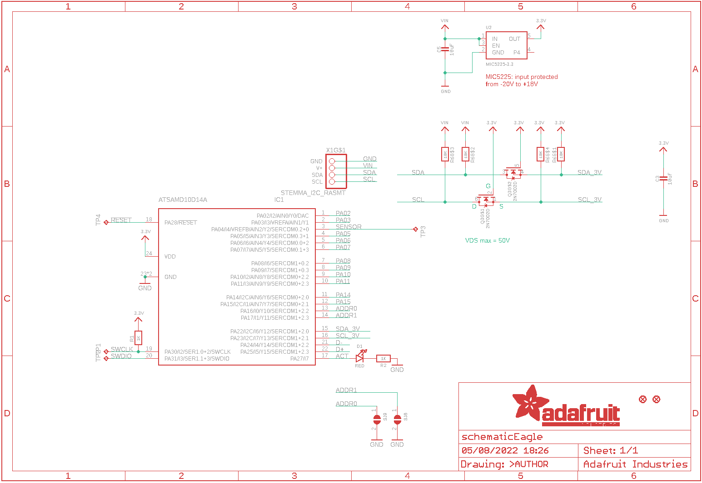
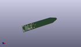
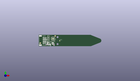
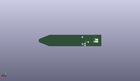
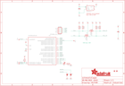

Contents
========

* [PRA4026 > Adafruit STEMMA Soil Sensor PCB](#pra4026--adafruit-stemma-soil-sensor-pcb)
	* [Schematic](#schematic)
	* [PCB](#pcb)
	* [Interactive BOM](#interactive-bom)
	* [OOMP Parts](#oomp-parts)
	* [Images](#images)
	* [Tags](#tags)
  
![][im]
# PRA4026 > Adafruit STEMMA Soil Sensor PCB

- ID: PROJ-ADAF-4026-STAN-01
- Hex ID: PRA4026
- Name: Adafruit
- Description: Adafruit
- Long Link: [http://oom.lt/PROJ-ADAF-4026-STAN-01](http://oom.lt/PROJ-ADAF-4026-STAN-01)
- Short Link: [http://oom.lt/PRA4026](http://oom.lt/PRA4026)

## Schematic
  

## PCB
  

## Interactive BOM

- Interactive BOM page: [ibom.html](https://htmlpreview.github.io/?https://github.com/oomlout/oomlout_OOMP_projects/blob/main/PROJ-ADAF-4026-STAN-01/kicad/bom/ibom.html)

## OOMP Parts
  

|OOMP Parts|
| :---: |
|[CAPC-0805-X-UF10-V10  SMD (0805) 10 uF Capacitor (Ceramic) 10v  C3, C5](https://github.com/oomlout/oomlout_OOMP_parts/tree/main/CAPC-0805-X-UF10-V10/)|
|[LEDS-0805-R-STAN-01  SMD (0805) Red LED  D1](https://github.com/oomlout/oomlout_OOMP_parts/tree/main/LEDS-0805-R-STAN-01/)|
|UNMATCHED-UNMATCHED-X-UNMATCHED-01 IC1, TP1, TP2, TP3, TP4|
|MOSN-SO363-X-UNMATCHED-01 Q3|
|[RESE-0603-X-O102-01  SMD (0603) 1k Ohm Resistor  R1, R2](https://github.com/oomlout/oomlout_OOMP_parts/tree/main/RESE-0603-X-O102-01/)|
|RESA-06038-X-O103X4-01 R6|
|[VREG-SO235-X-KMIC5225-V33D  SMD (SOT-23-5) MIC5225 Voltage Regulator 3.3v  U2](https://github.com/oomlout/oomlout_OOMP_parts/tree/main/VREG-SO235-X-KMIC5225-V33D/)|
|HEAD-I01-X-UNMATCHED-01 X1|

## Images
  
  

|kicadPcb3d|kicadPcb3dFront|kicadPcb3dBack|eagleImage|eagleSchemImage|
| :---: | :---: | :---: | :---: | :---: |
||||||

## Tags

- hexID: PRA4026
- oompType: PROJ
- oompSize: ADAF
- oompColor: 4026
- oompDesc: STAN
- oompIndex: 01
- oompName: Adafruit STEMMA Soil Sensor PCB
- sources: All source files from https://github.com/adafruit/Adafruit-STEMMA-Soil-Sensor-PCB (source licence details in srcLicense.md)
- linkBuyPage: http://www.adafruit.com/products/4026
- oompID: PROJ-ADAF-4026-STAN-01
- oompParts: C3,CAPC-0805-X-UF10-V10
- oompParts: C5,CAPC-0805-X-UF10-V10
- oompParts: D1,LEDS-0805-R-STAN-01
- oompParts: IC1,UNMATCHED-UNMATCHED-X-UNMATCHED-01
- oompParts: Q3,MOSN-SO363-X-UNMATCHED-01
- oompParts: R1,RESE-0603-X-O102-01
- oompParts: R2,RESE-0603-X-O102-01
- oompParts: R6,RESA-06038-X-O103X4-01
- oompParts: TP1,UNMATCHED-UNMATCHED-X-UNMATCHED-01
- oompParts: TP2,UNMATCHED-UNMATCHED-X-UNMATCHED-01
- oompParts: TP3,UNMATCHED-UNMATCHED-X-UNMATCHED-01
- oompParts: TP4,UNMATCHED-UNMATCHED-X-UNMATCHED-01
- oompParts: U2,VREG-SO235-X-KMIC5225-V33D
- oompParts: X1,HEAD-I01-X-UNMATCHED-01
- rawParts: C3,10uF,CAP_CERAMIC0805-NOOUTLINE,0805-NO,Ceramic Capacitors,,,
- rawParts: C5,10uF,CAP_CERAMIC0805-NOOUTLINE,0805-NO,Ceramic Capacitors,,,
- rawParts: D1,RED,LED0805_NOOUTLINE,CHIPLED_0805_NOOUTLINE,LED,,,
- rawParts: FID1,FIDUCIAL_1MM,FIDUCIAL_1MM,FIDUCIAL_1MM,Fiducial Alignment Points,EXCLUDE,,
- rawParts: FID2,FIDUCIAL_1MM,FIDUCIAL_1MM,FIDUCIAL_1MM,Fiducial Alignment Points,EXCLUDE,,
- rawParts: IC1,ATSAMD10D14A,ATSAMD10D14A,QFN24_4MM,,,,
- rawParts: Q3,2N7002D,MOSFET-N_DUAL,SOT363,Dual N-Channel MOSFET,,,
- rawParts: R1,1K,RESISTOR_0603_NOOUT,0603-NO,Resistors,,,
- rawParts: R2,1K,RESISTOR_0603_NOOUT,0603-NO,Resistors,,,
- rawParts: R6,10K,RESISTOR_4PACK,RESPACK_4X0603,Resistor Packs (4 resistors),,,
- rawParts: SJ8,,SOLDERJUMPER,SOLDERJUMPER_ARROW_NOPASTE,SMD Solder JUMPER,EXCLUDE,,
- rawParts: SJ9,,SOLDERJUMPER,SOLDERJUMPER_ARROW_NOPASTE,SMD Solder JUMPER,EXCLUDE,,
- rawParts: TP1,TPTP15R,TPTP15R,TP15R,Test pad,,,
- rawParts: TP2,TPTP15R,TPTP15R,TP15R,Test pad,,,
- rawParts: TP3,TPTP10R,TPTP10R,TP10R,Test pad,,,
- rawParts: TP4,TPTP15R,TPTP15R,TP15R,Test pad,,,
- rawParts: U2,MIC5225-3.3,VREG_SOT23-5,SOT23-5,SOT23-5 Fixed Voltage Regulators,,,
- rawParts: X1,STEMMA_I2C_RASMT,STEMMA_I2C_RASMT,JSTPH4,,,,

[im]: kicadPcb3d_450.png
