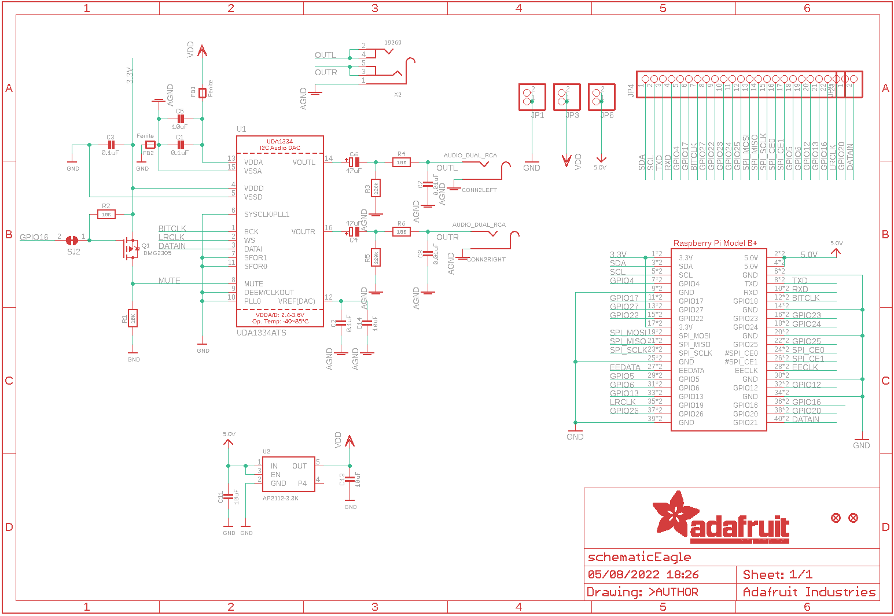
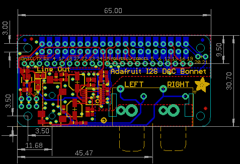
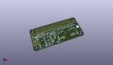
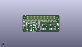
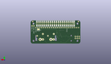
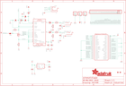

Contents
========

* [PRA4037 > Adafruit I2S Audio Bonnet for Raspberry Pi PCB](#pra4037--adafruit-i2s-audio-bonnet-for-raspberry-pi-pcb)
	* [Schematic](#schematic)
	* [PCB](#pcb)
	* [Interactive BOM](#interactive-bom)
	* [OOMP Parts](#oomp-parts)
	* [Images](#images)
	* [Tags](#tags)
  
![][im]
# PRA4037 > Adafruit I2S Audio Bonnet for Raspberry Pi PCB

- ID: PROJ-ADAF-4037-STAN-01
- Hex ID: PRA4037
- Name: Adafruit
- Description: Adafruit
- Long Link: [http://oom.lt/PROJ-ADAF-4037-STAN-01](http://oom.lt/PROJ-ADAF-4037-STAN-01)
- Short Link: [http://oom.lt/PRA4037](http://oom.lt/PRA4037)

## Schematic
  

## PCB
  

## Interactive BOM

- Interactive BOM page: [ibom.html](https://htmlpreview.github.io/?https://github.com/oomlout/oomlout_OOMP_projects/blob/main/PROJ-ADAF-4037-STAN-01/kicad/bom/ibom.html)

## OOMP Parts
  

|OOMP Parts|
| :---: |
|C1 C1,CAPC-0603-X-UF1D-01|
|C2 C2,CAPC-0603-X-UF1D-01|
|C3 C3,CAPC-0603-X-UF1D-01|
|C4 C4,CAPX-UNMATCHED-X-UF47-01|
|[C5 CAPC-0805-X-UF10-V10 SMD (0805) 10 uF Capacitor (Ceramic) 10v](https://github.com/oomlout/oomlout_OOMP_parts/tree/main/CAPC-0805-X-UF10-V10/)|
|C6 C6,CAPX-UNMATCHED-X-UF47-01|
|C7 C7,CAPC-0603-X-UNMATCHED-01|
|C8 C8,CAPC-0603-X-UNMATCHED-01|
|[C11 CAPC-0805-X-UF10-V10 SMD (0805) 10 uF Capacitor (Ceramic) 10v](https://github.com/oomlout/oomlout_OOMP_parts/tree/main/CAPC-0805-X-UF10-V10/)|
|[C13 CAPC-0805-X-UF10-V10 SMD (0805) 10 uF Capacitor (Ceramic) 10v](https://github.com/oomlout/oomlout_OOMP_parts/tree/main/CAPC-0805-X-UF10-V10/)|
|[C14 CAPC-0805-X-UF10-V10 SMD (0805) 10 uF Capacitor (Ceramic) 10v](https://github.com/oomlout/oomlout_OOMP_parts/tree/main/CAPC-0805-X-UF10-V10/)|
|CONN2 CONN2,UNMATCHED-UNMATCHED-X-UNMATCHED-01|
|FB1 FB1,FERB-0805-X-UNMATCHED-01|
|FB2 FB2,FERB-0805-X-UNMATCHED-01|
|[JP1 HEAD-I01-X-PI02-01 2.54 mm 2 Pin Header](https://github.com/oomlout/oomlout_OOMP_parts/tree/main/HEAD-I01-X-PI02-01/)|
|[JP3 HEAD-I01-X-PI02-01 2.54 mm 2 Pin Header](https://github.com/oomlout/oomlout_OOMP_parts/tree/main/HEAD-I01-X-PI02-01/)|
|JP4 JP4,HEAD-I01-X-PI23-01|
|[JP5 HEAD-I01-X-PI02-01 2.54 mm 2 Pin Header](https://github.com/oomlout/oomlout_OOMP_parts/tree/main/HEAD-I01-X-PI02-01/)|
|[JP6 HEAD-I01-X-PI02-01 2.54 mm 2 Pin Header](https://github.com/oomlout/oomlout_OOMP_parts/tree/main/HEAD-I01-X-PI02-01/)|
|Q1 Q1,MOSP-SO23-X-UNMATCHED-01|
|[R1 RESE-0603-X-O103-01 SMD (0603) 10k Ohm Resistor](https://github.com/oomlout/oomlout_OOMP_parts/tree/main/RESE-0603-X-O103-01/)|
|[R2 RESE-0603-X-O103-01 SMD (0603) 10k Ohm Resistor](https://github.com/oomlout/oomlout_OOMP_parts/tree/main/RESE-0603-X-O103-01/)|
|R3 R3,RESE-0603-X-O2203-01|
|[R4 RESE-0603-X-O101-01 SMD (0603) 100 Ohm Resistor](https://github.com/oomlout/oomlout_OOMP_parts/tree/main/RESE-0603-X-O101-01/)|
|R5 R5,RESE-0603-X-O2203-01|
|[R6 RESE-0603-X-O101-01 SMD (0603) 100 Ohm Resistor](https://github.com/oomlout/oomlout_OOMP_parts/tree/main/RESE-0603-X-O101-01/)|
|RPI1 RPI1,UNMATCHED-UNMATCHED-X-UNMATCHED-01|
|U1 U1,UNMATCHED-UNMATCHED-X-UNMATCHED-01|
|U2 U2,UNMATCHED-SO235-X-UNMATCHED-01|
|X2 X2,UNMATCHED-UNMATCHED-X-UNMATCHED-01|

## Images
  
  

|kicadPcb3d|kicadPcb3dFront|kicadPcb3dBack|eagleImage|eagleSchemImage|
| :---: | :---: | :---: | :---: | :---: |
||||||

## Tags

- hexID: PRA4037
- oompType: PROJ
- oompSize: ADAF
- oompColor: 4037
- oompDesc: STAN
- oompIndex: 01
- oompName: Adafruit I2S Audio Bonnet for Raspberry Pi PCB
- sources: All source files from https://github.com/adafruit/Adafruit-I2S-Audio-Bonnet-for-Raspberry-Pi-PCB (source licence details in srcLicense.md)
- linkBuyPage: http://www.adafruit.com/products/4037
- oompID: PROJ-ADAF-4037-STAN-01
- oompParts: C1,CAPC-0603-X-UF1D-01
- oompParts: C2,CAPC-0603-X-UF1D-01
- oompParts: C3,CAPC-0603-X-UF1D-01
- oompParts: C4,CAPX-UNMATCHED-X-UF47-01
- oompParts: C5,CAPC-0805-X-UF10-V10
- oompParts: C6,CAPX-UNMATCHED-X-UF47-01
- oompParts: C7,CAPC-0603-X-UNMATCHED-01
- oompParts: C8,CAPC-0603-X-UNMATCHED-01
- oompParts: C11,CAPC-0805-X-UF10-V10
- oompParts: C13,CAPC-0805-X-UF10-V10
- oompParts: C14,CAPC-0805-X-UF10-V10
- oompParts: CONN2,UNMATCHED-UNMATCHED-X-UNMATCHED-01
- oompParts: FB1,FERB-0805-X-UNMATCHED-01
- oompParts: FB2,FERB-0805-X-UNMATCHED-01
- oompParts: JP1,HEAD-I01-X-PI02-01
- oompParts: JP3,HEAD-I01-X-PI02-01
- oompParts: JP4,HEAD-I01-X-PI23-01
- oompParts: JP5,HEAD-I01-X-PI02-01
- oompParts: JP6,HEAD-I01-X-PI02-01
- oompParts: Q1,MOSP-SO23-X-UNMATCHED-01
- oompParts: R1,RESE-0603-X-O103-01
- oompParts: R2,RESE-0603-X-O103-01
- oompParts: R3,RESE-0603-X-O2203-01
- oompParts: R4,RESE-0603-X-O101-01
- oompParts: R5,RESE-0603-X-O2203-01
- oompParts: R6,RESE-0603-X-O101-01
- oompParts: RPI1,UNMATCHED-UNMATCHED-X-UNMATCHED-01
- oompParts: U1,UNMATCHED-UNMATCHED-X-UNMATCHED-01
- oompParts: U2,UNMATCHED-SO235-X-UNMATCHED-01
- oompParts: X2,UNMATCHED-UNMATCHED-X-UNMATCHED-01
- rawParts: C1,0.1uF,CAP_CERAMIC0603_NO,0603-NO,Ceramic Capacitors,,
- rawParts: C2,0.1uF,CAP_CERAMIC0603_NO,0603-NO,Ceramic Capacitors,,
- rawParts: C3,0.1uF,CAP_CERAMIC0603_NO,0603-NO,Ceramic Capacitors,,
- rawParts: C4,47uF,CAP_ELECTROLYTICPANASONIC_C,PANASONIC_C,Electrolytic Capacitors,,
- rawParts: C5,10uF,CAP_CERAMIC0805-NOOUTLINE,0805-NO,Ceramic Capacitors,,
- rawParts: C6,47uF,CAP_ELECTROLYTICPANASONIC_C,PANASONIC_C,Electrolytic Capacitors,,
- rawParts: C7,0.01uF,CAP_CERAMIC0603_NO,0603-NO,Ceramic Capacitors,,
- rawParts: C8,0.01uF,CAP_CERAMIC0603_NO,0603-NO,Ceramic Capacitors,,
- rawParts: C11,10uF,CAP_CERAMIC0805-NOOUTLINE,0805-NO,Ceramic Capacitors,,
- rawParts: C13,10uF,CAP_CERAMIC0805-NOOUTLINE,0805-NO,Ceramic Capacitors,,
- rawParts: C14,10uF,CAP_CERAMIC0805-NOOUTLINE,0805-NO,Ceramic Capacitors,,
- rawParts: CONN2,AUDIO_DUAL_RCA,AUDIO_DUAL_RCA,RCA_DUAL_JACK,,,
- rawParts: FB1,Ferrite,FERRITE0805,0805,Ferrite Bead,,
- rawParts: FB2,Ferrite,FERRITE0805,0805,Ferrite Bead,,
- rawParts: FID1,FIDUCIAL_1MM,FIDUCIAL_1MM,FIDUCIAL_1MM,Fiducial Alignment Points,EXCLUDE,
- rawParts: FID2,FIDUCIAL_1MM,FIDUCIAL_1MM,FIDUCIAL_1MM,Fiducial Alignment Points,EXCLUDE,
- rawParts: JP1,,HEADER-1X2ROUND,1X02_ROUND,PIN HEADER,,
- rawParts: JP3,,HEADER-1X2ROUND,1X02_ROUND,PIN HEADER,,
- rawParts: JP4,,HEADER-1X23,1X23_ROUND_70MIL,,,
- rawParts: JP5,,HEADER-1X2ROUND,1X02_ROUND,PIN HEADER,,
- rawParts: JP6,,HEADER-1X2ROUND,1X02_ROUND,PIN HEADER,,
- rawParts: Q1, DMG2305,MOSFET-PWIDE,SOT23-WIDE,P-Channel Mosfet,,
- rawParts: R1,10K,RESISTOR_0603_NOOUT,0603-NO,Resistors,,
- rawParts: R2,10K,RESISTOR_0603_NOOUT,0603-NO,Resistors,,
- rawParts: R3,220k,RESISTOR_0603_NOOUT,0603-NO,Resistors,,
- rawParts: R4,100,RESISTOR_0603_NOOUT,0603-NO,Resistors,,
- rawParts: R5,220k,RESISTOR_0603_NOOUT,0603-NO,Resistors,,
- rawParts: R6,100,RESISTOR_0603_NOOUT,0603-NO,Resistors,,
- rawParts: RPI1,RASPBERRYPI_BPLUS_BONNET_THMSMT,RASPBERRYPI_BPLUS_BONNET_THMSMT,PI_BONNET_THMSMT,,,
- rawParts: SJ2,,SOLDERJUMPER_CLOSED,SOLDERJUMPER_CLOSEDWIRE,Solder Jumper - Closed,,
- rawParts: U1,UDA1334ATS,AUDIO_I2S_UDA1334,SSOP16_4.4MM,UDA1334 I2C Audio DAC,,
- rawParts: U2,AP2112-3.3K,VREG_SOT23-5,SOT23-5,SOT23-5 Fixed Voltage Regulators,,
- rawParts: X2,19269,AUDIO_3.5MMJACK,4UCONN_19269,3.5MM Audio Jack,,

[im]: kicadPcb3d_450.png
