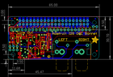

Contents
========

* [PROJ-ADAF-4037-STAN-01>Adafruit I2S Audio Bonnet for Raspberry Pi PCB](#proj-adaf-4037-stan-01adafruit-i2s-audio-bonnet-for-raspberry-pi-pcb)
	* [Images](#images)
	* [Interactive BOM](#interactive-bom)
	* [OOMP Parts](#oomp-parts)
	* [Tags](#tags)
  
![][im]
# PROJ-ADAF-4037-STAN-01>Adafruit I2S Audio Bonnet for Raspberry Pi PCB

- ID: PROJ-ADAF-4037-STAN-01
- Hex ID: PRA4037
- Name: Adafruit I2S Audio Bonnet for Raspberry Pi PCB
- Description: 

## Images
  
  

|eagleImage|
| :---: |
||

## Interactive BOM

- Interactive BOM page: [ibom.html](kicad/bom/ibom.html)

## OOMP Parts
  

|OOMP Parts|
| :---: |
|<table><tr><td></td><td> C1</td><td>[CAPC-0603-X-NF100-V50 SMD (0603) 100 nF Capacitor (Ceramic) 50v](https://github.com/oomlout/oomlout_OOMP_parts/tree/main/CAPC-0603-X-NF100-V50/)</td><td>[C6N100](https://github.com/oomlout/oomlout_OOMP_parts/tree/main/CAPC-0603-X-NF100-V50/)</td></tr></table>|
|<table><tr><td></td><td> C2</td><td>[CAPC-0603-X-NF100-V50 SMD (0603) 100 nF Capacitor (Ceramic) 50v](https://github.com/oomlout/oomlout_OOMP_parts/tree/main/CAPC-0603-X-NF100-V50/)</td><td>[C6N100](https://github.com/oomlout/oomlout_OOMP_parts/tree/main/CAPC-0603-X-NF100-V50/)</td></tr></table>|
|<table><tr><td></td><td> C3</td><td>[CAPC-0603-X-NF100-V50 SMD (0603) 100 nF Capacitor (Ceramic) 50v](https://github.com/oomlout/oomlout_OOMP_parts/tree/main/CAPC-0603-X-NF100-V50/)</td><td>[C6N100](https://github.com/oomlout/oomlout_OOMP_parts/tree/main/CAPC-0603-X-NF100-V50/)</td></tr></table>|
|CAPE-UNMATCHED-X-UNMATCHED-01, C4, 19.304, 5.842, 90,C4, 47uF, PANASONIC_C, microbuilder, (19.304, 5.842), R90|
|<table><tr><td></td><td> C5</td><td>[CAPC-0805-X-UF10-V25 SMD (0805) 10 uF Capacitor (Ceramic) 25v](https://github.com/oomlout/oomlout_OOMP_parts/tree/main/CAPC-0805-X-UF10-V25/)</td><td>[C85U010](https://github.com/oomlout/oomlout_OOMP_parts/tree/main/CAPC-0805-X-UF10-V25/)</td></tr></table>|
|CAPE-UNMATCHED-X-UNMATCHED-01, C6, 20.066, 14.859, 270,C6, 47uF, PANASONIC_C, microbuilder, (20.066, 14.859), R270|
|CAPC-0603-X-NF10-01, C7, 13.081, 16.637, 90,C7, 0.01uF, 0603-NO, microbuilder, (13.081, 16.637), R90|
|CAPC-0603-X-NF10-01, C8, 15.621, 5.842, 90,C8, 0.01uF, 0603-NO, microbuilder, (15.621, 5.842), R90|
|<table><tr><td></td><td> C11</td><td>[CAPC-0805-X-UF10-V25 SMD (0805) 10 uF Capacitor (Ceramic) 25v](https://github.com/oomlout/oomlout_OOMP_parts/tree/main/CAPC-0805-X-UF10-V25/)</td><td>[C85U010](https://github.com/oomlout/oomlout_OOMP_parts/tree/main/CAPC-0805-X-UF10-V25/)</td></tr></table>|
|<table><tr><td></td><td> C13</td><td>[CAPC-0805-X-UF10-V25 SMD (0805) 10 uF Capacitor (Ceramic) 25v](https://github.com/oomlout/oomlout_OOMP_parts/tree/main/CAPC-0805-X-UF10-V25/)</td><td>[C85U010](https://github.com/oomlout/oomlout_OOMP_parts/tree/main/CAPC-0805-X-UF10-V25/)</td></tr></table>|
|<table><tr><td></td><td> C14</td><td>[CAPC-0805-X-UF10-V25 SMD (0805) 10 uF Capacitor (Ceramic) 25v](https://github.com/oomlout/oomlout_OOMP_parts/tree/main/CAPC-0805-X-UF10-V25/)</td><td>[C85U010](https://github.com/oomlout/oomlout_OOMP_parts/tree/main/CAPC-0805-X-UF10-V25/)</td></tr></table>|
|UNMATCHED-UNMATCHED-X-UNMATCHED-01, CONN2, 45.466, 0.0, 0,CONN2, AUDIO_DUAL_RCA, RCA_DUAL_JACK, microbuilder, (45.466, 0), R0|
|UNMATCHED-0805-X-UNMATCHED-01, FB1, 6.858, 14.097, 90,FB1, Ferrite, 0805, microbuilder, (6.858, 14.097), R90|
|UNMATCHED-0805-X-UNMATCHED-01, FB2, 7.747, 17.145, 180,FB2, Ferrite, 0805, microbuilder, (7.747, 17.145), R180|
|UNMATCHED-UNMATCHED-X-UNMATCHED-01, JP1, 1.397, 8.128, 90,JP1, 1X02_ROUND, microbuilder, (1.397, 8.128), R90|
|UNMATCHED-UNMATCHED-X-UNMATCHED-01, JP3, 6.477, 8.128, 90,JP3, 1X02_ROUND, microbuilder, (6.477, 8.128), R90|
|UNMATCHED-UNMATCHED-X-UNMATCHED-01, JP4, 30.226, 21.209, 0,JP4, 1X23_ROUND_70MIL, microbuilder, (30.226, 21.209), R0|
|UNMATCHED-UNMATCHED-X-UNMATCHED-01, JP5, 61.976, 23.495, 0,JP5, 1X02_ROUND, microbuilder, (61.976, 23.495), R0|
|UNMATCHED-UNMATCHED-X-UNMATCHED-01, JP6, 3.937, 8.128, 90,JP6, 1X02_ROUND, microbuilder, (3.937, 8.128), R90|
|UNMATCHED-UNMATCHED-X-UNMATCHED-01, Q1, 29.083, 14.605, 180,Q1, DMG2305, SOT23-WIDE, microbuilder, (29.083, 14.605), R180|
|<table><tr><td></td><td> R1</td><td>[RESE-0603-X-O103-01 SMD (0603) 10k Ohm Resistor](https://github.com/oomlout/oomlout_OOMP_parts/tree/main/RESE-0603-X-O103-01/)</td><td>[R6103](https://github.com/oomlout/oomlout_OOMP_parts/tree/main/RESE-0603-X-O103-01/)</td></tr></table>|
|<table><tr><td></td><td> R2</td><td>[RESE-0603-X-O103-01 SMD (0603) 10k Ohm Resistor](https://github.com/oomlout/oomlout_OOMP_parts/tree/main/RESE-0603-X-O103-01/)</td><td>[R6103](https://github.com/oomlout/oomlout_OOMP_parts/tree/main/RESE-0603-X-O103-01/)</td></tr></table>|
|RESE-0603-X-UNMATCHED-01, R3, 15.621, 17.526, 0,R3, 220k, 0603-NO, microbuilder, (15.621, 17.526), R0|
|RESE-0603-X-UNMATCHED-01, R4, 15.494, 15.748, 180,R4, 100, 0603-NO, microbuilder, (15.494, 15.748), R180|
|RESE-0603-X-UNMATCHED-01, R5, 22.098, 1.27, 180,R5, 220k, 0603-NO, microbuilder, (22.098, 1.27), R180|
|RESE-0603-X-UNMATCHED-01, R6, 18.923, 1.27, 180,R6, 100, 0603-NO, microbuilder, (18.923, 1.27), R180|
|UNMATCHED-UNMATCHED-X-UNMATCHED-01, RPI1, 0.0, 0.0, 0,RPI1, RASPBERRYPI_BPLUS_BONNET_THMSMT, PI_BONNET_THMSMT, microbuilder, (0, 0), R0|
|UNMATCHED-UNMATCHED-X-UNMATCHED-01, SJ2, 54.864, 18.796, M180,SJ2, SOLDERJUMPER_CLOSEDWIRE, microbuilder, (54.864, 18.796), MR180|
|UNMATCHED-UNMATCHED-X-UNMATCHED-01, U1, 25.654, 10.033, 90,U1, UDA1334ATS, SSOP16_4.4MM, microbuilder, (25.654, 10.033), R90|
|UNMATCHED-UNMATCHED-X-UNMATCHED-01, U2, 3.175, 15.621, 180,U2, AP2112-3.3K, SOT23-5, microbuilder, (3.175, 15.621), R180|
|UNMATCHED-UNMATCHED-X-UNMATCHED-01, X2, 11.684, 0.0, 90,X2, 19269, 4UCONN_19269, microbuilder, (11.684, 0), R90|

## Tags

- hexID: PRA4037
- oompType: PROJ
- oompSize: ADAF
- oompColor: 4037
- oompDesc: STAN
- oompIndex: 01
- oompName: Adafruit I2S Audio Bonnet for Raspberry Pi PCB
- sources: All source files from https://github.com/adafruit/Adafruit-I2S-Audio-Bonnet-for-Raspberry-Pi-PCB (source licence details in srcLicense.md)
- linkBuyPage: http://www.adafruit.com/products/4037
- oompPart: CAPC-0603-X-NF100-V50, C1, 25.273, 4.953, 270
- oompPart: CAPC-0603-X-NF100-V50, C2, 24.765, 13.97, 0
- oompPart: CAPC-0603-X-NF100-V50, C3, 29.083, 18.288, 0
- oompPart: CAPE-UNMATCHED-X-UNMATCHED-01, C4, 19.304, 5.842, 90
- oompPart: CAPC-0805-X-UF10-V25, C5, 23.749, 4.953, 270
- oompPart: CAPE-UNMATCHED-X-UNMATCHED-01, C6, 20.066, 14.859, 270
- oompPart: CAPC-0603-X-NF10-01, C7, 13.081, 16.637, 90
- oompPart: CAPC-0603-X-NF10-01, C8, 15.621, 5.842, 90
- oompPart: CAPC-0805-X-UF10-V25, C11, 2.413, 18.669, 0
- oompPart: CAPC-0805-X-UF10-V25, C13, 3.302, 12.446, 180
- oompPart: CAPC-0805-X-UF10-V25, C14, 24.765, 15.748, 0
- oompPart: UNMATCHED-UNMATCHED-X-UNMATCHED-01, CONN2, 45.466, 0.0, 0
- oompPart: UNMATCHED-0805-X-UNMATCHED-01, FB1, 6.858, 14.097, 90
- oompPart: UNMATCHED-0805-X-UNMATCHED-01, FB2, 7.747, 17.145, 180
- oompPart: SKIP-UNMATCHED-X-UNMATCHED-01, FID1, 4.7625, 29.5275, 0
- oompPart: SKIP-UNMATCHED-X-UNMATCHED-01, FID2, 63.246, 6.096, 0
- oompPart: UNMATCHED-UNMATCHED-X-UNMATCHED-01, JP1, 1.397, 8.128, 90
- oompPart: UNMATCHED-UNMATCHED-X-UNMATCHED-01, JP3, 6.477, 8.128, 90
- oompPart: UNMATCHED-UNMATCHED-X-UNMATCHED-01, JP4, 30.226, 21.209, 0
- oompPart: UNMATCHED-UNMATCHED-X-UNMATCHED-01, JP5, 61.976, 23.495, 0
- oompPart: UNMATCHED-UNMATCHED-X-UNMATCHED-01, JP6, 3.937, 8.128, 90
- oompPart: UNMATCHED-UNMATCHED-X-UNMATCHED-01, Q1, 29.083, 14.605, 180
- oompPart: RESE-0603-X-O103-01, R1, 30.353, 11.938, 90
- oompPart: RESE-0603-X-O103-01, R2, 29.083, 17.018, 180
- oompPart: RESE-0603-X-UNMATCHED-01, R3, 15.621, 17.526, 0
- oompPart: RESE-0603-X-UNMATCHED-01, R4, 15.494, 15.748, 180
- oompPart: RESE-0603-X-UNMATCHED-01, R5, 22.098, 1.27, 180
- oompPart: RESE-0603-X-UNMATCHED-01, R6, 18.923, 1.27, 180
- oompPart: UNMATCHED-UNMATCHED-X-UNMATCHED-01, RPI1, 0.0, 0.0, 0
- oompPart: UNMATCHED-UNMATCHED-X-UNMATCHED-01, SJ2, 54.864, 18.796, M180
- oompPart: UNMATCHED-UNMATCHED-X-UNMATCHED-01, U1, 25.654, 10.033, 90
- oompPart: UNMATCHED-UNMATCHED-X-UNMATCHED-01, U2, 3.175, 15.621, 180
- oompPart: UNMATCHED-UNMATCHED-X-UNMATCHED-01, X2, 11.684, 0.0, 90
- rawPart: C1, 0.1uF, 0603-NO, microbuilder, (25.273, 4.953), R270
- rawPart: C2, 0.1uF, 0603-NO, microbuilder, (24.765, 13.97), R0
- rawPart: C3, 0.1uF, 0603-NO, microbuilder, (29.083, 18.288), R0
- rawPart: C4, 47uF, PANASONIC_C, microbuilder, (19.304, 5.842), R90
- rawPart: C5, 10uF, 0805-NO, microbuilder, (23.749, 4.953), R270
- rawPart: C6, 47uF, PANASONIC_C, microbuilder, (20.066, 14.859), R270
- rawPart: C7, 0.01uF, 0603-NO, microbuilder, (13.081, 16.637), R90
- rawPart: C8, 0.01uF, 0603-NO, microbuilder, (15.621, 5.842), R90
- rawPart: C11, 10uF, 0805-NO, microbuilder, (2.413, 18.669), R0
- rawPart: C13, 10uF, 0805-NO, microbuilder, (3.302, 12.446), R180
- rawPart: C14, 10uF, 0805-NO, microbuilder, (24.765, 15.748), R0
- rawPart: CONN2, AUDIO_DUAL_RCA, RCA_DUAL_JACK, microbuilder, (45.466, 0), R0
- rawPart: FB1, Ferrite, 0805, microbuilder, (6.858, 14.097), R90
- rawPart: FB2, Ferrite, 0805, microbuilder, (7.747, 17.145), R180
- rawPart: FID1, FIDUCIAL_1MM, FIDUCIAL_1MM, microbuilder, (4.7625, 29.5275), R0
- rawPart: FID2, FIDUCIAL_1MM, FIDUCIAL_1MM, microbuilder, (63.246, 6.096), R0
- rawPart: JP1, 1X02_ROUND, microbuilder, (1.397, 8.128), R90
- rawPart: JP3, 1X02_ROUND, microbuilder, (6.477, 8.128), R90
- rawPart: JP4, 1X23_ROUND_70MIL, microbuilder, (30.226, 21.209), R0
- rawPart: JP5, 1X02_ROUND, microbuilder, (61.976, 23.495), R0
- rawPart: JP6, 1X02_ROUND, microbuilder, (3.937, 8.128), R90
- rawPart: Q1, DMG2305, SOT23-WIDE, microbuilder, (29.083, 14.605), R180
- rawPart: R1, 10K, 0603-NO, microbuilder, (30.353, 11.938), R90
- rawPart: R2, 10K, 0603-NO, microbuilder, (29.083, 17.018), R180
- rawPart: R3, 220k, 0603-NO, microbuilder, (15.621, 17.526), R0
- rawPart: R4, 100, 0603-NO, microbuilder, (15.494, 15.748), R180
- rawPart: R5, 220k, 0603-NO, microbuilder, (22.098, 1.27), R180
- rawPart: R6, 100, 0603-NO, microbuilder, (18.923, 1.27), R180
- rawPart: RPI1, RASPBERRYPI_BPLUS_BONNET_THMSMT, PI_BONNET_THMSMT, microbuilder, (0, 0), R0
- rawPart: SJ2, SOLDERJUMPER_CLOSEDWIRE, microbuilder, (54.864, 18.796), MR180
- rawPart: U1, UDA1334ATS, SSOP16_4.4MM, microbuilder, (25.654, 10.033), R90
- rawPart: U2, AP2112-3.3K, SOT23-5, microbuilder, (3.175, 15.621), R180
- rawPart: X2, 19269, 4UCONN_19269, microbuilder, (11.684, 0), R90

[im]: eagleImage_450.png
