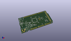
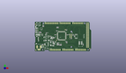
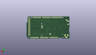
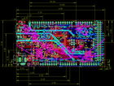

Contents
========

* [PRA4064 > Adafruit](#pra4064--adafruit)
	* [Schematic](#schematic)
	* [Interactive BOM](#interactive-bom)
	* [OOMP Parts](#oomp-parts)
	* [Images](#images)
	* [Tags](#tags)
  
![][im]
# PRA4064 > Adafruit

- ID: PROJ-ADAF-4064-STAN-01
- Hex ID: PRA4064
- Name: Adafruit
- Description: Adafruit
- Long Link: [http://oom.lt/PROJ-ADAF-4064-STAN-01](http://oom.lt/PROJ-ADAF-4064-STAN-01)
- Long Link: [http://oom.lt/PRA4064](http://oom.lt/PRA4064)

## Schematic
  
![][schem]
## Interactive BOM

- Interactive BOM page: [ibom.html](https://htmlpreview.github.io/?https://github.com/oomlout/oomlout_OOMP_projects/blob/main/PROJ-ADAF-4064-STAN-01/kicad/bom/ibom.html)

## OOMP Parts
  

|OOMP Parts|
| :---: |
|ANALOGH,UNMATCHED-UNMATCHED-UNMATCHED-UNMATCHED-UNMATCHED,ANALOGH,20610,HEADER-1X8OVALWAVE,1X08_OVALWAVE,PIN HEADER,,,,,,,,,,,,,|
|ANALOGL,UNMATCHED-UNMATCHED-UNMATCHED-UNMATCHED-UNMATCHED,ANALOGL,20610,HEADER-1X8OVALWAVE,1X08_OVALWAVE,PIN HEADER,,,,,,,,,,,,,|
|C1,UNMATCHED-UNMATCHED-UNMATCHED-UNMATCHED-UNMATCHED,C1,10uF,CAP_CERAMIC0805-NOOUTLINE,0805-NO,Ceramic Capacitors,,,,,,,,,,,,,|
|C2,UNMATCHED-UNMATCHED-UNMATCHED-UNMATCHED-UNMATCHED,C2,10uF,CAP_CERAMIC0805-NOOUTLINE,0805-NO,Ceramic Capacitors,,,,,,,,,,,,,|
|C3,UNMATCHED-UNMATCHED-UNMATCHED-UNMATCHED-UNMATCHED,C3,10uF,CAP_CERAMIC0805-NOOUTLINE,0805-NO,Ceramic Capacitors,,,,,,,,,,,,,|
|C4,UNMATCHED-UNMATCHED-UNMATCHED-UNMATCHED-UNMATCHED,C4,.1u,CAP_CERAMIC0603_NO,0603-NO,Ceramic Capacitors,,,,,,,,,,,,,|
|C5,UNMATCHED-UNMATCHED-UNMATCHED-UNMATCHED-UNMATCHED,C5,22pF,CAP_CERAMIC0603_NO,0603-NO,Ceramic Capacitors,,,,,,,,,,,,,|
|C6,UNMATCHED-UNMATCHED-UNMATCHED-UNMATCHED-UNMATCHED,C6,.1u,CAP_CERAMIC0603_NO,0603-NO,Ceramic Capacitors,,,,,,,,,,,,,|
|C7,UNMATCHED-UNMATCHED-UNMATCHED-UNMATCHED-UNMATCHED,C7,22pF,CAP_CERAMIC0603_NO,0603-NO,Ceramic Capacitors,,,,,,,,,,,,,|
|C8,UNMATCHED-UNMATCHED-UNMATCHED-UNMATCHED-UNMATCHED,C8,.1u,CAP_CERAMIC0603_NO,0603-NO,Ceramic Capacitors,,,,,,,,,,,,,|
|C9,UNMATCHED-UNMATCHED-UNMATCHED-UNMATCHED-UNMATCHED,C9,1uF,CAP_CERAMIC0603_NO,0603-NO,Ceramic Capacitors,,,,,,,,,,,,,|
|C10,UNMATCHED-UNMATCHED-UNMATCHED-UNMATCHED-UNMATCHED,C10,.1u,CAP_CERAMIC0603_NO,0603-NO,Ceramic Capacitors,,,,,,,,,,,,,|
|C11,UNMATCHED-UNMATCHED-UNMATCHED-UNMATCHED-UNMATCHED,C11,.1u,CAP_CERAMIC0603_NO,0603-NO,Ceramic Capacitors,,,,,,,,,,,,,|
|C12,UNMATCHED-UNMATCHED-UNMATCHED-UNMATCHED-UNMATCHED,C12,0.1uF,CAP_CERAMIC0603_NO,0603-NO,Ceramic Capacitors,,,,,,,,,,,,,|
|C13,UNMATCHED-UNMATCHED-UNMATCHED-UNMATCHED-UNMATCHED,C13,0.1uF,CAP_CERAMIC0603_NO,0603-NO,Ceramic Capacitors,,,,,,,,,,,,,|
|C14,UNMATCHED-UNMATCHED-UNMATCHED-UNMATCHED-UNMATCHED,C14,.1u,CAP_CERAMIC0603_NO,0603-NO,Ceramic Capacitors,,,,,,,,,,,,,|
|C15,UNMATCHED-UNMATCHED-UNMATCHED-UNMATCHED-UNMATCHED,C15,.1u,CAP_CERAMIC0603_NO,0603-NO,Ceramic Capacitors,,,,,,,,,,,,,|
|C16,UNMATCHED-UNMATCHED-UNMATCHED-UNMATCHED-UNMATCHED,C16,.1u,CAP_CERAMIC0603_NO,0603-NO,Ceramic Capacitors,,,,,,,,,,,,,|
|C17,UNMATCHED-UNMATCHED-UNMATCHED-UNMATCHED-UNMATCHED,C17,0.1uF,CAP_CERAMIC0603_NO,0603-NO,Ceramic Capacitors,,,,,,,,,,,,,|
|C18,UNMATCHED-UNMATCHED-UNMATCHED-UNMATCHED-UNMATCHED,C18,.1u,CAP_CERAMIC0603_NO,0603-NO,Ceramic Capacitors,,,,,,,,,,,,,|
|C19,UNMATCHED-UNMATCHED-UNMATCHED-UNMATCHED-UNMATCHED,C19,.1u,CAP_CERAMIC0603_NO,0603-NO,Ceramic Capacitors,,,,,,,,,,,,,|
|C20,UNMATCHED-UNMATCHED-UNMATCHED-UNMATCHED-UNMATCHED,C20,.1u,CAP_CERAMIC0603_NO,0603-NO,Ceramic Capacitors,,,,,,,,,,,,,|
|C21,UNMATCHED-UNMATCHED-UNMATCHED-UNMATCHED-UNMATCHED,C21,.1u,CAP_CERAMIC0603_NO,0603-NO,Ceramic Capacitors,,,,,,,,,,,,,|
|C22,UNMATCHED-UNMATCHED-UNMATCHED-UNMATCHED-UNMATCHED,C22,.1u,CAP_CERAMIC0603_NO,0603-NO,Ceramic Capacitors,,,,,,,,,,,,,|
|C23,UNMATCHED-UNMATCHED-UNMATCHED-UNMATCHED-UNMATCHED,C23,.1u,CAP_CERAMIC0603_NO,0603-NO,Ceramic Capacitors,,,,,,,,,,,,,|
|C24,UNMATCHED-UNMATCHED-UNMATCHED-UNMATCHED-UNMATCHED,C24,.1u,CAP_CERAMIC0603_NO,0603-NO,Ceramic Capacitors,,,,,,,,,,,,,|
|C25,UNMATCHED-UNMATCHED-UNMATCHED-UNMATCHED-UNMATCHED,C25,.1u,CAP_CERAMIC0603_NO,0603-NO,Ceramic Capacitors,,,,,,,,,,,,,|
|D1,UNMATCHED-UNMATCHED-UNMATCHED-UNMATCHED-UNMATCHED,D1,MBR120,DIODE-SCHOTTKYSOD-123,SOD-123,,,,,,,,,,,,,,|
|F2,UNMATCHED-UNMATCHED-UNMATCHED-UNMATCHED-UNMATCHED,F2,500mA,PTCFUSE-1206,R1206,PTC fuses, resettable thermistors,,,,,,,,,,,,,|
|FB2,UNMATCHED-UNMATCHED-UNMATCHED-UNMATCHED-UNMATCHED,FB2,FERRITE,FERRITE-0805NO,0805-NO,Ferrite Bead,,,,,,,,,,,,,|
|GROUND1,UNMATCHED-UNMATCHED-UNMATCHED-UNMATCHED-UNMATCHED,FD1,FIDUCIAL_1MM,FIDUCIAL_1MM,FIDUCIAL_1MM,Fiducial Alignment Points,EXCLUDE,,,,,,,,,,,,|
|IC3,UNMATCHED-UNMATCHED-UNMATCHED-UNMATCHED-UNMATCHED,FD2,FIDUCIAL_1MM,FIDUCIAL_1MM,FIDUCIAL_1MM,Fiducial Alignment Points,EXCLUDE,,,,,,,,,,,,|
|ICSP,UNMATCHED-UNMATCHED-UNMATCHED-UNMATCHED-UNMATCHED,FD3,FIDUCIAL_1MM,FIDUCIAL_1MM,FIDUCIAL_1MM,Fiducial Alignment Points,EXCLUDE,,,,,,,,,,,,|
|IOH,UNMATCHED-UNMATCHED-UNMATCHED-UNMATCHED-UNMATCHED,FD4,FIDUCIAL_1MM,FIDUCIAL_1MM,FIDUCIAL_1MM,Fiducial Alignment Points,EXCLUDE,,,,,,,,,,,,|
|IOL,UNMATCHED-UNMATCHED-UNMATCHED-UNMATCHED-UNMATCHED,FD5,FIDUCIAL_1MM,FIDUCIAL_1MM,FIDUCIAL_1MM,Fiducial Alignment Points,EXCLUDE,,,,,,,,,,,,|
|JP1,UNMATCHED-UNMATCHED-UNMATCHED-UNMATCHED-UNMATCHED,GROUND1,,SOLDERJUMPERCLOSED,SOLDERJUMPER_CLOSEDWIRE,SMD Solder JUMPER,,,,,,,,,,,,,|
|JP2,UNMATCHED-UNMATCHED-UNMATCHED-UNMATCHED-UNMATCHED,IC3,74LVC1G125D,74AHC1G125DBV,SOT23-5,Single Bus Buffer Gate with 3-State Output,,,,,,,,,,,,,|
|L,UNMATCHED-UNMATCHED-UNMATCHED-UNMATCHED-UNMATCHED,ICSP,3x2 M,HEADER-2X3,2X03_ROUND_70MIL,PIN HEADER,,,,,,,,,,,,,|
|L1,UNMATCHED-UNMATCHED-UNMATCHED-UNMATCHED-UNMATCHED,IOH,20611,HEADER-1X10OVALWAVE,1X10_OVALWAVE,PIN HEADER,,,,,,,,,,,,,|
|LED1,UNMATCHED-UNMATCHED-UNMATCHED-UNMATCHED-UNMATCHED,IOL,20610,HEADER-1X8OVALWAVE,1X08_OVALWAVE,PIN HEADER,,,,,,,,,,,,,|
|ON,UNMATCHED-UNMATCHED-UNMATCHED-UNMATCHED-UNMATCHED,JP1,,HEADER-1X1ROUND,1X01_ROUND,PIN HEADER,,,,,,,,,,,,,|
|PC1,UNMATCHED-UNMATCHED-UNMATCHED-UNMATCHED-UNMATCHED,JP2,,PINHD-2X18_THICKWAV,2X18_THICKWAVE,PIN HEADER,,,,,,,,,,,,,|
|PC2,UNMATCHED-UNMATCHED-UNMATCHED-UNMATCHED-UNMATCHED,L,RED,LED0805_NOOUTLINE,CHIPLED_0805_NOOUTLINE,LED,,,,,,,,,,,,,|
|POWER,UNMATCHED-UNMATCHED-UNMATCHED-UNMATCHED-UNMATCHED,L1,10uH,INDUCTOR,INDUCTOR_1007,Inductors,,,,,,,,,,,,,|
|R1,UNMATCHED-UNMATCHED-UNMATCHED-UNMATCHED-UNMATCHED,LED1,WS2812B3535,WS2812B3535,LED3535,,,,,,,,,,,,,,|
|R2,UNMATCHED-UNMATCHED-UNMATCHED-UNMATCHED-UNMATCHED,ON,GREEN,LED0805_NOOUTLINE,CHIPLED_0805_NOOUTLINE,LED,,,,,,,,,,,,,|
|R3,UNMATCHED-UNMATCHED-UNMATCHED-UNMATCHED-UNMATCHED,PC1,47uF/25V,CAP_ELECTROLYTICPANASONIC_D,PANASONIC_D,Electrolytic Capacitors,,,,,,,,,,,,,|
|R4,UNMATCHED-UNMATCHED-UNMATCHED-UNMATCHED-UNMATCHED,PC2,47uF+/6.3V+,CAP_ELECTROLYTICPANASONIC_D,PANASONIC_D,Electrolytic Capacitors,,,,,,,,,,,,,|
|R5,UNMATCHED-UNMATCHED-UNMATCHED-UNMATCHED-UNMATCHED,POWER,20610,HEADER-1X8OVALWAVE,1X08_OVALWAVE,PIN HEADER,,,,,,,,,,,,,|
|R7,UNMATCHED-UNMATCHED-UNMATCHED-UNMATCHED-UNMATCHED,R1,100K,RESISTOR_4PACK,RESPACK_4X0603,Resistor Packs (4 resistors),,,,,,,,,,,,,|
|R11,UNMATCHED-UNMATCHED-UNMATCHED-UNMATCHED-UNMATCHED,R2,1K,RESISTOR_4PACK,RESPACK_4X0603,Resistor Packs (4 resistors),,,,,,,,,,,,,|
|RESET,UNMATCHED-UNMATCHED-UNMATCHED-UNMATCHED-UNMATCHED,R3,10K,RESISTOR_0603_NOOUT,0603-NO,Resistors,,,,,,,,,,,,,|
|RXLED,UNMATCHED-UNMATCHED-UNMATCHED-UNMATCHED-UNMATCHED,R4,1K,RESISTOR_0603_NOOUT,0603-NO,Resistors,,,,,,,,,,,,,|
|SJ1,UNMATCHED-UNMATCHED-UNMATCHED-UNMATCHED-UNMATCHED,R5,10K,RESISTOR_0603_NOOUT,0603-NO,Resistors,,,,,,,,,,,,,|
|SW1,UNMATCHED-UNMATCHED-UNMATCHED-UNMATCHED-UNMATCHED,R7,10K,RESISTOR_0603_NOOUT,0603-NO,Resistors,,,,,,,,,,,,,|
|T2,UNMATCHED-UNMATCHED-UNMATCHED-UNMATCHED-UNMATCHED,R11,330R,RESISTOR_0603_NOOUT,0603-NO,Resistors,,,,,,,,,,,,,|
|TR1,UNMATCHED-UNMATCHED-UNMATCHED-UNMATCHED-UNMATCHED,RESET,EVQQ 6mm,SWITCH_TACT_SMT_EVQQ2_SMALL,EVQ-Q2_SMALLER,SMT Tact Switches,,,,,,,,,,,,,|
|TXLED,UNMATCHED-UNMATCHED-UNMATCHED-UNMATCHED-UNMATCHED,RXLED,YELLOW,LED0805_NOOUTLINE,CHIPLED_0805_NOOUTLINE,LED,,,,,,,,,,,,,|
|U$1,UNMATCHED-UNMATCHED-UNMATCHED-UNMATCHED-UNMATCHED,SJ1,AREF_3V,SOLDERJUMPERCLOSED,SOLDERJUMPER_CLOSEDWIRE,SMD Solder JUMPER,,,,,,,,,,,,,|
|U1,UNMATCHED-UNMATCHED-UNMATCHED-UNMATCHED-UNMATCHED,SW1,,SWITCH_SPDT,SPDT_SMT_SSSS811101,Switch - SPDT,,,,,,,,,,,,,|
|U2,UNMATCHED-UNMATCHED-UNMATCHED-UNMATCHED-UNMATCHED,T2,DMP3098L-7,PMOSSOT23,SOT-23,MOS FET,,,,,,unknown,unknown,,,,,,|
|U3,UNMATCHED-UNMATCHED-UNMATCHED-UNMATCHED-UNMATCHED,TR1,DMP3098L-7,0297_PMV48XP,SOT-23,20 V, 3.5 A P-channel Trench MOSFET - PMV48XP,,SOT23,,_____,,,,PMV48XP,_____,_____,Transistor,PMV48XP,|
|UART,UNMATCHED-UNMATCHED-UNMATCHED-UNMATCHED-UNMATCHED,TXLED,YELLOW,LED0805_NOOUTLINE,CHIPLED_0805_NOOUTLINE,LED,,,,,,,,,,,,,|
|X1,UNMATCHED-UNMATCHED-UNMATCHED-UNMATCHED-UNMATCHED,U$1,SAMD51PXXA,SAMD51PXXA,SQFP-S-14X14-128,SAMD51 P variant,,,,,,,,,,,,,|
|X2,UNMATCHED-UNMATCHED-UNMATCHED-UNMATCHED-UNMATCHED,U1,NCP1117ST50T3G,LM1117SOT223-REFLOW,SOT223-R,LM1117 Voltage Regulator,,,,,,,,,,,,,|
|X3,UNMATCHED-UNMATCHED-UNMATCHED-UNMATCHED-UNMATCHED,U2,AP2112K-3.3,LP2985-XXDBVR33,SOT23-DBV,ULTRALOW-POWER 50-mA LOW-DROPOUT LINEAR REGULATORS,,,,,,,,,,,,,|
|X4,UNMATCHED-UNMATCHED-UNMATCHED-UNMATCHED-UNMATCHED,U3,GD25Q64,SPIFLASH_SOIC8208MIL,SOIC8_208MIL,SOIC8 SPI Flash,,,,,,,,,,,,,|
|X5,UNMATCHED-UNMATCHED-UNMATCHED-UNMATCHED-UNMATCHED,UART,20610,HEADER-1X8OVALWAVE,1X08_OVALWAVE,PIN HEADER,,,,,,,,,,,,,|

## Images
  
  

|kicadPcb3d|kicadPcb3dFront|kicadPcb3dBack|eagleImage|eagleSchemImage|
| :---: | :---: | :---: | :---: | :---: |
||||||

## Tags

- hexID: PRA4064
- oompType: PROJ
- oompSize: ADAF
- oompColor: 4064
- oompDesc: STAN
- oompIndex: 01
- oompName: Adafruit Grand Central PCB
- sources: All source files from https://github.com/adafruit/Adafruit-Grand-Central-PCB (source licence details in srcLicense.md)
- linkBuyPage: http://www.adafruit.com/products/4064
- oompID: PROJ-ADAF-4064-STAN-01
- oompParts: ANALOGH,UNMATCHED-UNMATCHED-UNMATCHED-UNMATCHED-UNMATCHED
- oompParts: ANALOGL,UNMATCHED-UNMATCHED-UNMATCHED-UNMATCHED-UNMATCHED
- oompParts: C1,UNMATCHED-UNMATCHED-UNMATCHED-UNMATCHED-UNMATCHED
- oompParts: C2,UNMATCHED-UNMATCHED-UNMATCHED-UNMATCHED-UNMATCHED
- oompParts: C3,UNMATCHED-UNMATCHED-UNMATCHED-UNMATCHED-UNMATCHED
- oompParts: C4,UNMATCHED-UNMATCHED-UNMATCHED-UNMATCHED-UNMATCHED
- oompParts: C5,UNMATCHED-UNMATCHED-UNMATCHED-UNMATCHED-UNMATCHED
- oompParts: C6,UNMATCHED-UNMATCHED-UNMATCHED-UNMATCHED-UNMATCHED
- oompParts: C7,UNMATCHED-UNMATCHED-UNMATCHED-UNMATCHED-UNMATCHED
- oompParts: C8,UNMATCHED-UNMATCHED-UNMATCHED-UNMATCHED-UNMATCHED
- oompParts: C9,UNMATCHED-UNMATCHED-UNMATCHED-UNMATCHED-UNMATCHED
- oompParts: C10,UNMATCHED-UNMATCHED-UNMATCHED-UNMATCHED-UNMATCHED
- oompParts: C11,UNMATCHED-UNMATCHED-UNMATCHED-UNMATCHED-UNMATCHED
- oompParts: C12,UNMATCHED-UNMATCHED-UNMATCHED-UNMATCHED-UNMATCHED
- oompParts: C13,UNMATCHED-UNMATCHED-UNMATCHED-UNMATCHED-UNMATCHED
- oompParts: C14,UNMATCHED-UNMATCHED-UNMATCHED-UNMATCHED-UNMATCHED
- oompParts: C15,UNMATCHED-UNMATCHED-UNMATCHED-UNMATCHED-UNMATCHED
- oompParts: C16,UNMATCHED-UNMATCHED-UNMATCHED-UNMATCHED-UNMATCHED
- oompParts: C17,UNMATCHED-UNMATCHED-UNMATCHED-UNMATCHED-UNMATCHED
- oompParts: C18,UNMATCHED-UNMATCHED-UNMATCHED-UNMATCHED-UNMATCHED
- oompParts: C19,UNMATCHED-UNMATCHED-UNMATCHED-UNMATCHED-UNMATCHED
- oompParts: C20,UNMATCHED-UNMATCHED-UNMATCHED-UNMATCHED-UNMATCHED
- oompParts: C21,UNMATCHED-UNMATCHED-UNMATCHED-UNMATCHED-UNMATCHED
- oompParts: C22,UNMATCHED-UNMATCHED-UNMATCHED-UNMATCHED-UNMATCHED
- oompParts: C23,UNMATCHED-UNMATCHED-UNMATCHED-UNMATCHED-UNMATCHED
- oompParts: C24,UNMATCHED-UNMATCHED-UNMATCHED-UNMATCHED-UNMATCHED
- oompParts: C25,UNMATCHED-UNMATCHED-UNMATCHED-UNMATCHED-UNMATCHED
- oompParts: D1,UNMATCHED-UNMATCHED-UNMATCHED-UNMATCHED-UNMATCHED
- oompParts: F2,UNMATCHED-UNMATCHED-UNMATCHED-UNMATCHED-UNMATCHED
- oompParts: FB2,UNMATCHED-UNMATCHED-UNMATCHED-UNMATCHED-UNMATCHED
- oompParts: GROUND1,UNMATCHED-UNMATCHED-UNMATCHED-UNMATCHED-UNMATCHED
- oompParts: IC3,UNMATCHED-UNMATCHED-UNMATCHED-UNMATCHED-UNMATCHED
- oompParts: ICSP,UNMATCHED-UNMATCHED-UNMATCHED-UNMATCHED-UNMATCHED
- oompParts: IOH,UNMATCHED-UNMATCHED-UNMATCHED-UNMATCHED-UNMATCHED
- oompParts: IOL,UNMATCHED-UNMATCHED-UNMATCHED-UNMATCHED-UNMATCHED
- oompParts: JP1,UNMATCHED-UNMATCHED-UNMATCHED-UNMATCHED-UNMATCHED
- oompParts: JP2,UNMATCHED-UNMATCHED-UNMATCHED-UNMATCHED-UNMATCHED
- oompParts: L,UNMATCHED-UNMATCHED-UNMATCHED-UNMATCHED-UNMATCHED
- oompParts: L1,UNMATCHED-UNMATCHED-UNMATCHED-UNMATCHED-UNMATCHED
- oompParts: LED1,UNMATCHED-UNMATCHED-UNMATCHED-UNMATCHED-UNMATCHED
- oompParts: ON,UNMATCHED-UNMATCHED-UNMATCHED-UNMATCHED-UNMATCHED
- oompParts: PC1,UNMATCHED-UNMATCHED-UNMATCHED-UNMATCHED-UNMATCHED
- oompParts: PC2,UNMATCHED-UNMATCHED-UNMATCHED-UNMATCHED-UNMATCHED
- oompParts: POWER,UNMATCHED-UNMATCHED-UNMATCHED-UNMATCHED-UNMATCHED
- oompParts: R1,UNMATCHED-UNMATCHED-UNMATCHED-UNMATCHED-UNMATCHED
- oompParts: R2,UNMATCHED-UNMATCHED-UNMATCHED-UNMATCHED-UNMATCHED
- oompParts: R3,UNMATCHED-UNMATCHED-UNMATCHED-UNMATCHED-UNMATCHED
- oompParts: R4,UNMATCHED-UNMATCHED-UNMATCHED-UNMATCHED-UNMATCHED
- oompParts: R5,UNMATCHED-UNMATCHED-UNMATCHED-UNMATCHED-UNMATCHED
- oompParts: R7,UNMATCHED-UNMATCHED-UNMATCHED-UNMATCHED-UNMATCHED
- oompParts: R11,UNMATCHED-UNMATCHED-UNMATCHED-UNMATCHED-UNMATCHED
- oompParts: RESET,UNMATCHED-UNMATCHED-UNMATCHED-UNMATCHED-UNMATCHED
- oompParts: RXLED,UNMATCHED-UNMATCHED-UNMATCHED-UNMATCHED-UNMATCHED
- oompParts: SJ1,UNMATCHED-UNMATCHED-UNMATCHED-UNMATCHED-UNMATCHED
- oompParts: SW1,UNMATCHED-UNMATCHED-UNMATCHED-UNMATCHED-UNMATCHED
- oompParts: T2,UNMATCHED-UNMATCHED-UNMATCHED-UNMATCHED-UNMATCHED
- oompParts: TR1,UNMATCHED-UNMATCHED-UNMATCHED-UNMATCHED-UNMATCHED
- oompParts: TXLED,UNMATCHED-UNMATCHED-UNMATCHED-UNMATCHED-UNMATCHED
- oompParts: U$1,UNMATCHED-UNMATCHED-UNMATCHED-UNMATCHED-UNMATCHED
- oompParts: U1,UNMATCHED-UNMATCHED-UNMATCHED-UNMATCHED-UNMATCHED
- oompParts: U2,UNMATCHED-UNMATCHED-UNMATCHED-UNMATCHED-UNMATCHED
- oompParts: U3,UNMATCHED-UNMATCHED-UNMATCHED-UNMATCHED-UNMATCHED
- oompParts: UART,UNMATCHED-UNMATCHED-UNMATCHED-UNMATCHED-UNMATCHED
- oompParts: X1,UNMATCHED-UNMATCHED-UNMATCHED-UNMATCHED-UNMATCHED
- oompParts: X2,UNMATCHED-UNMATCHED-UNMATCHED-UNMATCHED-UNMATCHED
- oompParts: X3,UNMATCHED-UNMATCHED-UNMATCHED-UNMATCHED-UNMATCHED
- oompParts: X4,UNMATCHED-UNMATCHED-UNMATCHED-UNMATCHED-UNMATCHED
- oompParts: X5,UNMATCHED-UNMATCHED-UNMATCHED-UNMATCHED-UNMATCHED
- rawParts: ANALOGH,20610,HEADER-1X8OVALWAVE,1X08_OVALWAVE,PIN HEADER,,,,,,,,,,,,,
- rawParts: ANALOGL,20610,HEADER-1X8OVALWAVE,1X08_OVALWAVE,PIN HEADER,,,,,,,,,,,,,
- rawParts: C1,10uF,CAP_CERAMIC0805-NOOUTLINE,0805-NO,Ceramic Capacitors,,,,,,,,,,,,,
- rawParts: C2,10uF,CAP_CERAMIC0805-NOOUTLINE,0805-NO,Ceramic Capacitors,,,,,,,,,,,,,
- rawParts: C3,10uF,CAP_CERAMIC0805-NOOUTLINE,0805-NO,Ceramic Capacitors,,,,,,,,,,,,,
- rawParts: C4,.1u,CAP_CERAMIC0603_NO,0603-NO,Ceramic Capacitors,,,,,,,,,,,,,
- rawParts: C5,22pF,CAP_CERAMIC0603_NO,0603-NO,Ceramic Capacitors,,,,,,,,,,,,,
- rawParts: C6,.1u,CAP_CERAMIC0603_NO,0603-NO,Ceramic Capacitors,,,,,,,,,,,,,
- rawParts: C7,22pF,CAP_CERAMIC0603_NO,0603-NO,Ceramic Capacitors,,,,,,,,,,,,,
- rawParts: C8,.1u,CAP_CERAMIC0603_NO,0603-NO,Ceramic Capacitors,,,,,,,,,,,,,
- rawParts: C9,1uF,CAP_CERAMIC0603_NO,0603-NO,Ceramic Capacitors,,,,,,,,,,,,,
- rawParts: C10,.1u,CAP_CERAMIC0603_NO,0603-NO,Ceramic Capacitors,,,,,,,,,,,,,
- rawParts: C11,.1u,CAP_CERAMIC0603_NO,0603-NO,Ceramic Capacitors,,,,,,,,,,,,,
- rawParts: C12,0.1uF,CAP_CERAMIC0603_NO,0603-NO,Ceramic Capacitors,,,,,,,,,,,,,
- rawParts: C13,0.1uF,CAP_CERAMIC0603_NO,0603-NO,Ceramic Capacitors,,,,,,,,,,,,,
- rawParts: C14,.1u,CAP_CERAMIC0603_NO,0603-NO,Ceramic Capacitors,,,,,,,,,,,,,
- rawParts: C15,.1u,CAP_CERAMIC0603_NO,0603-NO,Ceramic Capacitors,,,,,,,,,,,,,
- rawParts: C16,.1u,CAP_CERAMIC0603_NO,0603-NO,Ceramic Capacitors,,,,,,,,,,,,,
- rawParts: C17,0.1uF,CAP_CERAMIC0603_NO,0603-NO,Ceramic Capacitors,,,,,,,,,,,,,
- rawParts: C18,.1u,CAP_CERAMIC0603_NO,0603-NO,Ceramic Capacitors,,,,,,,,,,,,,
- rawParts: C19,.1u,CAP_CERAMIC0603_NO,0603-NO,Ceramic Capacitors,,,,,,,,,,,,,
- rawParts: C20,.1u,CAP_CERAMIC0603_NO,0603-NO,Ceramic Capacitors,,,,,,,,,,,,,
- rawParts: C21,.1u,CAP_CERAMIC0603_NO,0603-NO,Ceramic Capacitors,,,,,,,,,,,,,
- rawParts: C22,.1u,CAP_CERAMIC0603_NO,0603-NO,Ceramic Capacitors,,,,,,,,,,,,,
- rawParts: C23,.1u,CAP_CERAMIC0603_NO,0603-NO,Ceramic Capacitors,,,,,,,,,,,,,
- rawParts: C24,.1u,CAP_CERAMIC0603_NO,0603-NO,Ceramic Capacitors,,,,,,,,,,,,,
- rawParts: C25,.1u,CAP_CERAMIC0603_NO,0603-NO,Ceramic Capacitors,,,,,,,,,,,,,
- rawParts: D1,MBR120,DIODE-SCHOTTKYSOD-123,SOD-123,,,,,,,,,,,,,,
- rawParts: F2,500mA,PTCFUSE-1206,R1206,PTC fuses, resettable thermistors,,,,,,,,,,,,,
- rawParts: FB2,FERRITE,FERRITE-0805NO,0805-NO,Ferrite Bead,,,,,,,,,,,,,
- rawParts: FD1,FIDUCIAL_1MM,FIDUCIAL_1MM,FIDUCIAL_1MM,Fiducial Alignment Points,EXCLUDE,,,,,,,,,,,,
- rawParts: FD2,FIDUCIAL_1MM,FIDUCIAL_1MM,FIDUCIAL_1MM,Fiducial Alignment Points,EXCLUDE,,,,,,,,,,,,
- rawParts: FD3,FIDUCIAL_1MM,FIDUCIAL_1MM,FIDUCIAL_1MM,Fiducial Alignment Points,EXCLUDE,,,,,,,,,,,,
- rawParts: FD4,FIDUCIAL_1MM,FIDUCIAL_1MM,FIDUCIAL_1MM,Fiducial Alignment Points,EXCLUDE,,,,,,,,,,,,
- rawParts: FD5,FIDUCIAL_1MM,FIDUCIAL_1MM,FIDUCIAL_1MM,Fiducial Alignment Points,EXCLUDE,,,,,,,,,,,,
- rawParts: GROUND1,,SOLDERJUMPERCLOSED,SOLDERJUMPER_CLOSEDWIRE,SMD Solder JUMPER,,,,,,,,,,,,,
- rawParts: IC3,74LVC1G125D,74AHC1G125DBV,SOT23-5,Single Bus Buffer Gate with 3-State Output,,,,,,,,,,,,,
- rawParts: ICSP,3x2 M,HEADER-2X3,2X03_ROUND_70MIL,PIN HEADER,,,,,,,,,,,,,
- rawParts: IOH,20611,HEADER-1X10OVALWAVE,1X10_OVALWAVE,PIN HEADER,,,,,,,,,,,,,
- rawParts: IOL,20610,HEADER-1X8OVALWAVE,1X08_OVALWAVE,PIN HEADER,,,,,,,,,,,,,
- rawParts: JP1,,HEADER-1X1ROUND,1X01_ROUND,PIN HEADER,,,,,,,,,,,,,
- rawParts: JP2,,PINHD-2X18_THICKWAV,2X18_THICKWAVE,PIN HEADER,,,,,,,,,,,,,
- rawParts: L,RED,LED0805_NOOUTLINE,CHIPLED_0805_NOOUTLINE,LED,,,,,,,,,,,,,
- rawParts: L1,10uH,INDUCTOR,INDUCTOR_1007,Inductors,,,,,,,,,,,,,
- rawParts: LED1,WS2812B3535,WS2812B3535,LED3535,,,,,,,,,,,,,,
- rawParts: ON,GREEN,LED0805_NOOUTLINE,CHIPLED_0805_NOOUTLINE,LED,,,,,,,,,,,,,
- rawParts: PC1,47uF/25V,CAP_ELECTROLYTICPANASONIC_D,PANASONIC_D,Electrolytic Capacitors,,,,,,,,,,,,,
- rawParts: PC2,47uF+/6.3V+,CAP_ELECTROLYTICPANASONIC_D,PANASONIC_D,Electrolytic Capacitors,,,,,,,,,,,,,
- rawParts: POWER,20610,HEADER-1X8OVALWAVE,1X08_OVALWAVE,PIN HEADER,,,,,,,,,,,,,
- rawParts: R1,100K,RESISTOR_4PACK,RESPACK_4X0603,Resistor Packs (4 resistors),,,,,,,,,,,,,
- rawParts: R2,1K,RESISTOR_4PACK,RESPACK_4X0603,Resistor Packs (4 resistors),,,,,,,,,,,,,
- rawParts: R3,10K,RESISTOR_0603_NOOUT,0603-NO,Resistors,,,,,,,,,,,,,
- rawParts: R4,1K,RESISTOR_0603_NOOUT,0603-NO,Resistors,,,,,,,,,,,,,
- rawParts: R5,10K,RESISTOR_0603_NOOUT,0603-NO,Resistors,,,,,,,,,,,,,
- rawParts: R7,10K,RESISTOR_0603_NOOUT,0603-NO,Resistors,,,,,,,,,,,,,
- rawParts: R11,330R,RESISTOR_0603_NOOUT,0603-NO,Resistors,,,,,,,,,,,,,
- rawParts: RESET,EVQQ 6mm,SWITCH_TACT_SMT_EVQQ2_SMALL,EVQ-Q2_SMALLER,SMT Tact Switches,,,,,,,,,,,,,
- rawParts: RXLED,YELLOW,LED0805_NOOUTLINE,CHIPLED_0805_NOOUTLINE,LED,,,,,,,,,,,,,
- rawParts: SJ1,AREF_3V,SOLDERJUMPERCLOSED,SOLDERJUMPER_CLOSEDWIRE,SMD Solder JUMPER,,,,,,,,,,,,,
- rawParts: SW1,,SWITCH_SPDT,SPDT_SMT_SSSS811101,Switch - SPDT,,,,,,,,,,,,,
- rawParts: T2,DMP3098L-7,PMOSSOT23,SOT-23,MOS FET,,,,,,unknown,unknown,,,,,,
- rawParts: TR1,DMP3098L-7,0297_PMV48XP,SOT-23,20 V, 3.5 A P-channel Trench MOSFET - PMV48XP,,SOT23,,_____,,,,PMV48XP,_____,_____,Transistor,PMV48XP,
- rawParts: TXLED,YELLOW,LED0805_NOOUTLINE,CHIPLED_0805_NOOUTLINE,LED,,,,,,,,,,,,,
- rawParts: U$1,SAMD51PXXA,SAMD51PXXA,SQFP-S-14X14-128,SAMD51 P variant,,,,,,,,,,,,,
- rawParts: U1,NCP1117ST50T3G,LM1117SOT223-REFLOW,SOT223-R,LM1117 Voltage Regulator,,,,,,,,,,,,,
- rawParts: U2,AP2112K-3.3,LP2985-XXDBVR33,SOT23-DBV,ULTRALOW-POWER 50-mA LOW-DROPOUT LINEAR REGULATORS,,,,,,,,,,,,,
- rawParts: U3,GD25Q64,SPIFLASH_SOIC8208MIL,SOIC8_208MIL,SOIC8 SPI Flash,,,,,,,,,,,,,
- rawParts: UART,20610,HEADER-1X8OVALWAVE,1X08_OVALWAVE,PIN HEADER,,,,,,,,,,,,,
- rawParts: X1,microsd,MICROSD,MICROSD,MicroSD/Transflash Card Holder with SPI pinout,,,,,,,,,,,,,
- rawParts: X2,2x5 0.05 SWD,JTAG-CORTEXBOXPOSTS,2X05_1.27MM_BOX_POSTS,Serial Wire (SW-DP) Connector,,,,,,,,,,,,,
- rawParts: X3,20329,USB_W_SHIELD_V2,4UCONN_20329_V2,,,,,,,,,,,,,,
- rawParts: X4,32.768,XTAL-3.2X1.5,XTAL3215,Low cost SMT crystals, no capacitors included,,,,,,,,,,,,,
- rawParts: X5,2.1mm,DCBARRELPTH,DCJACK_2MM_PTH,DC Barrel Jack,,,,,,,,,,,,,

[im]: kicadPcb3d_450.png
[schem]: eagleSchemImage.png
