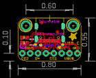
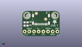
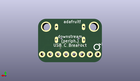
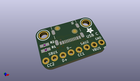

Contents
========

* [PROJ-ADAF-4090-STAN-01>Adafruit USB C Downstream Breakout](#proj-adaf-4090-stan-01adafruit-usb-c-downstream-breakout)
	* [Images](#images)
	* [Interactive BOM](#interactive-bom)
	* [OOMP Parts](#oomp-parts)
	* [Tags](#tags)
  
![][im]
# PROJ-ADAF-4090-STAN-01>Adafruit USB C Downstream Breakout

- ID: PROJ-ADAF-4090-STAN-01
- Hex ID: PRA4090
- Name: Adafruit USB C Downstream Breakout
- Description: 

## Images
  
  

|eagleImage|kicadPcb3dFront|kicadPcb3dBack|kicadPcb3d|
| :---: | :---: | :---: | :---: |
|||||

## Interactive BOM

- Interactive BOM page: [ibom.html](kicad/bom/ibom.html)

## OOMP Parts
  

|OOMP Parts|
| :---: |
|<table><tr><td></td><td> JP1</td><td>[HEAD-I01-X-PI08-01 2.54 mm 8 Pin Header](https://github.com/oomlout/oomlout_OOMP_parts/tree/main/HEAD-I01-X-PI08-01/)</td><td>[H08](https://github.com/oomlout/oomlout_OOMP_parts/tree/main/HEAD-I01-X-PI08-01/)</td></tr></table>|
|RESE-0603-X-UNMATCHED-01, R1, 2.032, 5.842, 0,R1, 5.1K, 0603-NO, microbuilder, (0.08, 0.23), R0|
|RESE-0603-X-UNMATCHED-01, R2, 2.032, 7.619999999999999, 0,R2, 5.1K, 0603-NO, microbuilder, (0.08, 0.3), R0|
|UNMATCHED-UNMATCHED-X-UNMATCHED-01, X1, 10.16, 13.97, 180,X1, USB_C_CUSB31-CFM2AX-01-X, microbuilder, (0.4, 0.55), R180|

## Tags

- hexID: PRA4090
- oompType: PROJ
- oompSize: ADAF
- oompColor: 4090
- oompDesc: STAN
- oompIndex: 01
- oompName: Adafruit USB C Downstream Breakout
- sources: All source files from https://github.com/adafruit/Adafruit-USB-C-Downstream-Breakout (source licence details in srcLicense.md)
- linkBuyPage: http://www.adafruit.com/products/4090
- oompPart: SKIP-UNMATCHED-X-UNMATCHED-01, FID1, 12.7, 9.398, 180
- oompPart: SKIP-UNMATCHED-X-UNMATCHED-01, FID2, 7.619999999999999, 12.572999999999999, 180
- oompPart: HEAD-I01-X-PI08-01, JP1, 10.16, 2.54, 180
- oompPart: RESE-0603-X-UNMATCHED-01, R1, 2.032, 5.842, 0
- oompPart: RESE-0603-X-UNMATCHED-01, R2, 2.032, 7.619999999999999, 0
- oompPart: SKIP-UNMATCHED-X-UNMATCHED-01, U$1, 17.779999999999998, 11.43, 180
- oompPart: SKIP-UNMATCHED-X-UNMATCHED-01, U$2, 2.54, 11.43, 180
- oompPart: UNMATCHED-UNMATCHED-X-UNMATCHED-01, X1, 10.16, 13.97, 180
- rawPart: FID1, FIDUCIAL_1MM, FIDUCIAL_1MM, microbuilder, (0.5, 0.37), R180
- rawPart: FID2, FIDUCIAL_1MM, FIDUCIAL_1MM, microbuilder, (0.3, 0.495), R180
- rawPart: JP1, 1X08_ROUND_76, microbuilder, (0.4, 0.1), R180
- rawPart: R1, 5.1K, 0603-NO, microbuilder, (0.08, 0.23), R0
- rawPart: R2, 5.1K, 0603-NO, microbuilder, (0.08, 0.3), R0
- rawPart: U$1, MOUNTINGHOLE2.5, MOUNTINGHOLE_2.5_PLATED, microbuilder, (0.7, 0.45), R180
- rawPart: U$2, MOUNTINGHOLE2.5, MOUNTINGHOLE_2.5_PLATED, microbuilder, (0.1, 0.45), R180
- rawPart: X1, USB_C_CUSB31-CFM2AX-01-X, microbuilder, (0.4, 0.55), R180
- oompID: PROJ-ADAF-4090-STAN-01

[im]: kicadPcb3d_450.png
