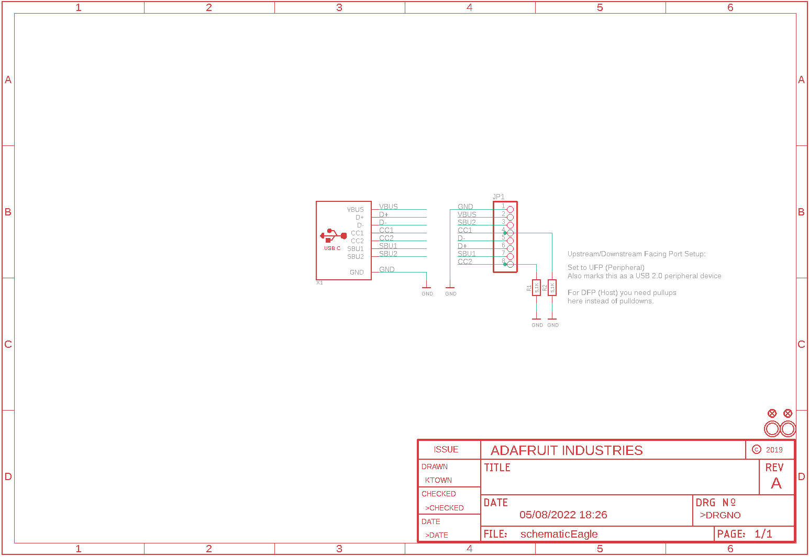
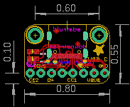
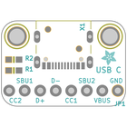
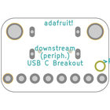
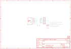
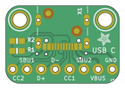
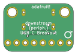

Contents
========

* [PRA4090 > Adafruit USB C Downstream Breakout](#pra4090--adafruit-usb-c-downstream-breakout)
	* [Schematic](#schematic)
	* [PCB](#pcb)
	* [Interactive BOM](#interactive-bom)
	* [OOMP Parts](#oomp-parts)
	* [Images](#images)
	* [Tags](#tags)
  
![][im]
# PRA4090 > Adafruit USB C Downstream Breakout

- ID: PROJ-ADAF-4090-STAN-01
- Hex ID: PRA4090
- Name: Adafruit
- Description: Adafruit
- Long Link: [http://oom.lt/PROJ-ADAF-4090-STAN-01](http://oom.lt/PROJ-ADAF-4090-STAN-01)
- Short Link: [http://oom.lt/PRA4090](http://oom.lt/PRA4090)

## Schematic
  

## PCB
  

## Interactive BOM

- Interactive BOM page: [ibom.html](https://htmlpreview.github.io/?https://github.com/oomlout/oomlout_OOMP_projects/blob/main/PROJ-ADAF-4090-STAN-01/kicad/bom/ibom.html)

## OOMP Parts
  

|OOMP Parts|
| :---: |
|[HEAD-I01-X-PI08-01  2.54 mm 8 Pin Header  JP1](https://github.com/oomlout/oomlout_OOMP_parts/tree/main/HEAD-I01-X-PI08-01/)|
|[RESE-0603-X-O472-01  SMD (0603) 4.7k Ohm Resistor  R1, R2](https://github.com/oomlout/oomlout_OOMP_parts/tree/main/RESE-0603-X-O472-01/)|
|UNMATCHED-UNMATCHED-X-UNMATCHED-01 X1|

## Images
  
  

|bominteractivefront|bominteractiveback|kicadPcb3d|kicadPcb3dFront|kicadPcb3dBack|eagleImage|eagleSchemImage|pcbdraw|pcbdrawback|
| :---: | :---: | :---: | :---: | :---: | :---: | :---: | :---: | :---: |
||||||||||

## Tags

- hexID: PRA4090
- oompType: PROJ
- oompSize: ADAF
- oompColor: 4090
- oompDesc: STAN
- oompIndex: 01
- oompName: Adafruit USB C Downstream Breakout
- sources: All source files from https://github.com/adafruit/Adafruit-USB-C-Downstream-Breakout (source licence details in srcLicense.md)
- linkBuyPage: http://www.adafruit.com/products/4090
- oompID: PROJ-ADAF-4090-STAN-01
- oompParts: JP1,HEAD-I01-X-PI08-01
- oompParts: R1,RESE-0603-X-O472-01
- oompParts: R2,RESE-0603-X-O472-01
- oompParts: X1,UNMATCHED-UNMATCHED-X-UNMATCHED-01
- rawParts: FID1,FIDUCIAL_1MM,FIDUCIAL_1MM,FIDUCIAL_1MM,Fiducial Alignment Points,EXCLUDE,
- rawParts: FID2,FIDUCIAL_1MM,FIDUCIAL_1MM,FIDUCIAL_1MM,Fiducial Alignment Points,EXCLUDE,
- rawParts: JP1,,HEADER-1X876MIL,1X08_ROUND_76,PIN HEADER,,
- rawParts: R1,5.1K,RESISTOR_0603_NOOUT,0603-NO,Resistors,,
- rawParts: R2,5.1K,RESISTOR_0603_NOOUT,0603-NO,Resistors,,
- rawParts: U$1,MOUNTINGHOLE2.5,MOUNTINGHOLE2.5,MOUNTINGHOLE_2.5_PLATED,Mounting Hole,EXCLUDE,
- rawParts: U$2,MOUNTINGHOLE2.5,MOUNTINGHOLE2.5,MOUNTINGHOLE_2.5_PLATED,Mounting Hole,EXCLUDE,
- rawParts: X1,,USB_C,USB_C_CUSB31-CFM2AX-01-X,USB Type-C USB 2.0 Connector,,

[im]: kicadPcb3d_450.png
