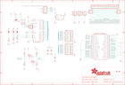

Contents
========

* [PRA4132 > Adafruit GPIO Expander Bonnet PCBs](#pra4132--adafruit-gpio-expander-bonnet-pcbs)
	* [Schematic](#schematic)
	* [PCB](#pcb)
	* [Interactive BOM](#interactive-bom)
	* [OOMP Parts](#oomp-parts)
	* [Images](#images)
	* [Tags](#tags)
  
![][im]
# PRA4132 > Adafruit GPIO Expander Bonnet PCBs

- ID: PROJ-ADAF-4132-STAN-01
- Hex ID: PRA4132
- Name: Adafruit
- Description: Adafruit
- Long Link: [http://oom.lt/PROJ-ADAF-4132-STAN-01](http://oom.lt/PROJ-ADAF-4132-STAN-01)
- Short Link: [http://oom.lt/PRA4132](http://oom.lt/PRA4132)

## Schematic
  

## PCB
  

## Interactive BOM

- Interactive BOM page: [ibom.html](https://htmlpreview.github.io/?https://github.com/oomlout/oomlout_OOMP_projects/blob/main/PROJ-ADAF-4132-STAN-01/kicad/bom/ibom.html)

## OOMP Parts
  

|OOMP Parts|
| :---: |
|[C1 CAPC-0805-X-UF10-V10 SMD (0805) 10 uF Capacitor (Ceramic) 10v](https://github.com/oomlout/oomlout_OOMP_parts/tree/main/CAPC-0805-X-UF10-V10/)|
|C2 C2,CAPC-0603-X-UF1D-01|
|[C3 CAPC-0805-X-UF10-V10 SMD (0805) 10 uF Capacitor (Ceramic) 10v](https://github.com/oomlout/oomlout_OOMP_parts/tree/main/CAPC-0805-X-UF10-V10/)|
|IC1 IC1,UNMATCHED-UNMATCHED-X-UNMATCHED-01|
|[JP1 HEAD-I01-X-PI02-01 2.54 mm 2 Pin Header](https://github.com/oomlout/oomlout_OOMP_parts/tree/main/HEAD-I01-X-PI02-01/)|
|JP2 JP2,HEAD-I01-X-UNMATCHED-01|
|[JP3 HEAD-I01-X-PI02-01 2.54 mm 2 Pin Header](https://github.com/oomlout/oomlout_OOMP_parts/tree/main/HEAD-I01-X-PI02-01/)|
|[JP5 HEAD-I01-X-PI02-01 2.54 mm 2 Pin Header](https://github.com/oomlout/oomlout_OOMP_parts/tree/main/HEAD-I01-X-PI02-01/)|
|[JP6 HEAD-I01-X-PI02-01 2.54 mm 2 Pin Header](https://github.com/oomlout/oomlout_OOMP_parts/tree/main/HEAD-I01-X-PI02-01/)|
|JP7 JP7,HEAD-I01-X-UNMATCHED-01|
|[JP8 HEAD-I01-X-PI02-01 2.54 mm 2 Pin Header](https://github.com/oomlout/oomlout_OOMP_parts/tree/main/HEAD-I01-X-PI02-01/)|
|[JP9 HEAD-I01-X-PI02-01 2.54 mm 2 Pin Header](https://github.com/oomlout/oomlout_OOMP_parts/tree/main/HEAD-I01-X-PI02-01/)|
|PIN1 PIN1,HEAD-I01-X-PI21-01|
|[Q1 MOSN-SO23-X-KBSS138-01 SMD (SOT-23) BSS138 N-Ch. MOSFET](https://github.com/oomlout/oomlout_OOMP_parts/tree/main/MOSN-SO23-X-KBSS138-01/)|
|[Q2 MOSN-SO23-X-KBSS138-01 SMD (SOT-23) BSS138 N-Ch. MOSFET](https://github.com/oomlout/oomlout_OOMP_parts/tree/main/MOSN-SO23-X-KBSS138-01/)|
|[R1 RESE-0603-X-O103-01 SMD (0603) 10k Ohm Resistor](https://github.com/oomlout/oomlout_OOMP_parts/tree/main/RESE-0603-X-O103-01/)|
|[R2 RESE-0603-X-O103-01 SMD (0603) 10k Ohm Resistor](https://github.com/oomlout/oomlout_OOMP_parts/tree/main/RESE-0603-X-O103-01/)|
|[R3 RESE-0603-X-O103-01 SMD (0603) 10k Ohm Resistor](https://github.com/oomlout/oomlout_OOMP_parts/tree/main/RESE-0603-X-O103-01/)|
|[R4 RESE-0603-X-O103-01 SMD (0603) 10k Ohm Resistor](https://github.com/oomlout/oomlout_OOMP_parts/tree/main/RESE-0603-X-O103-01/)|
|[R5 RESE-0603-X-O103-01 SMD (0603) 10k Ohm Resistor](https://github.com/oomlout/oomlout_OOMP_parts/tree/main/RESE-0603-X-O103-01/)|
|[R6 RESE-0603-X-O103-01 SMD (0603) 10k Ohm Resistor](https://github.com/oomlout/oomlout_OOMP_parts/tree/main/RESE-0603-X-O103-01/)|
|[R7 RESE-0603-X-O103-01 SMD (0603) 10k Ohm Resistor](https://github.com/oomlout/oomlout_OOMP_parts/tree/main/RESE-0603-X-O103-01/)|
|[R8 RESE-0603-X-O103-01 SMD (0603) 10k Ohm Resistor](https://github.com/oomlout/oomlout_OOMP_parts/tree/main/RESE-0603-X-O103-01/)|
|[R9 RESE-0603-X-O103-01 SMD (0603) 10k Ohm Resistor](https://github.com/oomlout/oomlout_OOMP_parts/tree/main/RESE-0603-X-O103-01/)|
|RPI2 RPI2,UNMATCHED-UNMATCHED-X-UNMATCHED-01|
|U1 U1,UNMATCHED-SO235-X-UNMATCHED-01|

## Images
  
  

|kicadPcb3d|kicadPcb3dFront|kicadPcb3dBack|eagleImage|eagleSchemImage|
| :---: | :---: | :---: | :---: | :---: |
||||||

## Tags

- hexID: PRA4132
- oompType: PROJ
- oompSize: ADAF
- oompColor: 4132
- oompDesc: STAN
- oompIndex: 01
- oompName: Adafruit GPIO Expander Bonnet PCBs
- sources: All source files from https://github.com/adafruit/Adafruit-GPIO-Expander-Bonnet-PCBs (source licence details in srcLicense.md)
- linkBuyPage: http://www.adafruit.com/products/4132
- oompID: PROJ-ADAF-4132-STAN-01
- oompParts: C1,CAPC-0805-X-UF10-V10
- oompParts: C2,CAPC-0603-X-UF1D-01
- oompParts: C3,CAPC-0805-X-UF10-V10
- oompParts: IC1,UNMATCHED-UNMATCHED-X-UNMATCHED-01
- oompParts: JP1,HEAD-I01-X-PI02-01
- oompParts: JP2,HEAD-I01-X-UNMATCHED-01
- oompParts: JP3,HEAD-I01-X-PI02-01
- oompParts: JP5,HEAD-I01-X-PI02-01
- oompParts: JP6,HEAD-I01-X-PI02-01
- oompParts: JP7,HEAD-I01-X-UNMATCHED-01
- oompParts: JP8,HEAD-I01-X-PI02-01
- oompParts: JP9,HEAD-I01-X-PI02-01
- oompParts: PIN1,HEAD-I01-X-PI21-01
- oompParts: Q1,MOSN-SO23-X-KBSS138-01
- oompParts: Q2,MOSN-SO23-X-KBSS138-01
- oompParts: R1,RESE-0603-X-O103-01
- oompParts: R2,RESE-0603-X-O103-01
- oompParts: R3,RESE-0603-X-O103-01
- oompParts: R4,RESE-0603-X-O103-01
- oompParts: R5,RESE-0603-X-O103-01
- oompParts: R6,RESE-0603-X-O103-01
- oompParts: R7,RESE-0603-X-O103-01
- oompParts: R8,RESE-0603-X-O103-01
- oompParts: R9,RESE-0603-X-O103-01
- oompParts: RPI2,UNMATCHED-UNMATCHED-X-UNMATCHED-01
- oompParts: U1,UNMATCHED-SO235-X-UNMATCHED-01
- rawParts: ADDR0,,SOLDERJUMPER,SOLDERJUMPER_ARROW_NOPASTE,SMD Solder JUMPER,EXCLUDE,,,,,
- rawParts: ADDR1,,SOLDERJUMPER,SOLDERJUMPER_ARROW_NOPASTE,SMD Solder JUMPER,EXCLUDE,,,,,
- rawParts: ADDR2,,SOLDERJUMPER,SOLDERJUMPER_ARROW_NOPASTE,SMD Solder JUMPER,EXCLUDE,,,,,
- rawParts: C1,10uF,CAP_CERAMIC0805-NOOUTLINE,0805-NO,Ceramic Capacitors,,,,,,
- rawParts: C2,0.1uF,CAP_CERAMIC0603_NO,0603-NO,Ceramic Capacitors,,,,,,
- rawParts: C3,10uF,CAP_CERAMIC0805-NOOUTLINE,0805-NO,Ceramic Capacitors,,,,,,
- rawParts: FID1,FIDUCIAL_1MM,FIDUCIAL_1MM,FIDUCIAL_1MM,Fiducial Alignment Points,EXCLUDE,,,,,
- rawParts: FID2,FIDUCIAL_1MM,FIDUCIAL_1MM,FIDUCIAL_1MM,Fiducial Alignment Points,EXCLUDE,,,,,
- rawParts: IC1,MCP23017ML,MCP23017ML,QFN28-ML_6X6MM,http://ww1.microchip.com/downloads/en/DeviceDoc/21952a.pdf,,MICROCHIP,MCP23017-E/ML,unknown,31K2957,
- rawParts: JP1,,HEADER-1X2ROUND,1X02_ROUND,PIN HEADER,,,,,,
- rawParts: JP2,,HEADER-2X8_SHROUDED,2X08_SHROUDED,,,,,,,
- rawParts: JP3,,HEADER-1X2ROUND,1X02_ROUND,PIN HEADER,,,,,,
- rawParts: JP5,,HEADER-1X2ROUND,1X02_ROUND,PIN HEADER,,,,,,
- rawParts: JP6,,HEADER-1X2ROUND,1X02_ROUND,PIN HEADER,,,,,,
- rawParts: JP7,,HEADER-2X8_SHROUDED,2X08_SHROUDED,,,,,,,
- rawParts: JP8,,HEADER-1X2ROUND,1X02_ROUND,PIN HEADER,,,,,,
- rawParts: JP9,,HEADER-1X2ROUND,1X02_ROUND,PIN HEADER,,,,,,
- rawParts: PIN1,HEADER-1X21,HEADER-1X21,1X21_ROUND_70MIL,,,,,,,
- rawParts: Q1,BSS138,MOSFET-NWIDE,SOT23-WIDE,N-Channel Mosfet,,,,,,
- rawParts: Q2,BSS138,MOSFET-NWIDE,SOT23-WIDE,N-Channel Mosfet,,,,,,
- rawParts: R1,10K,RESISTOR_0603_NOOUT,0603-NO,Resistors,,,,,,
- rawParts: R2,10K,RESISTOR_0603_NOOUT,0603-NO,Resistors,,,,,,
- rawParts: R3,10K,RESISTOR_0603_NOOUT,0603-NO,Resistors,,,,,,
- rawParts: R4,10K,RESISTOR_0603_NOOUT,0603-NO,Resistors,,,,,,
- rawParts: R5,10K,RESISTOR_0603_NOOUT,0603-NO,Resistors,,,,,,
- rawParts: R6,10K,RESISTOR_0603_NOOUT,0603-NO,Resistors,,,,,,
- rawParts: R7,10K,RESISTOR_0603_NOOUT,0603-NO,Resistors,,,,,,
- rawParts: R8,10K,RESISTOR_0603_NOOUT,0603-NO,Resistors,,,,,,
- rawParts: R9,10K,RESISTOR_0603_NOOUT,0603-NO,Resistors,,,,,,
- rawParts: RPI2,PIBONNET_STEMMA_2STEMMA_SMTTHM,PIBONNET_STEMMA_2STEMMA_SMTTHM,PI_BONNET_2STEMMA_SMT,,,,,,,
- rawParts: U1,,VREG_SOT23-5,SOT23-5,SOT23-5 Fixed Voltage Regulators,,,,,,
- rawParts: VIO_SELECT,,SOLDERJUMPER_2WAY,SOLDERJUMPER_2WAY_OPEN_NOPASTE,2-Way Solder Jumper,,,,,,

[im]: kicadPcb3d_450.png
