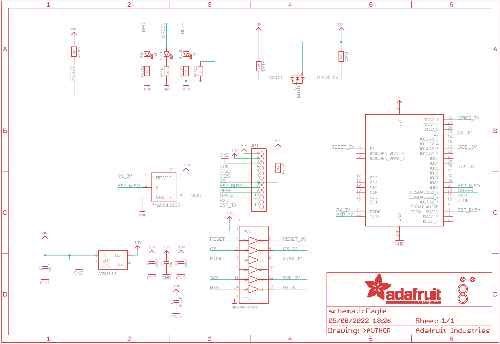
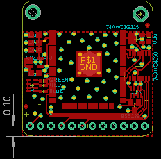
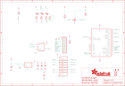

Contents
========

* [PRA4201 > Adafruit AirLift Breakout PCB](#pra4201--adafruit-airlift-breakout-pcb)
	* [Schematic](#schematic)
	* [PCB](#pcb)
	* [Interactive BOM](#interactive-bom)
	* [OOMP Parts](#oomp-parts)
	* [Images](#images)
	* [Tags](#tags)
  
![][im]
# PRA4201 > Adafruit AirLift Breakout PCB

- ID: PROJ-ADAF-4201-STAN-01
- Hex ID: PRA4201
- Name: Adafruit
- Description: Adafruit
- Long Link: [http://oom.lt/PROJ-ADAF-4201-STAN-01](http://oom.lt/PROJ-ADAF-4201-STAN-01)
- Short Link: [http://oom.lt/PRA4201](http://oom.lt/PRA4201)

## Schematic
  

## PCB
  

## Interactive BOM

- Interactive BOM page: [ibom.html](https://htmlpreview.github.io/?https://github.com/oomlout/oomlout_OOMP_projects/blob/main/PROJ-ADAF-4201-STAN-01/kicad/bom/ibom.html)

## OOMP Parts
  

|OOMP Parts|
| :---: |
|[C1 CAPC-0805-X-UF10-V10 SMD (0805) 10 uF Capacitor (Ceramic) 10v](https://github.com/oomlout/oomlout_OOMP_parts/tree/main/CAPC-0805-X-UF10-V10/)|
|[C2 CAPC-0805-X-UF10-V10 SMD (0805) 10 uF Capacitor (Ceramic) 10v](https://github.com/oomlout/oomlout_OOMP_parts/tree/main/CAPC-0805-X-UF10-V10/)|
|[C3 CAPC-0805-X-UF10-V10 SMD (0805) 10 uF Capacitor (Ceramic) 10v](https://github.com/oomlout/oomlout_OOMP_parts/tree/main/CAPC-0805-X-UF10-V10/)|
|[C4 CAPC-0805-X-UF10-V10 SMD (0805) 10 uF Capacitor (Ceramic) 10v](https://github.com/oomlout/oomlout_OOMP_parts/tree/main/CAPC-0805-X-UF10-V10/)|
|C5 C5,CAPC-0603-X-UF1D-01|
|[D1 LEDS-0603-G-STAN-01 SMD (0603) Green LED](https://github.com/oomlout/oomlout_OOMP_parts/tree/main/LEDS-0603-G-STAN-01/)|
|[D2 LEDS-0603-G-STAN-01 SMD (0603) Green LED](https://github.com/oomlout/oomlout_OOMP_parts/tree/main/LEDS-0603-G-STAN-01/)|
|[D3 LEDS-0603-G-STAN-01 SMD (0603) Green LED](https://github.com/oomlout/oomlout_OOMP_parts/tree/main/LEDS-0603-G-STAN-01/)|
|IC1 IC1,UNMATCHED-SO235-X-UNMATCHED-01|
|[JP1 HEAD-I01-X-PI12-01 2.54 mm 12 Pin Header](https://github.com/oomlout/oomlout_OOMP_parts/tree/main/HEAD-I01-X-PI12-01/)|
|[Q3 MOSN-SO23-X-KBSS138-01 SMD (SOT-23) BSS138 N-Ch. MOSFET](https://github.com/oomlout/oomlout_OOMP_parts/tree/main/MOSN-SO23-X-KBSS138-01/)|
|R2 R2,RESA-06038-X-O103X4-01|
|R6 R6,RESA-06038-X-O102X4-01|
|U1 U1,UNMATCHED-SO235-X-UNMATCHED-01|
|U2 U2,UNMATCHED-UNMATCHED-X-UNMATCHED-01|
|X1 X1,UNMATCHED-UNMATCHED-X-UNMATCHED-01|

## Images
  
  

|kicadPcb3d|kicadPcb3dFront|kicadPcb3dBack|eagleImage|eagleSchemImage|
| :---: | :---: | :---: | :---: | :---: |
||||||

## Tags

- hexID: PRA4201
- oompType: PROJ
- oompSize: ADAF
- oompColor: 4201
- oompDesc: STAN
- oompIndex: 01
- oompName: Adafruit AirLift Breakout PCB
- sources: All source files from https://github.com/adafruit/Adafruit-AirLift-Breakout-PCB (source licence details in srcLicense.md)
- linkBuyPage: http://www.adafruit.com/products/4201
- oompID: PROJ-ADAF-4201-STAN-01
- oompParts: C1,CAPC-0805-X-UF10-V10
- oompParts: C2,CAPC-0805-X-UF10-V10
- oompParts: C3,CAPC-0805-X-UF10-V10
- oompParts: C4,CAPC-0805-X-UF10-V10
- oompParts: C5,CAPC-0603-X-UF1D-01
- oompParts: D1,LEDS-0603-G-STAN-01
- oompParts: D2,LEDS-0603-G-STAN-01
- oompParts: D3,LEDS-0603-G-STAN-01
- oompParts: IC1,UNMATCHED-SO235-X-UNMATCHED-01
- oompParts: JP1,HEAD-I01-X-PI12-01
- oompParts: Q3,MOSN-SO23-X-KBSS138-01
- oompParts: R2,RESA-06038-X-O103X4-01
- oompParts: R6,RESA-06038-X-O102X4-01
- oompParts: U1,UNMATCHED-SO235-X-UNMATCHED-01
- oompParts: U2,UNMATCHED-UNMATCHED-X-UNMATCHED-01
- oompParts: X1,UNMATCHED-UNMATCHED-X-UNMATCHED-01
- rawParts: C1,10uF,CAP_CERAMIC0805-NOOUTLINE,0805-NO,Ceramic Capacitors,,
- rawParts: C2,10uF,CAP_CERAMIC0805-NOOUTLINE,0805-NO,Ceramic Capacitors,,
- rawParts: C3,10uF,CAP_CERAMIC0805-NOOUTLINE,0805-NO,Ceramic Capacitors,,
- rawParts: C4,10uF,CAP_CERAMIC0805-NOOUTLINE,0805-NO,Ceramic Capacitors,,
- rawParts: C5,0.1uF,CAP_CERAMIC0603_NO,0603-NO,Ceramic Capacitors,,
- rawParts: D1,GREEN,LED0603_NOOUTLINE,CHIPLED_0603_NOOUTLINE,LED,,
- rawParts: D2,BLUE,LED0603_NOOUTLINE,CHIPLED_0603_NOOUTLINE,LED,,
- rawParts: D3,RED,LED0603_NOOUTLINE,CHIPLED_0603_NOOUTLINE,LED,,
- rawParts: FID1,FIDUCIAL_1MM,FIDUCIAL_1MM,FIDUCIAL_1MM,Fiducial Alignment Points,EXCLUDE,
- rawParts: FID3,FIDUCIAL_1MM,FIDUCIAL_1MM,FIDUCIAL_1MM,Fiducial Alignment Points,EXCLUDE,
- rawParts: IC1,74AHC1G125,74AHC1G125,SOT23-5L,,,
- rawParts: JP1,,HEADER-1X12,1X12_ROUND,,,
- rawParts: Q3,BSS138,MOSFET-NWIDE,SOT23-WIDE,N-Channel Mosfet,,
- rawParts: R2,10K,RESISTOR_4PACK,RESPACK_4X0603,Resistor Packs (4 resistors),,
- rawParts: R6,1K,RESISTOR_4PACK,RESPACK_4X0603,Resistor Packs (4 resistors),,
- rawParts: U$15,MOUNTINGHOLE2.5,MOUNTINGHOLE2.5,MOUNTINGHOLE_2.5_PLATED,Mounting Hole,EXCLUDE,
- rawParts: U$16,MOUNTINGHOLE2.5,MOUNTINGHOLE2.5,MOUNTINGHOLE_2.5_PLATED,Mounting Hole,EXCLUDE,
- rawParts: U1,AP2112-3.3,VREG_SOT23-5,SOT23-5,SOT23-5 Fixed Voltage Regulators,,
- rawParts: U2,74AHC4050,74HC4050DTSSOP,TSSOP16,6-channel level shifter,,
- rawParts: X1,ESP32_WROOM32,ESP32_WROOM32,WROOM32,,,

[im]: kicadPcb3d_450.png
