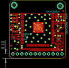
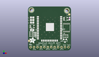
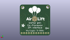
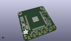

Contents
========

* [PROJ-ADAF-4201-STAN-01>Adafruit AirLift Breakout PCB](#proj-adaf-4201-stan-01adafruit-airlift-breakout-pcb)
	* [Images](#images)
	* [Interactive BOM](#interactive-bom)
	* [OOMP Parts](#oomp-parts)
	* [Tags](#tags)
  
![][im]
# PROJ-ADAF-4201-STAN-01>Adafruit AirLift Breakout PCB

- ID: PROJ-ADAF-4201-STAN-01
- Hex ID: PRA4201
- Name: Adafruit AirLift Breakout PCB
- Description: 

## Images
  
  

|eagleImage|kicadPcb3dFront|kicadPcb3dBack|kicadPcb3d|
| :---: | :---: | :---: | :---: |
|||||

## Interactive BOM

- Interactive BOM page: [ibom.html](kicad/bom/ibom.html)

## OOMP Parts
  

|OOMP Parts|
| :---: |
|CAPC-0805-X-UNMATCHED-01, C1, 3.0479999999999996, 24.764999999999997, 180,C1, 10uF, 0805-NO, microbuilder, (0.12, 0.975), R180|
|CAPC-0805-X-UNMATCHED-01, C2, 3.0479999999999996, 15.366999999999999, 0,C2, 10uF, 0805-NO, microbuilder, (0.12, 0.605), R0|
|CAPC-0805-X-UNMATCHED-01, C3, 3.0479999999999996, 20.955, 180,C3, 10uF, 0805-NO, microbuilder, (0.12, 0.825), R180|
|CAPC-0805-X-UNMATCHED-01, C4, 3.0479999999999996, 22.86, 180,C4, 10uF, 0805-NO, microbuilder, (0.12, 0.9), R180|
|<table><tr><td></td><td> C5</td><td>[CAPC-0603-X-NF100-V50 SMD (0603) 100 nF Capacitor (Ceramic) 50v](https://github.com/oomlout/oomlout_OOMP_parts/tree/main/CAPC-0603-X-NF100-V50/)</td><td>[C6N100](https://github.com/oomlout/oomlout_OOMP_parts/tree/main/CAPC-0603-X-NF100-V50/)</td></tr></table>|
|UNMATCHED-UNMATCHED-X-UNMATCHED-01, D1, 5.08, 13.589, 90,D1, GREEN, CHIPLED_0603_NOOUTLINE, microbuilder, (0.2, 0.535), R90|
|UNMATCHED-UNMATCHED-X-UNMATCHED-01, D2, 5.08, 10.921999999999999, 90,D2, BLUE, CHIPLED_0603_NOOUTLINE, microbuilder, (0.2, 0.43), R90|
|UNMATCHED-UNMATCHED-X-UNMATCHED-01, D3, 5.08, 12.318999999999999, 90,D3, RED, CHIPLED_0603_NOOUTLINE, microbuilder, (0.2, 0.485), R90|
|UNMATCHED-UNMATCHED-X-UNMATCHED-01, IC1, 27.813, 23.749, 270,IC1, 74AHC1G125, SOT23-5L, adafruit, (1.095, 0.935), R270|
|<table><tr><td></td><td> JP1</td><td>[HEAD-I01-X-PI12-01 2.54 mm 12 Pin Header](https://github.com/oomlout/oomlout_OOMP_parts/tree/main/HEAD-I01-X-PI12-01/)</td><td>[H12](https://github.com/oomlout/oomlout_OOMP_parts/tree/main/HEAD-I01-X-PI12-01/)</td></tr></table>|
|UNMATCHED-UNMATCHED-X-UNMATCHED-01, Q3, 27.304999999999996, 7.365999999999999, 180,Q3, BSS138, SOT23-WIDE, microbuilder, (1.075, 0.29), R180|
|RESE-UNMATCHED-X-O103-01, R2, 27.686, 10.795, 0,R2, 10K, RESPACK_4X0603, microbuilder, (1.09, 0.425), R0|
|RESE-UNMATCHED-X-UNMATCHED-01, R6, 2.2859999999999996, 12.318999999999999, 270,R6, 1K, RESPACK_4X0603, microbuilder, (0.09, 0.485), R270|
|UNMATCHED-UNMATCHED-X-UNMATCHED-01, U1, 3.0479999999999996, 18.034, 270,U1, AP2112-3.3, SOT23-5, microbuilder, (0.12, 0.71), R270|
|UNMATCHED-UNMATCHED-X-UNMATCHED-01, U2, 28.448, 17.145, 0,U2, 74AHC4050, TSSOP16, microbuilder, (1.12, 0.675), R0|
|UNMATCHED-UNMATCHED-X-UNMATCHED-01, X1, 15.875, 20.32, 0,X1, ESP32_WROOM32, WROOM32, microbuilder, (0.625, 0.8), R0|

## Tags

- hexID: PRA4201
- oompType: PROJ
- oompSize: ADAF
- oompColor: 4201
- oompDesc: STAN
- oompIndex: 01
- oompName: Adafruit AirLift Breakout PCB
- sources: All source files from https://github.com/adafruit/Adafruit-AirLift-Breakout-PCB (source licence details in srcLicense.md)
- linkBuyPage: http://www.adafruit.com/products/4201
- oompPart: CAPC-0805-X-UNMATCHED-01, C1, 3.0479999999999996, 24.764999999999997, 180
- oompPart: CAPC-0805-X-UNMATCHED-01, C2, 3.0479999999999996, 15.366999999999999, 0
- oompPart: CAPC-0805-X-UNMATCHED-01, C3, 3.0479999999999996, 20.955, 180
- oompPart: CAPC-0805-X-UNMATCHED-01, C4, 3.0479999999999996, 22.86, 180
- oompPart: CAPC-0603-X-NF100-V50, C5, 30.733999999999998, 24.002999999999997, 270
- oompPart: UNMATCHED-UNMATCHED-X-UNMATCHED-01, D1, 5.08, 13.589, 90
- oompPart: UNMATCHED-UNMATCHED-X-UNMATCHED-01, D2, 5.08, 10.921999999999999, 90
- oompPart: UNMATCHED-UNMATCHED-X-UNMATCHED-01, D3, 5.08, 12.318999999999999, 90
- oompPart: SKIP-UNMATCHED-X-UNMATCHED-01, FID1, 0.7619999999999999, 7.238999999999999, 0
- oompPart: SKIP-UNMATCHED-X-UNMATCHED-01, FID3, 30.479999999999997, 27.051, 0
- oompPart: UNMATCHED-UNMATCHED-X-UNMATCHED-01, IC1, 27.813, 23.749, 270
- oompPart: HEAD-I01-X-PI12-01, JP1, 15.875, 2.54, 0
- oompPart: UNMATCHED-UNMATCHED-X-UNMATCHED-01, Q3, 27.304999999999996, 7.365999999999999, 180
- oompPart: RESE-UNMATCHED-X-O103-01, R2, 27.686, 10.795, 0
- oompPart: RESE-UNMATCHED-X-UNMATCHED-01, R6, 2.2859999999999996, 12.318999999999999, 270
- oompPart: SKIP-UNMATCHED-X-UNMATCHED-01, U$15, 2.54, 30.353, 0
- oompPart: SKIP-UNMATCHED-X-UNMATCHED-01, U$16, 28.701999999999995, 29.845, 0
- oompPart: UNMATCHED-UNMATCHED-X-UNMATCHED-01, U1, 3.0479999999999996, 18.034, 270
- oompPart: UNMATCHED-UNMATCHED-X-UNMATCHED-01, U2, 28.448, 17.145, 0
- oompPart: UNMATCHED-UNMATCHED-X-UNMATCHED-01, X1, 15.875, 20.32, 0
- rawPart: C1, 10uF, 0805-NO, microbuilder, (0.12, 0.975), R180
- rawPart: C2, 10uF, 0805-NO, microbuilder, (0.12, 0.605), R0
- rawPart: C3, 10uF, 0805-NO, microbuilder, (0.12, 0.825), R180
- rawPart: C4, 10uF, 0805-NO, microbuilder, (0.12, 0.9), R180
- rawPart: C5, 0.1uF, 0603-NO, microbuilder, (1.21, 0.945), R270
- rawPart: D1, GREEN, CHIPLED_0603_NOOUTLINE, microbuilder, (0.2, 0.535), R90
- rawPart: D2, BLUE, CHIPLED_0603_NOOUTLINE, microbuilder, (0.2, 0.43), R90
- rawPart: D3, RED, CHIPLED_0603_NOOUTLINE, microbuilder, (0.2, 0.485), R90
- rawPart: FID1, FIDUCIAL_1MM, FIDUCIAL_1MM, microbuilder, (0.03, 0.285), R0
- rawPart: FID3, FIDUCIAL_1MM, FIDUCIAL_1MM, microbuilder, (1.2, 1.065), R0
- rawPart: IC1, 74AHC1G125, SOT23-5L, adafruit, (1.095, 0.935), R270
- rawPart: JP1, 1X12_ROUND, microbuilder, (0.625, 0.1), R0
- rawPart: Q3, BSS138, SOT23-WIDE, microbuilder, (1.075, 0.29), R180
- rawPart: R2, 10K, RESPACK_4X0603, microbuilder, (1.09, 0.425), R0
- rawPart: R6, 1K, RESPACK_4X0603, microbuilder, (0.09, 0.485), R270
- rawPart: U$15, MOUNTINGHOLE2.5, MOUNTINGHOLE_2.5_PLATED, microbuilder, (0.1, 1.195), R0
- rawPart: U$16, MOUNTINGHOLE2.5, MOUNTINGHOLE_2.5_PLATED, microbuilder, (1.13, 1.175), R0
- rawPart: U1, AP2112-3.3, SOT23-5, microbuilder, (0.12, 0.71), R270
- rawPart: U2, 74AHC4050, TSSOP16, microbuilder, (1.12, 0.675), R0
- rawPart: X1, ESP32_WROOM32, WROOM32, microbuilder, (0.625, 0.8), R0
- oompID: PROJ-ADAF-4201-STAN-01

[im]: kicadPcb3d_450.png
