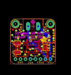
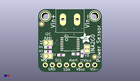
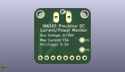
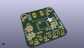

Contents
========

* [PROJ-ADAF-4226-STAN-01>Adafruit INA260 PCB](#proj-adaf-4226-stan-01adafruit-ina260-pcb)
	* [Images](#images)
	* [Interactive BOM](#interactive-bom)
	* [OOMP Parts](#oomp-parts)
	* [Tags](#tags)
  
![][im]
# PROJ-ADAF-4226-STAN-01>Adafruit INA260 PCB

- ID: PROJ-ADAF-4226-STAN-01
- Hex ID: PRA4226
- Name: Adafruit INA260 PCB
- Description: 

## Images
  
  

|eagleImage|kicadPcb3dFront|kicadPcb3dBack|kicadPcb3d|
| :---: | :---: | :---: | :---: |
|||||

## Interactive BOM

- Interactive BOM page: [ibom.html](kicad/bom/ibom.html)

## OOMP Parts
  

|OOMP Parts|
| :---: |
|CAPC-0603-X-UNMATCHED-01, C1, 15.7607, 6.6548, 270,C1, 1uF, 0603-NO, microbuilder, (0.6205, 0.262), R270|
|UNMATCHED-UNMATCHED-X-UNMATCHED-01, IC1, 11.43, 10.16, 270,IC1, INA260, TSSOP16, microbuilder, (0.45, 0.4), R270|
|<table><tr><td></td><td> JP2</td><td>[HEAD-I01-X-PI08-01 2.54 mm 8 Pin Header](https://github.com/oomlout/oomlout_OOMP_parts/tree/main/HEAD-I01-X-PI08-01/)</td><td>[H08](https://github.com/oomlout/oomlout_OOMP_parts/tree/main/HEAD-I01-X-PI08-01/)</td></tr></table>|
|<table><tr><td></td><td> R1</td><td>[RESE-0603-X-O103-01 SMD (0603) 10k Ohm Resistor](https://github.com/oomlout/oomlout_OOMP_parts/tree/main/RESE-0603-X-O103-01/)</td><td>[R6103](https://github.com/oomlout/oomlout_OOMP_parts/tree/main/RESE-0603-X-O103-01/)</td></tr></table>|
|<table><tr><td></td><td> R2</td><td>[RESE-0603-X-O103-01 SMD (0603) 10k Ohm Resistor](https://github.com/oomlout/oomlout_OOMP_parts/tree/main/RESE-0603-X-O103-01/)</td><td>[R6103](https://github.com/oomlout/oomlout_OOMP_parts/tree/main/RESE-0603-X-O103-01/)</td></tr></table>|
|<table><tr><td></td><td> R3</td><td>[RESE-0603-X-O103-01 SMD (0603) 10k Ohm Resistor](https://github.com/oomlout/oomlout_OOMP_parts/tree/main/RESE-0603-X-O103-01/)</td><td>[R6103](https://github.com/oomlout/oomlout_OOMP_parts/tree/main/RESE-0603-X-O103-01/)</td></tr></table>|
|<table><tr><td></td><td> R4</td><td>[RESE-0603-X-O103-01 SMD (0603) 10k Ohm Resistor](https://github.com/oomlout/oomlout_OOMP_parts/tree/main/RESE-0603-X-O103-01/)</td><td>[R6103](https://github.com/oomlout/oomlout_OOMP_parts/tree/main/RESE-0603-X-O103-01/)</td></tr></table>|
|ERROR, X1 5.08mm Term, 0, 0, 0,X1, 5.08mm, Term, TERMBLOCK_508_1X2, microbuilder, (0.45, 0.75), R0|

## Tags

- hexID: PRA4226
- oompType: PROJ
- oompSize: ADAF
- oompColor: 4226
- oompDesc: STAN
- oompIndex: 01
- oompName: Adafruit INA260 PCB
- sources: All source files from https://github.com/adafruit/Adafruit-INA260-PCB (source licence details in srcLicense.md)
- linkBuyPage: http://www.adafruit.com/products/4226
- oompID: PROJ-ADAF-4226-STAN-01
- oompPart: CAPC-0603-X-UNMATCHED-01, C1, 15.7607, 6.6548, 270
- oompPart: SKIP-UNMATCHED-X-UNMATCHED-01, FID3, 20.32, 5.4864, 0
- oompPart: SKIP-UNMATCHED-X-UNMATCHED-01, FID4, 1.2192, 17.4498, 0
- oompPart: UNMATCHED-UNMATCHED-X-UNMATCHED-01, IC1, 11.43, 10.16, 270
- oompPart: HEAD-I01-X-PI08-01, JP2, 11.43, 2.54, 0
- oompPart: RESE-0603-X-O103-01, R1, 8.2296, 6.152584342, 180
- oompPart: RESE-0603-X-O103-01, R2, 13.4493, 6.533584341999999, 0
- oompPart: RESE-0603-X-O103-01, R3, 3.503499978, 7.422584342, 180
- oompPart: RESE-0603-X-O103-01, R4, 3.503499978, 8.9408, 180
- oompPart: SKIP-UNMATCHED-X-UNMATCHED-01, SJ1, 17.525999999999996, 8.382, 90
- oompPart: SKIP-UNMATCHED-X-UNMATCHED-01, SJ3, 3.556, 5.785415658, 0
- oompPart: SKIP-UNMATCHED-X-UNMATCHED-01, SJ4, 3.556, 10.617199999999999, 0
- oompPart: SKIP-UNMATCHED-X-UNMATCHED-01, TP1, 3.556, 9.779, M0
- oompPart: SKIP-UNMATCHED-X-UNMATCHED-01, TP2, 3.556, 5.842, M0
- oompPart: SKIP-UNMATCHED-X-UNMATCHED-01, U$7, 20.32, 20.32, 0
- oompPart: SKIP-UNMATCHED-X-UNMATCHED-01, U$8, 2.54, 20.32, 0
- oompPart: ERROR, X1 5.08mm Term, 0, 0, 0
- rawPart: C1, 1uF, 0603-NO, microbuilder, (0.6205, 0.262), R270
- rawPart: FID3, MICROBUILDER_FIDUCIAL, MICROBUILDER_FIDUCIAL_1MM, Adafruit_INA219_CurPowerMonitor, (0.8, 0.216), R0
- rawPart: FID4, MICROBUILDER_FIDUCIAL, MICROBUILDER_FIDUCIAL_1MM, Adafruit_INA219_CurPowerMonitor, (0.048, 0.687), R0
- rawPart: IC1, INA260, TSSOP16, microbuilder, (0.45, 0.4), R270
- rawPart: JP2, 1X08_ROUND_70, microbuilder, (0.45, 0.1), R0
- rawPart: R1, 10K, 0603-NO, microbuilder, (0.324, 0.24222773), R180
- rawPart: R2, 10K, 0603-NO, microbuilder, (0.5295, 0.25722773), R0
- rawPart: R3, 10K, 0603-NO, microbuilder, (0.13793307, 0.29222773), R180
- rawPart: R4, 10K, 0603-NO, microbuilder, (0.13793307, 0.352), R180
- rawPart: SJ1, SOLDERJUMPER_CLOSEDWIRE, microbuilder, (0.69, 0.33), R90
- rawPart: SJ3, SOLDERJUMPER_ARROW_NOPASTE, microbuilder, (0.14, 0.22777227), R0
- rawPart: SJ4, SOLDERJUMPER_ARROW_NOPASTE, microbuilder, (0.14, 0.418), R0
- rawPart: TP1, TESTPOINT_ROUND_1.5MM, microbuilder, (0.14, 0.385), MR0
- rawPart: TP2, TESTPOINT_ROUND_1.5MM, microbuilder, (0.14, 0.23), MR0
- rawPart: U$7, MOUNTINGHOLE2.5, MOUNTINGHOLE_2.5_PLATED, microbuilder, (0.8, 0.8), R0
- rawPart: U$8, MOUNTINGHOLE2.5, MOUNTINGHOLE_2.5_PLATED, microbuilder, (0.1, 0.8), R0
- rawPart: X1, 5.08mm, Term, TERMBLOCK_508_1X2, microbuilder, (0.45, 0.75), R0

[im]: kicadPcb3d_450.png
