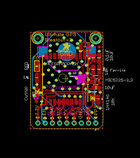

Contents
========

* [PROJ-ADAF-4279-STAN-01>Adafruit Ultimate GPS](#proj-adaf-4279-stan-01adafruit-ultimate-gps)
	* [Images](#images)
	* [Interactive BOM](#interactive-bom)
	* [OOMP Parts](#oomp-parts)
	* [Tags](#tags)
  
![][im]
# PROJ-ADAF-4279-STAN-01>Adafruit Ultimate GPS

- ID: PROJ-ADAF-4279-STAN-01
- Hex ID: PRA4279
- Name: Adafruit Ultimate GPS
- Description: 

## Images
  
  

|eagleImage|
| :---: |
||

## Interactive BOM

- Interactive BOM page: [ibom.html](kicad/bom/ibom.html)

## OOMP Parts
  

|OOMP Parts|
| :---: |
|UNMATCHED-UNMATCHED-X-UNMATCHED-01, B1, 12.7, 27.051, M0,B1, CR1220, CR1220, microbuilder, (0.5, 1.065), MR0|
|<table><tr><td></td><td> C1</td><td>[CAPC-0805-X-NF100-V50 SMD (0805) 100 nF Capacitor (Ceramic) 50v](https://github.com/oomlout/oomlout_OOMP_parts/tree/main/CAPC-0805-X-NF100-V50/)</td><td>[C85N100](https://github.com/oomlout/oomlout_OOMP_parts/tree/main/CAPC-0805-X-NF100-V50/)</td></tr></table>|
|<table><tr><td></td><td> C2</td><td>[CAPC-0805-X-UF10-V25 SMD (0805) 10 uF Capacitor (Ceramic) 25v](https://github.com/oomlout/oomlout_OOMP_parts/tree/main/CAPC-0805-X-UF10-V25/)</td><td>[C85U010](https://github.com/oomlout/oomlout_OOMP_parts/tree/main/CAPC-0805-X-UF10-V25/)</td></tr></table>|
|<table><tr><td></td><td> C3</td><td>[CAPC-0805-X-UF10-V25 SMD (0805) 10 uF Capacitor (Ceramic) 25v](https://github.com/oomlout/oomlout_OOMP_parts/tree/main/CAPC-0805-X-UF10-V25/)</td><td>[C85U010](https://github.com/oomlout/oomlout_OOMP_parts/tree/main/CAPC-0805-X-UF10-V25/)</td></tr></table>|
|UNMATCHED-UNMATCHED-X-UNMATCHED-01, D1, 21.843999999999998, 10.795, 90,D1, 1N4148, SOD-323, microbuilder, (0.86, 0.425), R90|
|UNMATCHED-UNMATCHED-X-UNMATCHED-01, D2, 2.413, 12.953999999999999, 90,D2, CUS520, SOD-323, microbuilder, (0.095, 0.51), R90|
|UNMATCHED-0805-X-UNMATCHED-01, FB1, 24.002999999999997, 20.804000048, 90,FB1, Ferrite, 0805-NO, microbuilder, (0.945, 0.81905512), R90|
|UNMATCHED-UNMATCHED-X-UNMATCHED-01, JP1, 12.7, 2.032, 180,JP1, 1X09_ROUND_70, microbuilder, (0.5, 0.08), R180|
|UNMATCHED-UNMATCHED-X-UNMATCHED-01, LED1, 2.182999952, 21.971, 180,LED1, RED, CHIPLED_0805, microbuilder, (0.08594488, 0.865), R180|
|<table><tr><td></td><td> R1</td><td>[RESE-0805-X-O102-01 SMD (0805) 1k Ohm Resistor](https://github.com/oomlout/oomlout_OOMP_parts/tree/main/RESE-0805-X-O102-01/)</td><td>[R85102](https://github.com/oomlout/oomlout_OOMP_parts/tree/main/RESE-0805-X-O102-01/)</td></tr></table>|
|<table><tr><td></td><td> R2</td><td>[RESE-0805-X-O103-01 SMD (0805) 10k Ohm Resistor](https://github.com/oomlout/oomlout_OOMP_parts/tree/main/RESE-0805-X-O103-01/)</td><td>[R85103](https://github.com/oomlout/oomlout_OOMP_parts/tree/main/RESE-0805-X-O103-01/)</td></tr></table>|
|<table><tr><td></td><td> R3</td><td>[RESE-0805-X-O103-01 SMD (0805) 10k Ohm Resistor](https://github.com/oomlout/oomlout_OOMP_parts/tree/main/RESE-0805-X-O103-01/)</td><td>[R85103](https://github.com/oomlout/oomlout_OOMP_parts/tree/main/RESE-0805-X-O103-01/)</td></tr></table>|
|UNMATCHED-UNMATCHED-X-UNMATCHED-01, U1, 12.191999999999998, 17.525999999999996, 90,U1, FGPMMOPA6H, FGPMMOPA6H, microbuilder, (0.48, 0.69), R90|
|UNMATCHED-UNMATCHED-X-UNMATCHED-01, U2, 22.987, 16.994000048, 270,U2, MIC5225-3.3, SOT23-5, microbuilder, (0.905, 0.66905512), R270|

## Tags

- hexID: PRA4279
- oompType: PROJ
- oompSize: ADAF
- oompColor: 4279
- oompDesc: STAN
- oompIndex: 01
- oompName: Adafruit Ultimate GPS
- sources: All source files from https://github.com/adafruit/Adafruit-Ultimate-GPS (source licence details in srcLicense.md)
- linkBuyPage: http://www.adafruit.com/products/4279
- oompPart: UNMATCHED-UNMATCHED-X-UNMATCHED-01, B1, 12.7, 27.051, M0
- oompPart: CAPC-0805-X-NF100-V50, C1, 21.971, 24.915999952, 90
- oompPart: CAPC-0805-X-UF10-V25, C2, 24.002999999999997, 24.868000048, 90
- oompPart: CAPC-0805-X-UF10-V25, C3, 22.987, 14.327000048, 0
- oompPart: UNMATCHED-UNMATCHED-X-UNMATCHED-01, D1, 21.843999999999998, 10.795, 90
- oompPart: UNMATCHED-UNMATCHED-X-UNMATCHED-01, D2, 2.413, 12.953999999999999, 90
- oompPart: UNMATCHED-0805-X-UNMATCHED-01, FB1, 24.002999999999997, 20.804000048, 90
- oompPart: SKIP-UNMATCHED-X-UNMATCHED-01, FID1, 24.13, 28.7655, 0
- oompPart: SKIP-UNMATCHED-X-UNMATCHED-01, FID2, 2.054999954, 9.63349991, 0
- oompPart: UNMATCHED-UNMATCHED-X-UNMATCHED-01, JP1, 12.7, 2.032, 180
- oompPart: UNMATCHED-UNMATCHED-X-UNMATCHED-01, LED1, 2.182999952, 21.971, 180
- oompPart: RESE-0805-X-O102-01, R1, 2.1350000479999998, 17.906999999999996, 90
- oompPart: RESE-0805-X-O103-01, R2, 21.971, 20.804000048, 270
- oompPart: RESE-0805-X-O103-01, R3, 23.725000048, 10.413999999999998, 90
- oompPart: SKIP-UNMATCHED-X-UNMATCHED-01, U$8, 2.54, 31.75, 0
- oompPart: SKIP-UNMATCHED-X-UNMATCHED-01, U$9, 22.86, 31.75, 0
- oompPart: SKIP-UNMATCHED-X-UNMATCHED-01, U$20, 18.923, 28.955999999999996, 270
- oompPart: UNMATCHED-UNMATCHED-X-UNMATCHED-01, U1, 12.191999999999998, 17.525999999999996, 90
- oompPart: UNMATCHED-UNMATCHED-X-UNMATCHED-01, U2, 22.987, 16.994000048, 270
- rawPart: B1, CR1220, CR1220, microbuilder, (0.5, 1.065), MR0
- rawPart: C1, 0.1uF, 0805-NO, microbuilder, (0.865, 0.98094488), R90
- rawPart: C2, 10uF, 0805-NO, microbuilder, (0.945, 0.97905512), R90
- rawPart: C3, 10uF, 0805-NO, microbuilder, (0.905, 0.56405512), R0
- rawPart: D1, 1N4148, SOD-323, microbuilder, (0.86, 0.425), R90
- rawPart: D2, CUS520, SOD-323, microbuilder, (0.095, 0.51), R90
- rawPart: FB1, Ferrite, 0805-NO, microbuilder, (0.945, 0.81905512), R90
- rawPart: FID1, FIDUCIAL, FIDUCIAL_1MM, microbuilder, (0.95, 1.1325), R0
- rawPart: FID2, FIDUCIAL, FIDUCIAL_1MM, microbuilder, (0.08090551, 0.37927165), R0
- rawPart: JP1, 1X09_ROUND_70, microbuilder, (0.5, 0.08), R180
- rawPart: LED1, RED, CHIPLED_0805, microbuilder, (0.08594488, 0.865), R180
- rawPart: R1, 1K, 0805-NO, microbuilder, (0.08405512, 0.705), R90
- rawPart: R2, 10K, 0805-NO, microbuilder, (0.865, 0.81905512), R270
- rawPart: R3, 10K, 0805-NO, microbuilder, (0.93405512, 0.41), R90
- rawPart: U$8, MOUNTINGHOLE2.5, MOUNTINGHOLE_2.5_PLATED, microbuilder, (0.1, 1.25), R0
- rawPart: U$9, MOUNTINGHOLE2.5, MOUNTINGHOLE_2.5_PLATED, microbuilder, (0.9, 1.25), R0
- rawPart: U$20, U.FL, U.FL, microbuilder, (0.745, 1.14), R270
- rawPart: U1, FGPMMOPA6H, FGPMMOPA6H, microbuilder, (0.48, 0.69), R90
- rawPart: U2, MIC5225-3.3, SOT23-5, microbuilder, (0.905, 0.66905512), R270

[im]: eagleImage_450.png
