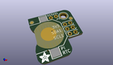
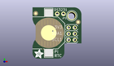
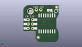
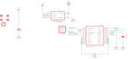

Contents
========

* [PRA4282 > Adafruit](#pra4282--adafruit)
	* [Images](#images)
	* [Tags](#tags)
  
![][im]
# PRA4282 > Adafruit

- ID: PROJ-ADAF-4282-STAN-01
- Hex ID: PRA4282
- Name: Adafruit
- Description: Adafruit

## Images
  
  

|kicadPcb3d|kicadPcb3dFront|kicadPcb3dBack|eagleImage|eagleSchemImage|
| :---: | :---: | :---: | :---: | :---: |
||||||

## Tags

- hexID: PRA4282
- oompType: PROJ
- oompSize: ADAF
- oompColor: 4282
- oompDesc: STAN
- oompIndex: 01
- oompName: Adafruit PiRTC DS3231 PCB
- sources: All source files from https://github.com/adafruit/Adafruit-PiRTC-DS3231-PCB (source licence details in srcLicense.md)
- linkBuyPage: http://www.adafruit.com/products/4282
- oompID: PROJ-ADAF-4282-STAN-01
- oompParts: B1,UNMATCHED-UNMATCHED-UNMATCHED-UNMATCHED-UNMATCHED
- oompParts: C1,UNMATCHED-UNMATCHED-UNMATCHED-UNMATCHED-UNMATCHED
- oompParts: IC2,UNMATCHED-UNMATCHED-UNMATCHED-UNMATCHED-UNMATCHED
- oompParts: JP1,UNMATCHED-UNMATCHED-UNMATCHED-UNMATCHED-UNMATCHED
- oompParts: RPI1,UNMATCHED-UNMATCHED-UNMATCHED-UNMATCHED-UNMATCHED
- rawParts: B1,CR1220,BATTERYCR1220_SMT,CR1220,CR1220 SMT - Digikey: 3001K-ND,,
- rawParts: C1,10uF,CAP_CERAMIC0805-NOOUTLINE,0805-NO,Ceramic Capacitors,,
- rawParts: FID1,FIDUCIAL_1MM,FIDUCIAL_1MM,FIDUCIAL_1MM,Fiducial Alignment Points,EXCLUDE,
- rawParts: FID2,FIDUCIAL_1MM,FIDUCIAL_1MM,FIDUCIAL_1MM,Fiducial Alignment Points,EXCLUDE,
- rawParts: FID3,FIDUCIAL_1MM,FIDUCIAL_1MM,FIDUCIAL_1MM,Fiducial Alignment Points,EXCLUDE,
- rawParts: FID4,FIDUCIAL_1MM,FIDUCIAL_1MM,FIDUCIAL_1MM,Fiducial Alignment Points,EXCLUDE,
- rawParts: IC2,DS3231/SO,DS3231/SO,SO16W,,,
- rawParts: JP1,,HEADER-1X2ROUND,1X02_ROUND,PIN HEADER,,
- rawParts: RPI1,RASPBERRYPI_2X3,RASPBERRYPI_2X3,RASPBERRYPI_2X3_THMSMT,,,
- rawParts: U$4,MOUNTINGHOLE3.0THIN,MOUNTINGHOLE3.0THIN,MOUNTINGHOLE_3.0_PLATEDTHIN,Mounting Hole,EXCLUDE,

[im]: kicadPcb3d_450.png
