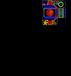

Contents
========

* [PROJ-ADAF-4282-STAN-01>Adafruit PiRTC DS3231 PCB](#proj-adaf-4282-stan-01adafruit-pirtc-ds3231-pcb)
	* [Images](#images)
	* [Interactive BOM](#interactive-bom)
	* [OOMP Parts](#oomp-parts)
	* [Tags](#tags)
  
![][im]
# PROJ-ADAF-4282-STAN-01>Adafruit PiRTC DS3231 PCB

- ID: PROJ-ADAF-4282-STAN-01
- Hex ID: PRA4282
- Name: Adafruit PiRTC DS3231 PCB
- Description: 

## Images
  
  

|eagleImage|
| :---: |
||

## Interactive BOM

- Interactive BOM page: [ibom.html](kicad/bom/ibom.html)

## OOMP Parts
  

|OOMP Parts|
| :---: |
|UNMATCHED-UNMATCHED-X-UNMATCHED-01, B1, 6.6802, 10.8204, 90,B1, CR1220, CR1220, microbuilder, (0.263, 0.426), R90|
|<table><tr><td></td><td> C1</td><td>[CAPC-0805-X-UF10-V25 SMD (0805) 10 uF Capacitor (Ceramic) 25v](https://github.com/oomlout/oomlout_OOMP_parts/tree/main/CAPC-0805-X-UF10-V25/)</td><td>[C85U010](https://github.com/oomlout/oomlout_OOMP_parts/tree/main/CAPC-0805-X-UF10-V25/)</td></tr></table>|
|UNMATCHED-UNMATCHED-X-UNMATCHED-01, IC2, 6.731, 10.795, M180,IC2, DS3231/SO, SO16W, adafruit, (0.265, 0.425), MR180|
|UNMATCHED-UNMATCHED-X-UNMATCHED-01, JP1, 11.43, 18.668999999999997, 180,JP1, 1X02_ROUND, microbuilder, (0.45, 0.735), R180|
|UNMATCHED-UNMATCHED-X-UNMATCHED-01, RPI1, 16.0782, 10.4394, 0,RPI1, RASPBERRYPI_2X3, RASPBERRYPI_2X3_THMSMT, microbuilder, (0.633, 0.411), R0|

## Tags

- hexID: PRA4282
- oompType: PROJ
- oompSize: ADAF
- oompColor: 4282
- oompDesc: STAN
- oompIndex: 01
- oompName: Adafruit PiRTC DS3231 PCB
- sources: All source files from https://github.com/adafruit/Adafruit-PiRTC-DS3231-PCB (source licence details in srcLicense.md)
- linkBuyPage: http://www.adafruit.com/products/4282
- oompPart: UNMATCHED-UNMATCHED-X-UNMATCHED-01, B1, 6.6802, 10.8204, 90
- oompPart: CAPC-0805-X-UF10-V25, C1, 5.1308, 18.389599999999998, M180
- oompPart: SKIP-UNMATCHED-X-UNMATCHED-01, FID1, 1.3716, 18.846799999999998, 180
- oompPart: SKIP-UNMATCHED-X-UNMATCHED-01, FID2, 18.694399999999998, 15.265399999999998, 180
- oompPart: SKIP-UNMATCHED-X-UNMATCHED-01, FID3, 11.6332, 2.6923999999999997, M0
- oompPart: SKIP-UNMATCHED-X-UNMATCHED-01, FID4, 1.2192, 20.2184, M0
- oompPart: UNMATCHED-UNMATCHED-X-UNMATCHED-01, IC2, 6.731, 10.795, M180
- oompPart: UNMATCHED-UNMATCHED-X-UNMATCHED-01, JP1, 11.43, 18.668999999999997, 180
- oompPart: UNMATCHED-UNMATCHED-X-UNMATCHED-01, RPI1, 16.0782, 10.4394, 0
- oompPart: SKIP-UNMATCHED-X-UNMATCHED-01, U$4, 16.0782, 17.856199999999998, 180
- rawPart: B1, CR1220, CR1220, microbuilder, (0.263, 0.426), R90
- rawPart: C1, 10uF, 0805-NO, microbuilder, (0.202, 0.724), MR180
- rawPart: FID1, FIDUCIAL_1MM, FIDUCIAL_1MM, microbuilder, (0.054, 0.742), R180
- rawPart: FID2, FIDUCIAL_1MM, FIDUCIAL_1MM, microbuilder, (0.736, 0.601), R180
- rawPart: FID3, FIDUCIAL_1MM, FIDUCIAL_1MM, microbuilder, (0.458, 0.106), MR0
- rawPart: FID4, FIDUCIAL_1MM, FIDUCIAL_1MM, microbuilder, (0.048, 0.796), MR0
- rawPart: IC2, DS3231/SO, SO16W, adafruit, (0.265, 0.425), MR180
- rawPart: JP1, 1X02_ROUND, microbuilder, (0.45, 0.735), R180
- rawPart: RPI1, RASPBERRYPI_2X3, RASPBERRYPI_2X3_THMSMT, microbuilder, (0.633, 0.411), R0
- rawPart: U$4, MOUNTINGHOLE3.0THIN, MOUNTINGHOLE_3.0_PLATEDTHIN, microbuilder, (0.633, 0.703), R180

[im]: eagleImage_450.png
