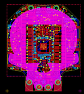

Contents
========

* [PROJ-ADAF-4300-STAN-01>Adafruit Hallowing M4 PCB](#proj-adaf-4300-stan-01adafruit-hallowing-m4-pcb)
	* [Images](#images)
	* [Interactive BOM](#interactive-bom)
	* [OOMP Parts](#oomp-parts)
	* [Tags](#tags)
  
![][im]
# PROJ-ADAF-4300-STAN-01>Adafruit Hallowing M4 PCB

- ID: PROJ-ADAF-4300-STAN-01
- Hex ID: PRA4300
- Name: Adafruit Hallowing M4 PCB
- Description: 

## Images
  
  

|eagleImage|
| :---: |
||

## Interactive BOM

- Interactive BOM page: [ibom.html](kicad/bom/ibom.html)

## OOMP Parts
  

|OOMP Parts|
| :---: |
|CAPC-0603-X-UNMATCHED-01, C12, 1.7949999659999998, 13.830499898, 90,C12, 1uF, 0603-NO, microbuilder, (0.07066929, 0.54450787), R90|
|<table><tr><td></td><td> C16</td><td>[CAPC-0805-X-UF10-V25 SMD (0805) 10 uF Capacitor (Ceramic) 25v](https://github.com/oomlout/oomlout_OOMP_parts/tree/main/CAPC-0805-X-UF10-V25/)</td><td>[C85U010](https://github.com/oomlout/oomlout_OOMP_parts/tree/main/CAPC-0805-X-UF10-V25/)</td></tr></table>|
|<table><tr><td></td><td> C17</td><td>[CAPC-0805-X-UF10-V25 SMD (0805) 10 uF Capacitor (Ceramic) 25v](https://github.com/oomlout/oomlout_OOMP_parts/tree/main/CAPC-0805-X-UF10-V25/)</td><td>[C85U010](https://github.com/oomlout/oomlout_OOMP_parts/tree/main/CAPC-0805-X-UF10-V25/)</td></tr></table>|
|<table><tr><td></td><td> C18</td><td>[CAPC-0805-X-UF10-V25 SMD (0805) 10 uF Capacitor (Ceramic) 25v](https://github.com/oomlout/oomlout_OOMP_parts/tree/main/CAPC-0805-X-UF10-V25/)</td><td>[C85U010](https://github.com/oomlout/oomlout_OOMP_parts/tree/main/CAPC-0805-X-UF10-V25/)</td></tr></table>|
|<table><tr><td></td><td> C19</td><td>[CAPC-0805-X-UF10-V25 SMD (0805) 10 uF Capacitor (Ceramic) 25v](https://github.com/oomlout/oomlout_OOMP_parts/tree/main/CAPC-0805-X-UF10-V25/)</td><td>[C85U010](https://github.com/oomlout/oomlout_OOMP_parts/tree/main/CAPC-0805-X-UF10-V25/)</td></tr></table>|
|<table><tr><td></td><td> C21</td><td>[CAPC-0805-X-UF10-V25 SMD (0805) 10 uF Capacitor (Ceramic) 25v](https://github.com/oomlout/oomlout_OOMP_parts/tree/main/CAPC-0805-X-UF10-V25/)</td><td>[C85U010](https://github.com/oomlout/oomlout_OOMP_parts/tree/main/CAPC-0805-X-UF10-V25/)</td></tr></table>|
|<table><tr><td></td><td> C22</td><td>[CAPC-0805-X-UF10-V25 SMD (0805) 10 uF Capacitor (Ceramic) 25v](https://github.com/oomlout/oomlout_OOMP_parts/tree/main/CAPC-0805-X-UF10-V25/)</td><td>[C85U010](https://github.com/oomlout/oomlout_OOMP_parts/tree/main/CAPC-0805-X-UF10-V25/)</td></tr></table>|
|CAPC-0603-X-UNMATCHED-01, C23, 2.0955, -13.9065, 180,C23, 1uF, 0603-NO, microbuilder, (0.0825, -0.5475), R180|
|CAPC-0603-X-UNMATCHED-01, C24, 3.937, -20.2565, 180,C24, 1uF, 0603-NO, microbuilder, (0.155, -0.7975), R180|
|<table><tr><td></td><td> C25</td><td>[CAPC-0603-X-NF100-V50 SMD (0603) 100 nF Capacitor (Ceramic) 50v](https://github.com/oomlout/oomlout_OOMP_parts/tree/main/CAPC-0603-X-NF100-V50/)</td><td>[C6N100](https://github.com/oomlout/oomlout_OOMP_parts/tree/main/CAPC-0603-X-NF100-V50/)</td></tr></table>|
|<table><tr><td></td><td> C26</td><td>[CAPC-0805-X-UF10-V25 SMD (0805) 10 uF Capacitor (Ceramic) 25v](https://github.com/oomlout/oomlout_OOMP_parts/tree/main/CAPC-0805-X-UF10-V25/)</td><td>[C85U010](https://github.com/oomlout/oomlout_OOMP_parts/tree/main/CAPC-0805-X-UF10-V25/)</td></tr></table>|
|CAPC-0603-X-UNMATCHED-01, C27, -0.7619999999999999, 9.398, 180,C27, 1uF, 0603-NO, microbuilder, (-0.03, 0.37), R180|
|CAPC-0603-X-UNMATCHED-01, C28, 19.685, 18.0975, 180,C28, 1uF, 0603-NO, microbuilder, (0.775, 0.7125), R180|
|CAPC-0603-X-UNMATCHED-01, C29, -5.7785, -5.0165, 180,C29, 1uF, 0603-NO, microbuilder, (-0.2275, -0.1975), R180|
|<table><tr><td></td><td> C30</td><td>[CAPC-0805-X-UF10-V25 SMD (0805) 10 uF Capacitor (Ceramic) 25v](https://github.com/oomlout/oomlout_OOMP_parts/tree/main/CAPC-0805-X-UF10-V25/)</td><td>[C85U010](https://github.com/oomlout/oomlout_OOMP_parts/tree/main/CAPC-0805-X-UF10-V25/)</td></tr></table>|
|<table><tr><td></td><td> C31</td><td>[CAPC-0603-X-NF100-V50 SMD (0603) 100 nF Capacitor (Ceramic) 50v](https://github.com/oomlout/oomlout_OOMP_parts/tree/main/CAPC-0603-X-NF100-V50/)</td><td>[C6N100](https://github.com/oomlout/oomlout_OOMP_parts/tree/main/CAPC-0603-X-NF100-V50/)</td></tr></table>|
|CAPC-0603-X-UNMATCHED-01, C32, -17.208499999999997, 16.764, 180,C32, 1uF, 0603-NO, microbuilder, (-0.6775, 0.66), R180|
|<table><tr><td></td><td> C33</td><td>[CAPC-0805-X-UF10-V25 SMD (0805) 10 uF Capacitor (Ceramic) 25v](https://github.com/oomlout/oomlout_OOMP_parts/tree/main/CAPC-0805-X-UF10-V25/)</td><td>[C85U010](https://github.com/oomlout/oomlout_OOMP_parts/tree/main/CAPC-0805-X-UF10-V25/)</td></tr></table>|
|UNMATCHED-UNMATCHED-X-UNMATCHED-01, CHG1, -5.7785, 27.558999999999997, 180,CHG1, ORANGE, CHIPLED_0805_NOOUTLINE, microbuilder, (-0.2275, 1.085), R180|
|UNMATCHED-UNMATCHED-X-UNMATCHED-01, D3, 3.6194999999999995, 22.605999999999998, 0,D3, MBR0540, SOD-123, microbuilder, (0.1425, 0.89), R0|
|UNMATCHED-UNMATCHED-X-UNMATCHED-01, D5, -19.939, -0.254, 180,D5, 3.6V, SOD-323, microbuilder, (-0.785, -0.01), R180|
|UNMATCHED-UNMATCHED-X-UNMATCHED-01, D6, 18.0975, 1.778, 0,D6, 3.6V, SOD-323, microbuilder, (0.7125, 0.07), R0|
|UNMATCHED-0805-X-UNMATCHED-01, FB1, -16.509999999999998, 19.1135, 270,FB1, Ferrite, 0805-NO, microbuilder, (-0.65, 0.7525), R270|
|ERROR, I2C1 JST PH, 0, 0, 0,I2C1, JST, PH, 4, JSTPH4, microbuilder, (0.86, -0.275), R270|
|UNMATCHED-UNMATCHED-X-UNMATCHED-01, IC2, 4.2545, -12.001499999999998, 270,IC2, MSA301, LGA12_2X2MM, microbuilder, (0.1675, -0.4725), R270|
|UNMATCHED-UNMATCHED-X-UNMATCHED-01, IC3, -18.287999999999997, 8.128, 0,IC3, PAM8301, SOT23-6, microbuilder, (-0.72, 0.32), R0|
|UNMATCHED-UNMATCHED-X-UNMATCHED-01, L1, 5.73850008, 27.517499956, 0,L1, RED, CHIPLED_0805_NOOUTLINE, microbuilder, (0.2259252, 1.08336614), R0|
|UNMATCHED-UNMATCHED-X-UNMATCHED-01, LED1, 17.779999999999998, -14.731999999999998, 180,LED1, WS2812B_4020, WS2812B_4020, microbuilder, (0.7, -0.58), R180|
|UNMATCHED-UNMATCHED-X-UNMATCHED-01, LED2, 24.002999999999997, 2.032, 270,LED2, WS2812B_4020, WS2812B_4020, microbuilder, (0.945, 0.08), R270|
|UNMATCHED-UNMATCHED-X-UNMATCHED-01, LED3, -17.779999999999998, -14.731999999999998, 180,LED3, WS2812B_4020, WS2812B_4020, microbuilder, (-0.7, -0.58), R180|
|UNMATCHED-UNMATCHED-X-UNMATCHED-01, LED4, -24.002999999999997, 2.032, 90,LED4, WS2812B_4020, WS2812B_4020, microbuilder, (-0.945, 0.08), R90|
|UNMATCHED-UNMATCHED-X-UNMATCHED-01, MS2, -11.43, 29.590999999999998, 270,MS2, FEATHERWING_SMTDUALNOHOLES, FEATHERWING_SMT_NOHOLES, microbuilder, (-0.45, 1.165), R270|
|ERROR, NEOPIX1 JST PH, 0, 0, 0,NEOPIX1, JST, PH, 3, JSTPH3, microbuilder, (-0.8225, -0.3225), R90|
|UNMATCHED-UNMATCHED-X-UNMATCHED-01, Q4, -18.8087, 2.4257, 180,Q4, BSS138, SOT23-WIDE, microbuilder, (-0.7405, 0.0955), R180|
|UNMATCHED-UNMATCHED-X-UNMATCHED-01, Q5, 2.9844999999999997, 17.145, 180,Q5, DMG3405, SOT23-R, microbuilder, (0.1175, 0.675), R180|
|UNMATCHED-UNMATCHED-X-UNMATCHED-01, Q6, 2.9844999999999997, 19.939, 180,Q6, DMG3405, SOT23-R, microbuilder, (0.1175, 0.785), R180|
|UNMATCHED-UNMATCHED-X-UNMATCHED-01, Q7, 5.1435, -17.272000000000002, 270,Q7, BSS138, SOT363, microbuilder, (0.2025, -0.68), R270|
|<table><tr><td></td><td> R1</td><td>[RESE-0603-X-O105-01 SMD (0603) 1M Ohm Resistor](https://github.com/oomlout/oomlout_OOMP_parts/tree/main/RESE-0603-X-O105-01/)</td><td>[R6105](https://github.com/oomlout/oomlout_OOMP_parts/tree/main/RESE-0603-X-O105-01/)</td></tr></table>|
|<table><tr><td></td><td> R2</td><td>[RESE-0603-X-O105-01 SMD (0603) 1M Ohm Resistor](https://github.com/oomlout/oomlout_OOMP_parts/tree/main/RESE-0603-X-O105-01/)</td><td>[R6105](https://github.com/oomlout/oomlout_OOMP_parts/tree/main/RESE-0603-X-O105-01/)</td></tr></table>|
|<table><tr><td></td><td> R3</td><td>[RESE-0603-X-O103-01 SMD (0603) 10k Ohm Resistor](https://github.com/oomlout/oomlout_OOMP_parts/tree/main/RESE-0603-X-O103-01/)</td><td>[R6103](https://github.com/oomlout/oomlout_OOMP_parts/tree/main/RESE-0603-X-O103-01/)</td></tr></table>|
|<table><tr><td></td><td> R4</td><td>[RESE-0603-X-O105-01 SMD (0603) 1M Ohm Resistor](https://github.com/oomlout/oomlout_OOMP_parts/tree/main/RESE-0603-X-O105-01/)</td><td>[R6105](https://github.com/oomlout/oomlout_OOMP_parts/tree/main/RESE-0603-X-O105-01/)</td></tr></table>|
|<table><tr><td></td><td> R5</td><td>[RESE-0603-X-O105-01 SMD (0603) 1M Ohm Resistor](https://github.com/oomlout/oomlout_OOMP_parts/tree/main/RESE-0603-X-O105-01/)</td><td>[R6105](https://github.com/oomlout/oomlout_OOMP_parts/tree/main/RESE-0603-X-O105-01/)</td></tr></table>|
|<table><tr><td></td><td> R10</td><td>[RESE-0603-X-O222-01 SMD (0603) 2.2k Ohm Resistor](https://github.com/oomlout/oomlout_OOMP_parts/tree/main/RESE-0603-X-O222-01/)</td><td>[R6222](https://github.com/oomlout/oomlout_OOMP_parts/tree/main/RESE-0603-X-O222-01/)</td></tr></table>|
|<table><tr><td></td><td> R11</td><td>[RESE-0603-X-O102-01 SMD (0603) 1k Ohm Resistor](https://github.com/oomlout/oomlout_OOMP_parts/tree/main/RESE-0603-X-O102-01/)</td><td>[R6102](https://github.com/oomlout/oomlout_OOMP_parts/tree/main/RESE-0603-X-O102-01/)</td></tr></table>|
|RESE-0603-X-UNMATCHED-01, R14, -1.27, 18.3515, 0,R14, 4.7K, 0603-NO, microbuilder, (-0.05, 0.7225), R0|
|RESE-UNMATCHED-X-O104-01, R15, 4.762499999999999, 9.524999999999999, 90,R15, 100K, RESPACK_4X0603, microbuilder, (0.1875, 0.375), R90|
|<table><tr><td></td><td> R17</td><td>[RESE-0603-X-O102-01 SMD (0603) 1k Ohm Resistor](https://github.com/oomlout/oomlout_OOMP_parts/tree/main/RESE-0603-X-O102-01/)</td><td>[R6102](https://github.com/oomlout/oomlout_OOMP_parts/tree/main/RESE-0603-X-O102-01/)</td></tr></table>|
|<table><tr><td></td><td> R18</td><td>[RESE-0603-X-O102-01 SMD (0603) 1k Ohm Resistor](https://github.com/oomlout/oomlout_OOMP_parts/tree/main/RESE-0603-X-O102-01/)</td><td>[R6102](https://github.com/oomlout/oomlout_OOMP_parts/tree/main/RESE-0603-X-O102-01/)</td></tr></table>|
|<table><tr><td></td><td> R19</td><td>[RESE-0603-X-O103-01 SMD (0603) 10k Ohm Resistor](https://github.com/oomlout/oomlout_OOMP_parts/tree/main/RESE-0603-X-O103-01/)</td><td>[R6103](https://github.com/oomlout/oomlout_OOMP_parts/tree/main/RESE-0603-X-O103-01/)</td></tr></table>|
|<table><tr><td></td><td> R20</td><td>[RESE-0603-X-O103-01 SMD (0603) 10k Ohm Resistor](https://github.com/oomlout/oomlout_OOMP_parts/tree/main/RESE-0603-X-O103-01/)</td><td>[R6103](https://github.com/oomlout/oomlout_OOMP_parts/tree/main/RESE-0603-X-O103-01/)</td></tr></table>|
|RESE-0603-X-UNMATCHED-01, R23, -21.209, 2.032, 270,R23, 10, 0603-NO, microbuilder, (-0.835, 0.08), R270|
|RESE-0603-X-UNMATCHED-01, R24, -17.0815, 11.112499999999999, 0,R24, 47K, 0603-NO, microbuilder, (-0.6725, 0.4375), R0|
|<table><tr><td></td><td> R25</td><td>[RESE-0603-X-O104-01 SMD (0603) 100k Ohm Resistor](https://github.com/oomlout/oomlout_OOMP_parts/tree/main/RESE-0603-X-O104-01/)</td><td>[R6104](https://github.com/oomlout/oomlout_OOMP_parts/tree/main/RESE-0603-X-O104-01/)</td></tr></table>|
|<table><tr><td></td><td> R26</td><td>[RESE-0603-X-O104-01 SMD (0603) 100k Ohm Resistor](https://github.com/oomlout/oomlout_OOMP_parts/tree/main/RESE-0603-X-O104-01/)</td><td>[R6104](https://github.com/oomlout/oomlout_OOMP_parts/tree/main/RESE-0603-X-O104-01/)</td></tr></table>|
|RESE-UNMATCHED-X-O103-01, R27, 2.413, -16.827499999999997, 270,R27, 10K, RESPACK_4X0603, microbuilder, (0.095, -0.6625), R270|
|ERROR, SENSE1 JST PH, 0, 0, 0,SENSE1, JST, PH, 3, JSTPH3, microbuilder, (0.8225, 0.385), R270|
|UNMATCHED-UNMATCHED-X-UNMATCHED-01, SJ2, 21.0185, 16.1925, 0,SJ2, SOLDERJUMPER_2WAY_OPEN_NOPASTE, microbuilder, (0.8275, 0.6375), R0|
|UNMATCHED-UNMATCHED-X-UNMATCHED-01, SW1, -2.921, -17.970499999999998, 0,SW1, EG1390, microbuilder, (-0.115, -0.7075), R0|
|UNMATCHED-UNMATCHED-X-UNMATCHED-01, SW3, 13.9065, 26.225499999999997, 135,SW3, SPST_TACT-EVQQ2, BTN_KMR2_4.6X2.8, microbuilder, (0.5475, 1.0325), R135|
|UNMATCHED-UNMATCHED-X-UNMATCHED-01, TFT1, 0.127, 4.6354999999999995, M180,TFT1, DISP_LCD_GENERIC_SPITFT_VDDIO_1.54_240X240_HANDSOLDER, TFT_1.54IN_240X240_HANDSOLDER, microbuilder, (0.005, 0.1825), MR180|
|UNMATCHED-UNMATCHED-X-UNMATCHED-01, TP3, -9.9695, -23.685499999999998, 180,TP3, SEWTAP_ALLILONG, PCB_ALLI_LONG, microbuilder, (-0.3925, -0.9325), R180|
|UNMATCHED-UNMATCHED-X-UNMATCHED-01, TP4, -3.175, -27.114499999999996, 180,TP4, SEWTAPPCB_ALLIGATOR, PCB_ALLI, microbuilder, (-0.125, -1.0675), R180|
|UNMATCHED-UNMATCHED-X-UNMATCHED-01, TP6, -3.3655, 12.382499999999999, 0,TP6, TESTPOINT_ROUND_1.5MM, microbuilder, (-0.1325, 0.4875), R0|
|UNMATCHED-UNMATCHED-X-UNMATCHED-01, TP7, -3.8099999999999996, 9.270999999999999, 0,TP7, TESTPOINT_ROUND_1.5MM, microbuilder, (-0.15, 0.365), R0|
|UNMATCHED-UNMATCHED-X-UNMATCHED-01, TP28, 3.302, -27.178, 180,TP28, SEWTAPPCB_ALLIGATOR, PCB_ALLI, microbuilder, (0.13, -1.07), R180|
|UNMATCHED-UNMATCHED-X-UNMATCHED-01, TP29, 10.033, -23.685499999999998, 180,TP29, SEWTAP_ALLILONG, PCB_ALLI_LONG, microbuilder, (0.395, -0.9325), R180|
|UNMATCHED-UNMATCHED-X-UNMATCHED-01, U4, -13.67318449, 27.249203058, 30,U4, ALS-PT21, ALS-PT26-21C, microbuilder, (-0.53831435, 1.07280327), R30|
|UNMATCHED-UNMATCHED-X-UNMATCHED-01, U6, 4.5085, 13.716, 90,U6, AP2112-3.3, SOT23-5, microbuilder, (0.1775, 0.54), R90|
|UNMATCHED-UNMATCHED-X-UNMATCHED-01, U7, -1.016, 15.6845, 0,U7, MCP73831T-2ACI/OT, SOT23-5, microbuilder, (-0.04, 0.6175), R0|
|UNMATCHED-UNMATCHED-X-UNMATCHED-01, U9, -2.8575, -10.795, 270,U9, GD25Q64, SOIC8_208MIL, microbuilder, (-0.1125, -0.425), R270|
|UNMATCHED-UNMATCHED-X-UNMATCHED-01, X2, 0.0, 25.4, 180,X2, microUSB, 4UCONN_20329_V2, microbuilder, (0, 1), R180|
|UNMATCHED-UNMATCHED-X-UNMATCHED-01, X4, 10.6045, 19.177, 270,X4, JSTPH, JSTPH2, microbuilder, (0.4175, 0.755), R270|

## Tags

- hexID: PRA4300
- oompType: PROJ
- oompSize: ADAF
- oompColor: 4300
- oompDesc: STAN
- oompIndex: 01
- oompName: Adafruit Hallowing M4 PCB
- sources: All source files from https://github.com/adafruit/Adafruit-Hallowing-M4-PCB (source licence details in srcLicense.md)
- linkBuyPage: http://www.adafruit.com/products/4300
- oompPart: CAPC-0603-X-UNMATCHED-01, C12, 1.7949999659999998, 13.830499898, 90
- oompPart: CAPC-0805-X-UF10-V25, C16, 2.36449997, 10.60800012, 270
- oompPart: CAPC-0805-X-UF10-V25, C17, -0.5714999999999999, 12.7, 180
- oompPart: CAPC-0805-X-UF10-V25, C18, -6.35, 20.700999999999997, 270
- oompPart: CAPC-0805-X-UF10-V25, C19, -22.352, -1.9049999999999998, 180
- oompPart: CAPC-0805-X-UF10-V25, C21, -19.685, 12.446, 90
- oompPart: CAPC-0805-X-UF10-V25, C22, -1.1429999999999998, 19.8755, 180
- oompPart: CAPC-0603-X-UNMATCHED-01, C23, 2.0955, -13.9065, 180
- oompPart: CAPC-0603-X-UNMATCHED-01, C24, 3.937, -20.2565, 180
- oompPart: CAPC-0603-X-NF100-V50, C25, 10.0965, 24.447499999999998, 0
- oompPart: CAPC-0805-X-UF10-V25, C26, -0.7619999999999999, 10.921999999999999, 180
- oompPart: CAPC-0603-X-UNMATCHED-01, C27, -0.7619999999999999, 9.398, 180
- oompPart: CAPC-0603-X-UNMATCHED-01, C28, 19.685, 18.0975, 180
- oompPart: CAPC-0603-X-UNMATCHED-01, C29, -5.7785, -5.0165, 180
- oompPart: CAPC-0805-X-UF10-V25, C30, 5.842, -7.6834999999999996, 270
- oompPart: CAPC-0603-X-NF100-V50, C31, -17.3355, 12.5095, 180
- oompPart: CAPC-0603-X-UNMATCHED-01, C32, -17.208499999999997, 16.764, 180
- oompPart: CAPC-0805-X-UF10-V25, C33, -17.3101, 15.189199999999998, 180
- oompPart: UNMATCHED-UNMATCHED-X-UNMATCHED-01, CHG1, -5.7785, 27.558999999999997, 180
- oompPart: UNMATCHED-UNMATCHED-X-UNMATCHED-01, D3, 3.6194999999999995, 22.605999999999998, 0
- oompPart: UNMATCHED-UNMATCHED-X-UNMATCHED-01, D5, -19.939, -0.254, 180
- oompPart: UNMATCHED-UNMATCHED-X-UNMATCHED-01, D6, 18.0975, 1.778, 0
- oompPart: UNMATCHED-0805-X-UNMATCHED-01, FB1, -16.509999999999998, 19.1135, 270
- oompPart: ERROR, I2C1 JST PH, 0, 0, 0
- oompPart: UNMATCHED-UNMATCHED-X-UNMATCHED-01, IC2, 4.2545, -12.001499999999998, 270
- oompPart: UNMATCHED-UNMATCHED-X-UNMATCHED-01, IC3, -18.287999999999997, 8.128, 0
- oompPart: UNMATCHED-UNMATCHED-X-UNMATCHED-01, L1, 5.73850008, 27.517499956, 0
- oompPart: UNMATCHED-UNMATCHED-X-UNMATCHED-01, LED1, 17.779999999999998, -14.731999999999998, 180
- oompPart: UNMATCHED-UNMATCHED-X-UNMATCHED-01, LED2, 24.002999999999997, 2.032, 270
- oompPart: UNMATCHED-UNMATCHED-X-UNMATCHED-01, LED3, -17.779999999999998, -14.731999999999998, 180
- oompPart: UNMATCHED-UNMATCHED-X-UNMATCHED-01, LED4, -24.002999999999997, 2.032, 90
- oompPart: UNMATCHED-UNMATCHED-X-UNMATCHED-01, MS2, -11.43, 29.590999999999998, 270
- oompPart: ERROR, NEOPIX1 JST PH, 0, 0, 0
- oompPart: UNMATCHED-UNMATCHED-X-UNMATCHED-01, Q4, -18.8087, 2.4257, 180
- oompPart: UNMATCHED-UNMATCHED-X-UNMATCHED-01, Q5, 2.9844999999999997, 17.145, 180
- oompPart: UNMATCHED-UNMATCHED-X-UNMATCHED-01, Q6, 2.9844999999999997, 19.939, 180
- oompPart: UNMATCHED-UNMATCHED-X-UNMATCHED-01, Q7, 5.1435, -17.272000000000002, 270
- oompPart: RESE-0603-X-O105-01, R1, -5.460999999999999, -22.605999999999998, 0
- oompPart: RESE-0603-X-O105-01, R2, -3.175, -23.4315, 90
- oompPart: RESE-0603-X-O103-01, R3, -19.8755, 20.383499999999998, 0
- oompPart: RESE-0603-X-O105-01, R4, 3.302, -23.4315, 90
- oompPart: RESE-0603-X-O105-01, R5, 5.6514999999999995, -22.605999999999998, 180
- oompPart: RESE-0603-X-O222-01, R10, 6.9215, 24.511, 180
- oompPart: RESE-0603-X-O102-01, R11, -6.286499999999999, 24.256999999999998, 270
- oompPart: RESE-0603-X-UNMATCHED-01, R14, -1.27, 18.3515, 0
- oompPart: RESE-UNMATCHED-X-O104-01, R15, 4.762499999999999, 9.524999999999999, 90
- oompPart: RESE-0603-X-O102-01, R17, -19.177, -1.778, 0
- oompPart: RESE-0603-X-O102-01, R18, 18.3515, 3.4925, 180
- oompPart: RESE-0603-X-O103-01, R19, -11.557, 25.273, 180
- oompPart: RESE-0603-X-O103-01, R20, -4.064, 14.224, 0
- oompPart: RESE-0603-X-UNMATCHED-01, R23, -21.209, 2.032, 270
- oompPart: RESE-0603-X-UNMATCHED-01, R24, -17.0815, 11.112499999999999, 0
- oompPart: RESE-0603-X-O104-01, R25, -18.884900000000002, 4.8641, 180
- oompPart: RESE-0603-X-O104-01, R26, -5.7785, -6.5405, 180
- oompPart: RESE-UNMATCHED-X-O103-01, R27, 2.413, -16.827499999999997, 270
- oompPart: ERROR, SENSE1 JST PH, 0, 0, 0
- oompPart: UNMATCHED-UNMATCHED-X-UNMATCHED-01, SJ2, 21.0185, 16.1925, 0
- oompPart: UNMATCHED-UNMATCHED-X-UNMATCHED-01, SW1, -2.921, -17.970499999999998, 0
- oompPart: UNMATCHED-UNMATCHED-X-UNMATCHED-01, SW3, 13.9065, 26.225499999999997, 135
- oompPart: UNMATCHED-UNMATCHED-X-UNMATCHED-01, TFT1, 0.127, 4.6354999999999995, M180
- oompPart: UNMATCHED-UNMATCHED-X-UNMATCHED-01, TP3, -9.9695, -23.685499999999998, 180
- oompPart: UNMATCHED-UNMATCHED-X-UNMATCHED-01, TP4, -3.175, -27.114499999999996, 180
- oompPart: UNMATCHED-UNMATCHED-X-UNMATCHED-01, TP6, -3.3655, 12.382499999999999, 0
- oompPart: UNMATCHED-UNMATCHED-X-UNMATCHED-01, TP7, -3.8099999999999996, 9.270999999999999, 0
- oompPart: UNMATCHED-UNMATCHED-X-UNMATCHED-01, TP28, 3.302, -27.178, 180
- oompPart: UNMATCHED-UNMATCHED-X-UNMATCHED-01, TP29, 10.033, -23.685499999999998, 180
- oompPart: SKIP-UNMATCHED-X-UNMATCHED-01, U$31, 8.889999999999999, 27.558999999999997, 180
- oompPart: SKIP-UNMATCHED-X-UNMATCHED-01, U$32, -8.889999999999999, 27.558999999999997, 180
- oompPart: SKIP-UNMATCHED-X-UNMATCHED-01, U$34, -20.383499999999998, 21.971, 180
- oompPart: SKIP-UNMATCHED-X-UNMATCHED-01, U$35, 7.245999986, -20.049700058, 180
- oompPart: SKIP-UNMATCHED-X-UNMATCHED-01, U$59, -22.1615, 8.509, 90
- oompPart: SKIP-UNMATCHED-X-UNMATCHED-01, U$63, -0.254, 0.889, 0
- oompPart: UNMATCHED-UNMATCHED-X-UNMATCHED-01, U4, -13.67318449, 27.249203058, 30
- oompPart: UNMATCHED-UNMATCHED-X-UNMATCHED-01, U6, 4.5085, 13.716, 90
- oompPart: UNMATCHED-UNMATCHED-X-UNMATCHED-01, U7, -1.016, 15.6845, 0
- oompPart: UNMATCHED-UNMATCHED-X-UNMATCHED-01, U9, -2.8575, -10.795, 270
- oompPart: UNMATCHED-UNMATCHED-X-UNMATCHED-01, X2, 0.0, 25.4, 180
- oompPart: UNMATCHED-UNMATCHED-X-UNMATCHED-01, X4, 10.6045, 19.177, 270
- rawPart: C12, 1uF, 0603-NO, microbuilder, (0.07066929, 0.54450787), R90
- rawPart: C16, 10uF, 0805-NO, microbuilder, (0.09309055, 0.4176378), R270
- rawPart: C17, 10uF, 0805-NO, microbuilder, (-0.0225, 0.5), R180
- rawPart: C18, 10uF, 0805-NO, microbuilder, (-0.25, 0.815), R270
- rawPart: C19, 10uF, 0805-NO, microbuilder, (-0.88, -0.075), R180
- rawPart: C21, 10uF, 0805-NO, microbuilder, (-0.775, 0.49), R90
- rawPart: C22, 10uF, 0805-NO, microbuilder, (-0.045, 0.7825), R180
- rawPart: C23, 1uF, 0603-NO, microbuilder, (0.0825, -0.5475), R180
- rawPart: C24, 1uF, 0603-NO, microbuilder, (0.155, -0.7975), R180
- rawPart: C25, 0.1uF, 0603-NO, microbuilder, (0.3975, 0.9625), R0
- rawPart: C26, 10uF, 0805-NO, microbuilder, (-0.03, 0.43), R180
- rawPart: C27, 1uF, 0603-NO, microbuilder, (-0.03, 0.37), R180
- rawPart: C28, 1uF, 0603-NO, microbuilder, (0.775, 0.7125), R180
- rawPart: C29, 1uF, 0603-NO, microbuilder, (-0.2275, -0.1975), R180
- rawPart: C30, 10uF, 0805-NO, microbuilder, (0.23, -0.3025), R270
- rawPart: C31, 0.1uF, 0603-NO, microbuilder, (-0.6825, 0.4925), R180
- rawPart: C32, 1uF, 0603-NO, microbuilder, (-0.6775, 0.66), R180
- rawPart: C33, 10uF, 0805-NO, microbuilder, (-0.6815, 0.598), R180
- rawPart: CHG1, ORANGE, CHIPLED_0805_NOOUTLINE, microbuilder, (-0.2275, 1.085), R180
- rawPart: D3, MBR0540, SOD-123, microbuilder, (0.1425, 0.89), R0
- rawPart: D5, 3.6V, SOD-323, microbuilder, (-0.785, -0.01), R180
- rawPart: D6, 3.6V, SOD-323, microbuilder, (0.7125, 0.07), R0
- rawPart: FB1, Ferrite, 0805-NO, microbuilder, (-0.65, 0.7525), R270
- rawPart: I2C1, JST, PH, 4, JSTPH4, microbuilder, (0.86, -0.275), R270
- rawPart: IC2, MSA301, LGA12_2X2MM, microbuilder, (0.1675, -0.4725), R270
- rawPart: IC3, PAM8301, SOT23-6, microbuilder, (-0.72, 0.32), R0
- rawPart: L1, RED, CHIPLED_0805_NOOUTLINE, microbuilder, (0.2259252, 1.08336614), R0
- rawPart: LED1, WS2812B_4020, WS2812B_4020, microbuilder, (0.7, -0.58), R180
- rawPart: LED2, WS2812B_4020, WS2812B_4020, microbuilder, (0.945, 0.08), R270
- rawPart: LED3, WS2812B_4020, WS2812B_4020, microbuilder, (-0.7, -0.58), R180
- rawPart: LED4, WS2812B_4020, WS2812B_4020, microbuilder, (-0.945, 0.08), R90
- rawPart: MS2, FEATHERWING_SMTDUALNOHOLES, FEATHERWING_SMT_NOHOLES, microbuilder, (-0.45, 1.165), R270
- rawPart: NEOPIX1, JST, PH, 3, JSTPH3, microbuilder, (-0.8225, -0.3225), R90
- rawPart: Q4, BSS138, SOT23-WIDE, microbuilder, (-0.7405, 0.0955), R180
- rawPart: Q5, DMG3405, SOT23-R, microbuilder, (0.1175, 0.675), R180
- rawPart: Q6, DMG3405, SOT23-R, microbuilder, (0.1175, 0.785), R180
- rawPart: Q7, BSS138, SOT363, microbuilder, (0.2025, -0.68), R270
- rawPart: R1, 1M, 0603-NO, microbuilder, (-0.215, -0.89), R0
- rawPart: R2, 1M, 0603-NO, microbuilder, (-0.125, -0.9225), R90
- rawPart: R3, 10K, 0603-NO, microbuilder, (-0.7825, 0.8025), R0
- rawPart: R4, 1M, 0603-NO, microbuilder, (0.13, -0.9225), R90
- rawPart: R5, 1M, 0603-NO, microbuilder, (0.2225, -0.89), R180
- rawPart: R10, 2.2K, 0603-NO, microbuilder, (0.2725, 0.965), R180
- rawPart: R11, 1K, 0603-NO, microbuilder, (-0.2475, 0.955), R270
- rawPart: R14, 4.7K, 0603-NO, microbuilder, (-0.05, 0.7225), R0
- rawPart: R15, 100K, RESPACK_4X0603, microbuilder, (0.1875, 0.375), R90
- rawPart: R17, 1K, 0603-NO, microbuilder, (-0.755, -0.07), R0
- rawPart: R18, 1K, 0603-NO, microbuilder, (0.7225, 0.1375), R180
- rawPart: R19, 10K, 0603-NO, microbuilder, (-0.455, 0.995), R180
- rawPart: R20, 10K, 0603-NO, microbuilder, (-0.16, 0.56), R0
- rawPart: R23, 10, 0603-NO, microbuilder, (-0.835, 0.08), R270
- rawPart: R24, 47K, 0603-NO, microbuilder, (-0.6725, 0.4375), R0
- rawPart: R25, 100K, 0603-NO, microbuilder, (-0.7435, 0.1915), R180
- rawPart: R26, 100K, 0603-NO, microbuilder, (-0.2275, -0.2575), R180
- rawPart: R27, 10K, RESPACK_4X0603, microbuilder, (0.095, -0.6625), R270
- rawPart: SENSE1, JST, PH, 3, JSTPH3, microbuilder, (0.8225, 0.385), R270
- rawPart: SJ2, SOLDERJUMPER_2WAY_OPEN_NOPASTE, microbuilder, (0.8275, 0.6375), R0
- rawPart: SW1, EG1390, microbuilder, (-0.115, -0.7075), R0
- rawPart: SW3, SPST_TACT-EVQQ2, BTN_KMR2_4.6X2.8, microbuilder, (0.5475, 1.0325), R135
- rawPart: TFT1, DISP_LCD_GENERIC_SPITFT_VDDIO_1.54_240X240_HANDSOLDER, TFT_1.54IN_240X240_HANDSOLDER, microbuilder, (0.005, 0.1825), MR180
- rawPart: TP3, SEWTAP_ALLILONG, PCB_ALLI_LONG, microbuilder, (-0.3925, -0.9325), R180
- rawPart: TP4, SEWTAPPCB_ALLIGATOR, PCB_ALLI, microbuilder, (-0.125, -1.0675), R180
- rawPart: TP6, TESTPOINT_ROUND_1.5MM, microbuilder, (-0.1325, 0.4875), R0
- rawPart: TP7, TESTPOINT_ROUND_1.5MM, microbuilder, (-0.15, 0.365), R0
- rawPart: TP28, SEWTAPPCB_ALLIGATOR, PCB_ALLI, microbuilder, (0.13, -1.07), R180
- rawPart: TP29, SEWTAP_ALLILONG, PCB_ALLI_LONG, microbuilder, (0.395, -0.9325), R180
- rawPart: U$31, MOUNTINGHOLE2.5, MOUNTINGHOLE_2.5_PLATED, microbuilder, (0.35, 1.085), R180
- rawPart: U$32, MOUNTINGHOLE2.5, MOUNTINGHOLE_2.5_PLATED, microbuilder, (-0.35, 1.085), R180
- rawPart: U$34, FIDUCIAL_1MM, FIDUCIAL_1MM, microbuilder, (-0.8025, 0.865), R180
- rawPart: U$35, FIDUCIAL_1MM, FIDUCIAL_1MM, microbuilder, (0.28527559, -0.78935827), R180
- rawPart: U$59, CON_MOLEX_2P, 53398-0271, microbuilder, (-0.8725, 0.335), R90
- rawPart: U$63, ATSAMD51J19, PQFN64-1, microbuilder, (-0.01, 0.035), R0
- rawPart: U4, ALS-PT21, ALS-PT26-21C, microbuilder, (-0.53831435, 1.07280327), R30
- rawPart: U6, AP2112-3.3, SOT23-5, microbuilder, (0.1775, 0.54), R90
- rawPart: U7, MCP73831T-2ACI/OT, SOT23-5, microbuilder, (-0.04, 0.6175), R0
- rawPart: U9, GD25Q64, SOIC8_208MIL, microbuilder, (-0.1125, -0.425), R270
- rawPart: X2, microUSB, 4UCONN_20329_V2, microbuilder, (0, 1), R180
- rawPart: X4, JSTPH, JSTPH2, microbuilder, (0.4175, 0.755), R270

[im]: eagleImage_450.png
