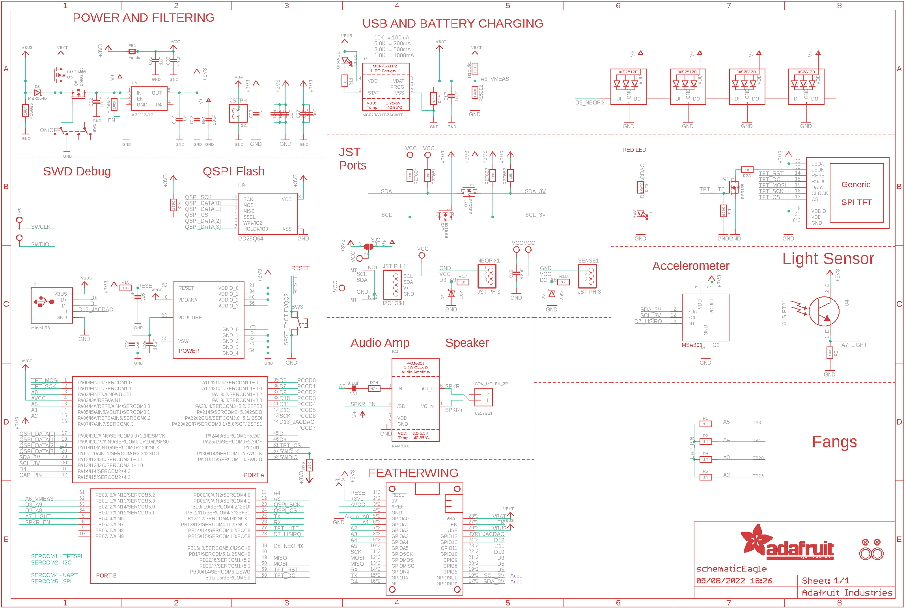
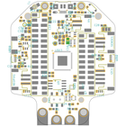
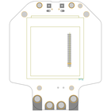
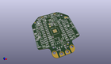
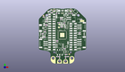
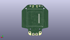
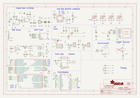
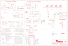
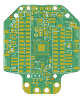
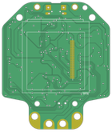

Contents
========

* [PRA4300 > Adafruit Hallowing M4 PCB](#pra4300--adafruit-hallowing-m4-pcb)
	* [Schematic](#schematic)
	* [PCB](#pcb)
	* [Interactive BOM](#interactive-bom)
	* [OOMP Parts](#oomp-parts)
	* [Images](#images)
	* [Tags](#tags)
  
![][im]
# PRA4300 > Adafruit Hallowing M4 PCB

- ID: PROJ-ADAF-4300-STAN-01
- Hex ID: PRA4300
- Name: Adafruit 4300
- Description: Adafruit 4300
- Long Link: [http://oom.lt/PROJ-ADAF-4300-STAN-01](http://oom.lt/PROJ-ADAF-4300-STAN-01)
- Short Link: [http://oom.lt/PRA4300](http://oom.lt/PRA4300)

## Schematic
  

## PCB
  

## Interactive BOM

- Interactive BOM page: [ibom.html](https://htmlpreview.github.io/?https://github.com/oomlout/oomlout_OOMP_projects/blob/main/PROJ-ADAF-4300-STAN-01/kicad/bom/ibom.html)

## OOMP Parts
  

|OOMP ID|Name|Identifier|
| :---: | :---: | :---: |
|[CAPC-0603-X-UF1-V25](https://github.com/oomlout/oomlout_OOMP_parts/tree/main/CAPC-0603-X-UF1-V25/)|[SMD (0603) 1 uF Capacitor (Ceramic) 25v](https://github.com/oomlout/oomlout_OOMP_parts/tree/main/CAPC-0603-X-UF1-V25/)|[C12, C23, C24, C27, C28, C29, C32](https://github.com/oomlout/oomlout_OOMP_parts/tree/main/CAPC-0603-X-UF1-V25/)|
|CAPC-0805-X-UNMATCHED-01||C16, C17, C22, C33|
|[CAPC-0805-X-UF10-V10](https://github.com/oomlout/oomlout_OOMP_parts/tree/main/CAPC-0805-X-UF10-V10/)|[SMD (0805) 10 uF Capacitor (Ceramic) 10v](https://github.com/oomlout/oomlout_OOMP_parts/tree/main/CAPC-0805-X-UF10-V10/)|[C18, C19, C21, C26, C30](https://github.com/oomlout/oomlout_OOMP_parts/tree/main/CAPC-0805-X-UF10-V10/)|
|[CAPC-0603-X-NF100-V50](https://github.com/oomlout/oomlout_OOMP_parts/tree/main/CAPC-0603-X-NF100-V50/)|[SMD (0603) 100 nF Capacitor (Ceramic) 50v](https://github.com/oomlout/oomlout_OOMP_parts/tree/main/CAPC-0603-X-NF100-V50/)|[C25, C31](https://github.com/oomlout/oomlout_OOMP_parts/tree/main/CAPC-0603-X-NF100-V50/)|
|LEDS-0805-O-STAN-01||CHG1|
|DIOD-S123-X-UNMATCHED-01||D3|
|DIOD-S323-X-UNMATCHED-01||D5, D6|
|FERB-0805-X-UNMATCHED-01||FB1|
|[HEAD-JSTSH-X-PI04-RS](https://github.com/oomlout/oomlout_OOMP_parts/tree/main/HEAD-JSTSH-X-PI04-RS/)|[JST XH (1 mm) 4 Pin Header Right Angle (SMD)](https://github.com/oomlout/oomlout_OOMP_parts/tree/main/HEAD-JSTSH-X-PI04-RS/)|[I2C1](https://github.com/oomlout/oomlout_OOMP_parts/tree/main/HEAD-JSTSH-X-PI04-RS/)|
|UNMATCHED-UNMATCHED-X-UNMATCHED-01||IC2, MS2, NEOPIX1, SENSE1, SW1, TFT1, U$59, U$63, U4, U9, X2, X4|
|UNMATCHED-SO23-X-UNMATCHED-01||IC3|
|[LEDS-0805-R-STAN-01](https://github.com/oomlout/oomlout_OOMP_parts/tree/main/LEDS-0805-R-STAN-01/)|[SMD (0805) Red LED](https://github.com/oomlout/oomlout_OOMP_parts/tree/main/LEDS-0805-R-STAN-01/)|[L1](https://github.com/oomlout/oomlout_OOMP_parts/tree/main/LEDS-0805-R-STAN-01/)|
|LEDS-UNMATCHED-RGB-K2812-01||LED1, LED2, LED3, LED4|
|[MOSN-SO23-X-KBSS138-01](https://github.com/oomlout/oomlout_OOMP_parts/tree/main/MOSN-SO23-X-KBSS138-01/)|[SMD (SOT-23) BSS138 N-Ch. MOSFET](https://github.com/oomlout/oomlout_OOMP_parts/tree/main/MOSN-SO23-X-KBSS138-01/)|[Q4](https://github.com/oomlout/oomlout_OOMP_parts/tree/main/MOSN-SO23-X-KBSS138-01/)|
|MOSP-SO23-X-UNMATCHED-01||Q5, Q6|
|[MOSN-SO363-X-KBSS138-01](https://github.com/oomlout/oomlout_OOMP_parts/tree/main/MOSN-SO363-X-KBSS138-01/)|[SMD (SOT-363) BSS138 N-Ch. MOSFET](https://github.com/oomlout/oomlout_OOMP_parts/tree/main/MOSN-SO363-X-KBSS138-01/)|[Q7](https://github.com/oomlout/oomlout_OOMP_parts/tree/main/MOSN-SO363-X-KBSS138-01/)|
|[RESE-0603-X-O105-01](https://github.com/oomlout/oomlout_OOMP_parts/tree/main/RESE-0603-X-O105-01/)|[SMD (0603) 1M Ohm Resistor](https://github.com/oomlout/oomlout_OOMP_parts/tree/main/RESE-0603-X-O105-01/)|[R1, R2, R4, R5](https://github.com/oomlout/oomlout_OOMP_parts/tree/main/RESE-0603-X-O105-01/)|
|[RESE-0603-X-O103-01](https://github.com/oomlout/oomlout_OOMP_parts/tree/main/RESE-0603-X-O103-01/)|[SMD (0603) 10k Ohm Resistor](https://github.com/oomlout/oomlout_OOMP_parts/tree/main/RESE-0603-X-O103-01/)|[R3, R19, R20](https://github.com/oomlout/oomlout_OOMP_parts/tree/main/RESE-0603-X-O103-01/)|
|[RESE-0603-X-O222-01](https://github.com/oomlout/oomlout_OOMP_parts/tree/main/RESE-0603-X-O222-01/)|[SMD (0603) 2.2k Ohm Resistor](https://github.com/oomlout/oomlout_OOMP_parts/tree/main/RESE-0603-X-O222-01/)|[R10](https://github.com/oomlout/oomlout_OOMP_parts/tree/main/RESE-0603-X-O222-01/)|
|[RESE-0603-X-O102-01](https://github.com/oomlout/oomlout_OOMP_parts/tree/main/RESE-0603-X-O102-01/)|[SMD (0603) 1k Ohm Resistor](https://github.com/oomlout/oomlout_OOMP_parts/tree/main/RESE-0603-X-O102-01/)|[R11, R17, R18](https://github.com/oomlout/oomlout_OOMP_parts/tree/main/RESE-0603-X-O102-01/)|
|[RESE-0603-X-O472-01](https://github.com/oomlout/oomlout_OOMP_parts/tree/main/RESE-0603-X-O472-01/)|[SMD (0603) 4.7k Ohm Resistor](https://github.com/oomlout/oomlout_OOMP_parts/tree/main/RESE-0603-X-O472-01/)|[R14](https://github.com/oomlout/oomlout_OOMP_parts/tree/main/RESE-0603-X-O472-01/)|
|RESA-06038-X-O1003X4-01||R15|
|[RESE-0603-X-O100-01](https://github.com/oomlout/oomlout_OOMP_parts/tree/main/RESE-0603-X-O100-01/)|[SMD (0603) 10 Ohm Resistor](https://github.com/oomlout/oomlout_OOMP_parts/tree/main/RESE-0603-X-O100-01/)|[R23](https://github.com/oomlout/oomlout_OOMP_parts/tree/main/RESE-0603-X-O100-01/)|
|[RESE-0603-X-O473-01](https://github.com/oomlout/oomlout_OOMP_parts/tree/main/RESE-0603-X-O473-01/)|[SMD (0603) 47k Ohm Resistor](https://github.com/oomlout/oomlout_OOMP_parts/tree/main/RESE-0603-X-O473-01/)|[R24](https://github.com/oomlout/oomlout_OOMP_parts/tree/main/RESE-0603-X-O473-01/)|
|RESE-0603-X-O1003-01||R25, R26|
|[RESA-06038-X-O103X4-01](https://github.com/oomlout/oomlout_OOMP_parts/tree/main/RESA-06038-X-O103X4-01/)|[SMD (0603-8) 10k Ohm (x4) Resistor Array](https://github.com/oomlout/oomlout_OOMP_parts/tree/main/RESA-06038-X-O103X4-01/)|[R27](https://github.com/oomlout/oomlout_OOMP_parts/tree/main/RESA-06038-X-O103X4-01/)|
|[BUTA-4628-X-STAN-01](https://github.com/oomlout/oomlout_OOMP_parts/tree/main/BUTA-4628-X-STAN-01/)|[SMD (4628) Pushbutton (Tactile)](https://github.com/oomlout/oomlout_OOMP_parts/tree/main/BUTA-4628-X-STAN-01/)|[SW3](https://github.com/oomlout/oomlout_OOMP_parts/tree/main/BUTA-4628-X-STAN-01/)|
|UNMATCHED-SO235-X-UNMATCHED-01||U6, U7|

## Images
  
  

|bominteractivefront|bominteractiveback|kicadPcb3d|kicadPcb3dFront|kicadPcb3dBack|kicadSchem|eagleImage|eagleSchemImage|pcbdraw|pcbdrawback|
| :---: | :---: | :---: | :---: | :---: | :---: | :---: | :---: | :---: | :---: |
|||||||||||

## Tags

- hexID: PRA4300
- oompType: PROJ
- oompSize: ADAF
- oompColor: 4300
- oompDesc: STAN
- oompIndex: 01
- oompName: Adafruit Hallowing M4 PCB
- sources: All source files from https://github.com/adafruit/Adafruit-Hallowing-M4-PCB (source licence details in srcLicense.md)
- linkBuyPage: http://www.adafruit.com/products/4300
- oompID: PROJ-ADAF-4300-STAN-01
- oompParts: C12,CAPC-0603-X-UF1-V25
- oompParts: C16,CAPC-0805-X-UNMATCHED-01
- oompParts: C17,CAPC-0805-X-UNMATCHED-01
- oompParts: C18,CAPC-0805-X-UF10-V10
- oompParts: C19,CAPC-0805-X-UF10-V10
- oompParts: C21,CAPC-0805-X-UF10-V10
- oompParts: C22,CAPC-0805-X-UNMATCHED-01
- oompParts: C23,CAPC-0603-X-UF1-V25
- oompParts: C24,CAPC-0603-X-UF1-V25
- oompParts: C25,CAPC-0603-X-NF100-V50
- oompParts: C26,CAPC-0805-X-UF10-V10
- oompParts: C27,CAPC-0603-X-UF1-V25
- oompParts: C28,CAPC-0603-X-UF1-V25
- oompParts: C29,CAPC-0603-X-UF1-V25
- oompParts: C30,CAPC-0805-X-UF10-V10
- oompParts: C31,CAPC-0603-X-NF100-V50
- oompParts: C32,CAPC-0603-X-UF1-V25
- oompParts: C33,CAPC-0805-X-UNMATCHED-01
- oompParts: CHG1,LEDS-0805-O-STAN-01
- oompParts: D3,DIOD-S123-X-UNMATCHED-01
- oompParts: D5,DIOD-S323-X-UNMATCHED-01
- oompParts: D6,DIOD-S323-X-UNMATCHED-01
- oompParts: FB1,FERB-0805-X-UNMATCHED-01
- oompParts: I2C1,HEAD-JSTSH-X-PI04-RS
- oompParts: IC2,UNMATCHED-UNMATCHED-X-UNMATCHED-01
- oompParts: IC3,UNMATCHED-SO23-X-UNMATCHED-01
- oompParts: L1,LEDS-0805-R-STAN-01
- oompParts: LED1,LEDS-UNMATCHED-RGB-K2812-01
- oompParts: LED2,LEDS-UNMATCHED-RGB-K2812-01
- oompParts: LED3,LEDS-UNMATCHED-RGB-K2812-01
- oompParts: LED4,LEDS-UNMATCHED-RGB-K2812-01
- oompParts: MS2,UNMATCHED-UNMATCHED-X-UNMATCHED-01
- oompParts: NEOPIX1,UNMATCHED-UNMATCHED-X-UNMATCHED-01
- oompParts: Q4,MOSN-SO23-X-KBSS138-01
- oompParts: Q5,MOSP-SO23-X-UNMATCHED-01
- oompParts: Q6,MOSP-SO23-X-UNMATCHED-01
- oompParts: Q7,MOSN-SO363-X-KBSS138-01
- oompParts: R1,RESE-0603-X-O105-01
- oompParts: R2,RESE-0603-X-O105-01
- oompParts: R3,RESE-0603-X-O103-01
- oompParts: R4,RESE-0603-X-O105-01
- oompParts: R5,RESE-0603-X-O105-01
- oompParts: R10,RESE-0603-X-O222-01
- oompParts: R11,RESE-0603-X-O102-01
- oompParts: R14,RESE-0603-X-O472-01
- oompParts: R15,RESA-06038-X-O1003X4-01
- oompParts: R17,RESE-0603-X-O102-01
- oompParts: R18,RESE-0603-X-O102-01
- oompParts: R19,RESE-0603-X-O103-01
- oompParts: R20,RESE-0603-X-O103-01
- oompParts: R23,RESE-0603-X-O100-01
- oompParts: R24,RESE-0603-X-O473-01
- oompParts: R25,RESE-0603-X-O1003-01
- oompParts: R26,RESE-0603-X-O1003-01
- oompParts: R27,RESA-06038-X-O103X4-01
- oompParts: SENSE1,UNMATCHED-UNMATCHED-X-UNMATCHED-01
- oompParts: SW1,UNMATCHED-UNMATCHED-X-UNMATCHED-01
- oompParts: SW3,BUTA-4628-X-STAN-01
- oompParts: TFT1,UNMATCHED-UNMATCHED-X-UNMATCHED-01
- oompParts: U$59,UNMATCHED-UNMATCHED-X-UNMATCHED-01
- oompParts: U$63,UNMATCHED-UNMATCHED-X-UNMATCHED-01
- oompParts: U4,UNMATCHED-UNMATCHED-X-UNMATCHED-01
- oompParts: U6,UNMATCHED-SO235-X-UNMATCHED-01
- oompParts: U7,UNMATCHED-SO235-X-UNMATCHED-01
- oompParts: U9,UNMATCHED-UNMATCHED-X-UNMATCHED-01
- oompParts: X2,UNMATCHED-UNMATCHED-X-UNMATCHED-01
- oompParts: X4,UNMATCHED-UNMATCHED-X-UNMATCHED-01
- rawParts: C12,1uF,CAP_CERAMIC0603_NO,0603-NO,Ceramic Capacitors,,,
- rawParts: C16,10µF,CAP_CERAMIC0805-NOOUTLINE,0805-NO,Ceramic Capacitors,,C,
- rawParts: C17,10µF,CAP_CERAMIC0805-NOOUTLINE,0805-NO,Ceramic Capacitors,,,
- rawParts: C18,10uF,CAP_CERAMIC0805-NOOUTLINE,0805-NO,Ceramic Capacitors,,,
- rawParts: C19,10uF,CAP_CERAMIC0805-NOOUTLINE,0805-NO,Ceramic Capacitors,,,
- rawParts: C21,10uF,CAP_CERAMIC0805-NOOUTLINE,0805-NO,Ceramic Capacitors,,,
- rawParts: C22,10µF,CAP_CERAMIC0805-NOOUTLINE,0805-NO,Ceramic Capacitors,,,
- rawParts: C23,1uF,CAP_CERAMIC0603_NO,0603-NO,Ceramic Capacitors,,,
- rawParts: C24,1uF,CAP_CERAMIC0603_NO,0603-NO,Ceramic Capacitors,,,
- rawParts: C25,0.1uF,CAP_CERAMIC0603_NO,0603-NO,Ceramic Capacitors,,,
- rawParts: C26,10uF,CAP_CERAMIC0805-NOOUTLINE,0805-NO,Ceramic Capacitors,,,
- rawParts: C27,1uF,CAP_CERAMIC0603_NO,0603-NO,Ceramic Capacitors,,,
- rawParts: C28,1uF,CAP_CERAMIC0603_NO,0603-NO,Ceramic Capacitors,,,
- rawParts: C29,1uF,CAP_CERAMIC0603_NO,0603-NO,Ceramic Capacitors,,,
- rawParts: C30,10uF,CAP_CERAMIC0805-NOOUTLINE,0805-NO,Ceramic Capacitors,,,
- rawParts: C31,0.1uF,CAP_CERAMIC0603_NO,0603-NO,Ceramic Capacitors,,,
- rawParts: C32,1uF,CAP_CERAMIC0603_NO,0603-NO,Ceramic Capacitors,,,
- rawParts: C33,10µF,CAP_CERAMIC0805-NOOUTLINE,0805-NO,Ceramic Capacitors,,,
- rawParts: CHG1,ORANGE,LED0805_NOOUTLINE,CHIPLED_0805_NOOUTLINE,LED,,,
- rawParts: D3,MBR0540,DIODE-SCHOTTKYSOD-123,SOD-123,,,,
- rawParts: D5,3.6V,DIODE-ZENERSOD323,SOD-323,Zener Diode,,,
- rawParts: D6,3.6V,DIODE-ZENERSOD323,SOD-323,Zener Diode,,,
- rawParts: FB1,Ferrite,FERRITE-0805NO,0805-NO,Ferrite Bead,,,
- rawParts: I2C1,JST PH 4,STEMMA_I2C_RASMT,JSTPH4,,,,
- rawParts: IC2,MSA301,MSA301,LGA12_2X2MM,,,,
- rawParts: IC3,PAM8301,PAM8301,SOT23-6,,,,
- rawParts: L1,RED,LED0805_NOOUTLINE,CHIPLED_0805_NOOUTLINE,LED,,,
- rawParts: LED1,WS2812B_4020,WS2812B_4020,WS2812B_4020,,,,
- rawParts: LED2,WS2812B_4020,WS2812B_4020,WS2812B_4020,,,,
- rawParts: LED3,WS2812B_4020,WS2812B_4020,WS2812B_4020,,,,
- rawParts: LED4,WS2812B_4020,WS2812B_4020,WS2812B_4020,,,,
- rawParts: MS2,FEATHERWING_SMTDUALNOHOLES,FEATHERWING_SMTDUALNOHOLES,FEATHERWING_SMT_NOHOLES,,,,
- rawParts: NEOPIX1,JST PH 3,CON_JST_PH_3PIN,JSTPH3,,,,
- rawParts: Q4,BSS138,MOSFET-NWIDE,SOT23-WIDE,N-Channel Mosfet,,,
- rawParts: Q5,DMG3405,MOSFET-P,SOT23-R,P-Channel Mosfet,,,
- rawParts: Q6,DMG3405,MOSFET-P,SOT23-R,P-Channel Mosfet,,,
- rawParts: Q7,BSS138,MOSFET-N_DUAL,SOT363,Dual N-Channel MOSFET,,,
- rawParts: R1,1M,RESISTOR_0603_NOOUT,0603-NO,Resistors,,,
- rawParts: R2,1M,RESISTOR_0603_NOOUT,0603-NO,Resistors,,,
- rawParts: R3,10K,RESISTOR_0603_NOOUT,0603-NO,Resistors,,,
- rawParts: R4,1M,RESISTOR_0603_NOOUT,0603-NO,Resistors,,,
- rawParts: R5,1M,RESISTOR_0603_NOOUT,0603-NO,Resistors,,,
- rawParts: R10,2.2K,RESISTOR_0603_NOOUT,0603-NO,Resistors,,,
- rawParts: R11,1K,RESISTOR_0603_NOOUT,0603-NO,Resistors,,,
- rawParts: R14,4.7K,RESISTOR_0603_NOOUT,0603-NO,Resistors,,,
- rawParts: R15,100K,RESISTOR_4PACK,RESPACK_4X0603,Resistor Packs (4 resistors),,,
- rawParts: R17,1K,RESISTOR_0603_NOOUT,0603-NO,Resistors,,,
- rawParts: R18,1K,RESISTOR_0603_NOOUT,0603-NO,Resistors,,,
- rawParts: R19,10K,RESISTOR_0603_NOOUT,0603-NO,Resistors,,,
- rawParts: R20,10K,RESISTOR_0603_NOOUT,0603-NO,Resistors,,,
- rawParts: R23,10,RESISTOR_0603_NOOUT,0603-NO,Resistors,,,
- rawParts: R24,47K,RESISTOR_0603_NOOUT,0603-NO,Resistors,,,
- rawParts: R25,100K,RESISTOR_0603_NOOUT,0603-NO,Resistors,,,
- rawParts: R26,100K,RESISTOR_0603_NOOUT,0603-NO,Resistors,,,
- rawParts: R27,10K,RESISTOR_4PACK,RESPACK_4X0603,Resistor Packs (4 resistors),,,
- rawParts: SENSE1,JST PH 3,CON_JST_PH_3PIN,JSTPH3,,,,
- rawParts: SJ2,,SOLDERJUMPER_2WAY,SOLDERJUMPER_2WAY_OPEN_NOPASTE,2-Way Solder Jumper,,,
- rawParts: SW1,,SWITCH_DPDTEG1390,EG1390,Switch - DPDT,,,
- rawParts: SW3,SPST_TACT-EVQQ2,SWITCH_TACT_SMT4.6X2.8,BTN_KMR2_4.6X2.8,SMT Tact Switches,,,
- rawParts: TFT1,DISP_LCD_GENERIC_SPITFT_VDDIO_1.54_240X240_HANDSOLDER,DISP_LCD_GENERIC_SPITFT_VDDIO_1.54_240X240_HANDSOLDER,TFT_1.54IN_240X240_HANDSOLDER,,,,
- rawParts: TP3,SEWTAP_ALLILONG,SEWTAP_ALLILONG,PCB_ALLI_LONG,,,,
- rawParts: TP4,SEWTAPPCB_ALLIGATOR,SEWTAPPCB_ALLIGATOR,PCB_ALLI,,,,
- rawParts: TP6,,TESTPOINTROUND1.5MM,TESTPOINT_ROUND_1.5MM,Test Point,,,
- rawParts: TP7,,TESTPOINTROUND1.5MM,TESTPOINT_ROUND_1.5MM,Test Point,,,
- rawParts: TP28,SEWTAPPCB_ALLIGATOR,SEWTAPPCB_ALLIGATOR,PCB_ALLI,,,,
- rawParts: TP29,SEWTAP_ALLILONG,SEWTAP_ALLILONG,PCB_ALLI_LONG,,,,
- rawParts: U$31,MOUNTINGHOLE2.5,MOUNTINGHOLE2.5,MOUNTINGHOLE_2.5_PLATED,Mounting Hole,EXCLUDE,,
- rawParts: U$32,MOUNTINGHOLE2.5,MOUNTINGHOLE2.5,MOUNTINGHOLE_2.5_PLATED,Mounting Hole,EXCLUDE,,
- rawParts: U$34,FIDUCIAL_1MM,FIDUCIAL_1MM,FIDUCIAL_1MM,Fiducial Alignment Points,EXCLUDE,,
- rawParts: U$35,FIDUCIAL_1MM,FIDUCIAL_1MM,FIDUCIAL_1MM,Fiducial Alignment Points,EXCLUDE,,
- rawParts: U$59,CON_MOLEX_2P,CON_MOLEX_2P,53398-0271,,,,
- rawParts: U$63,ATSAMD51J19,ATSAMD51J,PQFN64-1,ATSAMD51J cortex m4 microcontroller,,,
- rawParts: U4,ALS-PT21,PHOTOTRANSISTOR_PT26-21C,ALS-PT26-21C,ALS-PT19-315C - Analog Light Sensor,,,
- rawParts: U6,AP2112-3.3,VREG_SOT23-5,SOT23-5,SOT23-5 Fixed Voltage Regulators,,,
- rawParts: U7,MCP73831T-2ACI/OT,MCP73831/2,SOT23-5,MCP73831/2 LIPO Charger,,,
- rawParts: U9,GD25Q64,SPIFLASH_8PIN208MIL,SOIC8_208MIL,SOIC8 SPI Flash,,,
- rawParts: X2,microUSB,USB_MICRO_20329_V2,4UCONN_20329_V2,USB Connectors,,,
- rawParts: X4,JSTPH,CON_JST_PH_2PIN,JSTPH2,JST 2-Pin Right-Angle Connector,,,

[im]: kicadPcb3d_450.png
