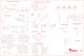

Contents
========

* [PRA4300 > Adafruit](#pra4300--adafruit)
	* [Schematic](#schematic)
	* [Interactive BOM](#interactive-bom)
	* [OOMP Parts](#oomp-parts)
	* [Images](#images)
	* [Tags](#tags)
  
![][im]
# PRA4300 > Adafruit

- ID: PROJ-ADAF-4300-STAN-01
- Hex ID: PRA4300
- Name: Adafruit
- Description: Adafruit
- Long Link: [http://oom.lt/PROJ-ADAF-4300-STAN-01](http://oom.lt/PROJ-ADAF-4300-STAN-01)
- Short Link: [http://oom.lt/PRA4300](http://oom.lt/PRA4300)

## Schematic
  

## Interactive BOM

- Interactive BOM page: [ibom.html](https://htmlpreview.github.io/?https://github.com/oomlout/oomlout_OOMP_projects/blob/main/PROJ-ADAF-4300-STAN-01/kicad/bom/ibom.html)

## OOMP Parts
  

|OOMP Parts|
| :---: |
|C12,CAPC-0603-X-UF1-01,C12,1uF,CAP_CERAMIC0603_NO,0603-NO,Ceramic Capacitors,,,|
|C16,CAPC-0805-X-UNMATCHED-01,C16,10µF,CAP_CERAMIC0805-NOOUTLINE,0805-NO,Ceramic Capacitors,,C,|
|C17,CAPC-0805-X-UNMATCHED-01,C17,10µF,CAP_CERAMIC0805-NOOUTLINE,0805-NO,Ceramic Capacitors,,,|
|C18,CAPC-0805-X-UF10-V10,C18,10uF,CAP_CERAMIC0805-NOOUTLINE,0805-NO,Ceramic Capacitors,,,|
|C19,CAPC-0805-X-UF10-V10,C19,10uF,CAP_CERAMIC0805-NOOUTLINE,0805-NO,Ceramic Capacitors,,,|
|C21,CAPC-0805-X-UF10-V10,C21,10uF,CAP_CERAMIC0805-NOOUTLINE,0805-NO,Ceramic Capacitors,,,|
|C22,CAPC-0805-X-UNMATCHED-01,C22,10µF,CAP_CERAMIC0805-NOOUTLINE,0805-NO,Ceramic Capacitors,,,|
|C23,CAPC-0603-X-UF1-01,C23,1uF,CAP_CERAMIC0603_NO,0603-NO,Ceramic Capacitors,,,|
|C24,CAPC-0603-X-UF1-01,C24,1uF,CAP_CERAMIC0603_NO,0603-NO,Ceramic Capacitors,,,|
|C25,CAPC-0603-X-NF100-V50,C25,0.1uF,CAP_CERAMIC0603_NO,0603-NO,Ceramic Capacitors,,,|
|C26,CAPC-0805-X-UF10-V10,C26,10uF,CAP_CERAMIC0805-NOOUTLINE,0805-NO,Ceramic Capacitors,,,|
|C27,CAPC-0603-X-UF1-01,C27,1uF,CAP_CERAMIC0603_NO,0603-NO,Ceramic Capacitors,,,|
|C28,CAPC-0603-X-UF1-01,C28,1uF,CAP_CERAMIC0603_NO,0603-NO,Ceramic Capacitors,,,|
|C29,CAPC-0603-X-UF1-01,C29,1uF,CAP_CERAMIC0603_NO,0603-NO,Ceramic Capacitors,,,|
|C30,CAPC-0805-X-UF10-V10,C30,10uF,CAP_CERAMIC0805-NOOUTLINE,0805-NO,Ceramic Capacitors,,,|
|C31,CAPC-0603-X-NF100-V50,C31,0.1uF,CAP_CERAMIC0603_NO,0603-NO,Ceramic Capacitors,,,|
|C32,CAPC-0603-X-UF1-01,C32,1uF,CAP_CERAMIC0603_NO,0603-NO,Ceramic Capacitors,,,|
|C33,CAPC-0805-X-UNMATCHED-01,C33,10µF,CAP_CERAMIC0805-NOOUTLINE,0805-NO,Ceramic Capacitors,,,|
|CHG1,LEDS-0805-G-STAN-01,CHG1,ORANGE,LED0805_NOOUTLINE,CHIPLED_0805_NOOUTLINE,LED,,,|
|D3,DIOD-UNMATCHED-X-UNMATCHED-01,D3,MBR0540,DIODE-SCHOTTKYSOD-123,SOD-123,,,,|
|D5,DIOD-S323-X-UNMATCHED-01,D5,3.6V,DIODE-ZENERSOD323,SOD-323,Zener Diode,,,|
|D6,DIOD-S323-X-UNMATCHED-01,D6,3.6V,DIODE-ZENERSOD323,SOD-323,Zener Diode,,,|
|FB1,UNMATCHED-0805-X-UNMATCHED-01,FB1,Ferrite,FERRITE-0805NO,0805-NO,Ferrite Bead,,,|
|I2C1,UNMATCHED-UNMATCHED-X-UNMATCHED-01,I2C1,JST PH 4,STEMMA_I2C_RASMT,JSTPH4,,,,|
|IC2,UNMATCHED-UNMATCHED-X-UNMATCHED-01,IC2,MSA301,MSA301,LGA12_2X2MM,,,,|
|IC3,UNMATCHED-SO23-X-UNMATCHED-01,IC3,PAM8301,PAM8301,SOT23-6,,,,|
|L1,LEDS-0805-G-STAN-01,L1,RED,LED0805_NOOUTLINE,CHIPLED_0805_NOOUTLINE,LED,,,|
|LED1,UNMATCHED-UNMATCHED-X-UNMATCHED-01,LED1,WS2812B_4020,WS2812B_4020,WS2812B_4020,,,,|
|LED2,UNMATCHED-UNMATCHED-X-UNMATCHED-01,LED2,WS2812B_4020,WS2812B_4020,WS2812B_4020,,,,|
|LED3,UNMATCHED-UNMATCHED-X-UNMATCHED-01,LED3,WS2812B_4020,WS2812B_4020,WS2812B_4020,,,,|
|LED4,UNMATCHED-UNMATCHED-X-UNMATCHED-01,LED4,WS2812B_4020,WS2812B_4020,WS2812B_4020,,,,|
|MS2,UNMATCHED-UNMATCHED-X-UNMATCHED-01,MS2,FEATHERWING_SMTDUALNOHOLES,FEATHERWING_SMTDUALNOHOLES,FEATHERWING_SMT_NOHOLES,,,,|
|NEOPIX1,UNMATCHED-UNMATCHED-X-UNMATCHED-01,NEOPIX1,JST PH 3,CON_JST_PH_3PIN,JSTPH3,,,,|
|Q4,MOSN-SO23-X-KBSS138-01,Q4,BSS138,MOSFET-NWIDE,SOT23-WIDE,N-Channel Mosfet,,,|
|Q5,MOSP-SO23-X-UNMATCHED-01,Q5,DMG3405,MOSFET-P,SOT23-R,P-Channel Mosfet,,,|
|Q6,MOSP-SO23-X-UNMATCHED-01,Q6,DMG3405,MOSFET-P,SOT23-R,P-Channel Mosfet,,,|
|Q7,MOSN-SO363-X-KBSS138-01,Q7,BSS138,MOSFET-N_DUAL,SOT363,Dual N-Channel MOSFET,,,|
|R1,RESE-0603-X-O105-01,R1,1M,RESISTOR_0603_NOOUT,0603-NO,Resistors,,,|
|R2,RESE-0603-X-O105-01,R2,1M,RESISTOR_0603_NOOUT,0603-NO,Resistors,,,|
|R3,RESE-0603-X-O103-01,R3,10K,RESISTOR_0603_NOOUT,0603-NO,Resistors,,,|
|R4,RESE-0603-X-O105-01,R4,1M,RESISTOR_0603_NOOUT,0603-NO,Resistors,,,|
|R5,RESE-0603-X-O105-01,R5,1M,RESISTOR_0603_NOOUT,0603-NO,Resistors,,,|
|R10,RESE-0603-X-UNMATCHED-01,R10,2.2K,RESISTOR_0603_NOOUT,0603-NO,Resistors,,,|
|R11,RESE-0603-X-O102-01,R11,1K,RESISTOR_0603_NOOUT,0603-NO,Resistors,,,|
|R14,RESE-0603-X-O472-01,R14,4.7K,RESISTOR_0603_NOOUT,0603-NO,Resistors,,,|
|R15,RESE-UNMATCHED-X-O1003-01,R15,100K,RESISTOR_4PACK,RESPACK_4X0603,Resistor Packs (4 resistors),,,|
|R17,RESE-0603-X-O102-01,R17,1K,RESISTOR_0603_NOOUT,0603-NO,Resistors,,,|
|R18,RESE-0603-X-O102-01,R18,1K,RESISTOR_0603_NOOUT,0603-NO,Resistors,,,|
|R19,RESE-0603-X-O103-01,R19,10K,RESISTOR_0603_NOOUT,0603-NO,Resistors,,,|
|R20,RESE-0603-X-O103-01,R20,10K,RESISTOR_0603_NOOUT,0603-NO,Resistors,,,|
|R23,RESE-0603-X-O11-01,R23,10,RESISTOR_0603_NOOUT,0603-NO,Resistors,,,|
|R24,RESE-0603-X-O473-01,R24,47K,RESISTOR_0603_NOOUT,0603-NO,Resistors,,,|
|R25,RESE-0603-X-O1003-01,R25,100K,RESISTOR_0603_NOOUT,0603-NO,Resistors,,,|
|R26,RESE-0603-X-O1003-01,R26,100K,RESISTOR_0603_NOOUT,0603-NO,Resistors,,,|
|R27,RESE-UNMATCHED-X-O103-01,R27,10K,RESISTOR_4PACK,RESPACK_4X0603,Resistor Packs (4 resistors),,,|
|SENSE1,UNMATCHED-UNMATCHED-X-UNMATCHED-01,SENSE1,JST PH 3,CON_JST_PH_3PIN,JSTPH3,,,,|
|SW1,UNMATCHED-UNMATCHED-X-UNMATCHED-01,SJ2,,SOLDERJUMPER_2WAY,SOLDERJUMPER_2WAY_OPEN_NOPASTE,2-Way Solder Jumper,,,|
|SW3,UNMATCHED-UNMATCHED-X-UNMATCHED-01,SW1,,SWITCH_DPDTEG1390,EG1390,Switch - DPDT,,,|
|TFT1,UNMATCHED-UNMATCHED-X-UNMATCHED-01,SW3,SPST_TACT-EVQQ2,SWITCH_TACT_SMT4.6X2.8,BTN_KMR2_4.6X2.8,SMT Tact Switches,,,|
|TP3,UNMATCHED-UNMATCHED-X-UNMATCHED-01,TFT1,DISP_LCD_GENERIC_SPITFT_VDDIO_1.54_240X240_HANDSOLDER,DISP_LCD_GENERIC_SPITFT_VDDIO_1.54_240X240_HANDSOLDER,TFT_1.54IN_240X240_HANDSOLDER,,,,|
|TP4,UNMATCHED-UNMATCHED-X-UNMATCHED-01,TP3,SEWTAP_ALLILONG,SEWTAP_ALLILONG,PCB_ALLI_LONG,,,,|
|TP6,UNMATCHED-UNMATCHED-X-UNMATCHED-01,TP4,SEWTAPPCB_ALLIGATOR,SEWTAPPCB_ALLIGATOR,PCB_ALLI,,,,|
|TP7,UNMATCHED-UNMATCHED-X-UNMATCHED-01,TP6,,TESTPOINTROUND1.5MM,TESTPOINT_ROUND_1.5MM,Test Point,,,|
|TP28,UNMATCHED-UNMATCHED-X-UNMATCHED-01,TP7,,TESTPOINTROUND1.5MM,TESTPOINT_ROUND_1.5MM,Test Point,,,|
|TP29,UNMATCHED-UNMATCHED-X-UNMATCHED-01,TP28,SEWTAPPCB_ALLIGATOR,SEWTAPPCB_ALLIGATOR,PCB_ALLI,,,,|
|U$59,UNMATCHED-UNMATCHED-X-UNMATCHED-01,TP29,SEWTAP_ALLILONG,SEWTAP_ALLILONG,PCB_ALLI_LONG,,,,|
|U$63,UNMATCHED-UNMATCHED-X-UNMATCHED-01,U$31,MOUNTINGHOLE2.5,MOUNTINGHOLE2.5,MOUNTINGHOLE_2.5_PLATED,Mounting Hole,EXCLUDE,,|
|U4,UNMATCHED-UNMATCHED-X-UNMATCHED-01,U$32,MOUNTINGHOLE2.5,MOUNTINGHOLE2.5,MOUNTINGHOLE_2.5_PLATED,Mounting Hole,EXCLUDE,,|
|U6,UNMATCHED-SO235-X-UNMATCHED-01,U$34,FIDUCIAL_1MM,FIDUCIAL_1MM,FIDUCIAL_1MM,Fiducial Alignment Points,EXCLUDE,,|
|U7,UNMATCHED-SO235-X-UNMATCHED-01,U$35,FIDUCIAL_1MM,FIDUCIAL_1MM,FIDUCIAL_1MM,Fiducial Alignment Points,EXCLUDE,,|
|U9,UNMATCHED-UNMATCHED-X-UNMATCHED-01,U$59,CON_MOLEX_2P,CON_MOLEX_2P,53398-0271,,,,|
|X2,UNMATCHED-UNMATCHED-X-UNMATCHED-01,U$63,ATSAMD51J19,ATSAMD51J,PQFN64-1,ATSAMD51J cortex m4 microcontroller,,,|
|X4,UNMATCHED-UNMATCHED-X-UNMATCHED-01,U4,ALS-PT21,PHOTOTRANSISTOR_PT26-21C,ALS-PT26-21C,ALS-PT19-315C - Analog Light Sensor,,,|

## Images
  
  

|kicadPcb3d|kicadPcb3dFront|kicadPcb3dBack|eagleImage|eagleSchemImage|
| :---: | :---: | :---: | :---: | :---: |
||||||

## Tags

- hexID: PRA4300
- oompType: PROJ
- oompSize: ADAF
- oompColor: 4300
- oompDesc: STAN
- oompIndex: 01
- oompName: Adafruit Hallowing M4 PCB
- sources: All source files from https://github.com/adafruit/Adafruit-Hallowing-M4-PCB (source licence details in srcLicense.md)
- linkBuyPage: http://www.adafruit.com/products/4300
- oompID: PROJ-ADAF-4300-STAN-01
- oompParts: C12,CAPC-0603-X-UF1-01
- oompParts: C16,CAPC-0805-X-UNMATCHED-01
- oompParts: C17,CAPC-0805-X-UNMATCHED-01
- oompParts: C18,CAPC-0805-X-UF10-V10
- oompParts: C19,CAPC-0805-X-UF10-V10
- oompParts: C21,CAPC-0805-X-UF10-V10
- oompParts: C22,CAPC-0805-X-UNMATCHED-01
- oompParts: C23,CAPC-0603-X-UF1-01
- oompParts: C24,CAPC-0603-X-UF1-01
- oompParts: C25,CAPC-0603-X-NF100-V50
- oompParts: C26,CAPC-0805-X-UF10-V10
- oompParts: C27,CAPC-0603-X-UF1-01
- oompParts: C28,CAPC-0603-X-UF1-01
- oompParts: C29,CAPC-0603-X-UF1-01
- oompParts: C30,CAPC-0805-X-UF10-V10
- oompParts: C31,CAPC-0603-X-NF100-V50
- oompParts: C32,CAPC-0603-X-UF1-01
- oompParts: C33,CAPC-0805-X-UNMATCHED-01
- oompParts: CHG1,LEDS-0805-G-STAN-01
- oompParts: D3,DIOD-UNMATCHED-X-UNMATCHED-01
- oompParts: D5,DIOD-S323-X-UNMATCHED-01
- oompParts: D6,DIOD-S323-X-UNMATCHED-01
- oompParts: FB1,UNMATCHED-0805-X-UNMATCHED-01
- oompParts: I2C1,UNMATCHED-UNMATCHED-X-UNMATCHED-01
- oompParts: IC2,UNMATCHED-UNMATCHED-X-UNMATCHED-01
- oompParts: IC3,UNMATCHED-SO23-X-UNMATCHED-01
- oompParts: L1,LEDS-0805-G-STAN-01
- oompParts: LED1,UNMATCHED-UNMATCHED-X-UNMATCHED-01
- oompParts: LED2,UNMATCHED-UNMATCHED-X-UNMATCHED-01
- oompParts: LED3,UNMATCHED-UNMATCHED-X-UNMATCHED-01
- oompParts: LED4,UNMATCHED-UNMATCHED-X-UNMATCHED-01
- oompParts: MS2,UNMATCHED-UNMATCHED-X-UNMATCHED-01
- oompParts: NEOPIX1,UNMATCHED-UNMATCHED-X-UNMATCHED-01
- oompParts: Q4,MOSN-SO23-X-KBSS138-01
- oompParts: Q5,MOSP-SO23-X-UNMATCHED-01
- oompParts: Q6,MOSP-SO23-X-UNMATCHED-01
- oompParts: Q7,MOSN-SO363-X-KBSS138-01
- oompParts: R1,RESE-0603-X-O105-01
- oompParts: R2,RESE-0603-X-O105-01
- oompParts: R3,RESE-0603-X-O103-01
- oompParts: R4,RESE-0603-X-O105-01
- oompParts: R5,RESE-0603-X-O105-01
- oompParts: R10,RESE-0603-X-UNMATCHED-01
- oompParts: R11,RESE-0603-X-O102-01
- oompParts: R14,RESE-0603-X-O472-01
- oompParts: R15,RESE-UNMATCHED-X-O1003-01
- oompParts: R17,RESE-0603-X-O102-01
- oompParts: R18,RESE-0603-X-O102-01
- oompParts: R19,RESE-0603-X-O103-01
- oompParts: R20,RESE-0603-X-O103-01
- oompParts: R23,RESE-0603-X-O11-01
- oompParts: R24,RESE-0603-X-O473-01
- oompParts: R25,RESE-0603-X-O1003-01
- oompParts: R26,RESE-0603-X-O1003-01
- oompParts: R27,RESE-UNMATCHED-X-O103-01
- oompParts: SENSE1,UNMATCHED-UNMATCHED-X-UNMATCHED-01
- oompParts: SW1,UNMATCHED-UNMATCHED-X-UNMATCHED-01
- oompParts: SW3,UNMATCHED-UNMATCHED-X-UNMATCHED-01
- oompParts: TFT1,UNMATCHED-UNMATCHED-X-UNMATCHED-01
- oompParts: TP3,UNMATCHED-UNMATCHED-X-UNMATCHED-01
- oompParts: TP4,UNMATCHED-UNMATCHED-X-UNMATCHED-01
- oompParts: TP6,UNMATCHED-UNMATCHED-X-UNMATCHED-01
- oompParts: TP7,UNMATCHED-UNMATCHED-X-UNMATCHED-01
- oompParts: TP28,UNMATCHED-UNMATCHED-X-UNMATCHED-01
- oompParts: TP29,UNMATCHED-UNMATCHED-X-UNMATCHED-01
- oompParts: U$59,UNMATCHED-UNMATCHED-X-UNMATCHED-01
- oompParts: U$63,UNMATCHED-UNMATCHED-X-UNMATCHED-01
- oompParts: U4,UNMATCHED-UNMATCHED-X-UNMATCHED-01
- oompParts: U6,UNMATCHED-SO235-X-UNMATCHED-01
- oompParts: U7,UNMATCHED-SO235-X-UNMATCHED-01
- oompParts: U9,UNMATCHED-UNMATCHED-X-UNMATCHED-01
- oompParts: X2,UNMATCHED-UNMATCHED-X-UNMATCHED-01
- oompParts: X4,UNMATCHED-UNMATCHED-X-UNMATCHED-01
- rawParts: C12,1uF,CAP_CERAMIC0603_NO,0603-NO,Ceramic Capacitors,,,
- rawParts: C16,10µF,CAP_CERAMIC0805-NOOUTLINE,0805-NO,Ceramic Capacitors,,C,
- rawParts: C17,10µF,CAP_CERAMIC0805-NOOUTLINE,0805-NO,Ceramic Capacitors,,,
- rawParts: C18,10uF,CAP_CERAMIC0805-NOOUTLINE,0805-NO,Ceramic Capacitors,,,
- rawParts: C19,10uF,CAP_CERAMIC0805-NOOUTLINE,0805-NO,Ceramic Capacitors,,,
- rawParts: C21,10uF,CAP_CERAMIC0805-NOOUTLINE,0805-NO,Ceramic Capacitors,,,
- rawParts: C22,10µF,CAP_CERAMIC0805-NOOUTLINE,0805-NO,Ceramic Capacitors,,,
- rawParts: C23,1uF,CAP_CERAMIC0603_NO,0603-NO,Ceramic Capacitors,,,
- rawParts: C24,1uF,CAP_CERAMIC0603_NO,0603-NO,Ceramic Capacitors,,,
- rawParts: C25,0.1uF,CAP_CERAMIC0603_NO,0603-NO,Ceramic Capacitors,,,
- rawParts: C26,10uF,CAP_CERAMIC0805-NOOUTLINE,0805-NO,Ceramic Capacitors,,,
- rawParts: C27,1uF,CAP_CERAMIC0603_NO,0603-NO,Ceramic Capacitors,,,
- rawParts: C28,1uF,CAP_CERAMIC0603_NO,0603-NO,Ceramic Capacitors,,,
- rawParts: C29,1uF,CAP_CERAMIC0603_NO,0603-NO,Ceramic Capacitors,,,
- rawParts: C30,10uF,CAP_CERAMIC0805-NOOUTLINE,0805-NO,Ceramic Capacitors,,,
- rawParts: C31,0.1uF,CAP_CERAMIC0603_NO,0603-NO,Ceramic Capacitors,,,
- rawParts: C32,1uF,CAP_CERAMIC0603_NO,0603-NO,Ceramic Capacitors,,,
- rawParts: C33,10µF,CAP_CERAMIC0805-NOOUTLINE,0805-NO,Ceramic Capacitors,,,
- rawParts: CHG1,ORANGE,LED0805_NOOUTLINE,CHIPLED_0805_NOOUTLINE,LED,,,
- rawParts: D3,MBR0540,DIODE-SCHOTTKYSOD-123,SOD-123,,,,
- rawParts: D5,3.6V,DIODE-ZENERSOD323,SOD-323,Zener Diode,,,
- rawParts: D6,3.6V,DIODE-ZENERSOD323,SOD-323,Zener Diode,,,
- rawParts: FB1,Ferrite,FERRITE-0805NO,0805-NO,Ferrite Bead,,,
- rawParts: I2C1,JST PH 4,STEMMA_I2C_RASMT,JSTPH4,,,,
- rawParts: IC2,MSA301,MSA301,LGA12_2X2MM,,,,
- rawParts: IC3,PAM8301,PAM8301,SOT23-6,,,,
- rawParts: L1,RED,LED0805_NOOUTLINE,CHIPLED_0805_NOOUTLINE,LED,,,
- rawParts: LED1,WS2812B_4020,WS2812B_4020,WS2812B_4020,,,,
- rawParts: LED2,WS2812B_4020,WS2812B_4020,WS2812B_4020,,,,
- rawParts: LED3,WS2812B_4020,WS2812B_4020,WS2812B_4020,,,,
- rawParts: LED4,WS2812B_4020,WS2812B_4020,WS2812B_4020,,,,
- rawParts: MS2,FEATHERWING_SMTDUALNOHOLES,FEATHERWING_SMTDUALNOHOLES,FEATHERWING_SMT_NOHOLES,,,,
- rawParts: NEOPIX1,JST PH 3,CON_JST_PH_3PIN,JSTPH3,,,,
- rawParts: Q4,BSS138,MOSFET-NWIDE,SOT23-WIDE,N-Channel Mosfet,,,
- rawParts: Q5,DMG3405,MOSFET-P,SOT23-R,P-Channel Mosfet,,,
- rawParts: Q6,DMG3405,MOSFET-P,SOT23-R,P-Channel Mosfet,,,
- rawParts: Q7,BSS138,MOSFET-N_DUAL,SOT363,Dual N-Channel MOSFET,,,
- rawParts: R1,1M,RESISTOR_0603_NOOUT,0603-NO,Resistors,,,
- rawParts: R2,1M,RESISTOR_0603_NOOUT,0603-NO,Resistors,,,
- rawParts: R3,10K,RESISTOR_0603_NOOUT,0603-NO,Resistors,,,
- rawParts: R4,1M,RESISTOR_0603_NOOUT,0603-NO,Resistors,,,
- rawParts: R5,1M,RESISTOR_0603_NOOUT,0603-NO,Resistors,,,
- rawParts: R10,2.2K,RESISTOR_0603_NOOUT,0603-NO,Resistors,,,
- rawParts: R11,1K,RESISTOR_0603_NOOUT,0603-NO,Resistors,,,
- rawParts: R14,4.7K,RESISTOR_0603_NOOUT,0603-NO,Resistors,,,
- rawParts: R15,100K,RESISTOR_4PACK,RESPACK_4X0603,Resistor Packs (4 resistors),,,
- rawParts: R17,1K,RESISTOR_0603_NOOUT,0603-NO,Resistors,,,
- rawParts: R18,1K,RESISTOR_0603_NOOUT,0603-NO,Resistors,,,
- rawParts: R19,10K,RESISTOR_0603_NOOUT,0603-NO,Resistors,,,
- rawParts: R20,10K,RESISTOR_0603_NOOUT,0603-NO,Resistors,,,
- rawParts: R23,10,RESISTOR_0603_NOOUT,0603-NO,Resistors,,,
- rawParts: R24,47K,RESISTOR_0603_NOOUT,0603-NO,Resistors,,,
- rawParts: R25,100K,RESISTOR_0603_NOOUT,0603-NO,Resistors,,,
- rawParts: R26,100K,RESISTOR_0603_NOOUT,0603-NO,Resistors,,,
- rawParts: R27,10K,RESISTOR_4PACK,RESPACK_4X0603,Resistor Packs (4 resistors),,,
- rawParts: SENSE1,JST PH 3,CON_JST_PH_3PIN,JSTPH3,,,,
- rawParts: SJ2,,SOLDERJUMPER_2WAY,SOLDERJUMPER_2WAY_OPEN_NOPASTE,2-Way Solder Jumper,,,
- rawParts: SW1,,SWITCH_DPDTEG1390,EG1390,Switch - DPDT,,,
- rawParts: SW3,SPST_TACT-EVQQ2,SWITCH_TACT_SMT4.6X2.8,BTN_KMR2_4.6X2.8,SMT Tact Switches,,,
- rawParts: TFT1,DISP_LCD_GENERIC_SPITFT_VDDIO_1.54_240X240_HANDSOLDER,DISP_LCD_GENERIC_SPITFT_VDDIO_1.54_240X240_HANDSOLDER,TFT_1.54IN_240X240_HANDSOLDER,,,,
- rawParts: TP3,SEWTAP_ALLILONG,SEWTAP_ALLILONG,PCB_ALLI_LONG,,,,
- rawParts: TP4,SEWTAPPCB_ALLIGATOR,SEWTAPPCB_ALLIGATOR,PCB_ALLI,,,,
- rawParts: TP6,,TESTPOINTROUND1.5MM,TESTPOINT_ROUND_1.5MM,Test Point,,,
- rawParts: TP7,,TESTPOINTROUND1.5MM,TESTPOINT_ROUND_1.5MM,Test Point,,,
- rawParts: TP28,SEWTAPPCB_ALLIGATOR,SEWTAPPCB_ALLIGATOR,PCB_ALLI,,,,
- rawParts: TP29,SEWTAP_ALLILONG,SEWTAP_ALLILONG,PCB_ALLI_LONG,,,,
- rawParts: U$31,MOUNTINGHOLE2.5,MOUNTINGHOLE2.5,MOUNTINGHOLE_2.5_PLATED,Mounting Hole,EXCLUDE,,
- rawParts: U$32,MOUNTINGHOLE2.5,MOUNTINGHOLE2.5,MOUNTINGHOLE_2.5_PLATED,Mounting Hole,EXCLUDE,,
- rawParts: U$34,FIDUCIAL_1MM,FIDUCIAL_1MM,FIDUCIAL_1MM,Fiducial Alignment Points,EXCLUDE,,
- rawParts: U$35,FIDUCIAL_1MM,FIDUCIAL_1MM,FIDUCIAL_1MM,Fiducial Alignment Points,EXCLUDE,,
- rawParts: U$59,CON_MOLEX_2P,CON_MOLEX_2P,53398-0271,,,,
- rawParts: U$63,ATSAMD51J19,ATSAMD51J,PQFN64-1,ATSAMD51J cortex m4 microcontroller,,,
- rawParts: U4,ALS-PT21,PHOTOTRANSISTOR_PT26-21C,ALS-PT26-21C,ALS-PT19-315C - Analog Light Sensor,,,
- rawParts: U6,AP2112-3.3,VREG_SOT23-5,SOT23-5,SOT23-5 Fixed Voltage Regulators,,,
- rawParts: U7,MCP73831T-2ACI/OT,MCP73831/2,SOT23-5,MCP73831/2 LIPO Charger,,,
- rawParts: U9,GD25Q64,SPIFLASH_8PIN208MIL,SOIC8_208MIL,SOIC8 SPI Flash,,,
- rawParts: X2,microUSB,USB_MICRO_20329_V2,4UCONN_20329_V2,USB Connectors,,,
- rawParts: X4,JSTPH,CON_JST_PH_2PIN,JSTPH2,JST 2-Pin Right-Angle Connector,,,

[im]: kicadPcb3d_450.png
