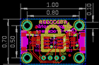
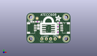
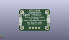
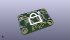

Contents
========

* [PROJ-ADAF-4314-STAN-01>Adafruit ATECC608 PCB](#proj-adaf-4314-stan-01adafruit-atecc608-pcb)
	* [Images](#images)
	* [Interactive BOM](#interactive-bom)
	* [OOMP Parts](#oomp-parts)
	* [Tags](#tags)
  
![][im]
# PROJ-ADAF-4314-STAN-01>Adafruit ATECC608 PCB

- ID: PROJ-ADAF-4314-STAN-01
- Hex ID: PRA4314
- Name: Adafruit ATECC608 PCB
- Description: 

## Images
  
  

|eagleImage|kicadPcb3dFront|kicadPcb3dBack|kicadPcb3d|
| :---: | :---: | :---: | :---: |
|||||

## Interactive BOM

- Interactive BOM page: [ibom.html](kicad/bom/ibom.html)

## OOMP Parts
  

|OOMP Parts|
| :---: |
|CAPE-0603-X-NF100-01, C1, 12.953999999999999, -2.7304999999999997, 0,C1, 0.1uF, 0603-NO, microbuilder, (0.51, -0.1075), R0|
|CAPE-0805-X-UNMATCHED-01, C2, 0.7619999999999999, -5.0165, 90,C2, 10uF, 0805-NO, microbuilder, (0.03, -0.1975), R90|
|UNMATCHED-UNMATCHED-X-UNMATCHED-01, CONN3, 16.764, -5.6514999999999995, 90,CONN3, STEMMA_I2C_QT, JST_SH4, microbuilder, (0.66, -0.2225), R90|
|UNMATCHED-UNMATCHED-X-UNMATCHED-01, CONN4, -3.556, -5.6514999999999995, 270,CONN4, STEMMA_I2C_QT, JST_SH4, microbuilder, (-0.14, -0.2225), R270|
|UNMATCHED-UNMATCHED-X-UNMATCHED-01, D1, -2.667, -1.9685, 270,D1, GREEN, CHIPLED_0603_NOOUTLINE, microbuilder, (-0.105, -0.0775), R270|
|UNMATCHED-UNMATCHED-X-UNMATCHED-01, ECC1, 6.604, -6.0325, 270,ECC1, ATECC608, SOIC8, cryptotronix, (0.26, -0.2375), R270|
|UNMATCHED-UNMATCHED-X-UNMATCHED-01, JP2, 6.604, -12.001499999999998, 0,JP2, 1X04_ROUND, microbuilder, (0.26, -0.4725), R0|
|RESE-0603-X-UNMATCHED-01, R3, 0.254, -1.9685, 0,R3, 4.7K, 0603-NO, microbuilder, (0.01, -0.0775), R0|
|<table><tr><td></td><td> R4</td><td>[RESE-0603-X-O103-01 SMD (0603) 10k Ohm Resistor](https://github.com/oomlout/oomlout_OOMP_parts/tree/main/RESE-0603-X-O103-01/)</td><td>[R6103](https://github.com/oomlout/oomlout_OOMP_parts/tree/main/RESE-0603-X-O103-01/)</td></tr></table>|
|<table><tr><td></td><td> R5</td><td>[RESE-0603-X-O103-01 SMD (0603) 10k Ohm Resistor](https://github.com/oomlout/oomlout_OOMP_parts/tree/main/RESE-0603-X-O103-01/)</td><td>[R6103](https://github.com/oomlout/oomlout_OOMP_parts/tree/main/RESE-0603-X-O103-01/)</td></tr></table>|

## Tags

- hexID: PRA4314
- oompType: PROJ
- oompSize: ADAF
- oompColor: 4314
- oompDesc: STAN
- oompIndex: 01
- oompName: Adafruit ATECC608 PCB
- sources: All source files from https://github.com/adafruit/Adafruit-ATECC608-PCB (source licence details in srcLicense.md)
- linkBuyPage: http://www.adafruit.com/products/4314
- oompPart: CAPE-0603-X-NF100-01, C1, 12.953999999999999, -2.7304999999999997, 0
- oompPart: CAPE-0805-X-UNMATCHED-01, C2, 0.7619999999999999, -5.0165, 90
- oompPart: UNMATCHED-UNMATCHED-X-UNMATCHED-01, CONN3, 16.764, -5.6514999999999995, 90
- oompPart: UNMATCHED-UNMATCHED-X-UNMATCHED-01, CONN4, -3.556, -5.6514999999999995, 270
- oompPart: UNMATCHED-UNMATCHED-X-UNMATCHED-01, D1, -2.667, -1.9685, 270
- oompPart: UNMATCHED-UNMATCHED-X-UNMATCHED-01, ECC1, 6.604, -6.0325, 270
- oompPart: SKIP-UNMATCHED-X-UNMATCHED-01, FID3, 0.0, 0.0, 0
- oompPart: SKIP-UNMATCHED-X-UNMATCHED-01, FID4, 12.953999999999999, -10.9474, 0
- oompPart: UNMATCHED-UNMATCHED-X-UNMATCHED-01, JP2, 6.604, -12.001499999999998, 0
- oompPart: RESE-0603-X-UNMATCHED-01, R3, 0.254, -1.9685, 0
- oompPart: RESE-0603-X-O103-01, R4, 12.065, -8.064499999999999, 270
- oompPart: RESE-0603-X-O103-01, R5, 12.065, -4.8895, 90
- oompPart: SKIP-UNMATCHED-X-UNMATCHED-01, U$11, -3.556, 0.6985, 0
- oompPart: SKIP-UNMATCHED-X-UNMATCHED-01, U$12, 16.764, 0.6985, 0
- oompPart: SKIP-UNMATCHED-X-UNMATCHED-01, U$14, -3.556, -12.001499999999998, 0
- oompPart: SKIP-UNMATCHED-X-UNMATCHED-01, U$15, 16.764, -12.001499999999998, 0
- rawPart: C1, 0.1uF, 0603-NO, microbuilder, (0.51, -0.1075), R0
- rawPart: C2, 10uF, 0805-NO, microbuilder, (0.03, -0.1975), R90
- rawPart: CONN3, STEMMA_I2C_QT, JST_SH4, microbuilder, (0.66, -0.2225), R90
- rawPart: CONN4, STEMMA_I2C_QT, JST_SH4, microbuilder, (-0.14, -0.2225), R270
- rawPart: D1, GREEN, CHIPLED_0603_NOOUTLINE, microbuilder, (-0.105, -0.0775), R270
- rawPart: ECC1, ATECC608, SOIC8, cryptotronix, (0.26, -0.2375), R270
- rawPart: FID3, FIDUCIAL_1MM, FIDUCIAL_1MM, microbuilder, (0, 0), R0
- rawPart: FID4, FIDUCIAL_1MM, FIDUCIAL_1MM, microbuilder, (0.51, -0.431), R0
- rawPart: JP2, 1X04_ROUND, microbuilder, (0.26, -0.4725), R0
- rawPart: R3, 4.7K, 0603-NO, microbuilder, (0.01, -0.0775), R0
- rawPart: R4, 10K, 0603-NO, microbuilder, (0.475, -0.3175), R270
- rawPart: R5, 10K, 0603-NO, microbuilder, (0.475, -0.1925), R90
- rawPart: U$11, MOUNTINGHOLE2.5, MOUNTINGHOLE_2.5_PLATED, microbuilder, (-0.14, 0.0275), R0
- rawPart: U$12, MOUNTINGHOLE2.5, MOUNTINGHOLE_2.5_PLATED, microbuilder, (0.66, 0.0275), R0
- rawPart: U$14, MOUNTINGHOLE2.5, MOUNTINGHOLE_2.5_PLATED, microbuilder, (-0.14, -0.4725), R0
- rawPart: U$15, MOUNTINGHOLE2.5, MOUNTINGHOLE_2.5_PLATED, microbuilder, (0.66, -0.4725), R0

[im]: kicadPcb3d_450.png
