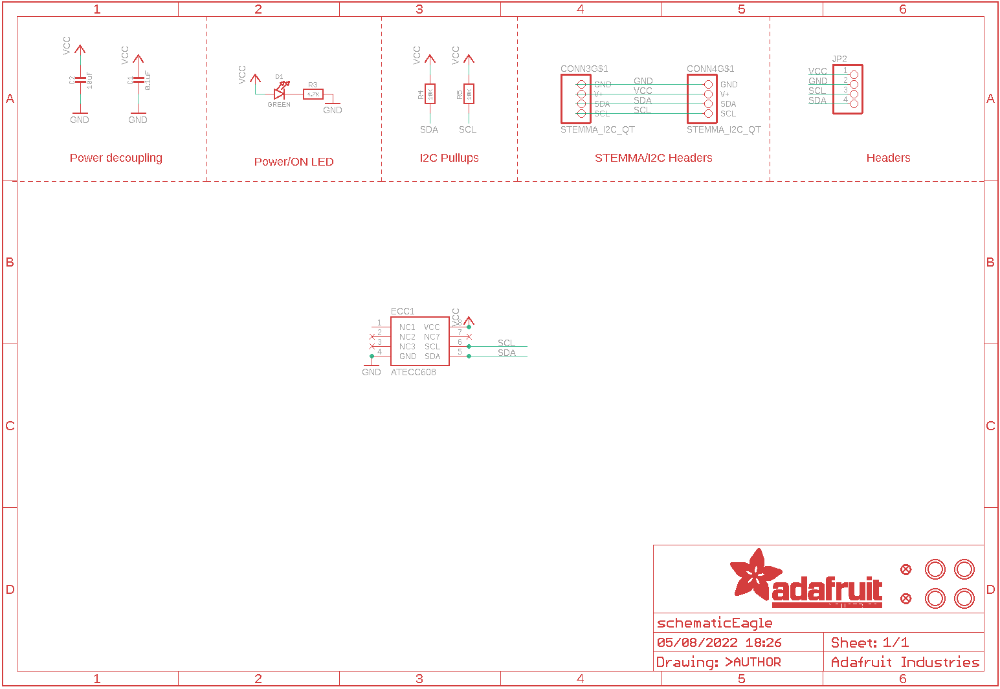
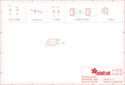

Contents
========

* [PRA4314 > Adafruit](#pra4314--adafruit)
	* [Schematic](#schematic)
	* [Interactive BOM](#interactive-bom)
	* [OOMP Parts](#oomp-parts)
	* [Images](#images)
	* [Tags](#tags)
  
![][im]
# PRA4314 > Adafruit

- ID: PROJ-ADAF-4314-STAN-01
- Hex ID: PRA4314
- Name: Adafruit
- Description: Adafruit
- Long Link: [http://oom.lt/PROJ-ADAF-4314-STAN-01](http://oom.lt/PROJ-ADAF-4314-STAN-01)
- Short Link: [http://oom.lt/PRA4314](http://oom.lt/PRA4314)

## Schematic
  

## Interactive BOM

- Interactive BOM page: [ibom.html](https://htmlpreview.github.io/?https://github.com/oomlout/oomlout_OOMP_projects/blob/main/PROJ-ADAF-4314-STAN-01/kicad/bom/ibom.html)

## OOMP Parts
  

|OOMP Parts|
| :---: |
|C1,CAPC-0603-X-NF100-V50,C1,0.1uF,CAP_CERAMIC0603_NO,0603-NO,Ceramic Capacitors,,|
|C2,CAPC-0805-X-UF10-V10,C2,10uF,CAP_CERAMIC0805-NOOUTLINE,0805-NO,Ceramic Capacitors,,|
|CONN3,UNMATCHED-UNMATCHED-X-UNMATCHED-01,CONN3,STEMMA_I2C_QT,STEMMA_I2C_QT,JST_SH4,,,|
|CONN4,UNMATCHED-UNMATCHED-X-UNMATCHED-01,CONN4,STEMMA_I2C_QT,STEMMA_I2C_QT,JST_SH4,,,|
|D1,LEDS-0603-G-STAN-01,D1,GREEN,LED0603_NOOUTLINE,CHIPLED_0603_NOOUTLINE,LED,,|
|ECC1,UNMATCHED-UNMATCHED-X-UNMATCHED-01,ECC1,ATECC608,ATECC108,SOIC8,ATECC108: Provides ECDSA with NIST curves P256, B283, and K283.  Also, a RNG, 8.5Kb EEPROM.  2.0V - 5.5V.,,|
|JP2,HEAD-I01-X-PI04-01,FID3,FIDUCIAL_1MM,FIDUCIAL_1MM,FIDUCIAL_1MM,Fiducial Alignment Points,EXCLUDE,|
|R3,RESE-0603-X-O472-01,FID4,FIDUCIAL_1MM,FIDUCIAL_1MM,FIDUCIAL_1MM,Fiducial Alignment Points,EXCLUDE,|
|R4,RESE-0603-X-O103-01,JP2,,HEADER-1X4ROUND,1X04_ROUND,PIN HEADER,,|
|R5,RESE-0603-X-O103-01,R3,4.7K,RESISTOR_0603_NOOUT,0603-NO,Resistors,,|

## Images
  
  

|kicadPcb3d|kicadPcb3dFront|kicadPcb3dBack|eagleImage|eagleSchemImage|
| :---: | :---: | :---: | :---: | :---: |
||||||

## Tags

- hexID: PRA4314
- oompType: PROJ
- oompSize: ADAF
- oompColor: 4314
- oompDesc: STAN
- oompIndex: 01
- oompName: Adafruit ATECC608 PCB
- sources: All source files from https://github.com/adafruit/Adafruit-ATECC608-PCB (source licence details in srcLicense.md)
- linkBuyPage: http://www.adafruit.com/products/4314
- oompID: PROJ-ADAF-4314-STAN-01
- oompParts: C1,CAPC-0603-X-NF100-V50
- oompParts: C2,CAPC-0805-X-UF10-V10
- oompParts: CONN3,UNMATCHED-UNMATCHED-X-UNMATCHED-01
- oompParts: CONN4,UNMATCHED-UNMATCHED-X-UNMATCHED-01
- oompParts: D1,LEDS-0603-G-STAN-01
- oompParts: ECC1,UNMATCHED-UNMATCHED-X-UNMATCHED-01
- oompParts: JP2,HEAD-I01-X-PI04-01
- oompParts: R3,RESE-0603-X-O472-01
- oompParts: R4,RESE-0603-X-O103-01
- oompParts: R5,RESE-0603-X-O103-01
- rawParts: C1,0.1uF,CAP_CERAMIC0603_NO,0603-NO,Ceramic Capacitors,,
- rawParts: C2,10uF,CAP_CERAMIC0805-NOOUTLINE,0805-NO,Ceramic Capacitors,,
- rawParts: CONN3,STEMMA_I2C_QT,STEMMA_I2C_QT,JST_SH4,,,
- rawParts: CONN4,STEMMA_I2C_QT,STEMMA_I2C_QT,JST_SH4,,,
- rawParts: D1,GREEN,LED0603_NOOUTLINE,CHIPLED_0603_NOOUTLINE,LED,,
- rawParts: ECC1,ATECC608,ATECC108,SOIC8,ATECC108: Provides ECDSA with NIST curves P256, B283, and K283.  Also, a RNG, 8.5Kb EEPROM.  2.0V - 5.5V.,,
- rawParts: FID3,FIDUCIAL_1MM,FIDUCIAL_1MM,FIDUCIAL_1MM,Fiducial Alignment Points,EXCLUDE,
- rawParts: FID4,FIDUCIAL_1MM,FIDUCIAL_1MM,FIDUCIAL_1MM,Fiducial Alignment Points,EXCLUDE,
- rawParts: JP2,,HEADER-1X4ROUND,1X04_ROUND,PIN HEADER,,
- rawParts: R3,4.7K,RESISTOR_0603_NOOUT,0603-NO,Resistors,,
- rawParts: R4,10K,RESISTOR_0603_NOOUT,0603-NO,Resistors,,
- rawParts: R5,10K,RESISTOR_0603_NOOUT,0603-NO,Resistors,,
- rawParts: U$11,MOUNTINGHOLE2.5,MOUNTINGHOLE2.5,MOUNTINGHOLE_2.5_PLATED,Mounting Hole,EXCLUDE,
- rawParts: U$12,MOUNTINGHOLE2.5,MOUNTINGHOLE2.5,MOUNTINGHOLE_2.5_PLATED,Mounting Hole,EXCLUDE,
- rawParts: U$14,MOUNTINGHOLE2.5,MOUNTINGHOLE2.5,MOUNTINGHOLE_2.5_PLATED,Mounting Hole,EXCLUDE,
- rawParts: U$15,MOUNTINGHOLE2.5,MOUNTINGHOLE2.5,MOUNTINGHOLE_2.5_PLATED,Mounting Hole,EXCLUDE,

[im]: kicadPcb3d_450.png
