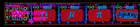

Contents
========

* [PROJ-ADAF-4319-STAN-01>Adafruit PyRuler PCB](#proj-adaf-4319-stan-01adafruit-pyruler-pcb)
	* [Images](#images)
	* [Interactive BOM](#interactive-bom)
	* [Tags](#tags)
  
![][im]
# PROJ-ADAF-4319-STAN-01>Adafruit PyRuler PCB

- ID: PROJ-ADAF-4319-STAN-01
- Hex ID: PRA4319
- Name: Adafruit PyRuler PCB
- Description: 

## Images
  
  

|eagleImage|
| :---: |
||

## Interactive BOM

- Interactive BOM page: [ibom.html](kicad/bom/ibom.html)

## Tags

- hexID: PRA4319
- oompType: PROJ
- oompSize: ADAF
- oompColor: 4319
- oompDesc: STAN
- oompIndex: 01
- oompName: Adafruit PyRuler PCB
- sources: All source files from https://github.com/adafruit/Adafruit-PyRuler-PCB (source licence details in srcLicense.md)
- linkBuyPage: http://www.adafruit.com/products/4319

[im]: eagleImage_450.png
