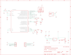

Contents
========

* [PRA4319 > Adafruit](#pra4319--adafruit)
	* [Schematic](#schematic)
	* [Interactive BOM](#interactive-bom)
	* [OOMP Parts](#oomp-parts)
	* [Images](#images)
	* [Tags](#tags)
  
![][im]
# PRA4319 > Adafruit

- ID: PROJ-ADAF-4319-STAN-01
- Hex ID: PRA4319
- Name: Adafruit
- Description: Adafruit
- Long Link: [http://oom.lt/PROJ-ADAF-4319-STAN-01](http://oom.lt/PROJ-ADAF-4319-STAN-01)
- Short Link: [http://oom.lt/PRA4319](http://oom.lt/PRA4319)

## Schematic
  

## Interactive BOM

- Interactive BOM page: [ibom.html](https://htmlpreview.github.io/?https://github.com/oomlout/oomlout_OOMP_projects/blob/main/PROJ-ADAF-4319-STAN-01/kicad/bom/ibom.html)

## OOMP Parts
  

|OOMP Parts|
| :---: |
|C1,CAPC-0805-X-UF10-V10,C1,10uF,CAP_CERAMIC0805-NOOUTLINE,0805-NO,Ceramic Capacitors,,,|
|C2,CAPC-0603-X-UF1-01,C2,1uF,CAP_CERAMIC0603_NO,0603-NO,Ceramic Capacitors,,,|
|C3,CAPC-0603-X-UF1-01,C3,1uF,CAP_CERAMIC0603_NO,0603-NO,Ceramic Capacitors,,,|
|C8,CAPC-0805-X-UF10-V10,C8,10uF,CAP_CERAMIC0805-NOOUTLINE,0805-NO,Ceramic Capacitors,,,|
|CN1,UNMATCHED-UNMATCHED-X-UNMATCHED-01,CN1,4U#20329,USB_MICRO_NARROW,4UCONN_20329_NARROW,USB Connectors,,,|
|D2,DIOD-UNMATCHED-X-UNMATCHED-01,D2,SCHOTTKY,DIODE_SOD-123FL,SOD-123FL,Diode,,,|
|D3,DIOD-UNMATCHED-X-UNMATCHED-01,D3,SCHOTTKY,DIODE_SOD-123FL,SOD-123FL,Diode,,,|
|IC3,UNMATCHED-UNMATCHED-X-UNMATCHED-01,IC3,ATSAMD21E,ATSAMD21E,QFN32_5MM,,,,|
|JP3,HEAD-I01-X-PI05-01,JP3,,HEADER-1X570MIL,1X05_ROUND_70,PIN HEADER,,,|
|JP4,HEAD-I01-X-PI05-01,JP4,,HEADER-1X570MIL,1X05_ROUND_70,PIN HEADER,,,|
|L,LEDS-0603-G-STAN-01,L,red,LED0603_NOOUTLINE,CHIPLED_0603_NOOUTLINE,LED,,,|
|L1,LEDS-0603-G-STAN-01,L1,yellow,LED0603_NOOUTLINE,CHIPLED_0603_NOOUTLINE,LED,,,|
|L2,LEDS-0603-G-STAN-01,L2,red,LED0603_NOOUTLINE,CHIPLED_0603_NOOUTLINE,LED,,,|
|L3,LEDS-0603-G-STAN-01,L3,blue,LED0603_NOOUTLINE,CHIPLED_0603_NOOUTLINE,LED,,,|
|L4,LEDS-0603-G-STAN-01,L4,green,LED0603_NOOUTLINE,CHIPLED_0603_NOOUTLINE,LED,,,|
|LED1,UNMATCHED-UNMATCHED-X-UNMATCHED-01,LED1,AP102-2020,APA1022020,APA102_2020,APA102/DotStar Pixels,,,|
|PWR,LEDS-0603-G-STAN-01,PWR,green,LED0603_NOOUTLINE,CHIPLED_0603_NOOUTLINE,LED,,,|
|Q2,UNMATCHED-UNMATCHED-X-UNMATCHED-01,Q2,reset,SWITCH_TACT_SMT4.6X2.8,BTN_KMR2_4.6X2.8,SMT Tact Switches,,,|
|R1,RESE-0603-X-UNMATCHED-01,R1,2.2K,RESISTOR_0603_NOOUT,0603-NO,Resistors,,,|
|R2,RESE-0603-X-UNMATCHED-01,R2,2.2K,RESISTOR_0603_NOOUT,0603-NO,Resistors,,,|
|R3,RESE-0603-X-UNMATCHED-01,R3,2.2K,RESISTOR_0603_NOOUT,0603-NO,Resistors,,,|
|R4,RESE-0603-X-O103-01,R4,10K,RESISTOR_0603_NOOUT,0603-NO,Resistors,,,|
|R5,RESE-0603-X-O103-01,R5,10K,RESISTOR_0603_NOOUT,0603-NO,Resistors,,,|
|R6,RESE-0603-X-O103-01,R6,10K,RESISTOR_0603_NOOUT,0603-NO,Resistors,,,|
|R7,RESE-0603-X-O205-01,R7,2M,RESISTOR_0603_NOOUT,0603-NO,Resistors,,,|
|SWC,UNMATCHED-UNMATCHED-X-UNMATCHED-01,SWC,TPB1,27,TPB1,27,B1,27,Test pad,,,|
|SWD,UNMATCHED-UNMATCHED-X-UNMATCHED-01,SWD,TPB1,27,TPB1,27,B1,27,Test pad,,,|
|U1,VREG-SO235-X-KAP2112K-V33D,U$1,FIDUCIAL_1MM,FIDUCIAL_1MM,FIDUCIAL_1MM,Fiducial Alignment Points,EXCLUDE,,|

## Images
  
  

|kicadPcb3d|kicadPcb3dFront|kicadPcb3dBack|eagleImage|eagleSchemImage|
| :---: | :---: | :---: | :---: | :---: |
||||||

## Tags

- hexID: PRA4319
- oompType: PROJ
- oompSize: ADAF
- oompColor: 4319
- oompDesc: STAN
- oompIndex: 01
- oompName: Adafruit PyRuler PCB
- sources: All source files from https://github.com/adafruit/Adafruit-PyRuler-PCB (source licence details in srcLicense.md)
- linkBuyPage: http://www.adafruit.com/products/4319
- oompID: PROJ-ADAF-4319-STAN-01
- oompParts: C1,CAPC-0805-X-UF10-V10
- oompParts: C2,CAPC-0603-X-UF1-01
- oompParts: C3,CAPC-0603-X-UF1-01
- oompParts: C8,CAPC-0805-X-UF10-V10
- oompParts: CN1,UNMATCHED-UNMATCHED-X-UNMATCHED-01
- oompParts: D2,DIOD-UNMATCHED-X-UNMATCHED-01
- oompParts: D3,DIOD-UNMATCHED-X-UNMATCHED-01
- oompParts: IC3,UNMATCHED-UNMATCHED-X-UNMATCHED-01
- oompParts: JP3,HEAD-I01-X-PI05-01
- oompParts: JP4,HEAD-I01-X-PI05-01
- oompParts: L,LEDS-0603-G-STAN-01
- oompParts: L1,LEDS-0603-G-STAN-01
- oompParts: L2,LEDS-0603-G-STAN-01
- oompParts: L3,LEDS-0603-G-STAN-01
- oompParts: L4,LEDS-0603-G-STAN-01
- oompParts: LED1,UNMATCHED-UNMATCHED-X-UNMATCHED-01
- oompParts: PWR,LEDS-0603-G-STAN-01
- oompParts: Q2,UNMATCHED-UNMATCHED-X-UNMATCHED-01
- oompParts: R1,RESE-0603-X-UNMATCHED-01
- oompParts: R2,RESE-0603-X-UNMATCHED-01
- oompParts: R3,RESE-0603-X-UNMATCHED-01
- oompParts: R4,RESE-0603-X-O103-01
- oompParts: R5,RESE-0603-X-O103-01
- oompParts: R6,RESE-0603-X-O103-01
- oompParts: R7,RESE-0603-X-O205-01
- oompParts: SWC,UNMATCHED-UNMATCHED-X-UNMATCHED-01
- oompParts: SWD,UNMATCHED-UNMATCHED-X-UNMATCHED-01
- oompParts: U1,VREG-SO235-X-KAP2112K-V33D
- rawParts: C1,10uF,CAP_CERAMIC0805-NOOUTLINE,0805-NO,Ceramic Capacitors,,,
- rawParts: C2,1uF,CAP_CERAMIC0603_NO,0603-NO,Ceramic Capacitors,,,
- rawParts: C3,1uF,CAP_CERAMIC0603_NO,0603-NO,Ceramic Capacitors,,,
- rawParts: C8,10uF,CAP_CERAMIC0805-NOOUTLINE,0805-NO,Ceramic Capacitors,,,
- rawParts: CN1,4U#20329,USB_MICRO_NARROW,4UCONN_20329_NARROW,USB Connectors,,,
- rawParts: D2,SCHOTTKY,DIODE_SOD-123FL,SOD-123FL,Diode,,,
- rawParts: D3,SCHOTTKY,DIODE_SOD-123FL,SOD-123FL,Diode,,,
- rawParts: IC3,ATSAMD21E,ATSAMD21E,QFN32_5MM,,,,
- rawParts: JP3,,HEADER-1X570MIL,1X05_ROUND_70,PIN HEADER,,,
- rawParts: JP4,,HEADER-1X570MIL,1X05_ROUND_70,PIN HEADER,,,
- rawParts: L,red,LED0603_NOOUTLINE,CHIPLED_0603_NOOUTLINE,LED,,,
- rawParts: L1,yellow,LED0603_NOOUTLINE,CHIPLED_0603_NOOUTLINE,LED,,,
- rawParts: L2,red,LED0603_NOOUTLINE,CHIPLED_0603_NOOUTLINE,LED,,,
- rawParts: L3,blue,LED0603_NOOUTLINE,CHIPLED_0603_NOOUTLINE,LED,,,
- rawParts: L4,green,LED0603_NOOUTLINE,CHIPLED_0603_NOOUTLINE,LED,,,
- rawParts: LED1,AP102-2020,APA1022020,APA102_2020,APA102/DotStar Pixels,,,
- rawParts: PWR,green,LED0603_NOOUTLINE,CHIPLED_0603_NOOUTLINE,LED,,,
- rawParts: Q2,reset,SWITCH_TACT_SMT4.6X2.8,BTN_KMR2_4.6X2.8,SMT Tact Switches,,,
- rawParts: R1,2.2K,RESISTOR_0603_NOOUT,0603-NO,Resistors,,,
- rawParts: R2,2.2K,RESISTOR_0603_NOOUT,0603-NO,Resistors,,,
- rawParts: R3,2.2K,RESISTOR_0603_NOOUT,0603-NO,Resistors,,,
- rawParts: R4,10K,RESISTOR_0603_NOOUT,0603-NO,Resistors,,,
- rawParts: R5,10K,RESISTOR_0603_NOOUT,0603-NO,Resistors,,,
- rawParts: R6,10K,RESISTOR_0603_NOOUT,0603-NO,Resistors,,,
- rawParts: R7,2M,RESISTOR_0603_NOOUT,0603-NO,Resistors,,,
- rawParts: SWC,TPB1,27,TPB1,27,B1,27,Test pad,,,
- rawParts: SWD,TPB1,27,TPB1,27,B1,27,Test pad,,,
- rawParts: U$1,FIDUCIAL_1MM,FIDUCIAL_1MM,FIDUCIAL_1MM,Fiducial Alignment Points,EXCLUDE,,
- rawParts: U$6,FIDUCIAL_1MM,FIDUCIAL_1MM,FIDUCIAL_1MM,Fiducial Alignment Points,EXCLUDE,,
- rawParts: U$8,MOUNTINGHOLE2.0,MOUNTINGHOLE2.0,MOUNTINGHOLE_2.0_PLATED,Mounting Hole,EXCLUDE,,
- rawParts: U$9,MOUNTINGHOLE2.0,MOUNTINGHOLE2.0,MOUNTINGHOLE_2.0_PLATED,Mounting Hole,EXCLUDE,,
- rawParts: U1,AP2112K-3.3,VREG_SOT23-5,SOT23-5,SOT23-5 Fixed Voltage Regulators,,,

[im]: kicadPcb3d_450.png
