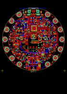
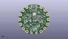
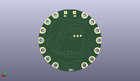
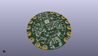

Contents
========

* [PROJ-ADAF-4333-STAN-01>Adafruit Circuit Playground Bluefruit PCB](#proj-adaf-4333-stan-01adafruit-circuit-playground-bluefruit-pcb)
	* [Images](#images)
	* [Interactive BOM](#interactive-bom)
	* [Tags](#tags)
  
![][im]
# PROJ-ADAF-4333-STAN-01>Adafruit Circuit Playground Bluefruit PCB

- ID: PROJ-ADAF-4333-STAN-01
- Hex ID: PRA4333
- Name: Adafruit Circuit Playground Bluefruit PCB
- Description: 

## Images
  
  

|eagleImage|kicadPcb3dFront|kicadPcb3dBack|kicadPcb3d|
| :---: | :---: | :---: | :---: |
|||||

## Interactive BOM

- Interactive BOM page: [ibom.html](kicad/bom/ibom.html)

## Tags

- hexID: PRA4333
- oompType: PROJ
- oompSize: ADAF
- oompColor: 4333
- oompDesc: STAN
- oompIndex: 01
- oompName: Adafruit Circuit Playground Bluefruit PCB
- sources: All source files from https://github.com/adafruit/Adafruit-Circuit-Playground-Bluefruit-PCB (source licence details in srcLicense.md)
- linkBuyPage: http://www.adafruit.com/products/4333
- oompID: PROJ-ADAF-4333-STAN-01
- oompParts: 3.3VTAP,UNMATCHED-UNMATCHED-UNMATCHED-UNMATCHED-UNMATCHED
- oompParts: 3V3TAP2,UNMATCHED-UNMATCHED-UNMATCHED-UNMATCHED-UNMATCHED
- oompParts: BATT,UNMATCHED-UNMATCHED-UNMATCHED-UNMATCHED-UNMATCHED
- oompParts: C1,UNMATCHED-UNMATCHED-UNMATCHED-UNMATCHED-UNMATCHED
- oompParts: C2,UNMATCHED-UNMATCHED-UNMATCHED-UNMATCHED-UNMATCHED
- oompParts: C3,UNMATCHED-UNMATCHED-UNMATCHED-UNMATCHED-UNMATCHED
- oompParts: C4,UNMATCHED-UNMATCHED-UNMATCHED-UNMATCHED-UNMATCHED
- oompParts: C5,UNMATCHED-UNMATCHED-UNMATCHED-UNMATCHED-UNMATCHED
- oompParts: C6,UNMATCHED-UNMATCHED-UNMATCHED-UNMATCHED-UNMATCHED
- oompParts: C7,UNMATCHED-UNMATCHED-UNMATCHED-UNMATCHED-UNMATCHED
- oompParts: C8,UNMATCHED-UNMATCHED-UNMATCHED-UNMATCHED-UNMATCHED
- oompParts: C9,UNMATCHED-UNMATCHED-UNMATCHED-UNMATCHED-UNMATCHED
- oompParts: C10,UNMATCHED-UNMATCHED-UNMATCHED-UNMATCHED-UNMATCHED
- oompParts: C11,UNMATCHED-UNMATCHED-UNMATCHED-UNMATCHED-UNMATCHED
- oompParts: C12,UNMATCHED-UNMATCHED-UNMATCHED-UNMATCHED-UNMATCHED
- oompParts: C13,UNMATCHED-UNMATCHED-UNMATCHED-UNMATCHED-UNMATCHED
- oompParts: C14,UNMATCHED-UNMATCHED-UNMATCHED-UNMATCHED-UNMATCHED
- oompParts: C15,UNMATCHED-UNMATCHED-UNMATCHED-UNMATCHED-UNMATCHED
- oompParts: C16,UNMATCHED-UNMATCHED-UNMATCHED-UNMATCHED-UNMATCHED
- oompParts: C17,UNMATCHED-UNMATCHED-UNMATCHED-UNMATCHED-UNMATCHED
- oompParts: C18,UNMATCHED-UNMATCHED-UNMATCHED-UNMATCHED-UNMATCHED
- oompParts: C19,UNMATCHED-UNMATCHED-UNMATCHED-UNMATCHED-UNMATCHED
- oompParts: C20,UNMATCHED-UNMATCHED-UNMATCHED-UNMATCHED-UNMATCHED
- oompParts: C21,UNMATCHED-UNMATCHED-UNMATCHED-UNMATCHED-UNMATCHED
- oompParts: C22,UNMATCHED-UNMATCHED-UNMATCHED-UNMATCHED-UNMATCHED
- oompParts: C23,UNMATCHED-UNMATCHED-UNMATCHED-UNMATCHED-UNMATCHED
- oompParts: C24,UNMATCHED-UNMATCHED-UNMATCHED-UNMATCHED-UNMATCHED
- oompParts: C25,UNMATCHED-UNMATCHED-UNMATCHED-UNMATCHED-UNMATCHED
- oompParts: C26,UNMATCHED-UNMATCHED-UNMATCHED-UNMATCHED-UNMATCHED
- oompParts: C27,UNMATCHED-UNMATCHED-UNMATCHED-UNMATCHED-UNMATCHED
- oompParts: CN1,UNMATCHED-UNMATCHED-UNMATCHED-UNMATCHED-UNMATCHED
- oompParts: D1,UNMATCHED-UNMATCHED-UNMATCHED-UNMATCHED-UNMATCHED
- oompParts: D2,UNMATCHED-UNMATCHED-UNMATCHED-UNMATCHED-UNMATCHED
- oompParts: D6,UNMATCHED-UNMATCHED-UNMATCHED-UNMATCHED-UNMATCHED
- oompParts: F1,UNMATCHED-UNMATCHED-UNMATCHED-UNMATCHED-UNMATCHED
- oompParts: GND3TAP,UNMATCHED-UNMATCHED-UNMATCHED-UNMATCHED-UNMATCHED
- oompParts: GNDTAP,UNMATCHED-UNMATCHED-UNMATCHED-UNMATCHED-UNMATCHED
- oompParts: GNDTAP2,UNMATCHED-UNMATCHED-UNMATCHED-UNMATCHED-UNMATCHED
- oompParts: IC1,UNMATCHED-UNMATCHED-UNMATCHED-UNMATCHED-UNMATCHED
- oompParts: IC2,UNMATCHED-UNMATCHED-UNMATCHED-UNMATCHED-UNMATCHED
- oompParts: IC3,UNMATCHED-UNMATCHED-UNMATCHED-UNMATCHED-UNMATCHED
- oompParts: IC4,UNMATCHED-UNMATCHED-UNMATCHED-UNMATCHED-UNMATCHED
- oompParts: IO9,UNMATCHED-UNMATCHED-UNMATCHED-UNMATCHED-UNMATCHED
- oompParts: IO10,UNMATCHED-UNMATCHED-UNMATCHED-UNMATCHED-UNMATCHED
- oompParts: IO12,UNMATCHED-UNMATCHED-UNMATCHED-UNMATCHED-UNMATCHED
- oompParts: L,UNMATCHED-UNMATCHED-UNMATCHED-UNMATCHED-UNMATCHED
- oompParts: L1,UNMATCHED-UNMATCHED-UNMATCHED-UNMATCHED-UNMATCHED
- oompParts: L2,UNMATCHED-UNMATCHED-UNMATCHED-UNMATCHED-UNMATCHED
- oompParts: LED1,UNMATCHED-UNMATCHED-UNMATCHED-UNMATCHED-UNMATCHED
- oompParts: LED2,UNMATCHED-UNMATCHED-UNMATCHED-UNMATCHED-UNMATCHED
- oompParts: LED3,UNMATCHED-UNMATCHED-UNMATCHED-UNMATCHED-UNMATCHED
- oompParts: LED4,UNMATCHED-UNMATCHED-UNMATCHED-UNMATCHED-UNMATCHED
- oompParts: LED5,UNMATCHED-UNMATCHED-UNMATCHED-UNMATCHED-UNMATCHED
- oompParts: LED6,UNMATCHED-UNMATCHED-UNMATCHED-UNMATCHED-UNMATCHED
- oompParts: LED7,UNMATCHED-UNMATCHED-UNMATCHED-UNMATCHED-UNMATCHED
- oompParts: LED8,UNMATCHED-UNMATCHED-UNMATCHED-UNMATCHED-UNMATCHED
- oompParts: LED9,UNMATCHED-UNMATCHED-UNMATCHED-UNMATCHED-UNMATCHED
- oompParts: LED10,UNMATCHED-UNMATCHED-UNMATCHED-UNMATCHED-UNMATCHED
- oompParts: PWR,UNMATCHED-UNMATCHED-UNMATCHED-UNMATCHED-UNMATCHED
- oompParts: Q1,UNMATCHED-UNMATCHED-UNMATCHED-UNMATCHED-UNMATCHED
- oompParts: R1,UNMATCHED-UNMATCHED-UNMATCHED-UNMATCHED-UNMATCHED
- oompParts: R2,UNMATCHED-UNMATCHED-UNMATCHED-UNMATCHED-UNMATCHED
- oompParts: R3,UNMATCHED-UNMATCHED-UNMATCHED-UNMATCHED-UNMATCHED
- oompParts: R4,UNMATCHED-UNMATCHED-UNMATCHED-UNMATCHED-UNMATCHED
- oompParts: R5,UNMATCHED-UNMATCHED-UNMATCHED-UNMATCHED-UNMATCHED
- oompParts: R6,UNMATCHED-UNMATCHED-UNMATCHED-UNMATCHED-UNMATCHED
- oompParts: R7,UNMATCHED-UNMATCHED-UNMATCHED-UNMATCHED-UNMATCHED
- oompParts: R8,UNMATCHED-UNMATCHED-UNMATCHED-UNMATCHED-UNMATCHED
- oompParts: R9,UNMATCHED-UNMATCHED-UNMATCHED-UNMATCHED-UNMATCHED
- oompParts: R10,UNMATCHED-UNMATCHED-UNMATCHED-UNMATCHED-UNMATCHED
- oompParts: R11,UNMATCHED-UNMATCHED-UNMATCHED-UNMATCHED-UNMATCHED
- oompParts: R12,UNMATCHED-UNMATCHED-UNMATCHED-UNMATCHED-UNMATCHED
- oompParts: R13,UNMATCHED-UNMATCHED-UNMATCHED-UNMATCHED-UNMATCHED
- oompParts: R14,UNMATCHED-UNMATCHED-UNMATCHED-UNMATCHED-UNMATCHED
- oompParts: R15,UNMATCHED-UNMATCHED-UNMATCHED-UNMATCHED-UNMATCHED
- oompParts: R16,UNMATCHED-UNMATCHED-UNMATCHED-UNMATCHED-UNMATCHED
- oompParts: R17,UNMATCHED-UNMATCHED-UNMATCHED-UNMATCHED-UNMATCHED
- oompParts: RESET,UNMATCHED-UNMATCHED-UNMATCHED-UNMATCHED-UNMATCHED
- oompParts: RX,UNMATCHED-UNMATCHED-UNMATCHED-UNMATCHED-UNMATCHED
- oompParts: SCL,UNMATCHED-UNMATCHED-UNMATCHED-UNMATCHED-UNMATCHED
- oompParts: SDA,UNMATCHED-UNMATCHED-UNMATCHED-UNMATCHED-UNMATCHED
- oompParts: SP1,UNMATCHED-UNMATCHED-UNMATCHED-UNMATCHED-UNMATCHED
- oompParts: SW1,UNMATCHED-UNMATCHED-UNMATCHED-UNMATCHED-UNMATCHED
- oompParts: SW2,UNMATCHED-UNMATCHED-UNMATCHED-UNMATCHED-UNMATCHED
- oompParts: SWITCH,UNMATCHED-UNMATCHED-UNMATCHED-UNMATCHED-UNMATCHED
- oompParts: THM1,UNMATCHED-UNMATCHED-UNMATCHED-UNMATCHED-UNMATCHED
- oompParts: TP1,UNMATCHED-UNMATCHED-UNMATCHED-UNMATCHED-UNMATCHED
- oompParts: TP2,UNMATCHED-UNMATCHED-UNMATCHED-UNMATCHED-UNMATCHED
- oompParts: TP3,UNMATCHED-UNMATCHED-UNMATCHED-UNMATCHED-UNMATCHED
- oompParts: TX,UNMATCHED-UNMATCHED-UNMATCHED-UNMATCHED-UNMATCHED
- oompParts: U2,UNMATCHED-UNMATCHED-UNMATCHED-UNMATCHED-UNMATCHED
- oompParts: U3,UNMATCHED-UNMATCHED-UNMATCHED-UNMATCHED-UNMATCHED
- oompParts: U4,UNMATCHED-UNMATCHED-UNMATCHED-UNMATCHED-UNMATCHED
- oompParts: VCC2,UNMATCHED-UNMATCHED-UNMATCHED-UNMATCHED-UNMATCHED
- oompParts: X1,UNMATCHED-UNMATCHED-UNMATCHED-UNMATCHED-UNMATCHED
- oompParts: Y1,UNMATCHED-UNMATCHED-UNMATCHED-UNMATCHED-UNMATCHED
- rawParts: 3.3VTAP,SEWTAP-ALLIGATOR,SEWTAP-ALLIGATOR,SEWALLI,,,
- rawParts: 3V3TAP2,SEWTAP-ALLIGATOR,SEWTAP-ALLIGATOR,SEWALLI,,,
- rawParts: BATT,3-6VDC,CON_JST_PH_2PIN,JSTPH2,JST 2-Pin Right-Angle Connector,,
- rawParts: C1,1pF NP0,CAPACITOR_0402_N,RESC0402_N,Generic chip capacitor,,
- rawParts: C2,1uF,CAP_CERAMIC0603_NO,0603-NO,Ceramic Capacitors,,
- rawParts: C3,1uF,CAP_CERAMIC0603_NO,0603-NO,Ceramic Capacitors,,
- rawParts: C4,10uF,CAP_CERAMIC0805-NOOUTLINE,0805-NO,Ceramic Capacitors,,
- rawParts: C5,1uF,CAP_CERAMIC0603_NO,0603-NO,Ceramic Capacitors,,
- rawParts: C6,1uF,CAP_CERAMIC0603_NO,0603-NO,Ceramic Capacitors,,
- rawParts: C7,0.1uF X7R 10%,CAP_CERAMIC0603_NO,0603-NO,Ceramic Capacitors,,
- rawParts: C8,10uF,CAP_CERAMIC0805-NOOUTLINE,0805-NO,Ceramic Capacitors,,
- rawParts: C9,0.1uF,CAP_CERAMIC0603_NO,0603-NO,Ceramic Capacitors,,
- rawParts: C10,1pF NP0,CAPACITOR_0402_N,RESC0402_N,Generic chip capacitor,,
- rawParts: C11,1pF NP0,CAPACITOR_0402_N,RESC0402_N,Generic chip capacitor,,
- rawParts: C12,12pF,CAPACITOR_0402_N,RESC0402_N,Generic chip capacitor,,
- rawParts: C13,12pF,CAPACITOR_0402_N,RESC0402_N,Generic chip capacitor,,
- rawParts: C14,100pF NP0 5%,CAPACITOR_0402_N,RESC0402_N,Generic chip capacitor,,
- rawParts: C15,820pF NP0 5%,CAPACITOR_0402_N,RESC0402_N,Generic chip capacitor,,
- rawParts: C16,0.1uF X7R 10%,CAP_CERAMIC0603_NO,0603-NO,Ceramic Capacitors,,
- rawParts: C17,1pF NP0,CAPACITOR_0402_N,RESC0402_N,Generic chip capacitor,,
- rawParts: C18,1uF,CAP_CERAMIC0603_NO,0603-NO,Ceramic Capacitors,,
- rawParts: C19,10uF X5R,CAPACITOR_0805_N,RESC0805_N,Generic chip capacitor,,
- rawParts: C20,0.1uF X7R 10%,CAP_CERAMIC0603_NO,0603-NO,Ceramic Capacitors,,
- rawParts: C21,0.1uF X7R 10%,CAPACITOR_0603_L,RESC0603_L,Generic chip capacitor,,
- rawParts: C22,4.7uF X7S 10%,CAPACITOR_0805_N,RESC0805_N,Generic chip capacitor,,
- rawParts: C23,10uF X5R,CAPACITOR_0805_N,RESC0805_N,Generic chip capacitor,,
- rawParts: C24,1uF X7R 10%,CAPACITOR_0603_N,RESC0603_N,Generic chip capacitor,,
- rawParts: C25,1uF X7R 10%,CAPACITOR_0603_N,RESC0603_N,Generic chip capacitor,,
- rawParts: C26,10uF,CAP_CERAMIC0805-NOOUTLINE,0805-NO,Ceramic Capacitors,,
- rawParts: C27,10uF,CAP_CERAMIC0805-NOOUTLINE,0805-NO,Ceramic Capacitors,,
- rawParts: CN1,MicroB USB,USB_MICRO_20329_V2,4UCONN_20329_V2,USB Connectors,,
- rawParts: D1,MBR120,DIODESOD-123,SOD-123,Diode,,
- rawParts: D2,MBR120,DIODESOD-123,SOD-123,Diode,,
- rawParts: D6,SEWTAP-ALLIGATOR,SEWTAP-ALLIGATOR,SEWALLI,,,
- rawParts: F1,6V+ 500mA,PTCFUSE-1206,R1206,PTC fuses, resettable thermistors,,
- rawParts: GND3TAP,SEWTAP-ALLIGATOR,SEWTAP-ALLIGATOR,SEWALLI,,,
- rawParts: GNDTAP,SEWTAP-ALLIGATOR,SEWTAP-ALLIGATOR,SEWALLI,,,
- rawParts: GNDTAP2,SEWTAP-ALLIGATOR,SEWTAP-ALLIGATOR,SEWALLI,,,
- rawParts: IC1,MIC_PDM,MIC_PDM_SPK0415,SPK0415HM4H,,,
- rawParts: IC2,PAM8301,PAM8301,SOT23-6,,,
- rawParts: IC3,GD25Q16,SPIFLASH_8PINUX,USON8,SOIC8 SPI Flash,,
- rawParts: IC4,LIS3DH,ACCEL_LIS3DHTR,LGA16_3X3MM,LIS3DHTR 3-Axis Accelerometer with I2C/SPI Interface,,
- rawParts: IO9,SEWTAP-ALLIGATOR,SEWTAP-ALLIGATOR,SEWALLI,,,
- rawParts: IO10,SEWTAP-ALLIGATOR,SEWTAP-ALLIGATOR,SEWALLI,,,
- rawParts: IO12,SEWTAP-ALLIGATOR,SEWTAP-ALLIGATOR,SEWALLI,,,
- rawParts: L,RED,LED0603_NOOUTLINE,CHIPLED_0603_NOOUTLINE,LED,,
- rawParts: L1,3.9nH,INDUCTOR_0402_N,RESC0402_N,Generic chip inductor,,
- rawParts: L2,3.9nH,INDUCTOR_0402_N,RESC0402_N,Generic chip inductor,,
- rawParts: LED1,WS2812B3535,WS2812B3535,LED3535,,,
- rawParts: LED2,WS2812B3535,WS2812B3535,LED3535,,,
- rawParts: LED3,WS2812B3535,WS2812B3535,LED3535,,,
- rawParts: LED4,WS2812B3535,WS2812B3535,LED3535,,,
- rawParts: LED5,WS2812B3535,WS2812B3535,LED3535,,,
- rawParts: LED6,WS2812B3535,WS2812B3535,LED3535,,,
- rawParts: LED7,WS2812B3535,WS2812B3535,LED3535,,,
- rawParts: LED8,WS2812B3535,WS2812B3535,LED3535,,,
- rawParts: LED9,WS2812B3535,WS2812B3535,LED3535,,,
- rawParts: LED10,WS2812B3535,WS2812B3535,LED3535,,,
- rawParts: PWR,GREEN,LED0603_NOOUTLINE,CHIPLED_0603_NOOUTLINE,LED,,
- rawParts: Q1,DMG3405,MOSFET-P,SOT23-R,P-Channel Mosfet,,
- rawParts: R1,47K,RESISTOR_0603_NOOUT,0603-NO,Resistors,,
- rawParts: R2,10K,RESISTOR_0603_NOOUT,0603-NO,Resistors,,
- rawParts: R3,10K,RESISTOR_0603_NOOUT,0603-NO,Resistors,,
- rawParts: R4,10K,RESISTOR_0603_NOOUT,0603-NO,Resistors,,
- rawParts: R5,4.7K,RESISTOR_0603_NOOUT,0603-NO,Resistors,,
- rawParts: R6,10K,RESISTOR_0603_NOOUT,0603-NO,Resistors,,
- rawParts: R7,10K,RESISTOR_0603_NOOUT,0603-NO,Resistors,,
- rawParts: R8,1M,RESISTOR_0603_NOOUT,0603-NO,Resistors,,
- rawParts: R9,1M,RESISTOR_0603_NOOUT,0603-NO,Resistors,,
- rawParts: R10,100K,RESISTOR_0603_NOOUT,0603-NO,Resistors,,
- rawParts: R11,1M,RESISTOR_0603_NOOUT,0603-NO,Resistors,,
- rawParts: R12,1M,RESISTOR_0603_NOOUT,0603-NO,Resistors,,
- rawParts: R13,1M,RESISTOR_0603_NOOUT,0603-NO,Resistors,,
- rawParts: R14,1M,RESISTOR_0603_NOOUT,0603-NO,Resistors,,
- rawParts: R15,1M,RESISTOR_0603_NOOUT,0603-NO,Resistors,,
- rawParts: R16,1M,RESISTOR_0603_NOOUT,0603-NO,Resistors,,
- rawParts: R17,100K,RESISTOR_0603_NOOUT,0603-NO,Resistors,,
- rawParts: RESET,KMR2,SWITCH_TACT_SMT4.6X2.8,BTN_KMR2_4.6X2.8,SMT Tact Switches,,
- rawParts: RX,SEWTAP-ALLIGATOR,SEWTAP-ALLIGATOR,SEWALLI,,,
- rawParts: SCL,SEWTAP-ALLIGATOR,SEWTAP-ALLIGATOR,SEWALLI,,,
- rawParts: SDA,SEWTAP-ALLIGATOR,SEWTAP-ALLIGATOR,SEWALLI,,,
- rawParts: SP1,7.5mm SPK,SPEAKER_7.5MM,BUZZER_SMT_7.5MM,SPEAKER Source: BuerklinAdded PS12 (for part # PS1240 piezo) http://www.ladyada.net/library/pcb/eaglelibrary.html,,
- rawParts: SW1,EVQQ,SWITCH_TACT_SMT_EVQQ2_SMALL,EVQ-Q2_SMALLER,SMT Tact Switches,,
- rawParts: SW2,EVQQ,SWITCH_TACT_SMT_EVQQ2_SMALL,EVQ-Q2_SMALLER,SMT Tact Switches,,
- rawParts: SWITCH,EG1390,DPDT-EG1390,EG1390,,,
- rawParts: THM1,THERM,RESISTOR_0402,_0402,Resistors,,
- rawParts: TP1,,TESTPOINTROUND1.5MMNO,TESTPOINT_ROUND_1.5MM_NO,Test Point,,
- rawParts: TP2,,TESTPOINTROUND1.5MMNO,TESTPOINT_ROUND_1.5MM_NO,Test Point,,
- rawParts: TP3,,TESTPOINTROUND1.5MMNO,TESTPOINT_ROUND_1.5MM_NO,Test Point,,
- rawParts: TX,SEWTAP-ALLIGATOR,SEWTAP-ALLIGATOR,SEWALLI,,,
- rawParts: U$2,FIDUCIAL_1MM,FIDUCIAL_1MM,FIDUCIAL_1MM,Fiducial Alignment Points,EXCLUDE,
- rawParts: U$3,FIDUCIAL_1MM,FIDUCIAL_1MM,FIDUCIAL_1MM,Fiducial Alignment Points,EXCLUDE,
- rawParts: U$6,FIDUCIAL_1MM,FIDUCIAL_1MM,FIDUCIAL_1MM,Fiducial Alignment Points,EXCLUDE,
- rawParts: U2,ALS-PT19-315C,PHOTOTRANSISTOR_PT19-315C,ALS-PT19-315C,ALS-PT19-315C - Analog Light Sensor,,
- rawParts: U3,AP2112K-3.3,VREG_SOT23-5,SOT23-5,SOT23-5 Fixed Voltage Regulators,,
- rawParts: U4,NRF52840,NRF52840_CPB_SMALLCENTER,AQFN50P700X800X85_HS-74N_SMALLCENTER,nRF52840,,
- rawParts: VCC2,SEWTAP-ALLIGATOR,SEWTAP-ALLIGATOR,SEWALLI,,,
- rawParts: X1,2450AT18B100,ANTENNA_JOHANSON_2450AT18B100,ANT_2450AT18B100,Johanson 2.4GHz Chip Antenna (1206 Package),,
- rawParts: Y1,32MHz,CRYSTAL_2X1.6MM,CRYSTAL_2X1.6,Crystals,,

[im]: kicadPcb3d_450.png
