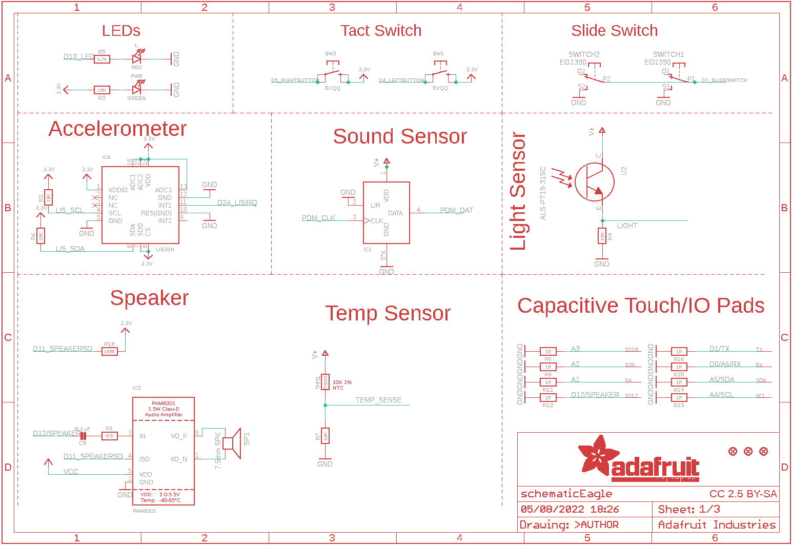
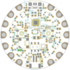
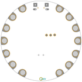
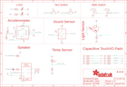
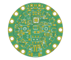
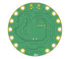

Contents
========

* [PRA4333 > Adafruit Circuit Playground Bluefruit PCB](#pra4333--adafruit-circuit-playground-bluefruit-pcb)
	* [Schematic](#schematic)
	* [PCB](#pcb)
	* [Interactive BOM](#interactive-bom)
	* [OOMP Parts](#oomp-parts)
	* [Images](#images)
	* [Tags](#tags)
  
![][im]
# PRA4333 > Adafruit Circuit Playground Bluefruit PCB

- ID: PROJ-ADAF-4333-STAN-01
- Hex ID: PRA4333
- Name: Adafruit
- Description: Adafruit
- Long Link: [http://oom.lt/PROJ-ADAF-4333-STAN-01](http://oom.lt/PROJ-ADAF-4333-STAN-01)
- Short Link: [http://oom.lt/PRA4333](http://oom.lt/PRA4333)

## Schematic
  

## PCB
  

## Interactive BOM

- Interactive BOM page: [ibom.html](https://htmlpreview.github.io/?https://github.com/oomlout/oomlout_OOMP_projects/blob/main/PROJ-ADAF-4333-STAN-01/kicad/bom/ibom.html)

## OOMP Parts
  

|OOMP Parts|
| :---: |
|UNMATCHED-UNMATCHED-X-UNMATCHED-01 BATT, CN1, IC1, IC3, IC4, SP1, SWITCH, U2, U4, X1, Y1|
|CAPC-0402-X-UNMATCHED-01 C1, C10, C11, C14, C15, C17|
|[CAPC-0603-X-UF1-V25  SMD (0603) 1 uF Capacitor (Ceramic) 25v  C2, C3, C5, C6, C18](https://github.com/oomlout/oomlout_OOMP_parts/tree/main/CAPC-0603-X-UF1-V25/)|
|[CAPC-0805-X-UF10-V10  SMD (0805) 10 uF Capacitor (Ceramic) 10v  C4, C8, C26, C27](https://github.com/oomlout/oomlout_OOMP_parts/tree/main/CAPC-0805-X-UF10-V10/)|
|[CAPC-0603-X-NF100-V50  SMD (0603) 100 nF Capacitor (Ceramic) 50v  C7, C9, C16, C20, C21](https://github.com/oomlout/oomlout_OOMP_parts/tree/main/CAPC-0603-X-NF100-V50/)|
|[CAPC-0402-X-PF12-V50  SMD (0402) 12 pF Capacitor (Ceramic) 50v  C12, C13](https://github.com/oomlout/oomlout_OOMP_parts/tree/main/CAPC-0402-X-PF12-V50/)|
|CAPC-0805-X-UNMATCHED-01 C19, C22, C23|
|CAPC-0603-X-UNMATCHED-01 C24, C25|
|[DIOD-S123-X-KMBR120-01  SMD (SOD-123) MBR120 Diode  D1, D2](https://github.com/oomlout/oomlout_OOMP_parts/tree/main/DIOD-S123-X-KMBR120-01/)|
|UNMATCHED-1206-X-UNMATCHED-01 F1|
|UNMATCHED-SO23-X-UNMATCHED-01 IC2|
|[LEDS-0603-R-STAN-01  SMD (0603) Red LED  L](https://github.com/oomlout/oomlout_OOMP_parts/tree/main/LEDS-0603-R-STAN-01/)|
|UNMATCHED-0402-X-UNMATCHED-01 L1, L2, THM1|
|[LEDS-3535-RGB-K2812-01  SMD (3535) Smart Controller (WS2812B) RGB LED  LED1, LED2, LED3, LED4, LED5, LED6, LED7, LED8, LED9, LED10](https://github.com/oomlout/oomlout_OOMP_parts/tree/main/LEDS-3535-RGB-K2812-01/)|
|[LEDS-0603-G-STAN-01  SMD (0603) Green LED  PWR](https://github.com/oomlout/oomlout_OOMP_parts/tree/main/LEDS-0603-G-STAN-01/)|
|MOSP-SO23-X-UNMATCHED-01 Q1|
|[RESE-0603-X-O473-01  SMD (0603) 47k Ohm Resistor  R1](https://github.com/oomlout/oomlout_OOMP_parts/tree/main/RESE-0603-X-O473-01/)|
|[RESE-0603-X-O103-01  SMD (0603) 10k Ohm Resistor  R2, R3, R4, R6, R7](https://github.com/oomlout/oomlout_OOMP_parts/tree/main/RESE-0603-X-O103-01/)|
|[RESE-0603-X-O472-01  SMD (0603) 4.7k Ohm Resistor  R5](https://github.com/oomlout/oomlout_OOMP_parts/tree/main/RESE-0603-X-O472-01/)|
|[RESE-0603-X-O105-01  SMD (0603) 1M Ohm Resistor  R8, R9, R11, R12, R13, R14, R15, R16](https://github.com/oomlout/oomlout_OOMP_parts/tree/main/RESE-0603-X-O105-01/)|
|RESE-0603-X-O1003-01 R10, R17|
|[BUTA-4628-X-STAN-01  SMD (4628) Pushbutton (Tactile)  RESET](https://github.com/oomlout/oomlout_OOMP_parts/tree/main/BUTA-4628-X-STAN-01/)|
|[BUTA-6060-X-STAN-01  SMD (6060) Pushbutton (Tactile)  SW1, SW2](https://github.com/oomlout/oomlout_OOMP_parts/tree/main/BUTA-6060-X-STAN-01/)|
|[VREG-SO235-X-KAP2112K-V33D  SMD (SOT-23-5) AP2112K Voltage Regulator 3.3v  U3](https://github.com/oomlout/oomlout_OOMP_parts/tree/main/VREG-SO235-X-KAP2112K-V33D/)|

## Images
  
  

|bominteractivefront|bominteractiveback|kicadPcb3d|kicadPcb3dFront|kicadPcb3dBack|eagleImage|eagleSchemImage|pcbdraw|pcbdrawback|
| :---: | :---: | :---: | :---: | :---: | :---: | :---: | :---: | :---: |
||||||||||

## Tags

- hexID: PRA4333
- oompType: PROJ
- oompSize: ADAF
- oompColor: 4333
- oompDesc: STAN
- oompIndex: 01
- oompName: Adafruit Circuit Playground Bluefruit PCB
- sources: All source files from https://github.com/adafruit/Adafruit-Circuit-Playground-Bluefruit-PCB (source licence details in srcLicense.md)
- linkBuyPage: http://www.adafruit.com/products/4333
- oompID: PROJ-ADAF-4333-STAN-01
- oompParts: BATT,UNMATCHED-UNMATCHED-X-UNMATCHED-01
- oompParts: C1,CAPC-0402-X-UNMATCHED-01
- oompParts: C2,CAPC-0603-X-UF1-V25
- oompParts: C3,CAPC-0603-X-UF1-V25
- oompParts: C4,CAPC-0805-X-UF10-V10
- oompParts: C5,CAPC-0603-X-UF1-V25
- oompParts: C6,CAPC-0603-X-UF1-V25
- oompParts: C7,CAPC-0603-X-NF100-V50
- oompParts: C8,CAPC-0805-X-UF10-V10
- oompParts: C9,CAPC-0603-X-NF100-V50
- oompParts: C10,CAPC-0402-X-UNMATCHED-01
- oompParts: C11,CAPC-0402-X-UNMATCHED-01
- oompParts: C12,CAPC-0402-X-PF12-V50
- oompParts: C13,CAPC-0402-X-PF12-V50
- oompParts: C14,CAPC-0402-X-UNMATCHED-01
- oompParts: C15,CAPC-0402-X-UNMATCHED-01
- oompParts: C16,CAPC-0603-X-NF100-V50
- oompParts: C17,CAPC-0402-X-UNMATCHED-01
- oompParts: C18,CAPC-0603-X-UF1-V25
- oompParts: C19,CAPC-0805-X-UNMATCHED-01
- oompParts: C20,CAPC-0603-X-NF100-V50
- oompParts: C21,CAPC-0603-X-NF100-V50
- oompParts: C22,CAPC-0805-X-UNMATCHED-01
- oompParts: C23,CAPC-0805-X-UNMATCHED-01
- oompParts: C24,CAPC-0603-X-UNMATCHED-01
- oompParts: C25,CAPC-0603-X-UNMATCHED-01
- oompParts: C26,CAPC-0805-X-UF10-V10
- oompParts: C27,CAPC-0805-X-UF10-V10
- oompParts: CN1,UNMATCHED-UNMATCHED-X-UNMATCHED-01
- oompParts: D1,DIOD-S123-X-KMBR120-01
- oompParts: D2,DIOD-S123-X-KMBR120-01
- oompParts: F1,UNMATCHED-1206-X-UNMATCHED-01
- oompParts: IC1,UNMATCHED-UNMATCHED-X-UNMATCHED-01
- oompParts: IC2,UNMATCHED-SO23-X-UNMATCHED-01
- oompParts: IC3,UNMATCHED-UNMATCHED-X-UNMATCHED-01
- oompParts: IC4,UNMATCHED-UNMATCHED-X-UNMATCHED-01
- oompParts: L,LEDS-0603-R-STAN-01
- oompParts: L1,UNMATCHED-0402-X-UNMATCHED-01
- oompParts: L2,UNMATCHED-0402-X-UNMATCHED-01
- oompParts: LED1,LEDS-3535-RGB-K2812-01
- oompParts: LED2,LEDS-3535-RGB-K2812-01
- oompParts: LED3,LEDS-3535-RGB-K2812-01
- oompParts: LED4,LEDS-3535-RGB-K2812-01
- oompParts: LED5,LEDS-3535-RGB-K2812-01
- oompParts: LED6,LEDS-3535-RGB-K2812-01
- oompParts: LED7,LEDS-3535-RGB-K2812-01
- oompParts: LED8,LEDS-3535-RGB-K2812-01
- oompParts: LED9,LEDS-3535-RGB-K2812-01
- oompParts: LED10,LEDS-3535-RGB-K2812-01
- oompParts: PWR,LEDS-0603-G-STAN-01
- oompParts: Q1,MOSP-SO23-X-UNMATCHED-01
- oompParts: R1,RESE-0603-X-O473-01
- oompParts: R2,RESE-0603-X-O103-01
- oompParts: R3,RESE-0603-X-O103-01
- oompParts: R4,RESE-0603-X-O103-01
- oompParts: R5,RESE-0603-X-O472-01
- oompParts: R6,RESE-0603-X-O103-01
- oompParts: R7,RESE-0603-X-O103-01
- oompParts: R8,RESE-0603-X-O105-01
- oompParts: R9,RESE-0603-X-O105-01
- oompParts: R10,RESE-0603-X-O1003-01
- oompParts: R11,RESE-0603-X-O105-01
- oompParts: R12,RESE-0603-X-O105-01
- oompParts: R13,RESE-0603-X-O105-01
- oompParts: R14,RESE-0603-X-O105-01
- oompParts: R15,RESE-0603-X-O105-01
- oompParts: R16,RESE-0603-X-O105-01
- oompParts: R17,RESE-0603-X-O1003-01
- oompParts: RESET,BUTA-4628-X-STAN-01
- oompParts: SP1,UNMATCHED-UNMATCHED-X-UNMATCHED-01
- oompParts: SW1,BUTA-6060-X-STAN-01
- oompParts: SW2,BUTA-6060-X-STAN-01
- oompParts: SWITCH,UNMATCHED-UNMATCHED-X-UNMATCHED-01
- oompParts: THM1,UNMATCHED-0402-X-UNMATCHED-01
- oompParts: U2,UNMATCHED-UNMATCHED-X-UNMATCHED-01
- oompParts: U3,VREG-SO235-X-KAP2112K-V33D
- oompParts: U4,UNMATCHED-UNMATCHED-X-UNMATCHED-01
- oompParts: X1,UNMATCHED-UNMATCHED-X-UNMATCHED-01
- oompParts: Y1,UNMATCHED-UNMATCHED-X-UNMATCHED-01
- rawParts: 3.3VTAP,SEWTAP-ALLIGATOR,SEWTAP-ALLIGATOR,SEWALLI,,,
- rawParts: 3V3TAP2,SEWTAP-ALLIGATOR,SEWTAP-ALLIGATOR,SEWALLI,,,
- rawParts: BATT,3-6VDC,CON_JST_PH_2PIN,JSTPH2,JST 2-Pin Right-Angle Connector,,
- rawParts: C1,1pF NP0,CAPACITOR_0402_N,RESC0402_N,Generic chip capacitor,,
- rawParts: C2,1uF,CAP_CERAMIC0603_NO,0603-NO,Ceramic Capacitors,,
- rawParts: C3,1uF,CAP_CERAMIC0603_NO,0603-NO,Ceramic Capacitors,,
- rawParts: C4,10uF,CAP_CERAMIC0805-NOOUTLINE,0805-NO,Ceramic Capacitors,,
- rawParts: C5,1uF,CAP_CERAMIC0603_NO,0603-NO,Ceramic Capacitors,,
- rawParts: C6,1uF,CAP_CERAMIC0603_NO,0603-NO,Ceramic Capacitors,,
- rawParts: C7,0.1uF X7R 10%,CAP_CERAMIC0603_NO,0603-NO,Ceramic Capacitors,,
- rawParts: C8,10uF,CAP_CERAMIC0805-NOOUTLINE,0805-NO,Ceramic Capacitors,,
- rawParts: C9,0.1uF,CAP_CERAMIC0603_NO,0603-NO,Ceramic Capacitors,,
- rawParts: C10,1pF NP0,CAPACITOR_0402_N,RESC0402_N,Generic chip capacitor,,
- rawParts: C11,1pF NP0,CAPACITOR_0402_N,RESC0402_N,Generic chip capacitor,,
- rawParts: C12,12pF,CAPACITOR_0402_N,RESC0402_N,Generic chip capacitor,,
- rawParts: C13,12pF,CAPACITOR_0402_N,RESC0402_N,Generic chip capacitor,,
- rawParts: C14,100pF NP0 5%,CAPACITOR_0402_N,RESC0402_N,Generic chip capacitor,,
- rawParts: C15,820pF NP0 5%,CAPACITOR_0402_N,RESC0402_N,Generic chip capacitor,,
- rawParts: C16,0.1uF X7R 10%,CAP_CERAMIC0603_NO,0603-NO,Ceramic Capacitors,,
- rawParts: C17,1pF NP0,CAPACITOR_0402_N,RESC0402_N,Generic chip capacitor,,
- rawParts: C18,1uF,CAP_CERAMIC0603_NO,0603-NO,Ceramic Capacitors,,
- rawParts: C19,10uF X5R,CAPACITOR_0805_N,RESC0805_N,Generic chip capacitor,,
- rawParts: C20,0.1uF X7R 10%,CAP_CERAMIC0603_NO,0603-NO,Ceramic Capacitors,,
- rawParts: C21,0.1uF X7R 10%,CAPACITOR_0603_L,RESC0603_L,Generic chip capacitor,,
- rawParts: C22,4.7uF X7S 10%,CAPACITOR_0805_N,RESC0805_N,Generic chip capacitor,,
- rawParts: C23,10uF X5R,CAPACITOR_0805_N,RESC0805_N,Generic chip capacitor,,
- rawParts: C24,1uF X7R 10%,CAPACITOR_0603_N,RESC0603_N,Generic chip capacitor,,
- rawParts: C25,1uF X7R 10%,CAPACITOR_0603_N,RESC0603_N,Generic chip capacitor,,
- rawParts: C26,10uF,CAP_CERAMIC0805-NOOUTLINE,0805-NO,Ceramic Capacitors,,
- rawParts: C27,10uF,CAP_CERAMIC0805-NOOUTLINE,0805-NO,Ceramic Capacitors,,
- rawParts: CN1,MicroB USB,USB_MICRO_20329_V2,4UCONN_20329_V2,USB Connectors,,
- rawParts: D1,MBR120,DIODESOD-123,SOD-123,Diode,,
- rawParts: D2,MBR120,DIODESOD-123,SOD-123,Diode,,
- rawParts: D6,SEWTAP-ALLIGATOR,SEWTAP-ALLIGATOR,SEWALLI,,,
- rawParts: F1,6V+ 500mA,PTCFUSE-1206,R1206,PTC fuses, resettable thermistors,,
- rawParts: GND3TAP,SEWTAP-ALLIGATOR,SEWTAP-ALLIGATOR,SEWALLI,,,
- rawParts: GNDTAP,SEWTAP-ALLIGATOR,SEWTAP-ALLIGATOR,SEWALLI,,,
- rawParts: GNDTAP2,SEWTAP-ALLIGATOR,SEWTAP-ALLIGATOR,SEWALLI,,,
- rawParts: IC1,MIC_PDM,MIC_PDM_SPK0415,SPK0415HM4H,,,
- rawParts: IC2,PAM8301,PAM8301,SOT23-6,,,
- rawParts: IC3,GD25Q16,SPIFLASH_8PINUX,USON8,SOIC8 SPI Flash,,
- rawParts: IC4,LIS3DH,ACCEL_LIS3DHTR,LGA16_3X3MM,LIS3DHTR 3-Axis Accelerometer with I2C/SPI Interface,,
- rawParts: IO9,SEWTAP-ALLIGATOR,SEWTAP-ALLIGATOR,SEWALLI,,,
- rawParts: IO10,SEWTAP-ALLIGATOR,SEWTAP-ALLIGATOR,SEWALLI,,,
- rawParts: IO12,SEWTAP-ALLIGATOR,SEWTAP-ALLIGATOR,SEWALLI,,,
- rawParts: L,RED,LED0603_NOOUTLINE,CHIPLED_0603_NOOUTLINE,LED,,
- rawParts: L1,3.9nH,INDUCTOR_0402_N,RESC0402_N,Generic chip inductor,,
- rawParts: L2,3.9nH,INDUCTOR_0402_N,RESC0402_N,Generic chip inductor,,
- rawParts: LED1,WS2812B3535,WS2812B3535,LED3535,,,
- rawParts: LED2,WS2812B3535,WS2812B3535,LED3535,,,
- rawParts: LED3,WS2812B3535,WS2812B3535,LED3535,,,
- rawParts: LED4,WS2812B3535,WS2812B3535,LED3535,,,
- rawParts: LED5,WS2812B3535,WS2812B3535,LED3535,,,
- rawParts: LED6,WS2812B3535,WS2812B3535,LED3535,,,
- rawParts: LED7,WS2812B3535,WS2812B3535,LED3535,,,
- rawParts: LED8,WS2812B3535,WS2812B3535,LED3535,,,
- rawParts: LED9,WS2812B3535,WS2812B3535,LED3535,,,
- rawParts: LED10,WS2812B3535,WS2812B3535,LED3535,,,
- rawParts: PWR,GREEN,LED0603_NOOUTLINE,CHIPLED_0603_NOOUTLINE,LED,,
- rawParts: Q1,DMG3405,MOSFET-P,SOT23-R,P-Channel Mosfet,,
- rawParts: R1,47K,RESISTOR_0603_NOOUT,0603-NO,Resistors,,
- rawParts: R2,10K,RESISTOR_0603_NOOUT,0603-NO,Resistors,,
- rawParts: R3,10K,RESISTOR_0603_NOOUT,0603-NO,Resistors,,
- rawParts: R4,10K,RESISTOR_0603_NOOUT,0603-NO,Resistors,,
- rawParts: R5,4.7K,RESISTOR_0603_NOOUT,0603-NO,Resistors,,
- rawParts: R6,10K,RESISTOR_0603_NOOUT,0603-NO,Resistors,,
- rawParts: R7,10K,RESISTOR_0603_NOOUT,0603-NO,Resistors,,
- rawParts: R8,1M,RESISTOR_0603_NOOUT,0603-NO,Resistors,,
- rawParts: R9,1M,RESISTOR_0603_NOOUT,0603-NO,Resistors,,
- rawParts: R10,100K,RESISTOR_0603_NOOUT,0603-NO,Resistors,,
- rawParts: R11,1M,RESISTOR_0603_NOOUT,0603-NO,Resistors,,
- rawParts: R12,1M,RESISTOR_0603_NOOUT,0603-NO,Resistors,,
- rawParts: R13,1M,RESISTOR_0603_NOOUT,0603-NO,Resistors,,
- rawParts: R14,1M,RESISTOR_0603_NOOUT,0603-NO,Resistors,,
- rawParts: R15,1M,RESISTOR_0603_NOOUT,0603-NO,Resistors,,
- rawParts: R16,1M,RESISTOR_0603_NOOUT,0603-NO,Resistors,,
- rawParts: R17,100K,RESISTOR_0603_NOOUT,0603-NO,Resistors,,
- rawParts: RESET,KMR2,SWITCH_TACT_SMT4.6X2.8,BTN_KMR2_4.6X2.8,SMT Tact Switches,,
- rawParts: RX,SEWTAP-ALLIGATOR,SEWTAP-ALLIGATOR,SEWALLI,,,
- rawParts: SCL,SEWTAP-ALLIGATOR,SEWTAP-ALLIGATOR,SEWALLI,,,
- rawParts: SDA,SEWTAP-ALLIGATOR,SEWTAP-ALLIGATOR,SEWALLI,,,
- rawParts: SP1,7.5mm SPK,SPEAKER_7.5MM,BUZZER_SMT_7.5MM,SPEAKER Source: BuerklinAdded PS12 (for part # PS1240 piezo) http://www.ladyada.net/library/pcb/eaglelibrary.html,,
- rawParts: SW1,EVQQ,SWITCH_TACT_SMT_EVQQ2_SMALL,EVQ-Q2_SMALLER,SMT Tact Switches,,
- rawParts: SW2,EVQQ,SWITCH_TACT_SMT_EVQQ2_SMALL,EVQ-Q2_SMALLER,SMT Tact Switches,,
- rawParts: SWITCH,EG1390,DPDT-EG1390,EG1390,,,
- rawParts: THM1,THERM,RESISTOR_0402,_0402,Resistors,,
- rawParts: TP1,,TESTPOINTROUND1.5MMNO,TESTPOINT_ROUND_1.5MM_NO,Test Point,,
- rawParts: TP2,,TESTPOINTROUND1.5MMNO,TESTPOINT_ROUND_1.5MM_NO,Test Point,,
- rawParts: TP3,,TESTPOINTROUND1.5MMNO,TESTPOINT_ROUND_1.5MM_NO,Test Point,,
- rawParts: TX,SEWTAP-ALLIGATOR,SEWTAP-ALLIGATOR,SEWALLI,,,
- rawParts: U$2,FIDUCIAL_1MM,FIDUCIAL_1MM,FIDUCIAL_1MM,Fiducial Alignment Points,EXCLUDE,
- rawParts: U$3,FIDUCIAL_1MM,FIDUCIAL_1MM,FIDUCIAL_1MM,Fiducial Alignment Points,EXCLUDE,
- rawParts: U$6,FIDUCIAL_1MM,FIDUCIAL_1MM,FIDUCIAL_1MM,Fiducial Alignment Points,EXCLUDE,
- rawParts: U2,ALS-PT19-315C,PHOTOTRANSISTOR_PT19-315C,ALS-PT19-315C,ALS-PT19-315C - Analog Light Sensor,,
- rawParts: U3,AP2112K-3.3,VREG_SOT23-5,SOT23-5,SOT23-5 Fixed Voltage Regulators,,
- rawParts: U4,NRF52840,NRF52840_CPB_SMALLCENTER,AQFN50P700X800X85_HS-74N_SMALLCENTER,nRF52840,,
- rawParts: VCC2,SEWTAP-ALLIGATOR,SEWTAP-ALLIGATOR,SEWALLI,,,
- rawParts: X1,2450AT18B100,ANTENNA_JOHANSON_2450AT18B100,ANT_2450AT18B100,Johanson 2.4GHz Chip Antenna (1206 Package),,
- rawParts: Y1,32MHz,CRYSTAL_2X1.6MM,CRYSTAL_2X1.6,Crystals,,

[im]: kicadPcb3d_450.png
