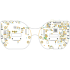
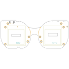
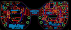
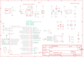

Contents
========

* [PRA4343 > Adafruit MONSTER M4SK PCB](#pra4343--adafruit-monster-m4sk-pcb)
	* [Schematic](#schematic)
	* [PCB](#pcb)
	* [Interactive BOM](#interactive-bom)
	* [OOMP Parts](#oomp-parts)
	* [Images](#images)
	* [Tags](#tags)

# PRA4343 > Adafruit MONSTER M4SK PCB

- ID: PROJ-ADAF-4343-STAN-01
- Hex ID: PRA4343
- Name: Adafruit
- Description: Adafruit
- Long Link: [http://oom.lt/PROJ-ADAF-4343-STAN-01](http://oom.lt/PROJ-ADAF-4343-STAN-01)
- Short Link: [http://oom.lt/PRA4343](http://oom.lt/PRA4343)

## Schematic
  

## PCB
  

## Interactive BOM

- Interactive BOM page: [ibom.html](https://htmlpreview.github.io/?https://github.com/oomlout/oomlout_OOMP_projects/blob/main/PROJ-ADAF-4343-STAN-01/kicad/bom/ibom.html)

## OOMP Parts
  

|OOMP ID|Name|Identifier|
| :---: | :---: | :---: |
|UNMATCHED-UNMATCHED-X-UNMATCHED-01||SW3, SW4, SW1, SW2, @HOLE21, @HOLE2, @HOLE23, @HOLE3, @HOLE19, @HOLE6, @HOLE0, @HOLE9, @HOLE1, @HOLE22, @HOLE4, @HOLE5, @HOLE13, @HOLE12, @HOLE8, @HOLE14, @HOLE15, @HOLE18, @HOLE20, @HOLE10, @HOLE11, @HOLE16, @HOLE17, @HOLE7, JP2, JP1, U$66, U$65, U$62, X1, IC2, U5, I2C0, U2, X2, IC4, IC3, SW11, NEOPIX0, SENSE0, U1, X3, U$13, TFT2, TFT1, U$57|
|[RESE-0603-X-O222-01](https://github.com/oomlout/oomlout_OOMP_parts/tree/main/RESE-0603-X-O222-01/)|[SMD (0603) 2.2k Ohm Resistor](https://github.com/oomlout/oomlout_OOMP_parts/tree/main/RESE-0603-X-O222-01/)|[R7, R6](https://github.com/oomlout/oomlout_OOMP_parts/tree/main/RESE-0603-X-O222-01/)|
|[CAPC-0603-X-UF1-V25](https://github.com/oomlout/oomlout_OOMP_parts/tree/main/CAPC-0603-X-UF1-V25/)|[SMD (0603) 1 uF Capacitor (Ceramic) 25v](https://github.com/oomlout/oomlout_OOMP_parts/tree/main/CAPC-0603-X-UF1-V25/)|[C28, C19, C21, C25, C16, C11](https://github.com/oomlout/oomlout_OOMP_parts/tree/main/CAPC-0603-X-UF1-V25/)|
|[RESE-0603-X-O473-01](https://github.com/oomlout/oomlout_OOMP_parts/tree/main/RESE-0603-X-O473-01/)|[SMD (0603) 47k Ohm Resistor](https://github.com/oomlout/oomlout_OOMP_parts/tree/main/RESE-0603-X-O473-01/)|[R12, R9](https://github.com/oomlout/oomlout_OOMP_parts/tree/main/RESE-0603-X-O473-01/)|
|DIOD-S323-X-UNMATCHED-01||D4, D3|
|[CAPC-0805-X-UF10-V10](https://github.com/oomlout/oomlout_OOMP_parts/tree/main/CAPC-0805-X-UF10-V10/)|[SMD (0805) 10 uF Capacitor (Ceramic) 10v](https://github.com/oomlout/oomlout_OOMP_parts/tree/main/CAPC-0805-X-UF10-V10/)|[C1, C4, C13, C15, C17, C2, C27, C30, C10](https://github.com/oomlout/oomlout_OOMP_parts/tree/main/CAPC-0805-X-UF10-V10/)|
|UNMATCHED-SO23-X-KBSS138-01||Q3, Q6, Q4, Q5|
|[RESE-0603-X-O102-01](https://github.com/oomlout/oomlout_OOMP_parts/tree/main/RESE-0603-X-O102-01/)|[SMD (0603) 1k Ohm Resistor](https://github.com/oomlout/oomlout_OOMP_parts/tree/main/RESE-0603-X-O102-01/)|[R8, R11, R15, R21](https://github.com/oomlout/oomlout_OOMP_parts/tree/main/RESE-0603-X-O102-01/)|
|DIOD-S123-X-UNMATCHED-01||D5|
|[RESE-0603-X-O103-01](https://github.com/oomlout/oomlout_OOMP_parts/tree/main/RESE-0603-X-O103-01/)|[SMD (0603) 10k Ohm Resistor](https://github.com/oomlout/oomlout_OOMP_parts/tree/main/RESE-0603-X-O103-01/)|[R17, R1](https://github.com/oomlout/oomlout_OOMP_parts/tree/main/RESE-0603-X-O103-01/)|
|RESE-0603-X-UNMATCHED-01||R13, R20|
|RESA-06038-X-O101X4-01||R10|
|CAPX-UNMATCHED-X-UF100-01||C23, C22|
|UNMATCHED-SO23-X-UNMATCHED-01||Q2, Q1|
|RESE-0603-X-O1003-01||R4, R3, R2|
|[CAPC-0603-X-NF100-V50](https://github.com/oomlout/oomlout_OOMP_parts/tree/main/CAPC-0603-X-NF100-V50/)|[SMD (0603) 100 nF Capacitor (Ceramic) 50v](https://github.com/oomlout/oomlout_OOMP_parts/tree/main/CAPC-0603-X-NF100-V50/)|[C5, C3, C12, C20](https://github.com/oomlout/oomlout_OOMP_parts/tree/main/CAPC-0603-X-NF100-V50/)|
|UNMATCHED-SO235-X-UNMATCHED-01||U4, U6, U3|
|FERB-0805-X-UNMATCHED-01||FB2, FB1|
|[RESE-0603-X-O101-01](https://github.com/oomlout/oomlout_OOMP_parts/tree/main/RESE-0603-X-O101-01/)|[SMD (0603) 100 Ohm Resistor](https://github.com/oomlout/oomlout_OOMP_parts/tree/main/RESE-0603-X-O101-01/)|[R18](https://github.com/oomlout/oomlout_OOMP_parts/tree/main/RESE-0603-X-O101-01/)|
|[RESE-0603-X-O472-01](https://github.com/oomlout/oomlout_OOMP_parts/tree/main/RESE-0603-X-O472-01/)|[SMD (0603) 4.7k Ohm Resistor](https://github.com/oomlout/oomlout_OOMP_parts/tree/main/RESE-0603-X-O472-01/)|[R16](https://github.com/oomlout/oomlout_OOMP_parts/tree/main/RESE-0603-X-O472-01/)|
|[RESA-06038-X-O103X4-01](https://github.com/oomlout/oomlout_OOMP_parts/tree/main/RESA-06038-X-O103X4-01/)|[SMD (0603-8) 10k Ohm (x4) Resistor Array](https://github.com/oomlout/oomlout_OOMP_parts/tree/main/RESA-06038-X-O103X4-01/)|[R19, R14](https://github.com/oomlout/oomlout_OOMP_parts/tree/main/RESA-06038-X-O103X4-01/)|
|[RESE-0603-X-O100-01](https://github.com/oomlout/oomlout_OOMP_parts/tree/main/RESE-0603-X-O100-01/)|[SMD (0603) 10 Ohm Resistor](https://github.com/oomlout/oomlout_OOMP_parts/tree/main/RESE-0603-X-O100-01/)|[R23, R5](https://github.com/oomlout/oomlout_OOMP_parts/tree/main/RESE-0603-X-O100-01/)|
|UNMATCHED-0805-X-UNMATCHED-01||L0, CHG0|
|[HEAD-JSTSH-X-PI04-RS](https://github.com/oomlout/oomlout_OOMP_parts/tree/main/HEAD-JSTSH-X-PI04-RS/)|[JST XH (1 mm) 4 Pin Header Right Angle (SMD)](https://github.com/oomlout/oomlout_OOMP_parts/tree/main/HEAD-JSTSH-X-PI04-RS/)|[CONN1](https://github.com/oomlout/oomlout_OOMP_parts/tree/main/HEAD-JSTSH-X-PI04-RS/)|

## Images
  
  

|bominteractivefront|bominteractiveback|eagleImage|eagleSchemImage|
| :---: | :---: | :---: | :---: |
|||||

## Tags

- hexID: PRA4343
- oompType: PROJ
- oompSize: ADAF
- oompColor: 4343
- oompDesc: STAN
- oompIndex: 01
- oompName: Adafruit MONSTER M4SK PCB
- sources: All source files from https://github.com/adafruit/Adafruit-MONSTER-M4SK-PCB (source licence details in srcLicense.md)
- linkBuyPage: http://www.adafruit.com/products/4343
- oompID: PROJ-ADAF-4343-STAN-01
- oompParts: SW3,UNMATCHED-UNMATCHED-X-UNMATCHED-01
- oompParts: SW4,UNMATCHED-UNMATCHED-X-UNMATCHED-01
- oompParts: SW1,UNMATCHED-UNMATCHED-X-UNMATCHED-01
- oompParts: SW2,UNMATCHED-UNMATCHED-X-UNMATCHED-01
- oompParts: R7,RESE-0603-X-O222-01
- oompParts: R6,RESE-0603-X-O222-01
- oompParts: @HOLE21,UNMATCHED-UNMATCHED-X-UNMATCHED-01
- oompParts: @HOLE2,UNMATCHED-UNMATCHED-X-UNMATCHED-01
- oompParts: @HOLE23,UNMATCHED-UNMATCHED-X-UNMATCHED-01
- oompParts: @HOLE3,UNMATCHED-UNMATCHED-X-UNMATCHED-01
- oompParts: @HOLE19,UNMATCHED-UNMATCHED-X-UNMATCHED-01
- oompParts: @HOLE6,UNMATCHED-UNMATCHED-X-UNMATCHED-01
- oompParts: @HOLE0,UNMATCHED-UNMATCHED-X-UNMATCHED-01
- oompParts: @HOLE9,UNMATCHED-UNMATCHED-X-UNMATCHED-01
- oompParts: @HOLE1,UNMATCHED-UNMATCHED-X-UNMATCHED-01
- oompParts: @HOLE22,UNMATCHED-UNMATCHED-X-UNMATCHED-01
- oompParts: @HOLE4,UNMATCHED-UNMATCHED-X-UNMATCHED-01
- oompParts: @HOLE5,UNMATCHED-UNMATCHED-X-UNMATCHED-01
- oompParts: @HOLE13,UNMATCHED-UNMATCHED-X-UNMATCHED-01
- oompParts: @HOLE12,UNMATCHED-UNMATCHED-X-UNMATCHED-01
- oompParts: @HOLE8,UNMATCHED-UNMATCHED-X-UNMATCHED-01
- oompParts: @HOLE14,UNMATCHED-UNMATCHED-X-UNMATCHED-01
- oompParts: @HOLE15,UNMATCHED-UNMATCHED-X-UNMATCHED-01
- oompParts: @HOLE18,UNMATCHED-UNMATCHED-X-UNMATCHED-01
- oompParts: @HOLE20,UNMATCHED-UNMATCHED-X-UNMATCHED-01
- oompParts: @HOLE10,UNMATCHED-UNMATCHED-X-UNMATCHED-01
- oompParts: @HOLE11,UNMATCHED-UNMATCHED-X-UNMATCHED-01
- oompParts: @HOLE16,UNMATCHED-UNMATCHED-X-UNMATCHED-01
- oompParts: @HOLE17,UNMATCHED-UNMATCHED-X-UNMATCHED-01
- oompParts: @HOLE7,UNMATCHED-UNMATCHED-X-UNMATCHED-01
- oompParts: JP2,UNMATCHED-UNMATCHED-X-UNMATCHED-01
- oompParts: JP1,UNMATCHED-UNMATCHED-X-UNMATCHED-01
- oompParts: C28,CAPC-0603-X-UF1-V25
- oompParts: C19,CAPC-0603-X-UF1-V25
- oompParts: C21,CAPC-0603-X-UF1-V25
- oompParts: C25,CAPC-0603-X-UF1-V25
- oompParts: C16,CAPC-0603-X-UF1-V25
- oompParts: C11,CAPC-0603-X-UF1-V25
- oompParts: U$66,UNMATCHED-UNMATCHED-X-UNMATCHED-01
- oompParts: U$65,UNMATCHED-UNMATCHED-X-UNMATCHED-01
- oompParts: U$62,UNMATCHED-UNMATCHED-X-UNMATCHED-01
- oompParts: R12,RESE-0603-X-O473-01
- oompParts: R9,RESE-0603-X-O473-01
- oompParts: D4,DIOD-S323-X-UNMATCHED-01
- oompParts: D3,DIOD-S323-X-UNMATCHED-01
- oompParts: X1,UNMATCHED-UNMATCHED-X-UNMATCHED-01
- oompParts: C1,CAPC-0805-X-UF10-V10
- oompParts: C4,CAPC-0805-X-UF10-V10
- oompParts: C13,CAPC-0805-X-UF10-V10
- oompParts: C15,CAPC-0805-X-UF10-V10
- oompParts: C17,CAPC-0805-X-UF10-V10
- oompParts: C2,CAPC-0805-X-UF10-V10
- oompParts: Q3,UNMATCHED-SO23-X-KBSS138-01
- oompParts: Q6,UNMATCHED-SO23-X-KBSS138-01
- oompParts: Q4,UNMATCHED-SO23-X-KBSS138-01
- oompParts: Q5,UNMATCHED-SO23-X-KBSS138-01
- oompParts: R8,RESE-0603-X-O102-01
- oompParts: R11,RESE-0603-X-O102-01
- oompParts: R15,RESE-0603-X-O102-01
- oompParts: IC2,UNMATCHED-UNMATCHED-X-UNMATCHED-01
- oompParts: U5,UNMATCHED-UNMATCHED-X-UNMATCHED-01
- oompParts: D5,DIOD-S123-X-UNMATCHED-01
- oompParts: R17,RESE-0603-X-O103-01
- oompParts: R1,RESE-0603-X-O103-01
- oompParts: R13,RESE-0603-X-UNMATCHED-01
- oompParts: I2C0,UNMATCHED-UNMATCHED-X-UNMATCHED-01
- oompParts: R10,RESA-06038-X-O101X4-01
- oompParts: C23,CAPX-UNMATCHED-X-UF100-01
- oompParts: C22,CAPX-UNMATCHED-X-UF100-01
- oompParts: C27,CAPC-0805-X-UF10-V10
- oompParts: C30,CAPC-0805-X-UF10-V10
- oompParts: Q2,UNMATCHED-SO23-X-UNMATCHED-01
- oompParts: Q1,UNMATCHED-SO23-X-UNMATCHED-01
- oompParts: R4,RESE-0603-X-O1003-01
- oompParts: R3,RESE-0603-X-O1003-01
- oompParts: C5,CAPC-0603-X-NF100-V50
- oompParts: C3,CAPC-0603-X-NF100-V50
- oompParts: C12,CAPC-0603-X-NF100-V50
- oompParts: C20,CAPC-0603-X-NF100-V50
- oompParts: C10,CAPC-0805-X-UF10-V10
- oompParts: U2,UNMATCHED-UNMATCHED-X-UNMATCHED-01
- oompParts: X2,UNMATCHED-UNMATCHED-X-UNMATCHED-01
- oompParts: U4,UNMATCHED-SO235-X-UNMATCHED-01
- oompParts: U6,UNMATCHED-SO235-X-UNMATCHED-01
- oompParts: IC4,UNMATCHED-UNMATCHED-X-UNMATCHED-01
- oompParts: FB2,FERB-0805-X-UNMATCHED-01
- oompParts: R21,RESE-0603-X-O102-01
- oompParts: U3,UNMATCHED-SO235-X-UNMATCHED-01
- oompParts: IC3,UNMATCHED-UNMATCHED-X-UNMATCHED-01
- oompParts: R18,RESE-0603-X-O101-01
- oompParts: R16,RESE-0603-X-O472-01
- oompParts: R2,RESE-0603-X-O1003-01
- oompParts: SW11,UNMATCHED-UNMATCHED-X-UNMATCHED-01
- oompParts: NEOPIX0,UNMATCHED-UNMATCHED-X-UNMATCHED-01
- oompParts: SENSE0,UNMATCHED-UNMATCHED-X-UNMATCHED-01
- oompParts: R19,RESA-06038-X-O103X4-01
- oompParts: R14,RESA-06038-X-O103X4-01
- oompParts: U1,UNMATCHED-UNMATCHED-X-UNMATCHED-01
- oompParts: R23,RESE-0603-X-O100-01
- oompParts: R5,RESE-0603-X-O100-01
- oompParts: X3,UNMATCHED-UNMATCHED-X-UNMATCHED-01
- oompParts: U$13,UNMATCHED-UNMATCHED-X-UNMATCHED-01
- oompParts: L0,UNMATCHED-0805-X-UNMATCHED-01
- oompParts: FB1,FERB-0805-X-UNMATCHED-01
- oompParts: R20,RESE-0603-X-UNMATCHED-01
- oompParts: CONN1,HEAD-JSTSH-X-PI04-RS
- oompParts: CHG0,UNMATCHED-0805-X-UNMATCHED-01
- oompParts: TFT2,UNMATCHED-UNMATCHED-X-UNMATCHED-01
- oompParts: TFT1,UNMATCHED-UNMATCHED-X-UNMATCHED-01
- oompParts: U$57,UNMATCHED-UNMATCHED-X-UNMATCHED-01
- rawParts: SW3,C13124,SPST_TACTILE_RA,SPST_TACTILE_RA,,,,
- rawParts: SW4,C13124,SPST_TACTILE_RA,SPST_TACTILE_RA,,,,
- rawParts: SW1,C13124,SPST_TACTILE_RA,SPST_TACTILE_RA,,,,
- rawParts: SW2,C13124,SPST_TACTILE_RA,SPST_TACTILE_RA,,,,
- rawParts: R7,2.2K,0603-NO,0603-NO,,,,
- rawParts: R6,2.2K,0603-NO,0603-NO,,,,
- rawParts: U$7,MOUNTINGHOLE3.0THIN,MOUNTINGHOLE_3.0_PLATEDTHIN,MOUNTINGHOLE_3.0_PLATEDTHIN,,,,
- rawParts: U$61,MOUNTINGHOLE3.0THIN,MOUNTINGHOLE_3.0_PLATEDTHIN,MOUNTINGHOLE_3.0_PLATEDTHIN,,,,
- rawParts: U$64,MOUNTINGHOLE3.0THIN,MOUNTINGHOLE_3.0_PLATEDTHIN,MOUNTINGHOLE_3.0_PLATEDTHIN,,,,
- rawParts: U$60,MOUNTINGHOLE3.0THIN,MOUNTINGHOLE_3.0_PLATEDTHIN,MOUNTINGHOLE_3.0_PLATEDTHIN,,,,
- rawParts: U$59,MOUNTINGHOLE3.0THIN,MOUNTINGHOLE_3.0_PLATEDTHIN,MOUNTINGHOLE_3.0_PLATEDTHIN,,,,
- rawParts: U$58,MOUNTINGHOLE3.0THIN,MOUNTINGHOLE_3.0_PLATEDTHIN,MOUNTINGHOLE_3.0_PLATEDTHIN,,,,
- rawParts: U$9,MOUNTINGHOLE3.0THIN,MOUNTINGHOLE_3.0_PLATEDTHIN,MOUNTINGHOLE_3.0_PLATEDTHIN,,,,
- rawParts: U$10,MOUNTINGHOLE3.0THIN,MOUNTINGHOLE_3.0_PLATEDTHIN,MOUNTINGHOLE_3.0_PLATEDTHIN,,,,
- rawParts: U$63,MOUNTINGHOLE3.0THIN,MOUNTINGHOLE_3.0_PLATEDTHIN,MOUNTINGHOLE_3.0_PLATEDTHIN,,,,
- rawParts: U$8,MOUNTINGHOLE3.0THIN,MOUNTINGHOLE_3.0_PLATEDTHIN,MOUNTINGHOLE_3.0_PLATEDTHIN,,,,
- rawParts: @HOLE21,,,,,,,
- rawParts: @HOLE2,,,,,,,
- rawParts: @HOLE23,,,,,,,
- rawParts: @HOLE3,,,,,,,
- rawParts: @HOLE19,,,,,,,
- rawParts: @HOLE6,,,,,,,
- rawParts: @HOLE0,,,,,,,
- rawParts: @HOLE9,,,,,,,
- rawParts: @HOLE1,,,,,,,
- rawParts: @HOLE22,,,,,,,
- rawParts: @HOLE4,,,,,,,
- rawParts: @HOLE5,,,,,,,
- rawParts: @HOLE13,,,,,,,
- rawParts: @HOLE12,,,,,,,
- rawParts: @HOLE8,,,,,,,
- rawParts: @HOLE14,,,,,,,
- rawParts: @HOLE15,,,,,,,
- rawParts: @HOLE18,,,,,,,
- rawParts: @HOLE20,,,,,,,
- rawParts: @HOLE10,,,,,,,
- rawParts: @HOLE11,,,,,,,
- rawParts: @HOLE16,,,,,,,
- rawParts: @HOLE17,,,,,,,
- rawParts: @HOLE7,,,,,,,
- rawParts: TP3,,TESTPOINT_ROUND_2MM,TESTPOINT_ROUND_2MM,,,,
- rawParts: TP4,,TESTPOINT_ROUND_2MM,TESTPOINT_ROUND_2MM,,,,
- rawParts: TP5,,TESTPOINT_ROUND_2MM,TESTPOINT_ROUND_2MM,,,,
- rawParts: JP2,,JST_SH9,JST_SH9,,,,
- rawParts: JP1,,JST_SH9,JST_SH9,,,,
- rawParts: U$34,FIDUCIAL_1MM,FIDUCIAL_1MM,FIDUCIAL_1MM,,,,
- rawParts: U$3,FIDUCIAL_1MM,FIDUCIAL_1MM,FIDUCIAL_1MM,,,,
- rawParts: U$35,FIDUCIAL_1MM,FIDUCIAL_1MM,FIDUCIAL_1MM,,,,
- rawParts: U$5,FIDUCIAL_1MM,FIDUCIAL_1MM,FIDUCIAL_1MM,,,,
- rawParts: U$4,FIDUCIAL_1MM,FIDUCIAL_1MM,FIDUCIAL_1MM,,,,
- rawParts: C28,1uF,0603-NO,0603-NO,,,,
- rawParts: C19,1uF,0603-NO,0603-NO,,,,
- rawParts: C21,1uF,0603-NO,0603-NO,,,,
- rawParts: C25,1uF,0603-NO,0603-NO,,,,
- rawParts: C16,1uF,0603-NO,0603-NO,,,,
- rawParts: C11,1uF,0603-NO,0603-NO,,,,
- rawParts: U$66,,PCBFEAT-REV-040,PCBFEAT-REV-040,,,,
- rawParts: U$65,,PCBFEAT-REV-040,PCBFEAT-REV-040,,,,
- rawParts: U$62,,MONSTERM4SK_BACK,MONSTERM4SK_BACK,,,,
- rawParts: R12,47K,0603-NO,0603-NO,,,,
- rawParts: R9,47K,0603-NO,0603-NO,,,,
- rawParts: D4,3.6V,SOD-323,SOD-323,,,,
- rawParts: D3,3.6V,SOD-323,SOD-323,,,,
- rawParts: X1,JSTPH,JSTPH2,JSTPH2,,,,
- rawParts: TP7,,TESTPOINT_ROUND_2MM_NO,TESTPOINT_ROUND_2MM_NO,,,,
- rawParts: TP6,,TESTPOINT_ROUND_2MM_NO,TESTPOINT_ROUND_2MM_NO,,,,
- rawParts: TP8,,TESTPOINT_ROUND_2MM_NO,TESTPOINT_ROUND_2MM_NO,,,,
- rawParts: C1,10uF,0805-NO,0805-NO,,,,
- rawParts: C4,10uF,0805-NO,0805-NO,,,,
- rawParts: C13,10uF,0805-NO,0805-NO,,,,
- rawParts: C15,10uF,0805-NO,0805-NO,,,,
- rawParts: C17,10uF,0805-NO,0805-NO,,,,
- rawParts: C2,10uF,0805-NO,0805-NO,,,,
- rawParts: Q3,BSS138,SOT23-WIDE,SOT23-WIDE,,,,
- rawParts: Q6,BSS138,SOT23-WIDE,SOT23-WIDE,,,,
- rawParts: Q4,BSS138,SOT23-WIDE,SOT23-WIDE,,,,
- rawParts: Q5,BSS138,SOT23-WIDE,SOT23-WIDE,,,,
- rawParts: R8,1K,0603-NO,0603-NO,,,,
- rawParts: R11,1K,0603-NO,0603-NO,,,,
- rawParts: R15,1K,0603-NO,0603-NO,,,,
- rawParts: IC2,ATSAMD09D14A-MU,QFN24_4MM,QFN24_4MM,,,,
- rawParts: U5,PAM8302AASCR,MSOP8_0.65MM,MSOP8_0.65MM,,,,
- rawParts: D5,MBR0540,SOD-123,SOD-123,,,,
- rawParts: TP2,,TESTPOINT_ROUND_1.5MM_NO,TESTPOINT_ROUND_1.5MM_NO,,,,
- rawParts: TP1,,TESTPOINT_ROUND_1.5MM_NO,TESTPOINT_ROUND_1.5MM_NO,,,,
- rawParts: R17,10K,0603-NO,0603-NO,,,,
- rawParts: R1,10K,0603-NO,0603-NO,,,,
- rawParts: R13,DNP,0603-NO,0603-NO,,,,
- rawParts: I2C0,JST PH 4,JSTPH4,JSTPH4,,,,
- rawParts: SJ2,,SOLDERJUMPER_2WAY_OPEN_NOPASTE,SOLDERJUMPER_2WAY_OPEN_NOPASTE,,,,
- rawParts: SJ1,,SOLDERJUMPER_2WAY_OPEN_NOPASTE,SOLDERJUMPER_2WAY_OPEN_NOPASTE,,,,
- rawParts: R10,100,RESPACK_4X0603,RESPACK_4X0603,,,,
- rawParts: C23,100uF,C1210,C1210,,,,
- rawParts: C22,100uF,C1210,C1210,,,,
- rawParts: C27,10µF,0805-NO,0805-NO,,,,
- rawParts: C30,10µF,0805-NO,0805-NO,,,,
- rawParts: Q2,DMG2305,SOT23-R,SOT23-R,,,,
- rawParts: Q1,DMG2305,SOT23-R,SOT23-R,,,,
- rawParts: R4,100K,0603-NO,0603-NO,,,,
- rawParts: R3,100K,0603-NO,0603-NO,,,,
- rawParts: C5,0.1uF,0603-NO,0603-NO,,,,
- rawParts: C3,0.1uF,0603-NO,0603-NO,,,,
- rawParts: C12,0.1uF,0603-NO,0603-NO,,,,
- rawParts: C20,0.1uF,0603-NO,0603-NO,,,,
- rawParts: C10,10uF,_0805MP,_0805MP,,,,
- rawParts: U2,ALS-PT21,ALS-PT26-21C,ALS-PT26-21C,,,,
- rawParts: X2,C2424,4UCONN_18510,4UCONN_18510,,,,
- rawParts: U4,AP2112-3.3,SOT23-5,SOT23-5,,,,
- rawParts: U6,AP2112-3.3,SOT23-5,SOT23-5,,,,
- rawParts: IC4,LIS3DH,LGA16_3X3MM,LGA16_3X3MM,,,,
- rawParts: FB2,Ferrite,_0805MP,_0805MP,,,,
- rawParts: R21,1k,0603-NO,0603-NO,,,,
- rawParts: U3,MCP73831T-2ACI/OT,SOT23-5,SOT23-5,,,,
- rawParts: IC3,ATSAMD51G_TQFN48,TQFN48_7MM,TQFN48_7MM,,,,
- rawParts: R18,100,0603-NO,0603-NO,,,,
- rawParts: R16,4.7K,0603-NO,0603-NO,,,,
- rawParts: R2,100k,0603-NO,0603-NO,,,,
- rawParts: SW11,C5392,SPDT_SMT_SSSS811101,SPDT_SMT_SSSS811101,,,,
- rawParts: NEOPIX0,JST PH 3,JSTPH3,JSTPH3,,,,
- rawParts: SENSE0,JST PH 3,JSTPH3,JSTPH3,,,,
- rawParts: R19,10K,RESPACK_4X0603,RESPACK_4X0603,,,,
- rawParts: R14,10K,RESPACK_4X0603,RESPACK_4X0603,,,,
- rawParts: U1,GD25x16,SOIC8_208MIL,SOIC8_208MIL,,,,
- rawParts: R23,10,0603-NO,0603-NO,,,,
- rawParts: R5,10,0603-NO,0603-NO,,,,
- rawParts: X3,microUSB,4UCONN_20329_NARROW,4UCONN_20329_NARROW,,,,
- rawParts: U$13,CON_MOLEX_2P,53398-0271,53398-0271,,,,
- rawParts: L0,RED,CHIPLED_0805_NOOUTLINE,CHIPLED_0805_NOOUTLINE,,,,
- rawParts: FB1,Ferrite,0805-NO,0805-NO,,,,
- rawParts: R20,2Meg,0603-NO,0603-NO,,,,
- rawParts: CONN1,STEMMA_I2C_QT,JST_SH4,JST_SH4,,,,
- rawParts: CHG0,ORANGE,CHIPLED_0805_NOOUTLINE,CHIPLED_0805_NOOUTLINE,,,,
- rawParts: TFT2,DISP_TFT_1.54IN_240X240_22P,TFT_1.54IN_240X240_22PIN,TFT_1.54IN_240X240_22PIN,,,,
- rawParts: TFT1,DISP_TFT_1.54IN_240X240_22P,TFT_1.54IN_240X240_22PIN,TFT_1.54IN_240X240_22PIN,,,,
- rawParts: U$57,,MONSTERM4SK_FRONT,MONSTERM4SK_FRONT,,,,
