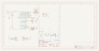

Contents
========

* [PRA4343 > Adafruit MONSTER M4SK PCB](#pra4343--adafruit-monster-m4sk-pcb)
	* [Schematic](#schematic)
	* [PCB](#pcb)
	* [Interactive BOM](#interactive-bom)
	* [OOMP Parts](#oomp-parts)
	* [Images](#images)
	* [Tags](#tags)

# PRA4343 > Adafruit MONSTER M4SK PCB

- ID: PROJ-ADAF-4343-STAN-01
- Hex ID: PRA4343
- Name: Adafruit 4343
- Description: Adafruit 4343
- Long Link: [http://oom.lt/PROJ-ADAF-4343-STAN-01](http://oom.lt/PROJ-ADAF-4343-STAN-01)
- Short Link: [http://oom.lt/PRA4343](http://oom.lt/PRA4343)

## Schematic
  

## PCB
  

## Interactive BOM

- Interactive BOM page: [ibom.html](https://htmlpreview.github.io/?https://github.com/oomlout/oomlout_OOMP_projects/blob/main/PROJ-ADAF-4343-STAN-01/kicad/bom/ibom.html)

## OOMP Parts
  

|OOMP ID|Name|Identifier|
| :---: | :---: | :---: |
|[CAPC-0805-X-UF10-V10](https://github.com/oomlout/oomlout_OOMP_parts/tree/main/CAPC-0805-X-UF10-V10/)|[SMD (0805) 10 uF Capacitor (Ceramic) 10v](https://github.com/oomlout/oomlout_OOMP_parts/tree/main/CAPC-0805-X-UF10-V10/)|[C1, C2, C4, C10, C13, C15, C17](https://github.com/oomlout/oomlout_OOMP_parts/tree/main/CAPC-0805-X-UF10-V10/)|
|[CAPC-0603-X-NF100-V50](https://github.com/oomlout/oomlout_OOMP_parts/tree/main/CAPC-0603-X-NF100-V50/)|[SMD (0603) 100 nF Capacitor (Ceramic) 50v](https://github.com/oomlout/oomlout_OOMP_parts/tree/main/CAPC-0603-X-NF100-V50/)|[C3, C5, C12, C20](https://github.com/oomlout/oomlout_OOMP_parts/tree/main/CAPC-0603-X-NF100-V50/)|
|[CAPC-0603-X-UF1-V25](https://github.com/oomlout/oomlout_OOMP_parts/tree/main/CAPC-0603-X-UF1-V25/)|[SMD (0603) 1 uF Capacitor (Ceramic) 25v](https://github.com/oomlout/oomlout_OOMP_parts/tree/main/CAPC-0603-X-UF1-V25/)|[C11, C16, C19, C21, C25, C28](https://github.com/oomlout/oomlout_OOMP_parts/tree/main/CAPC-0603-X-UF1-V25/)|
|CAPX-UNMATCHED-X-UF100-01||C22, C23|
|CAPC-0805-X-UNMATCHED-01||C27, C30|
|LEDS-0805-O-STAN-01||CHG|
|[HEAD-JSTSH-X-PI04-RS](https://github.com/oomlout/oomlout_OOMP_parts/tree/main/HEAD-JSTSH-X-PI04-RS/)|[JST XH (1 mm) 4 Pin Header Right Angle (SMD)](https://github.com/oomlout/oomlout_OOMP_parts/tree/main/HEAD-JSTSH-X-PI04-RS/)|[CONN1, I2C](https://github.com/oomlout/oomlout_OOMP_parts/tree/main/HEAD-JSTSH-X-PI04-RS/)|
|DIOD-S323-X-UNMATCHED-01||D3, D4|
|DIOD-S123-X-UNMATCHED-01||D5|
|FERB-0805-X-UNMATCHED-01||FB1, FB2|
|UNMATCHED-UNMATCHED-X-UNMATCHED-01||IC2, IC3, IC4, NEOPIX, SENSE, SW1, SW2, SW3, SW4, SW11, TFT1, TFT2, U$13, U1, U2, U5, X1, X2, X3|
|HEAD-I01-X-UNMATCHED-01||JP1, JP2|
|[LEDS-0805-R-STAN-01](https://github.com/oomlout/oomlout_OOMP_parts/tree/main/LEDS-0805-R-STAN-01/)|[SMD (0805) Red LED](https://github.com/oomlout/oomlout_OOMP_parts/tree/main/LEDS-0805-R-STAN-01/)|[L](https://github.com/oomlout/oomlout_OOMP_parts/tree/main/LEDS-0805-R-STAN-01/)|
|MOSP-SO23-X-UNMATCHED-01||Q1, Q2|
|[MOSN-SO23-X-KBSS138-01](https://github.com/oomlout/oomlout_OOMP_parts/tree/main/MOSN-SO23-X-KBSS138-01/)|[SMD (SOT-23) BSS138 N-Ch. MOSFET](https://github.com/oomlout/oomlout_OOMP_parts/tree/main/MOSN-SO23-X-KBSS138-01/)|[Q3, Q4, Q5, Q6](https://github.com/oomlout/oomlout_OOMP_parts/tree/main/MOSN-SO23-X-KBSS138-01/)|
|[RESE-0603-X-O103-01](https://github.com/oomlout/oomlout_OOMP_parts/tree/main/RESE-0603-X-O103-01/)|[SMD (0603) 10k Ohm Resistor](https://github.com/oomlout/oomlout_OOMP_parts/tree/main/RESE-0603-X-O103-01/)|[R1, R17](https://github.com/oomlout/oomlout_OOMP_parts/tree/main/RESE-0603-X-O103-01/)|
|RESE-0603-X-O1003-01||R2, R3, R4|
|[RESE-0603-X-O100-01](https://github.com/oomlout/oomlout_OOMP_parts/tree/main/RESE-0603-X-O100-01/)|[SMD (0603) 10 Ohm Resistor](https://github.com/oomlout/oomlout_OOMP_parts/tree/main/RESE-0603-X-O100-01/)|[R5, R23](https://github.com/oomlout/oomlout_OOMP_parts/tree/main/RESE-0603-X-O100-01/)|
|[RESE-0603-X-O222-01](https://github.com/oomlout/oomlout_OOMP_parts/tree/main/RESE-0603-X-O222-01/)|[SMD (0603) 2.2k Ohm Resistor](https://github.com/oomlout/oomlout_OOMP_parts/tree/main/RESE-0603-X-O222-01/)|[R6, R7](https://github.com/oomlout/oomlout_OOMP_parts/tree/main/RESE-0603-X-O222-01/)|
|[RESE-0603-X-O102-01](https://github.com/oomlout/oomlout_OOMP_parts/tree/main/RESE-0603-X-O102-01/)|[SMD (0603) 1k Ohm Resistor](https://github.com/oomlout/oomlout_OOMP_parts/tree/main/RESE-0603-X-O102-01/)|[R8, R11, R15, R21](https://github.com/oomlout/oomlout_OOMP_parts/tree/main/RESE-0603-X-O102-01/)|
|[RESE-0603-X-O473-01](https://github.com/oomlout/oomlout_OOMP_parts/tree/main/RESE-0603-X-O473-01/)|[SMD (0603) 47k Ohm Resistor](https://github.com/oomlout/oomlout_OOMP_parts/tree/main/RESE-0603-X-O473-01/)|[R9, R12](https://github.com/oomlout/oomlout_OOMP_parts/tree/main/RESE-0603-X-O473-01/)|
|RESA-06038-X-O101X4-01||R10|
|RESE-0603-X-UNMATCHED-01||R13, R20|
|[RESA-06038-X-O103X4-01](https://github.com/oomlout/oomlout_OOMP_parts/tree/main/RESA-06038-X-O103X4-01/)|[SMD (0603-8) 10k Ohm (x4) Resistor Array](https://github.com/oomlout/oomlout_OOMP_parts/tree/main/RESA-06038-X-O103X4-01/)|[R14, R19](https://github.com/oomlout/oomlout_OOMP_parts/tree/main/RESA-06038-X-O103X4-01/)|
|[RESE-0603-X-O472-01](https://github.com/oomlout/oomlout_OOMP_parts/tree/main/RESE-0603-X-O472-01/)|[SMD (0603) 4.7k Ohm Resistor](https://github.com/oomlout/oomlout_OOMP_parts/tree/main/RESE-0603-X-O472-01/)|[R16](https://github.com/oomlout/oomlout_OOMP_parts/tree/main/RESE-0603-X-O472-01/)|
|[RESE-0603-X-O101-01](https://github.com/oomlout/oomlout_OOMP_parts/tree/main/RESE-0603-X-O101-01/)|[SMD (0603) 100 Ohm Resistor](https://github.com/oomlout/oomlout_OOMP_parts/tree/main/RESE-0603-X-O101-01/)|[R18](https://github.com/oomlout/oomlout_OOMP_parts/tree/main/RESE-0603-X-O101-01/)|
|UNMATCHED-SO235-X-UNMATCHED-01||U3, U4, U6|

## Images
  
  

|bominteractivefront|bominteractiveback|kicadSchem|eagleImage|eagleSchemImage|
| :---: | :---: | :---: | :---: | :---: |
||||||

## Tags

- hexID: PRA4343
- oompType: PROJ
- oompSize: ADAF
- oompColor: 4343
- oompDesc: STAN
- oompIndex: 01
- oompName: Adafruit MONSTER M4SK PCB
- sources: All source files from https://github.com/adafruit/Adafruit-MONSTER-M4SK-PCB (source licence details in srcLicense.md)
- linkBuyPage: http://www.adafruit.com/products/4343
- oompID: PROJ-ADAF-4343-STAN-01
- oompParts: C1,CAPC-0805-X-UF10-V10
- oompParts: C2,CAPC-0805-X-UF10-V10
- oompParts: C3,CAPC-0603-X-NF100-V50
- oompParts: C4,CAPC-0805-X-UF10-V10
- oompParts: C5,CAPC-0603-X-NF100-V50
- oompParts: C10,CAPC-0805-X-UF10-V10
- oompParts: C11,CAPC-0603-X-UF1-V25
- oompParts: C12,CAPC-0603-X-NF100-V50
- oompParts: C13,CAPC-0805-X-UF10-V10
- oompParts: C15,CAPC-0805-X-UF10-V10
- oompParts: C16,CAPC-0603-X-UF1-V25
- oompParts: C17,CAPC-0805-X-UF10-V10
- oompParts: C19,CAPC-0603-X-UF1-V25
- oompParts: C20,CAPC-0603-X-NF100-V50
- oompParts: C21,CAPC-0603-X-UF1-V25
- oompParts: C22,CAPX-UNMATCHED-X-UF100-01
- oompParts: C23,CAPX-UNMATCHED-X-UF100-01
- oompParts: C25,CAPC-0603-X-UF1-V25
- oompParts: C27,CAPC-0805-X-UNMATCHED-01
- oompParts: C28,CAPC-0603-X-UF1-V25
- oompParts: C30,CAPC-0805-X-UNMATCHED-01
- oompParts: CHG,LEDS-0805-O-STAN-01
- oompParts: CONN1,HEAD-JSTSH-X-PI04-RS
- oompParts: D3,DIOD-S323-X-UNMATCHED-01
- oompParts: D4,DIOD-S323-X-UNMATCHED-01
- oompParts: D5,DIOD-S123-X-UNMATCHED-01
- oompParts: FB1,FERB-0805-X-UNMATCHED-01
- oompParts: FB2,FERB-0805-X-UNMATCHED-01
- oompParts: I2C,HEAD-JSTSH-X-PI04-RS
- oompParts: IC2,UNMATCHED-UNMATCHED-X-UNMATCHED-01
- oompParts: IC3,UNMATCHED-UNMATCHED-X-UNMATCHED-01
- oompParts: IC4,UNMATCHED-UNMATCHED-X-UNMATCHED-01
- oompParts: JP1,HEAD-I01-X-UNMATCHED-01
- oompParts: JP2,HEAD-I01-X-UNMATCHED-01
- oompParts: L,LEDS-0805-R-STAN-01
- oompParts: NEOPIX,UNMATCHED-UNMATCHED-X-UNMATCHED-01
- oompParts: Q1,MOSP-SO23-X-UNMATCHED-01
- oompParts: Q2,MOSP-SO23-X-UNMATCHED-01
- oompParts: Q3,MOSN-SO23-X-KBSS138-01
- oompParts: Q4,MOSN-SO23-X-KBSS138-01
- oompParts: Q5,MOSN-SO23-X-KBSS138-01
- oompParts: Q6,MOSN-SO23-X-KBSS138-01
- oompParts: R1,RESE-0603-X-O103-01
- oompParts: R2,RESE-0603-X-O1003-01
- oompParts: R3,RESE-0603-X-O1003-01
- oompParts: R4,RESE-0603-X-O1003-01
- oompParts: R5,RESE-0603-X-O100-01
- oompParts: R6,RESE-0603-X-O222-01
- oompParts: R7,RESE-0603-X-O222-01
- oompParts: R8,RESE-0603-X-O102-01
- oompParts: R9,RESE-0603-X-O473-01
- oompParts: R10,RESA-06038-X-O101X4-01
- oompParts: R11,RESE-0603-X-O102-01
- oompParts: R12,RESE-0603-X-O473-01
- oompParts: R13,RESE-0603-X-UNMATCHED-01
- oompParts: R14,RESA-06038-X-O103X4-01
- oompParts: R15,RESE-0603-X-O102-01
- oompParts: R16,RESE-0603-X-O472-01
- oompParts: R17,RESE-0603-X-O103-01
- oompParts: R18,RESE-0603-X-O101-01
- oompParts: R19,RESA-06038-X-O103X4-01
- oompParts: R20,RESE-0603-X-UNMATCHED-01
- oompParts: R21,RESE-0603-X-O102-01
- oompParts: R23,RESE-0603-X-O100-01
- oompParts: SENSE,UNMATCHED-UNMATCHED-X-UNMATCHED-01
- oompParts: SW1,UNMATCHED-UNMATCHED-X-UNMATCHED-01
- oompParts: SW2,UNMATCHED-UNMATCHED-X-UNMATCHED-01
- oompParts: SW3,UNMATCHED-UNMATCHED-X-UNMATCHED-01
- oompParts: SW4,UNMATCHED-UNMATCHED-X-UNMATCHED-01
- oompParts: SW11,UNMATCHED-UNMATCHED-X-UNMATCHED-01
- oompParts: TFT1,UNMATCHED-UNMATCHED-X-UNMATCHED-01
- oompParts: TFT2,UNMATCHED-UNMATCHED-X-UNMATCHED-01
- oompParts: U$13,UNMATCHED-UNMATCHED-X-UNMATCHED-01
- oompParts: U1,UNMATCHED-UNMATCHED-X-UNMATCHED-01
- oompParts: U2,UNMATCHED-UNMATCHED-X-UNMATCHED-01
- oompParts: U3,UNMATCHED-SO235-X-UNMATCHED-01
- oompParts: U4,UNMATCHED-SO235-X-UNMATCHED-01
- oompParts: U5,UNMATCHED-UNMATCHED-X-UNMATCHED-01
- oompParts: U6,UNMATCHED-SO235-X-UNMATCHED-01
- oompParts: X1,UNMATCHED-UNMATCHED-X-UNMATCHED-01
- oompParts: X2,UNMATCHED-UNMATCHED-X-UNMATCHED-01
- oompParts: X3,UNMATCHED-UNMATCHED-X-UNMATCHED-01
- rawParts: C1,10uF,CAP_CERAMIC0805-NOOUTLINE,0805-NO,Ceramic Capacitors,,
- rawParts: C2,10uF,CAP_CERAMIC0805-NOOUTLINE,0805-NO,Ceramic Capacitors,,
- rawParts: C3,0.1uF,CAP_CERAMIC0603_NO,0603-NO,Ceramic Capacitors,,
- rawParts: C4,10uF,CAP_CERAMIC0805-NOOUTLINE,0805-NO,Ceramic Capacitors,,
- rawParts: C5,0.1uF,CAP_CERAMIC0603_NO,0603-NO,Ceramic Capacitors,,
- rawParts: C10,10uF,CAP_CERAMIC_0805MP,_0805MP,Ceramic Capacitors,,
- rawParts: C11,1uF,CAP_CERAMIC0603_NO,0603-NO,Ceramic Capacitors,,
- rawParts: C12,0.1uF,CAP_CERAMIC0603_NO,0603-NO,Ceramic Capacitors,,
- rawParts: C13,10uF,CAP_CERAMIC0805-NOOUTLINE,0805-NO,Ceramic Capacitors,,
- rawParts: C15,10uF,CAP_CERAMIC0805-NOOUTLINE,0805-NO,Ceramic Capacitors,,
- rawParts: C16,1uF,CAP_CERAMIC0603_NO,0603-NO,Ceramic Capacitors,,
- rawParts: C17,10uF,CAP_CERAMIC0805-NOOUTLINE,0805-NO,Ceramic Capacitors,,
- rawParts: C19,1uF,CAP_CERAMIC0603_NO,0603-NO,Ceramic Capacitors,,
- rawParts: C20,0.1uF,CAP_CERAMIC0603_NO,0603-NO,Ceramic Capacitors,,
- rawParts: C21,1uF,CAP_CERAMIC0603_NO,0603-NO,Ceramic Capacitors,,
- rawParts: C22,100uF,C-USC1210,C1210,CAPACITOR, American symbol,,
- rawParts: C23,100uF,C-USC1210,C1210,CAPACITOR, American symbol,,
- rawParts: C25,1uF,CAP_CERAMIC0603_NO,0603-NO,Ceramic Capacitors,,
- rawParts: C27,10µF,CAP_CERAMIC0805-NOOUTLINE,0805-NO,Ceramic Capacitors,,
- rawParts: C28,1uF,CAP_CERAMIC0603_NO,0603-NO,Ceramic Capacitors,,
- rawParts: C30,10µF,CAP_CERAMIC0805-NOOUTLINE,0805-NO,Ceramic Capacitors,,
- rawParts: CHG,ORANGE,LED0805_NOOUTLINE,CHIPLED_0805_NOOUTLINE,LED,,
- rawParts: CONN1,STEMMA_I2C_QT,STEMMA_I2C_QT,JST_SH4,,,
- rawParts: D3,3.6V,DIODE-ZENERSOD323,SOD-323,Zener Diode,,
- rawParts: D4,3.6V,DIODE-ZENERSOD323,SOD-323,Zener Diode,,
- rawParts: D5,MBR0540,DIODE-SCHOTTKYSOD-123,SOD-123,,,
- rawParts: FB1,Ferrite,FERRITE-0805NO,0805-NO,Ferrite Bead,,
- rawParts: FB2,Ferrite,FERRITE_0805MP,_0805MP,Ferrite Bead,,
- rawParts: I2C,JST PH 4,STEMMA_I2C_RASMT,JSTPH4,,,
- rawParts: IC2,ATSAMD09D14A-MU,ATSAMD09D14A-MU,QFN24_4MM,,,
- rawParts: IC3,ATSAMD51G_TQFN48,ATSAMD51G_TQFN48,TQFN48_7MM,,,
- rawParts: IC4,LIS3DH,ACCEL_LIS3DHTR,LGA16_3X3MM,LIS3DHTR 3-Axis Accelerometer with I2C/SPI Interface,,
- rawParts: JP1,,HEADER-1X9_JSTSH,JST_SH9,PIN HEADER,,
- rawParts: JP2,,HEADER-1X9_JSTSH,JST_SH9,PIN HEADER,,
- rawParts: L,RED,LED0805_NOOUTLINE,CHIPLED_0805_NOOUTLINE,LED,,
- rawParts: NEOPIX,JST PH 3,CON_JST_PH_3PIN,JSTPH3,,,
- rawParts: Q1,DMG2305,MOSFET-P,SOT23-R,P-Channel Mosfet,,
- rawParts: Q2,DMG2305,MOSFET-P,SOT23-R,P-Channel Mosfet,,
- rawParts: Q3,BSS138,MOSFET-NWIDE,SOT23-WIDE,N-Channel Mosfet,,
- rawParts: Q4,BSS138,MOSFET-NWIDE,SOT23-WIDE,N-Channel Mosfet,,
- rawParts: Q5,BSS138,MOSFET-NWIDE,SOT23-WIDE,N-Channel Mosfet,,
- rawParts: Q6,BSS138,MOSFET-NWIDE,SOT23-WIDE,N-Channel Mosfet,,
- rawParts: R1,10K,RESISTOR_0603_NOOUT,0603-NO,Resistors,,
- rawParts: R2,100k,RESISTOR_0603_NOOUT,0603-NO,Resistors,,
- rawParts: R3,100K,RESISTOR_0603_NOOUT,0603-NO,Resistors,,
- rawParts: R4,100K,RESISTOR_0603_NOOUT,0603-NO,Resistors,,
- rawParts: R5,10,RESISTOR_0603_NOOUT,0603-NO,Resistors,,
- rawParts: R6,2.2K,RESISTOR_0603_NOOUT,0603-NO,Resistors,,
- rawParts: R7,2.2K,RESISTOR_0603_NOOUT,0603-NO,Resistors,,
- rawParts: R8,1K,RESISTOR_0603_NOOUT,0603-NO,Resistors,,
- rawParts: R9,47K,RESISTOR_0603_NOOUT,0603-NO,Resistors,,
- rawParts: R10,100,RESISTOR_4PACK,RESPACK_4X0603,Resistor Packs (4 resistors),,
- rawParts: R11,1K,RESISTOR_0603_NOOUT,0603-NO,Resistors,,
- rawParts: R12,47K,RESISTOR_0603_NOOUT,0603-NO,Resistors,,
- rawParts: R13,DNP,RESISTOR_0603_NOOUT,0603-NO,Resistors,,
- rawParts: R14,10K,RESISTOR_4PACK,RESPACK_4X0603,Resistor Packs (4 resistors),,
- rawParts: R15,1K,RESISTOR_0603_NOOUT,0603-NO,Resistors,,
- rawParts: R16,4.7K,RESISTOR_0603_NOOUT,0603-NO,Resistors,,
- rawParts: R17,10K,RESISTOR_0603_NOOUT,0603-NO,Resistors,,
- rawParts: R18,100,RESISTOR_0603_NOOUT,0603-NO,Resistors,,
- rawParts: R19,10K,RESISTOR_4PACK,RESPACK_4X0603,Resistor Packs (4 resistors),,
- rawParts: R20,2Meg,RESISTOR_0603_NOOUT,0603-NO,Resistors,,
- rawParts: R21,1k,RESISTOR_0603_NOOUT,0603-NO,Resistors,,
- rawParts: R23,10,RESISTOR_0603_NOOUT,0603-NO,Resistors,,
- rawParts: SENSE,JST PH 3,CON_JST_PH_3PIN,JSTPH3,,,
- rawParts: SJ1,,SOLDERJUMPER_2WAY,SOLDERJUMPER_2WAY_OPEN_NOPASTE,2-Way Solder Jumper,,
- rawParts: SJ2,,SOLDERJUMPER_2WAY,SOLDERJUMPER_2WAY_OPEN_NOPASTE,2-Way Solder Jumper,,
- rawParts: SW1,C13124,SWITCH_SPST_TACT_RA,SPST_TACTILE_RA,Switch - SPST,,
- rawParts: SW2,C13124,SWITCH_SPST_TACT_RA,SPST_TACTILE_RA,Switch - SPST,,
- rawParts: SW3,C13124,SWITCH_SPST_TACT_RA,SPST_TACTILE_RA,Switch - SPST,,
- rawParts: SW4,C13124,SWITCH_SPST_TACT_RA,SPST_TACTILE_RA,Switch - SPST,,
- rawParts: SW11,C5392,SWITCH_SPDT,SPDT_SMT_SSSS811101,Switch - SPDT,,
- rawParts: TFT1,DISP_TFT_1.54IN_240X240_22P,DISP_TFT_1.54IN_240X240_22P,TFT_1.54IN_240X240_22PIN,,,
- rawParts: TFT2,DISP_TFT_1.54IN_240X240_22P,DISP_TFT_1.54IN_240X240_22P,TFT_1.54IN_240X240_22PIN,,,
- rawParts: TP1,,TESTPOINTROUND1.5MMNO,TESTPOINT_ROUND_1.5MM_NO,Test Point,,
- rawParts: TP2,,TESTPOINTROUND1.5MMNO,TESTPOINT_ROUND_1.5MM_NO,Test Point,,
- rawParts: TP3,,TESTPOINTROUND2MM,TESTPOINT_ROUND_2MM,Test Point,,
- rawParts: TP4,,TESTPOINTROUND2MM,TESTPOINT_ROUND_2MM,Test Point,,
- rawParts: TP5,,TESTPOINTROUND2MM,TESTPOINT_ROUND_2MM,Test Point,,
- rawParts: TP6,,TESTPOINTROUND2MMNO,TESTPOINT_ROUND_2MM_NO,Test Point,,
- rawParts: TP7,,TESTPOINTROUND2MMNO,TESTPOINT_ROUND_2MM_NO,Test Point,,
- rawParts: TP8,,TESTPOINTROUND2MMNO,TESTPOINT_ROUND_2MM_NO,Test Point,,
- rawParts: U$3,FIDUCIAL_1MM,FIDUCIAL_1MM,FIDUCIAL_1MM,Fiducial Alignment Points,EXCLUDE,
- rawParts: U$4,FIDUCIAL_1MM,FIDUCIAL_1MM,FIDUCIAL_1MM,Fiducial Alignment Points,EXCLUDE,
- rawParts: U$5,FIDUCIAL_1MM,FIDUCIAL_1MM,FIDUCIAL_1MM,Fiducial Alignment Points,EXCLUDE,
- rawParts: U$7,MOUNTINGHOLE3.0THIN,MOUNTINGHOLE3.0THIN,MOUNTINGHOLE_3.0_PLATEDTHIN,Mounting Hole,EXCLUDE,
- rawParts: U$8,MOUNTINGHOLE3.0THIN,MOUNTINGHOLE3.0THIN,MOUNTINGHOLE_3.0_PLATEDTHIN,Mounting Hole,EXCLUDE,
- rawParts: U$9,MOUNTINGHOLE3.0THIN,MOUNTINGHOLE3.0THIN,MOUNTINGHOLE_3.0_PLATEDTHIN,Mounting Hole,EXCLUDE,
- rawParts: U$10,MOUNTINGHOLE3.0THIN,MOUNTINGHOLE3.0THIN,MOUNTINGHOLE_3.0_PLATEDTHIN,Mounting Hole,EXCLUDE,
- rawParts: U$13,CON_MOLEX_2P,CON_MOLEX_2P,53398-0271,,,
- rawParts: U$34,FIDUCIAL_1MM,FIDUCIAL_1MM,FIDUCIAL_1MM,Fiducial Alignment Points,EXCLUDE,
- rawParts: U$35,FIDUCIAL_1MM,FIDUCIAL_1MM,FIDUCIAL_1MM,Fiducial Alignment Points,EXCLUDE,
- rawParts: U$58,MOUNTINGHOLE3.0THIN,MOUNTINGHOLE3.0THIN,MOUNTINGHOLE_3.0_PLATEDTHIN,Mounting Hole,EXCLUDE,
- rawParts: U$59,MOUNTINGHOLE3.0THIN,MOUNTINGHOLE3.0THIN,MOUNTINGHOLE_3.0_PLATEDTHIN,Mounting Hole,EXCLUDE,
- rawParts: U$60,MOUNTINGHOLE3.0THIN,MOUNTINGHOLE3.0THIN,MOUNTINGHOLE_3.0_PLATEDTHIN,Mounting Hole,EXCLUDE,
- rawParts: U$61,MOUNTINGHOLE3.0THIN,MOUNTINGHOLE3.0THIN,MOUNTINGHOLE_3.0_PLATEDTHIN,Mounting Hole,EXCLUDE,
- rawParts: U$63,MOUNTINGHOLE3.0THIN,MOUNTINGHOLE3.0THIN,MOUNTINGHOLE_3.0_PLATEDTHIN,Mounting Hole,EXCLUDE,
- rawParts: U$64,MOUNTINGHOLE3.0THIN,MOUNTINGHOLE3.0THIN,MOUNTINGHOLE_3.0_PLATEDTHIN,Mounting Hole,EXCLUDE,
- rawParts: U1,GD25x16,SPIFLASH_8PIN208MIL,SOIC8_208MIL,SOIC8 SPI Flash,,
- rawParts: U2,ALS-PT21,PHOTOTRANSISTOR_PT26-21C,ALS-PT26-21C,ALS-PT19-315C - Analog Light Sensor,,
- rawParts: U3,MCP73831T-2ACI/OT,MCP73831/2,SOT23-5,MCP73831/2 LIPO Charger,,
- rawParts: U4,AP2112-3.3,VREG_SOT23-5,SOT23-5,SOT23-5 Fixed Voltage Regulators,,
- rawParts: U5,PAM8302AASCR,AUDIOAMP_PAM8302A,MSOP8_0.65MM,PAM8302A - 2.5W Class-D Mono Audio Amplifier,,
- rawParts: U6,AP2112-3.3,VREG_SOT23-5,SOT23-5,SOT23-5 Fixed Voltage Regulators,,
- rawParts: X1,JSTPH,CON_JST_PH_2PIN,JSTPH2,JST 2-Pin Right-Angle Connector,,
- rawParts: X2,C2424,AUDIO_3.5MMJACK_4POL,4UCONN_18510,Footprint courtesy Morten Hjerde (Riftlabs.com),,
- rawParts: X3,microUSB,USB_MICRO_NARROW,4UCONN_20329_NARROW,USB Connectors,,
