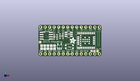
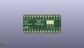
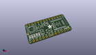

Contents
========

* [PROJ-ADAF-4363-STAN-01>Adafruit Airlift Bitsy Add On PCB](#proj-adaf-4363-stan-01adafruit-airlift-bitsy-add-on-pcb)
	* [Images](#images)
	* [Interactive BOM](#interactive-bom)
	* [OOMP Parts](#oomp-parts)
	* [Tags](#tags)
  
![][im]
# PROJ-ADAF-4363-STAN-01>Adafruit Airlift Bitsy Add On PCB

- ID: PROJ-ADAF-4363-STAN-01
- Hex ID: PRA4363
- Name: Adafruit Airlift Bitsy Add On PCB
- Description: 

## Images
  
  

|eagleImage|kicadPcb3dFront|kicadPcb3dBack|kicadPcb3d|
| :---: | :---: | :---: | :---: |
|||||

## Interactive BOM

- Interactive BOM page: [ibom.html](kicad/bom/ibom.html)

## OOMP Parts
  

|OOMP Parts|
| :---: |
|CAPE-0805-X-UNMATCHED-01, C1, 70.0, 200.0, 90,C1, 10uF, 0805-NO, microbuilder, (70, 200), R90|
|CAPE-0805-X-UNMATCHED-01, C2, 140.0, 200.0, 90,C2, 10uF, 0805-NO, microbuilder, (140, 200), R90|
|CAPE-0805-X-UNMATCHED-01, C3, 211.0, 200.5, 90,C3, 10uF, 0805-NO, microbuilder, (211, 200.5), R90|
|CAPE-0805-X-UNMATCHED-01, C4, 285.0, 201.0, 90,C4, 10uF, 0805-NO, microbuilder, (285, 201), R90|
|CAPE-0805-X-UNMATCHED-01, C5, 357.0, 201.0, 90,C5, 10uF, 0805-NO, microbuilder, (357, 201), R90|
|CAPE-0603-X-NF100-01, C6, 1211.0, 115.0, 0,C6, 0.1uF, 0603-NO, microbuilder, (1211, 115), R0|
|UNMATCHED-UNMATCHED-X-UNMATCHED-01, D7, 671.0, 489.0, 270,D7, RGBLED_3535_PLCC6, microbuilder, (671, 489), R270|
|UNMATCHED-UNMATCHED-X-UNMATCHED-01, IC3, 468.0, 217.0, 0,IC3, 74AHC1G125, SOT23-5L, adafruit, (468, 217), R0|
|UNMATCHED-UNMATCHED-X-UNMATCHED-01, IC4, 173.0, 458.0, 270,IC4, ATECCX08, SOIC8_150MIL, microbuilder, (173, 458), R270|
|UNMATCHED-UNMATCHED-X-UNMATCHED-01, JP2, 700.0, 650.0, 0,JP2, 1X14_ROUND70, microbuilder, (700, 650), R0|
|UNMATCHED-UNMATCHED-X-UNMATCHED-01, JP4, 700.0, 50.0, 180,JP4, 1X14_ROUND70, microbuilder, (700, 50), R180|
|RESE-UNMATCHED-X-UNMATCHED-01, R1, 511.0, 447.0, 90,R1, 1K, RESPACK_4X0603_NO, microbuilder, (511, 447), R90|
|RESE-UNMATCHED-X-O103-01, R2, 380.0, 432.0, 270,R2, 10K, RESPACK_4X0603_NO, microbuilder, (380, 432), R270|
|UNMATCHED-UNMATCHED-X-UNMATCHED-01, SJ6, 487.0, 419.0, SM90,SJ6, SOLDERJUMPER_ARROW_NOPASTE, microbuilder, (487, 419), SMR90|
|UNMATCHED-UNMATCHED-X-UNMATCHED-01, SJ7, 398.0, 419.0, SM90,SJ7, SOLDERJUMPER_ARROW_NOPASTE, microbuilder, (398, 419), SMR90|
|UNMATCHED-UNMATCHED-X-UNMATCHED-01, SJ8, 309.0, 418.99988, M90,SJ8, SOLDERJUMPER_ARROW_NOPASTE, microbuilder, (309, 418.99988), MR90|
|UNMATCHED-UNMATCHED-X-UNMATCHED-01, SW2, 686.0, 210.0, 0,SW2, KMR2, BTN_KMR2_4.6X2.8, microbuilder, (686, 210), R0|
|UNMATCHED-UNMATCHED-X-UNMATCHED-01, U5, 1075.0, 350.0, 180,U5, NINA-W102, ARDUINO-UCS&SOCS_NINA-W1X, microbuilder, (1075, 350), R180|

## Tags

- hexID: PRA4363
- oompType: PROJ
- oompSize: ADAF
- oompColor: 4363
- oompDesc: STAN
- oompIndex: 01
- oompName: Adafruit Airlift Bitsy Add On PCB
- sources: All source files from https://github.com/adafruit/Adafruit-Airlift-Bitsy-Add-On-PCB (source licence details in srcLicense.md)
- linkBuyPage: http://www.adafruit.com/products/4363
- oompPart: CAPE-0805-X-UNMATCHED-01, C1, 70.0, 200.0, 90
- oompPart: CAPE-0805-X-UNMATCHED-01, C2, 140.0, 200.0, 90
- oompPart: CAPE-0805-X-UNMATCHED-01, C3, 211.0, 200.5, 90
- oompPart: CAPE-0805-X-UNMATCHED-01, C4, 285.0, 201.0, 90
- oompPart: CAPE-0805-X-UNMATCHED-01, C5, 357.0, 201.0, 90
- oompPart: CAPE-0603-X-NF100-01, C6, 1211.0, 115.0, 0
- oompPart: UNMATCHED-UNMATCHED-X-UNMATCHED-01, D7, 671.0, 489.0, 270
- oompPart: UNMATCHED-UNMATCHED-X-UNMATCHED-01, IC3, 468.0, 217.0, 0
- oompPart: UNMATCHED-UNMATCHED-X-UNMATCHED-01, IC4, 173.0, 458.0, 270
- oompPart: UNMATCHED-UNMATCHED-X-UNMATCHED-01, JP2, 700.0, 650.0, 0
- oompPart: UNMATCHED-UNMATCHED-X-UNMATCHED-01, JP4, 700.0, 50.0, 180
- oompPart: RESE-UNMATCHED-X-UNMATCHED-01, R1, 511.0, 447.0, 90
- oompPart: RESE-UNMATCHED-X-O103-01, R2, 380.0, 432.0, 270
- oompPart: UNMATCHED-UNMATCHED-X-UNMATCHED-01, SJ6, 487.0, 419.0, SM90
- oompPart: UNMATCHED-UNMATCHED-X-UNMATCHED-01, SJ7, 398.0, 419.0, SM90
- oompPart: UNMATCHED-UNMATCHED-X-UNMATCHED-01, SJ8, 309.0, 418.99988, M90
- oompPart: UNMATCHED-UNMATCHED-X-UNMATCHED-01, SW2, 686.0, 210.0, 0
- oompPart: SKIP-UNMATCHED-X-UNMATCHED-01, U$34, 1311.0, 113.0, 270
- oompPart: SKIP-UNMATCHED-X-UNMATCHED-01, U$35, 38.14173, 314.72441, 90
- oompPart: UNMATCHED-UNMATCHED-X-UNMATCHED-01, U5, 1075.0, 350.0, 180
- rawPart: C1, 10uF, 0805-NO, microbuilder, (70, 200), R90
- rawPart: C2, 10uF, 0805-NO, microbuilder, (140, 200), R90
- rawPart: C3, 10uF, 0805-NO, microbuilder, (211, 200.5), R90
- rawPart: C4, 10uF, 0805-NO, microbuilder, (285, 201), R90
- rawPart: C5, 10uF, 0805-NO, microbuilder, (357, 201), R90
- rawPart: C6, 0.1uF, 0603-NO, microbuilder, (1211, 115), R0
- rawPart: D7, RGBLED_3535_PLCC6, microbuilder, (671, 489), R270
- rawPart: IC3, 74AHC1G125, SOT23-5L, adafruit, (468, 217), R0
- rawPart: IC4, ATECCX08, SOIC8_150MIL, microbuilder, (173, 458), R270
- rawPart: JP2, 1X14_ROUND70, microbuilder, (700, 650), R0
- rawPart: JP4, 1X14_ROUND70, microbuilder, (700, 50), R180
- rawPart: R1, 1K, RESPACK_4X0603_NO, microbuilder, (511, 447), R90
- rawPart: R2, 10K, RESPACK_4X0603_NO, microbuilder, (380, 432), R270
- rawPart: SJ6, SOLDERJUMPER_ARROW_NOPASTE, microbuilder, (487, 419), SMR90
- rawPart: SJ7, SOLDERJUMPER_ARROW_NOPASTE, microbuilder, (398, 419), SMR90
- rawPart: SJ8, SOLDERJUMPER_ARROW_NOPASTE, microbuilder, (309, 418.99988), MR90
- rawPart: SW2, KMR2, BTN_KMR2_4.6X2.8, microbuilder, (686, 210), R0
- rawPart: U$34, FIDUCIAL_1MM, FIDUCIAL_1MM, microbuilder, (1311, 113), R270
- rawPart: U$35, FIDUCIAL_1MM, FIDUCIAL_1MM, microbuilder, (38.14173, 314.72441), R90
- rawPart: U5, NINA-W102, ARDUINO-UCS&SOCS_NINA-W1X, microbuilder, (1075, 350), R180

[im]: kicadPcb3d_450.png
