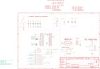

Contents
========

* [PRA4363 > Adafruit Airlift Bitsy Add On PCB](#pra4363--adafruit-airlift-bitsy-add-on-pcb)
	* [Schematic](#schematic)
	* [PCB](#pcb)
	* [Interactive BOM](#interactive-bom)
	* [OOMP Parts](#oomp-parts)
	* [Images](#images)
	* [Tags](#tags)
  
![][im]
# PRA4363 > Adafruit Airlift Bitsy Add On PCB

- ID: PROJ-ADAF-4363-STAN-01
- Hex ID: PRA4363
- Name: Adafruit
- Description: Adafruit
- Long Link: [http://oom.lt/PROJ-ADAF-4363-STAN-01](http://oom.lt/PROJ-ADAF-4363-STAN-01)
- Short Link: [http://oom.lt/PRA4363](http://oom.lt/PRA4363)

## Schematic
  

## PCB
  

## Interactive BOM

- Interactive BOM page: [ibom.html](https://htmlpreview.github.io/?https://github.com/oomlout/oomlout_OOMP_projects/blob/main/PROJ-ADAF-4363-STAN-01/kicad/bom/ibom.html)

## OOMP Parts
  

|OOMP Parts|
| :---: |
|[C1 CAPC-0805-X-UF10-V10 SMD (0805) 10 uF Capacitor (Ceramic) 10v](https://github.com/oomlout/oomlout_OOMP_parts/tree/main/CAPC-0805-X-UF10-V10/)|
|[C2 CAPC-0805-X-UF10-V10 SMD (0805) 10 uF Capacitor (Ceramic) 10v](https://github.com/oomlout/oomlout_OOMP_parts/tree/main/CAPC-0805-X-UF10-V10/)|
|[C3 CAPC-0805-X-UF10-V10 SMD (0805) 10 uF Capacitor (Ceramic) 10v](https://github.com/oomlout/oomlout_OOMP_parts/tree/main/CAPC-0805-X-UF10-V10/)|
|[C4 CAPC-0805-X-UF10-V10 SMD (0805) 10 uF Capacitor (Ceramic) 10v](https://github.com/oomlout/oomlout_OOMP_parts/tree/main/CAPC-0805-X-UF10-V10/)|
|[C5 CAPC-0805-X-UF10-V10 SMD (0805) 10 uF Capacitor (Ceramic) 10v](https://github.com/oomlout/oomlout_OOMP_parts/tree/main/CAPC-0805-X-UF10-V10/)|
|C6 C6,CAPC-0603-X-UF1D-01|
|D7 D7,LEDS-3535-G-STAN-01|
|IC3 IC3,UNMATCHED-SO235-X-UNMATCHED-01|
|IC4 IC4,UNMATCHED-UNMATCHED-X-UNMATCHED-01|
|[JP2 HEAD-I01-X-PI14-01 2.54 mm 14 Pin Header](https://github.com/oomlout/oomlout_OOMP_parts/tree/main/HEAD-I01-X-PI14-01/)|
|[JP4 HEAD-I01-X-PI14-01 2.54 mm 14 Pin Header](https://github.com/oomlout/oomlout_OOMP_parts/tree/main/HEAD-I01-X-PI14-01/)|
|R1 R1,RESA-06038-X-O102X4-01|
|R2 R2,RESA-06038-X-O103X4-01|
|SW2 SW2,UNMATCHED-UNMATCHED-X-UNMATCHED-01|
|U5 U5,UNMATCHED-UNMATCHED-X-UNMATCHED-01|

## Images
  
  

|kicadPcb3d|kicadPcb3dFront|kicadPcb3dBack|eagleImage|eagleSchemImage|
| :---: | :---: | :---: | :---: | :---: |
||||||

## Tags

- hexID: PRA4363
- oompType: PROJ
- oompSize: ADAF
- oompColor: 4363
- oompDesc: STAN
- oompIndex: 01
- oompName: Adafruit Airlift Bitsy Add On PCB
- sources: All source files from https://github.com/adafruit/Adafruit-Airlift-Bitsy-Add-On-PCB (source licence details in srcLicense.md)
- linkBuyPage: http://www.adafruit.com/products/4363
- oompID: PROJ-ADAF-4363-STAN-01
- oompParts: C1,CAPC-0805-X-UF10-V10
- oompParts: C2,CAPC-0805-X-UF10-V10
- oompParts: C3,CAPC-0805-X-UF10-V10
- oompParts: C4,CAPC-0805-X-UF10-V10
- oompParts: C5,CAPC-0805-X-UF10-V10
- oompParts: C6,CAPC-0603-X-UF1D-01
- oompParts: D7,LEDS-3535-G-STAN-01
- oompParts: IC3,UNMATCHED-SO235-X-UNMATCHED-01
- oompParts: IC4,UNMATCHED-UNMATCHED-X-UNMATCHED-01
- oompParts: JP2,HEAD-I01-X-PI14-01
- oompParts: JP4,HEAD-I01-X-PI14-01
- oompParts: R1,RESA-06038-X-O102X4-01
- oompParts: R2,RESA-06038-X-O103X4-01
- oompParts: SW2,UNMATCHED-UNMATCHED-X-UNMATCHED-01
- oompParts: U5,UNMATCHED-UNMATCHED-X-UNMATCHED-01
- rawParts: C1,10uF,CAP_CERAMIC0805-NOOUTLINE,0805-NO,Ceramic Capacitors,,,,,,,,,
- rawParts: C2,10uF,CAP_CERAMIC0805-NOOUTLINE,0805-NO,Ceramic Capacitors,,,,,,,,,
- rawParts: C3,10uF,CAP_CERAMIC0805-NOOUTLINE,0805-NO,Ceramic Capacitors,,,,,,,,,
- rawParts: C4,10uF,CAP_CERAMIC0805-NOOUTLINE,0805-NO,Ceramic Capacitors,,,,,,,,,
- rawParts: C5,10uF,CAP_CERAMIC0805-NOOUTLINE,0805-NO,Ceramic Capacitors,,,,,,,,,
- rawParts: C6,0.1uF,CAP_CERAMIC0603_NO,0603-NO,Ceramic Capacitors,,,,,,,,,
- rawParts: D7,,LED_RGB_PLCC63535,RGBLED_3535_PLCC6,RGB LED,,,,,,,,,
- rawParts: IC3,74AHC1G125,74AHC1G125,SOT23-5L,,,,,,,,,,
- rawParts: IC4,ATECCX08,ATECCX08,SOIC8_150MIL,,,,,,,,,,
- rawParts: JP2,,HEADER-1X14,1X14_ROUND70,,,,,,,,,,
- rawParts: JP4,,HEADER-1X14,1X14_ROUND70,,,,,,,,,,
- rawParts: R1,1K,RESISTOR_4PACK_NO,RESPACK_4X0603_NO,Resistor Packs (4 resistors),,,,,,,,,
- rawParts: R2,10K,RESISTOR_4PACK_NO,RESPACK_4X0603_NO,Resistor Packs (4 resistors),,,,,,,,,
- rawParts: SJ6,,SOLDERJUMPER,SOLDERJUMPER_ARROW_NOPASTE,SMD Solder JUMPER,EXCLUDE,,,,,,,,
- rawParts: SJ7,,SOLDERJUMPER,SOLDERJUMPER_ARROW_NOPASTE,SMD Solder JUMPER,EXCLUDE,,,,,,,,
- rawParts: SJ8,,SOLDERJUMPER,SOLDERJUMPER_ARROW_NOPASTE,SMD Solder JUMPER,EXCLUDE,,,,,,,,
- rawParts: SW2,KMR2,SWITCH_TACT_SMT4.6X2.8,BTN_KMR2_4.6X2.8,SMT Tact Switches,,,,,,,,,
- rawParts: U$34,FIDUCIAL_1MM,FIDUCIAL_1MM,FIDUCIAL_1MM,Fiducial Alignment Points,EXCLUDE,,,,,,,,
- rawParts: U$35,FIDUCIAL_1MM,FIDUCIAL_1MM,FIDUCIAL_1MM,Fiducial Alignment Points,EXCLUDE,,,,,,,,
- rawParts: U5,NINA-W102,NINA-W10X-102NINA-W10X,ARDUINO-UCS&SOCS_NINA-W1X,uBlox NINA-W10X ESP32 WiFi/BLE module,,2205,https://www.u-blox.com/sites/default/files/NINA-W1_DataSheet_%28UBX-17006694%29.pdf,https://www.digikey.com/product-detail/en/u-blox-america-inc/NINA-W102/672-1070-1-ND/7931820,672-1070-1-ND,Ublocks,NINA-W102,NINA-W102,

[im]: kicadPcb3d_450.png
