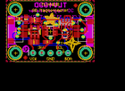

Contents
========

* [PROJ-ADAF-4366-STAN-01>Adafruit TLV493D PCB](#proj-adaf-4366-stan-01adafruit-tlv493d-pcb)
	* [Images](#images)
	* [Interactive BOM](#interactive-bom)
	* [Tags](#tags)
  
![][im]
# PROJ-ADAF-4366-STAN-01>Adafruit TLV493D PCB

- ID: PROJ-ADAF-4366-STAN-01
- Hex ID: PRA4366
- Name: Adafruit TLV493D PCB
- Description: 

## Images
  
  

|eagleImage|
| :---: |
||

## Interactive BOM

- Interactive BOM page: [ibom.html](kicad/bom/ibom.html)

## Tags

- hexID: PRA4366
- oompType: PROJ
- oompSize: ADAF
- oompColor: 4366
- oompDesc: STAN
- oompIndex: 01
- oompName: Adafruit TLV493D PCB
- sources: All source files from https://github.com/adafruit/Adafruit-TLV493D-PCB (source licence details in srcLicense.md)
- linkBuyPage: http://www.adafruit.com/products/4366
- oompPart: CAPC-0603-X-NF100-V50, C1, 11.811, 5.715, 180
- oompPart: CAPC-0805-X-UF10-V25, C2, 7.874, 5.715, 0
- oompPart: CAPC-0805-X-UF10-V25, C3, 8.128, 12.191999999999998, 0
- oompPart: UNMATCHED-UNMATCHED-X-UNMATCHED-01, CONN3, 22.86, 8.889999999999999, 90
- oompPart: UNMATCHED-UNMATCHED-X-UNMATCHED-01, CONN4, 2.54, 8.889999999999999, 270
- oompPart: UNMATCHED-UNMATCHED-X-UNMATCHED-01, D1, 3.556, 12.572999999999999, 90
- oompPart: SKIP-UNMATCHED-X-UNMATCHED-01, FID3, 5.334, 1.2065, 0
- oompPart: SKIP-UNMATCHED-X-UNMATCHED-01, FID4, 19.939, 16.4211, 0
- oompPart: UNMATCHED-UNMATCHED-X-UNMATCHED-01, IC1, 12.7, 8.889999999999999, 270
- oompPart: UNMATCHED-UNMATCHED-X-UNMATCHED-01, JP2, 12.7, 2.54, 0
- oompPart: UNMATCHED-UNMATCHED-X-UNMATCHED-01, Q2, 16.891, 8.001, 90
- oompPart: RESE-0603-X-O103-01, R1, 5.588, 12.446, 270
- oompPart: RESE-UNMATCHED-X-O103-01, R3, 17.145, 11.43, 180
- oompPart: SKIP-UNMATCHED-X-UNMATCHED-01, U$1, 2.54, 15.239999999999998, 0
- oompPart: SKIP-UNMATCHED-X-UNMATCHED-01, U$17, 22.86, 15.239999999999998, 0
- oompPart: SKIP-UNMATCHED-X-UNMATCHED-01, U$19, 2.54, 2.54, 0
- oompPart: SKIP-UNMATCHED-X-UNMATCHED-01, U$21, 22.86, 2.54, 0
- oompPart: UNMATCHED-UNMATCHED-X-UNMATCHED-01, U2, 8.128, 8.762999999999998, 0
- rawPart: 

[im]: eagleImage_450.png
