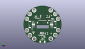
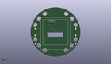
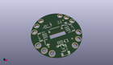

Contents
========

* [PROJ-ADAF-4367-STAN-01>Adafruit TFT Gizmo PCB](#proj-adaf-4367-stan-01adafruit-tft-gizmo-pcb)
	* [Images](#images)
	* [Interactive BOM](#interactive-bom)
	* [Tags](#tags)
  
![][im]
# PROJ-ADAF-4367-STAN-01>Adafruit TFT Gizmo PCB

- ID: PROJ-ADAF-4367-STAN-01
- Hex ID: PRA4367
- Name: Adafruit TFT Gizmo PCB
- Description: 

## Images
  
  

|eagleImage|kicadPcb3dFront|kicadPcb3dBack|kicadPcb3d|
| :---: | :---: | :---: | :---: |
|||||

## Interactive BOM

- Interactive BOM page: [ibom.html](kicad/bom/ibom.html)

## Tags

- hexID: PRA4367
- oompType: PROJ
- oompSize: ADAF
- oompColor: 4367
- oompDesc: STAN
- oompIndex: 01
- oompName: Adafruit TFT Gizmo PCB
- sources: All source files from https://github.com/adafruit/Adafruit-TFT-Gizmo-PCB (source licence details in srcLicense.md)
- linkBuyPage: http://www.adafruit.com/products/4367
- oompID: PROJ-ADAF-4367-STAN-01
- oompParts: C1,UNMATCHED-UNMATCHED-UNMATCHED-UNMATCHED-UNMATCHED
- oompParts: C2,UNMATCHED-UNMATCHED-UNMATCHED-UNMATCHED-UNMATCHED
- oompParts: C9,UNMATCHED-UNMATCHED-UNMATCHED-UNMATCHED-UNMATCHED
- oompParts: C13,UNMATCHED-UNMATCHED-UNMATCHED-UNMATCHED-UNMATCHED
- oompParts: C15,UNMATCHED-UNMATCHED-UNMATCHED-UNMATCHED-UNMATCHED
- oompParts: D1,UNMATCHED-UNMATCHED-UNMATCHED-UNMATCHED-UNMATCHED
- oompParts: D2,UNMATCHED-UNMATCHED-UNMATCHED-UNMATCHED-UNMATCHED
- oompParts: IC4,UNMATCHED-UNMATCHED-UNMATCHED-UNMATCHED-UNMATCHED
- oompParts: LEFT,UNMATCHED-UNMATCHED-UNMATCHED-UNMATCHED-UNMATCHED
- oompParts: Q1,UNMATCHED-UNMATCHED-UNMATCHED-UNMATCHED-UNMATCHED
- oompParts: R1,UNMATCHED-UNMATCHED-UNMATCHED-UNMATCHED-UNMATCHED
- oompParts: R2,UNMATCHED-UNMATCHED-UNMATCHED-UNMATCHED-UNMATCHED
- oompParts: R3,UNMATCHED-UNMATCHED-UNMATCHED-UNMATCHED-UNMATCHED
- oompParts: R4,UNMATCHED-UNMATCHED-UNMATCHED-UNMATCHED-UNMATCHED
- oompParts: R5,UNMATCHED-UNMATCHED-UNMATCHED-UNMATCHED-UNMATCHED
- oompParts: R12,UNMATCHED-UNMATCHED-UNMATCHED-UNMATCHED-UNMATCHED
- oompParts: R13,UNMATCHED-UNMATCHED-UNMATCHED-UNMATCHED-UNMATCHED
- oompParts: RIGHT,UNMATCHED-UNMATCHED-UNMATCHED-UNMATCHED-UNMATCHED
- oompParts: TFT2,UNMATCHED-UNMATCHED-UNMATCHED-UNMATCHED-UNMATCHED
- oompParts: TP1,UNMATCHED-UNMATCHED-UNMATCHED-UNMATCHED-UNMATCHED
- oompParts: TP2,UNMATCHED-UNMATCHED-UNMATCHED-UNMATCHED-UNMATCHED
- oompParts: TP3,UNMATCHED-UNMATCHED-UNMATCHED-UNMATCHED-UNMATCHED
- oompParts: TP4,UNMATCHED-UNMATCHED-UNMATCHED-UNMATCHED-UNMATCHED
- oompParts: TP5,UNMATCHED-UNMATCHED-UNMATCHED-UNMATCHED-UNMATCHED
- oompParts: TP6,UNMATCHED-UNMATCHED-UNMATCHED-UNMATCHED-UNMATCHED
- oompParts: TP7,UNMATCHED-UNMATCHED-UNMATCHED-UNMATCHED-UNMATCHED
- oompParts: TP8,UNMATCHED-UNMATCHED-UNMATCHED-UNMATCHED-UNMATCHED
- oompParts: TP9,UNMATCHED-UNMATCHED-UNMATCHED-UNMATCHED-UNMATCHED
- oompParts: TP10,UNMATCHED-UNMATCHED-UNMATCHED-UNMATCHED-UNMATCHED
- oompParts: TP11,UNMATCHED-UNMATCHED-UNMATCHED-UNMATCHED-UNMATCHED
- oompParts: TP12,UNMATCHED-UNMATCHED-UNMATCHED-UNMATCHED-UNMATCHED
- oompParts: TP13,UNMATCHED-UNMATCHED-UNMATCHED-UNMATCHED-UNMATCHED
- oompParts: TP14,UNMATCHED-UNMATCHED-UNMATCHED-UNMATCHED-UNMATCHED
- oompParts: TP15,UNMATCHED-UNMATCHED-UNMATCHED-UNMATCHED-UNMATCHED
- oompParts: TP16,UNMATCHED-UNMATCHED-UNMATCHED-UNMATCHED-UNMATCHED
- oompParts: TP17,UNMATCHED-UNMATCHED-UNMATCHED-UNMATCHED-UNMATCHED
- oompParts: TP18,UNMATCHED-UNMATCHED-UNMATCHED-UNMATCHED-UNMATCHED
- oompParts: U$1,UNMATCHED-UNMATCHED-UNMATCHED-UNMATCHED-UNMATCHED
- oompParts: U5,UNMATCHED-UNMATCHED-UNMATCHED-UNMATCHED-UNMATCHED
- oompParts: VR2,UNMATCHED-UNMATCHED-UNMATCHED-UNMATCHED-UNMATCHED
- rawParts: C1,10uF,CAP_CERAMIC0805-NOOUTLINE,0805-NO,Ceramic Capacitors,,
- rawParts: C2,10uF,CAP_CERAMIC0805-NOOUTLINE,0805-NO,Ceramic Capacitors,,
- rawParts: C9,1uF,CAP_CERAMIC0603_NO,0603-NO,Ceramic Capacitors,,
- rawParts: C13,1uF,CAP_CERAMIC0603_NO,0603-NO,Ceramic Capacitors,,
- rawParts: C15,10uF,CAP_CERAMIC0805-NOOUTLINE,0805-NO,Ceramic Capacitors,,
- rawParts: D1,3.6V,DIODE-ZENERSOD323,SOD-323,Zener Diode,,
- rawParts: D2,3.6V,DIODE-ZENERSOD323,SOD-323,Zener Diode,,
- rawParts: IC4,APX803-SAG,AXP083-SAG,SOT23,,,
- rawParts: LEFT,JST PH 3,CON_JST_PH_3PIN,JSTPH3,,,
- rawParts: Q1,BSS138,MOSFET-NWIDE,SOT23-WIDE,N-Channel Mosfet,,
- rawParts: R1,33 ohm,RESISTOR_0603_NOOUT,0603-NO,Resistors,,
- rawParts: R2,1K,RESISTOR_0603_NOOUT,0603-NO,Resistors,,
- rawParts: R3,10K,RESISTOR_0603_NOOUT,0603-NO,Resistors,,
- rawParts: R4,10K,RESISTOR_0603_NOOUT,0603-NO,Resistors,,
- rawParts: R5,1K,RESISTOR_0603_NOOUT,0603-NO,Resistors,,
- rawParts: R12,100,RESISTOR_0603_NOOUT,0603-NO,Resistors,,
- rawParts: R13,100,RESISTOR_0603_NOOUT,0603-NO,Resistors,,
- rawParts: RIGHT,JST PH 3,CON_JST_PH_3PIN,JSTPH3,,,
- rawParts: TFT2,DISP_TFT_1.54IN_240X240_22P,DISP_TFT_1.54IN_240X240_22P,TFT_1.54IN_240X240_22PIN,,,
- rawParts: TP1,,TESTPOINTROUND1.5MMNO,TESTPOINT_ROUND_1.5MM_NO,Test Point,,
- rawParts: TP2,SEWTAP_SMTNUTM3,SEWTAP_SMTNUTM3,SMT_NUT_3MM,,,
- rawParts: TP3,SEWTAP_SMTNUTM3,SEWTAP_SMTNUTM3,SMT_NUT_3MM,,,
- rawParts: TP4,SEWTAP_SMTNUTM3,SEWTAP_SMTNUTM3,SMT_NUT_3MM,,,
- rawParts: TP5,SEWTAP_SMTNUTM3,SEWTAP_SMTNUTM3,SMT_NUT_3MM,,,
- rawParts: TP6,SEWTAP_SMTNUTM3,SEWTAP_SMTNUTM3,SMT_NUT_3MM,,,
- rawParts: TP7,SEWTAP_SMTNUTM3,SEWTAP_SMTNUTM3,SMT_NUT_3MM,,,
- rawParts: TP8,SEWTAP_SMTNUTM3,SEWTAP_SMTNUTM3,SMT_NUT_3MM,,,
- rawParts: TP9,SEWTAP_SMTNUTM3,SEWTAP_SMTNUTM3,SMT_NUT_3MM,,,
- rawParts: TP10,SEWTAP_SMTNUTM3,SEWTAP_SMTNUTM3,SMT_NUT_3MM,,,
- rawParts: TP11,SEWTAP_SMTNUTM3,SEWTAP_SMTNUTM3,SMT_NUT_3MM,,,
- rawParts: TP12,SEWTAP_SMTNUTM3,SEWTAP_SMTNUTM3,SMT_NUT_3MM,,,
- rawParts: TP13,SEWTAP_SMTNUTM3,SEWTAP_SMTNUTM3,SMT_NUT_3MM,,,
- rawParts: TP14,,TESTPOINTROUND1.5MMNO,TESTPOINT_ROUND_1.5MM_NO,Test Point,,
- rawParts: TP15,,TESTPOINTROUND1.5MMNO,TESTPOINT_ROUND_1.5MM_NO,Test Point,,
- rawParts: TP16,,TESTPOINTROUND1.5MMNO,TESTPOINT_ROUND_1.5MM_NO,Test Point,,
- rawParts: TP17,,TESTPOINTROUND1.5MMNO,TESTPOINT_ROUND_1.5MM_NO,Test Point,,
- rawParts: TP18,,TESTPOINTROUND1.5MMNO,TESTPOINT_ROUND_1.5MM_NO,Test Point,,
- rawParts: U$1,CON_MOLEX_2P,CON_MOLEX_2P,53398-0271,,,
- rawParts: U$2,FIDUCIAL_1MM,FIDUCIAL_1MM,FIDUCIAL_1MM,Fiducial Alignment Points,EXCLUDE,
- rawParts: U$3,FIDUCIAL_1MM,FIDUCIAL_1MM,FIDUCIAL_1MM,Fiducial Alignment Points,EXCLUDE,
- rawParts: U$6,FIDUCIAL_1MM,FIDUCIAL_1MM,FIDUCIAL_1MM,Fiducial Alignment Points,EXCLUDE,
- rawParts: U5,PAM8302AASCR,AUDIOAMP_PAM8302A,MSOP8_0.65MM,PAM8302A - 2.5W Class-D Mono Audio Amplifier,,
- rawParts: VR2,10K trim,TRIMPOT3303W/X,TRIMPOT_BOURNS_3303W,3-Pin SMT Trimpots,,

[im]: kicadPcb3d_450.png
