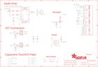

Contents
========

* [PRA4367 > Adafruit TFT Gizmo PCB](#pra4367--adafruit-tft-gizmo-pcb)
	* [Schematic](#schematic)
	* [PCB](#pcb)
	* [Interactive BOM](#interactive-bom)
	* [OOMP Parts](#oomp-parts)
	* [Images](#images)
	* [Tags](#tags)
  
![][im]
# PRA4367 > Adafruit TFT Gizmo PCB

- ID: PROJ-ADAF-4367-STAN-01
- Hex ID: PRA4367
- Name: Adafruit
- Description: Adafruit
- Long Link: [http://oom.lt/PROJ-ADAF-4367-STAN-01](http://oom.lt/PROJ-ADAF-4367-STAN-01)
- Short Link: [http://oom.lt/PRA4367](http://oom.lt/PRA4367)

## Schematic
  

## PCB
  

## Interactive BOM

- Interactive BOM page: [ibom.html](https://htmlpreview.github.io/?https://github.com/oomlout/oomlout_OOMP_projects/blob/main/PROJ-ADAF-4367-STAN-01/kicad/bom/ibom.html)

## OOMP Parts
  

|OOMP Parts|
| :---: |
|[CAPC-0805-X-UF10-V10  SMD (0805) 10 uF Capacitor (Ceramic) 10v  C1, C2, C15](https://github.com/oomlout/oomlout_OOMP_parts/tree/main/CAPC-0805-X-UF10-V10/)|
|[CAPC-0603-X-UF1-V25  SMD (0603) 1 uF Capacitor (Ceramic) 25v  C9, C13](https://github.com/oomlout/oomlout_OOMP_parts/tree/main/CAPC-0603-X-UF1-V25/)|
|DIOD-S323-X-UNMATCHED-01 D1, D2|
|UNMATCHED-SO23-X-UNMATCHED-01 IC4|
|UNMATCHED-UNMATCHED-X-UNMATCHED-01 LEFT, RIGHT, TFT2, U$1, U5, VR2|
|[MOSN-SO23-X-KBSS138-01  SMD (SOT-23) BSS138 N-Ch. MOSFET  Q1](https://github.com/oomlout/oomlout_OOMP_parts/tree/main/MOSN-SO23-X-KBSS138-01/)|
|RESE-0603-X-UNMATCHED-01 R1|
|[RESE-0603-X-O102-01  SMD (0603) 1k Ohm Resistor  R2, R5](https://github.com/oomlout/oomlout_OOMP_parts/tree/main/RESE-0603-X-O102-01/)|
|[RESE-0603-X-O103-01  SMD (0603) 10k Ohm Resistor  R3, R4](https://github.com/oomlout/oomlout_OOMP_parts/tree/main/RESE-0603-X-O103-01/)|
|[RESE-0603-X-O101-01  SMD (0603) 100 Ohm Resistor  R12, R13](https://github.com/oomlout/oomlout_OOMP_parts/tree/main/RESE-0603-X-O101-01/)|

## Images
  
  

|bominteractivefront|bominteractiveback|kicadPcb3d|kicadPcb3dFront|kicadPcb3dBack|eagleImage|eagleSchemImage|pcbdraw|pcbdrawback|
| :---: | :---: | :---: | :---: | :---: | :---: | :---: | :---: | :---: |
||||||||||

## Tags

- hexID: PRA4367
- oompType: PROJ
- oompSize: ADAF
- oompColor: 4367
- oompDesc: STAN
- oompIndex: 01
- oompName: Adafruit TFT Gizmo PCB
- sources: All source files from https://github.com/adafruit/Adafruit-TFT-Gizmo-PCB (source licence details in srcLicense.md)
- linkBuyPage: http://www.adafruit.com/products/4367
- oompID: PROJ-ADAF-4367-STAN-01
- oompParts: C1,CAPC-0805-X-UF10-V10
- oompParts: C2,CAPC-0805-X-UF10-V10
- oompParts: C9,CAPC-0603-X-UF1-V25
- oompParts: C13,CAPC-0603-X-UF1-V25
- oompParts: C15,CAPC-0805-X-UF10-V10
- oompParts: D1,DIOD-S323-X-UNMATCHED-01
- oompParts: D2,DIOD-S323-X-UNMATCHED-01
- oompParts: IC4,UNMATCHED-SO23-X-UNMATCHED-01
- oompParts: LEFT,UNMATCHED-UNMATCHED-X-UNMATCHED-01
- oompParts: Q1,MOSN-SO23-X-KBSS138-01
- oompParts: R1,RESE-0603-X-UNMATCHED-01
- oompParts: R2,RESE-0603-X-O102-01
- oompParts: R3,RESE-0603-X-O103-01
- oompParts: R4,RESE-0603-X-O103-01
- oompParts: R5,RESE-0603-X-O102-01
- oompParts: R12,RESE-0603-X-O101-01
- oompParts: R13,RESE-0603-X-O101-01
- oompParts: RIGHT,UNMATCHED-UNMATCHED-X-UNMATCHED-01
- oompParts: TFT2,UNMATCHED-UNMATCHED-X-UNMATCHED-01
- oompParts: U$1,UNMATCHED-UNMATCHED-X-UNMATCHED-01
- oompParts: U5,UNMATCHED-UNMATCHED-X-UNMATCHED-01
- oompParts: VR2,UNMATCHED-UNMATCHED-X-UNMATCHED-01
- rawParts: C1,10uF,CAP_CERAMIC0805-NOOUTLINE,0805-NO,Ceramic Capacitors,,
- rawParts: C2,10uF,CAP_CERAMIC0805-NOOUTLINE,0805-NO,Ceramic Capacitors,,
- rawParts: C9,1uF,CAP_CERAMIC0603_NO,0603-NO,Ceramic Capacitors,,
- rawParts: C13,1uF,CAP_CERAMIC0603_NO,0603-NO,Ceramic Capacitors,,
- rawParts: C15,10uF,CAP_CERAMIC0805-NOOUTLINE,0805-NO,Ceramic Capacitors,,
- rawParts: D1,3.6V,DIODE-ZENERSOD323,SOD-323,Zener Diode,,
- rawParts: D2,3.6V,DIODE-ZENERSOD323,SOD-323,Zener Diode,,
- rawParts: IC4,APX803-SAG,AXP083-SAG,SOT23,,,
- rawParts: LEFT,JST PH 3,CON_JST_PH_3PIN,JSTPH3,,,
- rawParts: Q1,BSS138,MOSFET-NWIDE,SOT23-WIDE,N-Channel Mosfet,,
- rawParts: R1,33 ohm,RESISTOR_0603_NOOUT,0603-NO,Resistors,,
- rawParts: R2,1K,RESISTOR_0603_NOOUT,0603-NO,Resistors,,
- rawParts: R3,10K,RESISTOR_0603_NOOUT,0603-NO,Resistors,,
- rawParts: R4,10K,RESISTOR_0603_NOOUT,0603-NO,Resistors,,
- rawParts: R5,1K,RESISTOR_0603_NOOUT,0603-NO,Resistors,,
- rawParts: R12,100,RESISTOR_0603_NOOUT,0603-NO,Resistors,,
- rawParts: R13,100,RESISTOR_0603_NOOUT,0603-NO,Resistors,,
- rawParts: RIGHT,JST PH 3,CON_JST_PH_3PIN,JSTPH3,,,
- rawParts: TFT2,DISP_TFT_1.54IN_240X240_22P,DISP_TFT_1.54IN_240X240_22P,TFT_1.54IN_240X240_22PIN,,,
- rawParts: TP1,,TESTPOINTROUND1.5MMNO,TESTPOINT_ROUND_1.5MM_NO,Test Point,,
- rawParts: TP2,SEWTAP_SMTNUTM3,SEWTAP_SMTNUTM3,SMT_NUT_3MM,,,
- rawParts: TP3,SEWTAP_SMTNUTM3,SEWTAP_SMTNUTM3,SMT_NUT_3MM,,,
- rawParts: TP4,SEWTAP_SMTNUTM3,SEWTAP_SMTNUTM3,SMT_NUT_3MM,,,
- rawParts: TP5,SEWTAP_SMTNUTM3,SEWTAP_SMTNUTM3,SMT_NUT_3MM,,,
- rawParts: TP6,SEWTAP_SMTNUTM3,SEWTAP_SMTNUTM3,SMT_NUT_3MM,,,
- rawParts: TP7,SEWTAP_SMTNUTM3,SEWTAP_SMTNUTM3,SMT_NUT_3MM,,,
- rawParts: TP8,SEWTAP_SMTNUTM3,SEWTAP_SMTNUTM3,SMT_NUT_3MM,,,
- rawParts: TP9,SEWTAP_SMTNUTM3,SEWTAP_SMTNUTM3,SMT_NUT_3MM,,,
- rawParts: TP10,SEWTAP_SMTNUTM3,SEWTAP_SMTNUTM3,SMT_NUT_3MM,,,
- rawParts: TP11,SEWTAP_SMTNUTM3,SEWTAP_SMTNUTM3,SMT_NUT_3MM,,,
- rawParts: TP12,SEWTAP_SMTNUTM3,SEWTAP_SMTNUTM3,SMT_NUT_3MM,,,
- rawParts: TP13,SEWTAP_SMTNUTM3,SEWTAP_SMTNUTM3,SMT_NUT_3MM,,,
- rawParts: TP14,,TESTPOINTROUND1.5MMNO,TESTPOINT_ROUND_1.5MM_NO,Test Point,,
- rawParts: TP15,,TESTPOINTROUND1.5MMNO,TESTPOINT_ROUND_1.5MM_NO,Test Point,,
- rawParts: TP16,,TESTPOINTROUND1.5MMNO,TESTPOINT_ROUND_1.5MM_NO,Test Point,,
- rawParts: TP17,,TESTPOINTROUND1.5MMNO,TESTPOINT_ROUND_1.5MM_NO,Test Point,,
- rawParts: TP18,,TESTPOINTROUND1.5MMNO,TESTPOINT_ROUND_1.5MM_NO,Test Point,,
- rawParts: U$1,CON_MOLEX_2P,CON_MOLEX_2P,53398-0271,,,
- rawParts: U$2,FIDUCIAL_1MM,FIDUCIAL_1MM,FIDUCIAL_1MM,Fiducial Alignment Points,EXCLUDE,
- rawParts: U$3,FIDUCIAL_1MM,FIDUCIAL_1MM,FIDUCIAL_1MM,Fiducial Alignment Points,EXCLUDE,
- rawParts: U$6,FIDUCIAL_1MM,FIDUCIAL_1MM,FIDUCIAL_1MM,Fiducial Alignment Points,EXCLUDE,
- rawParts: U5,PAM8302AASCR,AUDIOAMP_PAM8302A,MSOP8_0.65MM,PAM8302A - 2.5W Class-D Mono Audio Amplifier,,
- rawParts: VR2,10K trim,TRIMPOT3303W/X,TRIMPOT_BOURNS_3303W,3-Pin SMT Trimpots,,

[im]: kicadPcb3d_450.png
