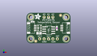
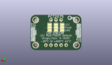
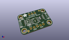

Contents
========

* [PROJ-ADAF-4369-STAN-01>Adafruit PCT2075 PCB](#proj-adaf-4369-stan-01adafruit-pct2075-pcb)
	* [Images](#images)
	* [Interactive BOM](#interactive-bom)
	* [OOMP Parts](#oomp-parts)
	* [Tags](#tags)
  
![][im]
# PROJ-ADAF-4369-STAN-01>Adafruit PCT2075 PCB

- ID: PROJ-ADAF-4369-STAN-01
- Hex ID: PRA4369
- Name: Adafruit PCT2075 PCB
- Description: 

## Images
  
  

|eagleImage|kicadPcb3dFront|kicadPcb3dBack|kicadPcb3d|
| :---: | :---: | :---: | :---: |
|||||

## Interactive BOM

- Interactive BOM page: [ibom.html](kicad/bom/ibom.html)

## OOMP Parts
  

|OOMP Parts|
| :---: |
|CAPE-0603-X-NF100-01, C1, 690.0, 345.0, 270,C1, 0.1uF, 0603-NO, microbuilder, (690, 345), R270|
|CAPE-0805-X-UNMATCHED-01, C2, 285.0, 230.0, 0,C2, 10uF, 0805-NO, microbuilder, (285, 230), R0|
|UNMATCHED-UNMATCHED-X-UNMATCHED-01, CONN3, 900.0, 350.0, 90,CONN3, STEMMA_I2C_QT, JST_SH4, microbuilder, (900, 350), R90|
|UNMATCHED-UNMATCHED-X-UNMATCHED-01, CONN4, 100.0, 350.0, 270,CONN4, STEMMA_I2C_QT, JST_SH4, microbuilder, (100, 350), R270|
|UNMATCHED-UNMATCHED-X-UNMATCHED-01, D1, 140.0, 495.0, 90,D1, GREEN, CHIPLED_0603_NOOUTLINE, microbuilder, (140, 495), R90|
|UNMATCHED-UNMATCHED-X-UNMATCHED-01, JP2, 500.0, 600.0, 0,JP2, 1X03_ROUND, microbuilder, (500, 600), R0|
|UNMATCHED-UNMATCHED-X-UNMATCHED-01, JP3, 500.0, 100.0, 0,JP3, 1X05_ROUND, microbuilder, (500, 100), R0|
|RESE-UNMATCHED-X-O103-01, R3, 295.0, 350.0, 270,R3, 10K, RESPACK_4X0603, microbuilder, (295, 350), R270|
|UNMATCHED-UNMATCHED-X-UNMATCHED-01, SJ4, 380.0, 450.0, M90,SJ4, SOLDERJUMPER_2WAY_OPEN_NOPASTE, microbuilder, (380, 450), MR90|
|UNMATCHED-UNMATCHED-X-UNMATCHED-01, SJ5, 500.0, 450.0, M90,SJ5, SOLDERJUMPER_2WAY_OPEN_NOPASTE, microbuilder, (500, 450), MR90|
|UNMATCHED-UNMATCHED-X-UNMATCHED-01, SJ6, 625.0, 450.0, M90,SJ6, SOLDERJUMPER_2WAY_OPEN_NOPASTE, microbuilder, (625, 450), MR90|

## Tags

- hexID: PRA4369
- oompType: PROJ
- oompSize: ADAF
- oompColor: 4369
- oompDesc: STAN
- oompIndex: 01
- oompName: Adafruit PCT2075 PCB
- sources: All source files from https://github.com/adafruit/Adafruit-PCT2075-PCB (source licence details in srcLicense.md)
- linkBuyPage: http://www.adafruit.com/products/4369
- oompPart: CAPE-0603-X-NF100-01, C1, 690.0, 345.0, 270
- oompPart: CAPE-0805-X-UNMATCHED-01, C2, 285.0, 230.0, 0
- oompPart: UNMATCHED-UNMATCHED-X-UNMATCHED-01, CONN3, 900.0, 350.0, 90
- oompPart: UNMATCHED-UNMATCHED-X-UNMATCHED-01, CONN4, 100.0, 350.0, 270
- oompPart: UNMATCHED-UNMATCHED-X-UNMATCHED-01, D1, 140.0, 495.0, 90
- oompPart: SKIP-UNMATCHED-X-UNMATCHED-01, FID3, 210.0, 47.5, 0
- oompPart: SKIP-UNMATCHED-X-UNMATCHED-01, FID4, 775.0, 641.5, 0
- oompPart: UNMATCHED-UNMATCHED-X-UNMATCHED-01, JP2, 500.0, 600.0, 0
- oompPart: UNMATCHED-UNMATCHED-X-UNMATCHED-01, JP3, 500.0, 100.0, 0
- oompPart: RESE-UNMATCHED-X-O103-01, R3, 295.0, 350.0, 270
- oompPart: UNMATCHED-UNMATCHED-X-UNMATCHED-01, SJ4, 380.0, 450.0, M90
- oompPart: UNMATCHED-UNMATCHED-X-UNMATCHED-01, SJ5, 500.0, 450.0, M90
- oompPart: UNMATCHED-UNMATCHED-X-UNMATCHED-01, SJ6, 625.0, 450.0, M90
- oompPart: SKIP-UNMATCHED-X-UNMATCHED-01, U$1, 100.0, 600.0, 0
- oompPart: SKIP-UNMATCHED-X-UNMATCHED-01, U$2, 505.0, 300.0, 270
- oompPart: SKIP-UNMATCHED-X-UNMATCHED-01, U$17, 900.0, 600.0, 0
- oompPart: SKIP-UNMATCHED-X-UNMATCHED-01, U$19, 100.0, 100.0, 0
- oompPart: SKIP-UNMATCHED-X-UNMATCHED-01, U$21, 900.0, 100.0, 0
- rawPart: C1, 0.1uF, 0603-NO, microbuilder, (690, 345), R270
- rawPart: C2, 10uF, 0805-NO, microbuilder, (285, 230), R0
- rawPart: CONN3, STEMMA_I2C_QT, JST_SH4, microbuilder, (900, 350), R90
- rawPart: CONN4, STEMMA_I2C_QT, JST_SH4, microbuilder, (100, 350), R270
- rawPart: D1, GREEN, CHIPLED_0603_NOOUTLINE, microbuilder, (140, 495), R90
- rawPart: FID3, FIDUCIAL_1MM, FIDUCIAL_1MM, microbuilder, (210, 47.5), R0
- rawPart: FID4, FIDUCIAL_1MM, FIDUCIAL_1MM, microbuilder, (775, 641.5), R0
- rawPart: JP2, 1X03_ROUND, microbuilder, (500, 600), R0
- rawPart: JP3, 1X05_ROUND, microbuilder, (500, 100), R0
- rawPart: R3, 10K, RESPACK_4X0603, microbuilder, (295, 350), R270
- rawPart: SJ4, SOLDERJUMPER_2WAY_OPEN_NOPASTE, microbuilder, (380, 450), MR90
- rawPart: SJ5, SOLDERJUMPER_2WAY_OPEN_NOPASTE, microbuilder, (500, 450), MR90
- rawPart: SJ6, SOLDERJUMPER_2WAY_OPEN_NOPASTE, microbuilder, (625, 450), MR90
- rawPart: U$1, MOUNTINGHOLE2.5, MOUNTINGHOLE_2.5_PLATED, microbuilder, (100, 600), R0
- rawPart: U$2, PCT2075D, SOIC8_150MIL, microbuilder, (505, 300), R270
- rawPart: U$17, MOUNTINGHOLE2.5, MOUNTINGHOLE_2.5_PLATED, microbuilder, (900, 600), R0
- rawPart: U$19, MOUNTINGHOLE2.5, MOUNTINGHOLE_2.5_PLATED, microbuilder, (100, 100), R0
- rawPart: U$21, MOUNTINGHOLE2.5, MOUNTINGHOLE_2.5_PLATED, microbuilder, (900, 100), R0

[im]: kicadPcb3d_450.png
