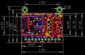

Contents
========

* [PROJ-ADAF-4383-STAN-01>Adafruit 1.14 inch 240x135 TFT PCB](#proj-adaf-4383-stan-01adafruit-114-inch-240x135-tft-pcb)
	* [Images](#images)
	* [Interactive BOM](#interactive-bom)
	* [OOMP Parts](#oomp-parts)
	* [Tags](#tags)
  
![][im]
# PROJ-ADAF-4383-STAN-01>Adafruit 1.14 inch 240x135 TFT PCB

- ID: PROJ-ADAF-4383-STAN-01
- Hex ID: PRA4383
- Name: Adafruit 1.14 inch 240x135 TFT PCB
- Description: 

## Images
  
  

|eagleImage|
| :---: |
||

## Interactive BOM

- Interactive BOM page: [ibom.html](kicad/bom/ibom.html)

## OOMP Parts
  

|OOMP Parts|
| :---: |
|<table><tr><td></td><td> C1</td><td>[CAPC-0805-X-UF10-V25 SMD (0805) 10 uF Capacitor (Ceramic) 25v](https://github.com/oomlout/oomlout_OOMP_parts/tree/main/CAPC-0805-X-UF10-V25/)</td><td>[C85U010](https://github.com/oomlout/oomlout_OOMP_parts/tree/main/CAPC-0805-X-UF10-V25/)</td></tr></table>|
|<table><tr><td></td><td> C2</td><td>[CAPC-0805-X-UF10-V25 SMD (0805) 10 uF Capacitor (Ceramic) 25v](https://github.com/oomlout/oomlout_OOMP_parts/tree/main/CAPC-0805-X-UF10-V25/)</td><td>[C85U010](https://github.com/oomlout/oomlout_OOMP_parts/tree/main/CAPC-0805-X-UF10-V25/)</td></tr></table>|
|<table><tr><td></td><td> C3</td><td>[CAPC-0805-X-NF100-V50 SMD (0805) 100 nF Capacitor (Ceramic) 50v](https://github.com/oomlout/oomlout_OOMP_parts/tree/main/CAPC-0805-X-NF100-V50/)</td><td>[C85N100](https://github.com/oomlout/oomlout_OOMP_parts/tree/main/CAPC-0805-X-NF100-V50/)</td></tr></table>|
|UNMATCHED-UNMATCHED-X-UNMATCHED-01, CN1, 14.350999999999997, 11.302999999999999, 270,CN1, MICROSD, microbuilder, (0.565, 0.445), R270|
|UNMATCHED-UNMATCHED-X-UNMATCHED-01, DISP1, -1.016, 4.826, M90,DISP1, DISP_LCD_GENERIC_SPI_1.14IN_240X135_WRAPUNDER, TFT_1.14IN_240X135_WRAPUNDER, microbuilder, (-0.04, 0.19), MR90|
|UNMATCHED-UNMATCHED-X-UNMATCHED-01, IC5, 22.86, -1.778, 270,IC5, APX803, SOT23, adafruit, (0.9, -0.07), R270|
|UNMATCHED-UNMATCHED-X-UNMATCHED-01, JP1, 14.350999999999997, -6.35, 180,JP1, 1X11_ROUND, microbuilder, (0.565, -0.25), R180|
|UNMATCHED-UNMATCHED-X-UNMATCHED-01, Q1, 27.178, 6.731, 180,Q1, MMBT2222, SOT23-WIDE, microbuilder, (1.07, 0.265), R180|
|<table><tr><td></td><td> R2</td><td>[RESE-0603-X-O103-01 SMD (0603) 10k Ohm Resistor](https://github.com/oomlout/oomlout_OOMP_parts/tree/main/RESE-0603-X-O103-01/)</td><td>[R6103](https://github.com/oomlout/oomlout_OOMP_parts/tree/main/RESE-0603-X-O103-01/)</td></tr></table>|
|RESE-0603-X-UNMATCHED-01, R5, 24.637999999999998, 6.731, 90,R5, 22, 0603-NO, microbuilder, (0.97, 0.265), R90|
|<table><tr><td></td><td> R7</td><td>[RESE-0603-X-O102-01 SMD (0603) 1k Ohm Resistor](https://github.com/oomlout/oomlout_OOMP_parts/tree/main/RESE-0603-X-O102-01/)</td><td>[R6102](https://github.com/oomlout/oomlout_OOMP_parts/tree/main/RESE-0603-X-O102-01/)</td></tr></table>|
|<table><tr><td></td><td> R8</td><td>[RESE-0603-X-O103-01 SMD (0603) 10k Ohm Resistor](https://github.com/oomlout/oomlout_OOMP_parts/tree/main/RESE-0603-X-O103-01/)</td><td>[R6103](https://github.com/oomlout/oomlout_OOMP_parts/tree/main/RESE-0603-X-O103-01/)</td></tr></table>|
|UNMATCHED-UNMATCHED-X-UNMATCHED-01, U2, 26.416, 0.254, 0,U2, MIC5225-3.3, SOT23-5, microbuilder, (1.04, 0.01), R0|
|UNMATCHED-UNMATCHED-X-UNMATCHED-01, U3, 20.066, 4.826, 270,U3, 74HC4050D, SOIC16, microbuilder, (0.79, 0.19), R270|

## Tags

- hexID: PRA4383
- oompType: PROJ
- oompSize: ADAF
- oompColor: 4383
- oompDesc: STAN
- oompIndex: 01
- oompName: Adafruit 1.14 inch 240x135 TFT PCB
- sources: All source files from https://github.com/adafruit/Adafruit-1.14-inch-240x135-TFT-PCB (source licence details in srcLicense.md)
- linkBuyPage: http://www.adafruit.com/products/4383
- oompPart: CAPC-0805-X-UF10-V25, C1, 26.162, 3.302, 0
- oompPart: CAPC-0805-X-UF10-V25, C2, 27.178, -3.175, 180
- oompPart: CAPC-0805-X-NF100-V50, C3, 19.812, 11.176, 0
- oompPart: UNMATCHED-UNMATCHED-X-UNMATCHED-01, CN1, 14.350999999999997, 11.302999999999999, 270
- oompPart: UNMATCHED-UNMATCHED-X-UNMATCHED-01, DISP1, -1.016, 4.826, M90
- oompPart: SKIP-UNMATCHED-X-UNMATCHED-01, FID1, 0.0, 0.0, 0
- oompPart: SKIP-UNMATCHED-X-UNMATCHED-01, FID2, 11.049, 7.746999999999999, 0
- oompPart: UNMATCHED-UNMATCHED-X-UNMATCHED-01, IC5, 22.86, -1.778, 270
- oompPart: UNMATCHED-UNMATCHED-X-UNMATCHED-01, JP1, 14.350999999999997, -6.35, 180
- oompPart: UNMATCHED-UNMATCHED-X-UNMATCHED-01, Q1, 27.178, 6.731, 180
- oompPart: RESE-0603-X-O103-01, R2, 20.066, -3.302, 270
- oompPart: RESE-0603-X-UNMATCHED-01, R5, 24.637999999999998, 6.731, 90
- oompPart: RESE-0603-X-O102-01, R7, 27.432, 9.652, 0
- oompPart: RESE-0603-X-O103-01, R8, 25.145999999999997, 10.287, 90
- oompPart: SKIP-UNMATCHED-X-UNMATCHED-01, U$9, 1.016, 16.509999999999998, 0
- oompPart: SKIP-UNMATCHED-X-UNMATCHED-01, U$10, 27.686, 16.509999999999998, 0
- oompPart: UNMATCHED-UNMATCHED-X-UNMATCHED-01, U2, 26.416, 0.254, 0
- oompPart: UNMATCHED-UNMATCHED-X-UNMATCHED-01, U3, 20.066, 4.826, 270
- rawPart: C1, 10uF, 0805-NO, microbuilder, (1.03, 0.13), R0
- rawPart: C2, 10uF, 0805-NO, microbuilder, (1.07, -0.125), R180
- rawPart: C3, 0.1uF, 0805-NO, microbuilder, (0.78, 0.44), R0
- rawPart: CN1, MICROSD, microbuilder, (0.565, 0.445), R270
- rawPart: DISP1, DISP_LCD_GENERIC_SPI_1.14IN_240X135_WRAPUNDER, TFT_1.14IN_240X135_WRAPUNDER, microbuilder, (-0.04, 0.19), MR90
- rawPart: FID1, FIDUCIAL_1MM, FIDUCIAL_1MM, microbuilder, (0, 0), R0
- rawPart: FID2, FIDUCIAL_1MM, FIDUCIAL_1MM, microbuilder, (0.435, 0.305), R0
- rawPart: IC5, APX803, SOT23, adafruit, (0.9, -0.07), R270
- rawPart: JP1, 1X11_ROUND, microbuilder, (0.565, -0.25), R180
- rawPart: Q1, MMBT2222, SOT23-WIDE, microbuilder, (1.07, 0.265), R180
- rawPart: R2, 10K, 0603-NO, microbuilder, (0.79, -0.13), R270
- rawPart: R5, 22, 0603-NO, microbuilder, (0.97, 0.265), R90
- rawPart: R7, 1K, 0603-NO, microbuilder, (1.08, 0.38), R0
- rawPart: R8, 10K, 0603-NO, microbuilder, (0.99, 0.405), R90
- rawPart: U$9, MOUNTINGHOLE2.5, MOUNTINGHOLE_2.5_PLATED, microbuilder, (0.04, 0.65), R0
- rawPart: U$10, MOUNTINGHOLE2.5, MOUNTINGHOLE_2.5_PLATED, microbuilder, (1.09, 0.65), R0
- rawPart: U2, MIC5225-3.3, SOT23-5, microbuilder, (1.04, 0.01), R0
- rawPart: U3, 74HC4050D, SOIC16, microbuilder, (0.79, 0.19), R270

[im]: eagleImage_450.png
