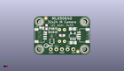
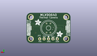
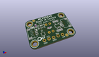

Contents
========

* [PROJ-ADAF-4407-STAN-01>Adafruit MLX90640 PCB](#proj-adaf-4407-stan-01adafruit-mlx90640-pcb)
	* [Images](#images)
	* [Interactive BOM](#interactive-bom)
	* [OOMP Parts](#oomp-parts)
	* [Tags](#tags)
  
![][im]
# PROJ-ADAF-4407-STAN-01>Adafruit MLX90640 PCB

- ID: PROJ-ADAF-4407-STAN-01
- Hex ID: PRA4407
- Name: Adafruit MLX90640 PCB
- Description: 

## Images
  
  

|eagleImage|kicadPcb3dFront|kicadPcb3dBack|kicadPcb3d|
| :---: | :---: | :---: | :---: |
|||||

## Interactive BOM

- Interactive BOM page: [ibom.html](kicad/bom/ibom.html)

## OOMP Parts
  

|OOMP Parts|
| :---: |
|<table><tr><td></td><td> C1</td><td>[CAPC-0603-X-NF100-V50 SMD (0603) 100 nF Capacitor (Ceramic) 50v](https://github.com/oomlout/oomlout_OOMP_parts/tree/main/CAPC-0603-X-NF100-V50/)</td><td>[C6N100](https://github.com/oomlout/oomlout_OOMP_parts/tree/main/CAPC-0603-X-NF100-V50/)</td></tr></table>|
|CAPC-0805-X-UNMATCHED-01, C2, 17.779999999999998, 5.588, 180,C2, 10uF, 0805-NO, microbuilder, (0.7, 0.22), R180|
|CAPC-0805-X-UNMATCHED-01, C3, 17.399, 11.937999999999999, 0,C3, 10uF, 0805-NO, microbuilder, (0.685, 0.47), R0|
|UNMATCHED-UNMATCHED-X-UNMATCHED-01, CONN3, 22.86, 8.889999999999999, 90,CONN3, STEMMA_I2C_QT, JST_SH4, microbuilder, (0.9, 0.35), R90|
|UNMATCHED-UNMATCHED-X-UNMATCHED-01, CONN4, 2.54, 8.889999999999999, 270,CONN4, STEMMA_I2C_QT, JST_SH4, microbuilder, (0.1, 0.35), R270|
|UNMATCHED-UNMATCHED-X-UNMATCHED-01, D1, 3.556, 12.572999999999999, 90,D1, GREEN, CHIPLED_0603_NOOUTLINE, microbuilder, (0.14, 0.495), R90|
|UNMATCHED-UNMATCHED-X-UNMATCHED-01, IC1, 12.7, 8.889999999999999, M0,IC1, MLX90640, MLX90640, microbuilder, (0.5, 0.35), MR0|
|<table><tr><td></td><td> JP2</td><td>[HEAD-I01-X-PI05-01 2.54 mm 5 Pin Header](https://github.com/oomlout/oomlout_OOMP_parts/tree/main/HEAD-I01-X-PI05-01/)</td><td>[H05](https://github.com/oomlout/oomlout_OOMP_parts/tree/main/HEAD-I01-X-PI05-01/)</td></tr></table>|
|UNMATCHED-UNMATCHED-X-UNMATCHED-01, Q2, 8.128, 6.286499999999999, 90,Q2, BSS138, SOT363, microbuilder, (0.32, 0.2475), R90|
|<table><tr><td></td><td> R1</td><td>[RESE-0603-X-O103-01 SMD (0603) 10k Ohm Resistor](https://github.com/oomlout/oomlout_OOMP_parts/tree/main/RESE-0603-X-O103-01/)</td><td>[R6103](https://github.com/oomlout/oomlout_OOMP_parts/tree/main/RESE-0603-X-O103-01/)</td></tr></table>|
|RESE-UNMATCHED-X-UNMATCHED-01, R3, 8.592821778, 11.302999999999999, 180,R3, 4.7K, RESPACK_4X0603, microbuilder, (0.33830007, 0.445), R180|
|UNMATCHED-UNMATCHED-X-UNMATCHED-01, U2, 17.653, 8.636000000000001, 0,U2, AP2112K-3.3, SOT23-5, microbuilder, (0.695, 0.34), R0|

## Tags

- hexID: PRA4407
- oompType: PROJ
- oompSize: ADAF
- oompColor: 4407
- oompDesc: STAN
- oompIndex: 01
- oompName: Adafruit MLX90640 PCB
- sources: All source files from https://github.com/adafruit/Adafruit-MLX90640-PCB (source licence details in srcLicense.md)
- linkBuyPage: http://www.adafruit.com/products/4407
- oompID: PROJ-ADAF-4407-STAN-01
- oompPart: CAPC-0603-X-NF100-V50, C1, 12.763499999999999, 8.953499999999998, 0
- oompPart: CAPC-0805-X-UNMATCHED-01, C2, 17.779999999999998, 5.588, 180
- oompPart: CAPC-0805-X-UNMATCHED-01, C3, 17.399, 11.937999999999999, 0
- oompPart: UNMATCHED-UNMATCHED-X-UNMATCHED-01, CONN3, 22.86, 8.889999999999999, 90
- oompPart: UNMATCHED-UNMATCHED-X-UNMATCHED-01, CONN4, 2.54, 8.889999999999999, 270
- oompPart: UNMATCHED-UNMATCHED-X-UNMATCHED-01, D1, 3.556, 12.572999999999999, 90
- oompPart: SKIP-UNMATCHED-X-UNMATCHED-01, FID3, 19.872959492, 1.48081873, 0
- oompPart: SKIP-UNMATCHED-X-UNMATCHED-01, FID4, 5.400040508, 16.83258127, 0
- oompPart: UNMATCHED-UNMATCHED-X-UNMATCHED-01, IC1, 12.7, 8.889999999999999, M0
- oompPart: HEAD-I01-X-PI05-01, JP2, 12.7, 2.54, M0
- oompPart: UNMATCHED-UNMATCHED-X-UNMATCHED-01, Q2, 8.128, 6.286499999999999, 90
- oompPart: RESE-0603-X-O103-01, R1, 5.7251594919999995, 12.786359491999999, 270
- oompPart: RESE-UNMATCHED-X-UNMATCHED-01, R3, 8.592821778, 11.302999999999999, 180
- oompPart: SKIP-UNMATCHED-X-UNMATCHED-01, U$1, 2.54, 15.239999999999998, 0
- oompPart: SKIP-UNMATCHED-X-UNMATCHED-01, U$17, 22.86, 15.239999999999998, 0
- oompPart: SKIP-UNMATCHED-X-UNMATCHED-01, U$19, 2.54, 2.54, 0
- oompPart: SKIP-UNMATCHED-X-UNMATCHED-01, U$21, 22.86, 2.54, 0
- oompPart: UNMATCHED-UNMATCHED-X-UNMATCHED-01, U2, 17.653, 8.636000000000001, 0
- rawPart: C1, 0.1uF, 0603-NO, microbuilder, (0.5025, 0.3525), R0
- rawPart: C2, 10uF, 0805-NO, microbuilder, (0.7, 0.22), R180
- rawPart: C3, 10uF, 0805-NO, microbuilder, (0.685, 0.47), R0
- rawPart: CONN3, STEMMA_I2C_QT, JST_SH4, microbuilder, (0.9, 0.35), R90
- rawPart: CONN4, STEMMA_I2C_QT, JST_SH4, microbuilder, (0.1, 0.35), R270
- rawPart: D1, GREEN, CHIPLED_0603_NOOUTLINE, microbuilder, (0.14, 0.495), R90
- rawPart: FID3, FIDUCIAL_1MM, FIDUCIAL_1MM, microbuilder, (0.78239998, 0.05829995), R0
- rawPart: FID4, FIDUCIAL_1MM, FIDUCIAL_1MM, microbuilder, (0.21260002, 0.66270005), R0
- rawPart: IC1, MLX90640, MLX90640, microbuilder, (0.5, 0.35), MR0
- rawPart: JP2, 1X05_ROUND, microbuilder, (0.5, 0.1), MR0
- rawPart: Q2, BSS138, SOT363, microbuilder, (0.32, 0.2475), R90
- rawPart: R1, 10K, 0603-NO, microbuilder, (0.22539998, 0.50339998), R270
- rawPart: R3, 4.7K, RESPACK_4X0603, microbuilder, (0.33830007, 0.445), R180
- rawPart: U$1, MOUNTINGHOLE2.5, MOUNTINGHOLE_2.5_PLATED, microbuilder, (0.1, 0.6), R0
- rawPart: U$17, MOUNTINGHOLE2.5, MOUNTINGHOLE_2.5_PLATED, microbuilder, (0.9, 0.6), R0
- rawPart: U$19, MOUNTINGHOLE2.5, MOUNTINGHOLE_2.5_PLATED, microbuilder, (0.1, 0.1), R0
- rawPart: U$21, MOUNTINGHOLE2.5, MOUNTINGHOLE_2.5_PLATED, microbuilder, (0.9, 0.1), R0
- rawPart: U2, AP2112K-3.3, SOT23-5, microbuilder, (0.695, 0.34), R0

[im]: kicadPcb3d_450.png
