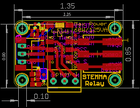
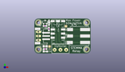
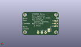
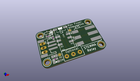

Contents
========

* [PROJ-ADAF-4409-STAN-01>Adafruit STEMMA Non Latching Mini Relay PCB](#proj-adaf-4409-stan-01adafruit-stemma-non-latching-mini-relay-pcb)
	* [Images](#images)
	* [Interactive BOM](#interactive-bom)
	* [OOMP Parts](#oomp-parts)
	* [Tags](#tags)
  
![][im]
# PROJ-ADAF-4409-STAN-01>Adafruit STEMMA Non Latching Mini Relay PCB

- ID: PROJ-ADAF-4409-STAN-01
- Hex ID: PRA4409
- Name: Adafruit STEMMA Non Latching Mini Relay PCB
- Description: 

## Images
  
  

|eagleImage|kicadPcb3dFront|kicadPcb3dBack|kicadPcb3d|
| :---: | :---: | :---: | :---: |
|||||

## Interactive BOM

- Interactive BOM page: [ibom.html](kicad/bom/ibom.html)

## OOMP Parts
  

|OOMP Parts|
| :---: |
|CAPE-0805-X-UNMATCHED-01, C1, 6.604, 4.444999999999999, 180,C1, 10uF, 0805-NO, microbuilder, (0.26, 0.175), R180|
|UNMATCHED-UNMATCHED-X-UNMATCHED-01, D1, 8.953499999999998, 18.9865, 90,D1, 1N4148, SOD-323, microbuilder, (0.3525, 0.7475), R90|
|UNMATCHED-UNMATCHED-X-UNMATCHED-01, D2, 6.731, 1.27, 270,D2, RED, CHIPLED_0805_NOOUTLINE, microbuilder, (0.265, 0.05), R270|
|ERROR, JP1 0.1 Header, 0, 0, 0,JP1, 0.1, Header, 1X03_OVAL, microbuilder, (0.1, 0.425), R270|
|UNMATCHED-UNMATCHED-X-UNMATCHED-01, Q1, 6.5405, 19.367499999999996, 0,Q1, MMBT2222, SOT23-R, microbuilder, (0.2575, 0.7625), R0|
|RESE-0603-X-UNMATCHED-01, R1, 8.889999999999999, 15.112999999999998, 90,R1, 1K, 0603-NO, microbuilder, (0.35, 0.595), R90|
|<table><tr><td></td><td> R2</td><td>[RESE-0603-X-O103-01 SMD (0603) 10k Ohm Resistor](https://github.com/oomlout/oomlout_OOMP_parts/tree/main/RESE-0603-X-O103-01/)</td><td>[R6103](https://github.com/oomlout/oomlout_OOMP_parts/tree/main/RESE-0603-X-O103-01/)</td></tr></table>|
|RESE-0603-X-UNMATCHED-01, R3, 6.604, 2.794, 0,R3, 1K, 0603-NO, microbuilder, (0.26, 0.11), R0|
|UNMATCHED-UNMATCHED-X-UNMATCHED-01, SJ1, 9.334499999999998, 4.444999999999999, M270,SJ1, SOLDERJUMPER_CLOSEDWIRE, microbuilder, (0.3675, 0.175), MR270|
|UNMATCHED-UNMATCHED-X-UNMATCHED-01, X1, 14.350999999999997, 13.462, 270,X1, RELAY_NONLATCHING-EE2NUH, RELAY_EE2_NOLATCH, microbuilder, (0.565, 0.53), R270|
|ERROR, X3 3.5mm Terminal, 0, 0, 0,X3, 3.5mm, Terminal, TERMBLOCK_1X3-3.5MM, microbuilder, (0.625, 0.09), R0|
|ERROR, X4 JST PH, 0, 0, 0,X4, JST, PH, 3, JSTPH3, microbuilder, (0.1775, 0.425), R90|
|UNMATCHED-UNMATCHED-X-UNMATCHED-01, X5, 26.288999999999998, 10.795, 0,X5, 2060-403/998-404, P-2060-403/998-404, adafruit_connector, (1.035, 0.425), R0|

## Tags

- hexID: PRA4409
- oompType: PROJ
- oompSize: ADAF
- oompColor: 4409
- oompDesc: STAN
- oompIndex: 01
- oompName: Adafruit STEMMA Non Latching Mini Relay PCB
- sources: All source files from https://github.com/adafruit/Adafruit-STEMMA-Non-Latching-Mini-Relay-PCB (source licence details in srcLicense.md)
- linkBuyPage: http://www.adafruit.com/products/4409
- oompPart: CAPE-0805-X-UNMATCHED-01, C1, 6.604, 4.444999999999999, 180
- oompPart: UNMATCHED-UNMATCHED-X-UNMATCHED-01, D1, 8.953499999999998, 18.9865, 90
- oompPart: UNMATCHED-UNMATCHED-X-UNMATCHED-01, D2, 6.731, 1.27, 270
- oompPart: SKIP-UNMATCHED-X-UNMATCHED-01, FID2, 9.270999999999999, 4.3180000000000005, 0
- oompPart: SKIP-UNMATCHED-X-UNMATCHED-01, FID3, 19.240499999999997, 16.827499999999997, 0
- oompPart: ERROR, JP1 0.1 Header, 0, 0, 0
- oompPart: UNMATCHED-UNMATCHED-X-UNMATCHED-01, Q1, 6.5405, 19.367499999999996, 0
- oompPart: RESE-0603-X-UNMATCHED-01, R1, 8.889999999999999, 15.112999999999998, 90
- oompPart: RESE-0603-X-O103-01, R2, 6.476999999999999, 17.018, 180
- oompPart: RESE-0603-X-UNMATCHED-01, R3, 6.604, 2.794, 0
- oompPart: UNMATCHED-UNMATCHED-X-UNMATCHED-01, SJ1, 9.334499999999998, 4.444999999999999, M270
- oompPart: SKIP-UNMATCHED-X-UNMATCHED-01, U$1, 31.75, 2.54, 0
- oompPart: SKIP-UNMATCHED-X-UNMATCHED-01, U$8, 31.75, 19.049999999999997, 0
- oompPart: SKIP-UNMATCHED-X-UNMATCHED-01, U$9, 2.54, 19.049999999999997, 0
- oompPart: SKIP-UNMATCHED-X-UNMATCHED-01, U$10, 2.54, 2.54, 0
- oompPart: UNMATCHED-UNMATCHED-X-UNMATCHED-01, X1, 14.350999999999997, 13.462, 270
- oompPart: ERROR, X3 3.5mm Terminal, 0, 0, 0
- oompPart: ERROR, X4 JST PH, 0, 0, 0
- oompPart: UNMATCHED-UNMATCHED-X-UNMATCHED-01, X5, 26.288999999999998, 10.795, 0
- rawPart: C1, 10uF, 0805-NO, microbuilder, (0.26, 0.175), R180
- rawPart: D1, 1N4148, SOD-323, microbuilder, (0.3525, 0.7475), R90
- rawPart: D2, RED, CHIPLED_0805_NOOUTLINE, microbuilder, (0.265, 0.05), R270
- rawPart: FID2, FIDUCIAL_1MM, FIDUCIAL_1MM, microbuilder, (0.365, 0.17), R0
- rawPart: FID3, FIDUCIAL_1MM, FIDUCIAL_1MM, microbuilder, (0.7575, 0.6625), R0
- rawPart: JP1, 0.1, Header, 1X03_OVAL, microbuilder, (0.1, 0.425), R270
- rawPart: Q1, MMBT2222, SOT23-R, microbuilder, (0.2575, 0.7625), R0
- rawPart: R1, 1K, 0603-NO, microbuilder, (0.35, 0.595), R90
- rawPart: R2, 10K, 0603-NO, microbuilder, (0.255, 0.67), R180
- rawPart: R3, 1K, 0603-NO, microbuilder, (0.26, 0.11), R0
- rawPart: SJ1, SOLDERJUMPER_CLOSEDWIRE, microbuilder, (0.3675, 0.175), MR270
- rawPart: U$1, MOUNTINGHOLE2.5, MOUNTINGHOLE_2.5_PLATED, microbuilder, (1.25, 0.1), R0
- rawPart: U$8, MOUNTINGHOLE2.5, MOUNTINGHOLE_2.5_PLATED, microbuilder, (1.25, 0.75), R0
- rawPart: U$9, MOUNTINGHOLE2.5, MOUNTINGHOLE_2.5_PLATED, microbuilder, (0.1, 0.75), R0
- rawPart: U$10, MOUNTINGHOLE2.5, MOUNTINGHOLE_2.5_PLATED, microbuilder, (0.1, 0.1), R0
- rawPart: X1, RELAY_NONLATCHING-EE2NUH, RELAY_EE2_NOLATCH, microbuilder, (0.565, 0.53), R270
- rawPart: X3, 3.5mm, Terminal, TERMBLOCK_1X3-3.5MM, microbuilder, (0.625, 0.09), R0
- rawPart: X4, JST, PH, 3, JSTPH3, microbuilder, (0.1775, 0.425), R90
- rawPart: X5, 2060-403/998-404, P-2060-403/998-404, adafruit_connector, (1.035, 0.425), R0

[im]: kicadPcb3d_450.png
