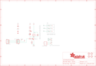

Contents
========

* [PRA4409 > Adafruit STEMMA Non Latching Mini Relay PCB](#pra4409--adafruit-stemma-non-latching-mini-relay-pcb)
	* [Schematic](#schematic)
	* [PCB](#pcb)
	* [Interactive BOM](#interactive-bom)
	* [OOMP Parts](#oomp-parts)
	* [Images](#images)
	* [Tags](#tags)
  
![][im]
# PRA4409 > Adafruit STEMMA Non Latching Mini Relay PCB

- ID: PROJ-ADAF-4409-STAN-01
- Hex ID: PRA4409
- Name: Adafruit
- Description: Adafruit
- Long Link: [http://oom.lt/PROJ-ADAF-4409-STAN-01](http://oom.lt/PROJ-ADAF-4409-STAN-01)
- Short Link: [http://oom.lt/PRA4409](http://oom.lt/PRA4409)

## Schematic
  

## PCB
  

## Interactive BOM

- Interactive BOM page: [ibom.html](https://htmlpreview.github.io/?https://github.com/oomlout/oomlout_OOMP_projects/blob/main/PROJ-ADAF-4409-STAN-01/kicad/bom/ibom.html)

## OOMP Parts
  

|OOMP ID|Name|Identifier|
| :---: | :---: | :---: |
|[CAPC-0805-X-UF10-V10](https://github.com/oomlout/oomlout_OOMP_parts/tree/main/CAPC-0805-X-UF10-V10/)|[SMD (0805) 10 uF Capacitor (Ceramic) 10v](https://github.com/oomlout/oomlout_OOMP_parts/tree/main/CAPC-0805-X-UF10-V10/)|[C1](https://github.com/oomlout/oomlout_OOMP_parts/tree/main/CAPC-0805-X-UF10-V10/)|
|[DIOD-S323-X-K4148-01](https://github.com/oomlout/oomlout_OOMP_parts/tree/main/DIOD-S323-X-K4148-01/)|[SMD (SOD-323) Diode](https://github.com/oomlout/oomlout_OOMP_parts/tree/main/DIOD-S323-X-K4148-01/)|[D1](https://github.com/oomlout/oomlout_OOMP_parts/tree/main/DIOD-S323-X-K4148-01/)|
|[LEDS-0805-R-STAN-01](https://github.com/oomlout/oomlout_OOMP_parts/tree/main/LEDS-0805-R-STAN-01/)|[SMD (0805) Red LED](https://github.com/oomlout/oomlout_OOMP_parts/tree/main/LEDS-0805-R-STAN-01/)|[D2](https://github.com/oomlout/oomlout_OOMP_parts/tree/main/LEDS-0805-R-STAN-01/)|
|[HEAD-I01-X-PI03-01](https://github.com/oomlout/oomlout_OOMP_parts/tree/main/HEAD-I01-X-PI03-01/)|[2.54 mm 3 Pin Header](https://github.com/oomlout/oomlout_OOMP_parts/tree/main/HEAD-I01-X-PI03-01/)|[JP1](https://github.com/oomlout/oomlout_OOMP_parts/tree/main/HEAD-I01-X-PI03-01/)|
|UNMATCHED-SO23-X-UNMATCHED-01||Q1|
|[RESE-0603-X-O102-01](https://github.com/oomlout/oomlout_OOMP_parts/tree/main/RESE-0603-X-O102-01/)|[SMD (0603) 1k Ohm Resistor](https://github.com/oomlout/oomlout_OOMP_parts/tree/main/RESE-0603-X-O102-01/)|[R1, R3](https://github.com/oomlout/oomlout_OOMP_parts/tree/main/RESE-0603-X-O102-01/)|
|[RESE-0603-X-O103-01](https://github.com/oomlout/oomlout_OOMP_parts/tree/main/RESE-0603-X-O103-01/)|[SMD (0603) 10k Ohm Resistor](https://github.com/oomlout/oomlout_OOMP_parts/tree/main/RESE-0603-X-O103-01/)|[R2](https://github.com/oomlout/oomlout_OOMP_parts/tree/main/RESE-0603-X-O103-01/)|
|UNMATCHED-UNMATCHED-X-UNMATCHED-01||X1, X4, X5|
|[TERS-35D-L-PI03-01](https://github.com/oomlout/oomlout_OOMP_parts/tree/main/TERS-35D-L-PI03-01/)|[3.5 mm 3 Pin Blue Screw Terminal](https://github.com/oomlout/oomlout_OOMP_parts/tree/main/TERS-35D-L-PI03-01/)|[X3](https://github.com/oomlout/oomlout_OOMP_parts/tree/main/TERS-35D-L-PI03-01/)|

## Images
  
  

|bominteractivefront|bominteractiveback|kicadPcb3d|kicadPcb3dFront|kicadPcb3dBack|eagleImage|eagleSchemImage|pcbdraw|pcbdrawback|
| :---: | :---: | :---: | :---: | :---: | :---: | :---: | :---: | :---: |
||||||||||

## Tags

- hexID: PRA4409
- oompType: PROJ
- oompSize: ADAF
- oompColor: 4409
- oompDesc: STAN
- oompIndex: 01
- oompName: Adafruit STEMMA Non Latching Mini Relay PCB
- sources: All source files from https://github.com/adafruit/Adafruit-STEMMA-Non-Latching-Mini-Relay-PCB (source licence details in srcLicense.md)
- linkBuyPage: http://www.adafruit.com/products/4409
- oompID: PROJ-ADAF-4409-STAN-01
- oompParts: C1,CAPC-0805-X-UF10-V10
- oompParts: D1,DIOD-S323-X-K4148-01
- oompParts: D2,LEDS-0805-R-STAN-01
- oompParts: JP1,HEAD-I01-X-PI03-01
- oompParts: Q1,UNMATCHED-SO23-X-UNMATCHED-01
- oompParts: R1,RESE-0603-X-O102-01
- oompParts: R2,RESE-0603-X-O103-01
- oompParts: R3,RESE-0603-X-O102-01
- oompParts: X1,UNMATCHED-UNMATCHED-X-UNMATCHED-01
- oompParts: X3,TERS-35D-L-PI03-01
- oompParts: X4,UNMATCHED-UNMATCHED-X-UNMATCHED-01
- oompParts: X5,UNMATCHED-UNMATCHED-X-UNMATCHED-01
- rawParts: C1,10uF,CAP_CERAMIC0805-NOOUTLINE,0805-NO,Ceramic Capacitors,,
- rawParts: D1,1N4148,DIODESOD-323,SOD-323,Diode,,
- rawParts: D2,RED,LED0805_NOOUTLINE,CHIPLED_0805_NOOUTLINE,LED,,
- rawParts: FID2,FIDUCIAL_1MM,FIDUCIAL_1MM,FIDUCIAL_1MM,Fiducial Alignment Points,EXCLUDE,
- rawParts: FID3,FIDUCIAL_1MM,FIDUCIAL_1MM,FIDUCIAL_1MM,Fiducial Alignment Points,EXCLUDE,
- rawParts: JP1,0.1 Header,HEADER-1X3,1X03_OVAL,PIN HEADER,,
- rawParts: Q1,MMBT2222,TRANSISTOR_NPN,SOT23-R,NPN Transistor,,
- rawParts: R1,1K,RESISTOR_0603_NOOUT,0603-NO,Resistors,,
- rawParts: R2,10K,RESISTOR_0603_NOOUT,0603-NO,Resistors,,
- rawParts: R3,1K,RESISTOR_0603_NOOUT,0603-NO,Resistors,,
- rawParts: SJ1,,SOLDERJUMPER_CLOSED,SOLDERJUMPER_CLOSEDWIRE,Solder Jumper - Closed,,
- rawParts: U$1,MOUNTINGHOLE2.5,MOUNTINGHOLE2.5,MOUNTINGHOLE_2.5_PLATED,Mounting Hole,EXCLUDE,
- rawParts: U$8,MOUNTINGHOLE2.5,MOUNTINGHOLE2.5,MOUNTINGHOLE_2.5_PLATED,Mounting Hole,EXCLUDE,
- rawParts: U$9,MOUNTINGHOLE2.5,MOUNTINGHOLE2.5,MOUNTINGHOLE_2.5_PLATED,Mounting Hole,EXCLUDE,
- rawParts: U$10,MOUNTINGHOLE2.5,MOUNTINGHOLE2.5,MOUNTINGHOLE_2.5_PLATED,Mounting Hole,EXCLUDE,
- rawParts: X1,RELAY_NONLATCHING-EE2NUH,RELAY_NONLATCHING-EE2NUH,RELAY_EE2_NOLATCH,,,
- rawParts: X3,3.5mm Terminal,TERMBLOCK_1X3,TERMBLOCK_1X3-3.5MM,3.5mm Terminal block,,
- rawParts: X4,JST PH 3,CON_JST_PH_3PIN,JSTPH3,,,
- rawParts: X5,2060-403/998-404,2060-403/998-404,P-2060-403/998-404,Serie 2060,  SMD-Leiterplattenklemme mit Betätigungsdrückern im Gurt 3-polig / Series 2060,  SMD terminal block with push-buttons in tape-and-reel packing 3-polePolzahl / Pole No.: 3 Rastermaß / Pitch: 4  mmBemessungsspannung / Rated Voltage: 160 VNennstrom / Nominal Current: 9 ALeiterquerschnitt / Conductor Size: 0.2 - 0.75 mm2Anschlusstechnik / Connection Technology: CAGE CLAMP® S Leitereinführung (zur Platine) / Conductor entry angle (to PCB): 0 °Farbe / Color: lichtgrau / light gray Stand: 01.01.2014. Die jeweils aktuellen Daten zu diesem Artikel finden Sie in unserem Produktkatalog, den Sie unter www.wago.com einsehen können.  As of: 01/01/2014. Please find the newest data for this article in our product catalogue, which can be viewed under www.wago.com.,,

[im]: kicadPcb3d_450.png
