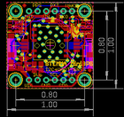
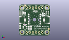
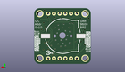
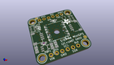

Contents
========

* [PROJ-ADAF-4415-STAN-01>Adafruit PA1010D Mini GPS PCB](#proj-adaf-4415-stan-01adafruit-pa1010d-mini-gps-pcb)
	* [Images](#images)
	* [Interactive BOM](#interactive-bom)
	* [OOMP Parts](#oomp-parts)
	* [Tags](#tags)
  
![][im]
# PROJ-ADAF-4415-STAN-01>Adafruit PA1010D Mini GPS PCB

- ID: PROJ-ADAF-4415-STAN-01
- Hex ID: PRA4415
- Name: Adafruit PA1010D Mini GPS PCB
- Description: 

## Images
  
  

|eagleImage|kicadPcb3dFront|kicadPcb3dBack|kicadPcb3d|
| :---: | :---: | :---: | :---: |
|||||

## Interactive BOM

- Interactive BOM page: [ibom.html](kicad/bom/ibom.html)

## OOMP Parts
  

|OOMP Parts|
| :---: |
|UNMATCHED-UNMATCHED-X-UNMATCHED-01, B1, 12.7, 12.7, M0,B1, CR1220-2, microbuilder, (0.5, 0.5), MR0|
|CAPE-0603-X-NF100-01, C1, 4.953, 8.889999999999999, 180,C1, 0.1uF, 0603-NO, microbuilder, (0.195, 0.35), R180|
|CAPE-0805-X-UNMATCHED-01, C2, 1.1429999999999998, 6.858, 90,C2, 10uF, 0805-NO, microbuilder, (0.045, 0.27), R90|
|CAPE-0805-X-UNMATCHED-01, C3, 9.906, 6.35, 90,C3, 10uF, 0805-NO, microbuilder, (0.39, 0.25), R90|
|UNMATCHED-UNMATCHED-X-UNMATCHED-01, CONN3, 22.86, 12.7, 90,CONN3, STEMMA_I2C_QT, JST_SH4, microbuilder, (0.9, 0.5), R90|
|UNMATCHED-UNMATCHED-X-UNMATCHED-01, CONN4, 2.54, 12.7, 270,CONN4, STEMMA_I2C_QT, JST_SH4, microbuilder, (0.1, 0.5), R270|
|UNMATCHED-UNMATCHED-X-UNMATCHED-01, D1, 4.571999999999999, 17.779999999999998, 90,D1, GREEN, CHIPLED_0603_NOOUTLINE, microbuilder, (0.18, 0.7), R90|
|UNMATCHED-UNMATCHED-X-UNMATCHED-01, D2, 13.334999999999999, 19.939, 180,D2, 1N4148, SOD-323, microbuilder, (0.525, 0.785), R180|
|UNMATCHED-UNMATCHED-X-UNMATCHED-01, D3, 4.571999999999999, 18.923, 90,D3, RED, CHIPLED_0603_NOOUTLINE, microbuilder, (0.18, 0.745), R90|
|UNMATCHED-0805-X-UNMATCHED-01, FB1, 8.001, 6.35, 270,FB1, FERRITE, 0805-NO, microbuilder, (0.315, 0.25), R270|
|UNMATCHED-UNMATCHED-X-UNMATCHED-01, JP1, 12.7, 2.54, 0,JP1, 1X06_ROUND_70, microbuilder, (0.5, 0.1), R0|
|UNMATCHED-UNMATCHED-X-UNMATCHED-01, JP2, 12.7, 22.86, 0,JP2, 1X06_ROUND_70, microbuilder, (0.5, 0.9), R0|
|UNMATCHED-UNMATCHED-X-UNMATCHED-01, Q2, 19.304, 19.939, 90,Q2, BSS138, SOT363, microbuilder, (0.76, 0.785), R90|
|RESE-UNMATCHED-X-O103-01, R1, 1.778, 18.415, 270,R1, 10K, RESPACK_4X0603, microbuilder, (0.07, 0.725), R270|
|RESE-UNMATCHED-X-O103-01, R3, 23.114, 18.160999999999998, 90,R3, 10K, RESPACK_4X0603, microbuilder, (0.91, 0.715), R90|
|UNMATCHED-UNMATCHED-X-UNMATCHED-01, U2, 4.953, 6.476999999999999, 270,U2, AP2112K-3.3, SOT23-5, microbuilder, (0.195, 0.255), R270|
|UNMATCHED-UNMATCHED-X-UNMATCHED-01, X1, 12.7, 13.462, 180,X1, GPS_PA1010D, GPS_PA1010D, microbuilder, (0.5, 0.53), R180|

## Tags

- hexID: PRA4415
- oompType: PROJ
- oompSize: ADAF
- oompColor: 4415
- oompDesc: STAN
- oompIndex: 01
- oompName: Adafruit PA1010D Mini GPS PCB
- sources: All source files from https://github.com/adafruit/Adafruit-PA1010D-Mini-GPS-PCB (source licence details in srcLicense.md)
- linkBuyPage: http://www.adafruit.com/products/4415
- oompPart: UNMATCHED-UNMATCHED-X-UNMATCHED-01, B1, 12.7, 12.7, M0
- oompPart: CAPE-0603-X-NF100-01, C1, 4.953, 8.889999999999999, 180
- oompPart: CAPE-0805-X-UNMATCHED-01, C2, 1.1429999999999998, 6.858, 90
- oompPart: CAPE-0805-X-UNMATCHED-01, C3, 9.906, 6.35, 90
- oompPart: UNMATCHED-UNMATCHED-X-UNMATCHED-01, CONN3, 22.86, 12.7, 90
- oompPart: UNMATCHED-UNMATCHED-X-UNMATCHED-01, CONN4, 2.54, 12.7, 270
- oompPart: UNMATCHED-UNMATCHED-X-UNMATCHED-01, D1, 4.571999999999999, 17.779999999999998, 90
- oompPart: UNMATCHED-UNMATCHED-X-UNMATCHED-01, D2, 13.334999999999999, 19.939, 180
- oompPart: UNMATCHED-UNMATCHED-X-UNMATCHED-01, D3, 4.571999999999999, 18.923, 90
- oompPart: UNMATCHED-0805-X-UNMATCHED-01, FB1, 8.001, 6.35, 270
- oompPart: SKIP-UNMATCHED-X-UNMATCHED-01, FID3, 24.256999999999998, 5.3975, 0
- oompPart: SKIP-UNMATCHED-X-UNMATCHED-01, FID4, 5.08, 24.5491, 0
- oompPart: UNMATCHED-UNMATCHED-X-UNMATCHED-01, JP1, 12.7, 2.54, 0
- oompPart: UNMATCHED-UNMATCHED-X-UNMATCHED-01, JP2, 12.7, 22.86, 0
- oompPart: UNMATCHED-UNMATCHED-X-UNMATCHED-01, Q2, 19.304, 19.939, 90
- oompPart: RESE-UNMATCHED-X-O103-01, R1, 1.778, 18.415, 270
- oompPart: RESE-UNMATCHED-X-O103-01, R3, 23.114, 18.160999999999998, 90
- oompPart: SKIP-UNMATCHED-X-UNMATCHED-01, U$1, 2.54, 22.86, 0
- oompPart: SKIP-UNMATCHED-X-UNMATCHED-01, U$17, 22.86, 22.86, 0
- oompPart: SKIP-UNMATCHED-X-UNMATCHED-01, U$19, 2.54, 2.54, 0
- oompPart: SKIP-UNMATCHED-X-UNMATCHED-01, U$21, 22.86, 2.54, 0
- oompPart: UNMATCHED-UNMATCHED-X-UNMATCHED-01, U2, 4.953, 6.476999999999999, 270
- oompPart: UNMATCHED-UNMATCHED-X-UNMATCHED-01, X1, 12.7, 13.462, 180
- rawPart: B1, CR1220-2, microbuilder, (0.5, 0.5), MR0
- rawPart: C1, 0.1uF, 0603-NO, microbuilder, (0.195, 0.35), R180
- rawPart: C2, 10uF, 0805-NO, microbuilder, (0.045, 0.27), R90
- rawPart: C3, 10uF, 0805-NO, microbuilder, (0.39, 0.25), R90
- rawPart: CONN3, STEMMA_I2C_QT, JST_SH4, microbuilder, (0.9, 0.5), R90
- rawPart: CONN4, STEMMA_I2C_QT, JST_SH4, microbuilder, (0.1, 0.5), R270
- rawPart: D1, GREEN, CHIPLED_0603_NOOUTLINE, microbuilder, (0.18, 0.7), R90
- rawPart: D2, 1N4148, SOD-323, microbuilder, (0.525, 0.785), R180
- rawPart: D3, RED, CHIPLED_0603_NOOUTLINE, microbuilder, (0.18, 0.745), R90
- rawPart: FB1, FERRITE, 0805-NO, microbuilder, (0.315, 0.25), R270
- rawPart: FID3, FIDUCIAL_1MM, FIDUCIAL_1MM, microbuilder, (0.955, 0.2125), R0
- rawPart: FID4, FIDUCIAL_1MM, FIDUCIAL_1MM, microbuilder, (0.2, 0.9665), R0
- rawPart: JP1, 1X06_ROUND_70, microbuilder, (0.5, 0.1), R0
- rawPart: JP2, 1X06_ROUND_70, microbuilder, (0.5, 0.9), R0
- rawPart: Q2, BSS138, SOT363, microbuilder, (0.76, 0.785), R90
- rawPart: R1, 10K, RESPACK_4X0603, microbuilder, (0.07, 0.725), R270
- rawPart: R3, 10K, RESPACK_4X0603, microbuilder, (0.91, 0.715), R90
- rawPart: U$1, MOUNTINGHOLE2.5, MOUNTINGHOLE_2.5_PLATED, microbuilder, (0.1, 0.9), R0
- rawPart: U$17, MOUNTINGHOLE2.5, MOUNTINGHOLE_2.5_PLATED, microbuilder, (0.9, 0.9), R0
- rawPart: U$19, MOUNTINGHOLE2.5, MOUNTINGHOLE_2.5_PLATED, microbuilder, (0.1, 0.1), R0
- rawPart: U$21, MOUNTINGHOLE2.5, MOUNTINGHOLE_2.5_PLATED, microbuilder, (0.9, 0.1), R0
- rawPart: U2, AP2112K-3.3, SOT23-5, microbuilder, (0.195, 0.255), R270
- rawPart: X1, GPS_PA1010D, GPS_PA1010D, microbuilder, (0.5, 0.53), R180

[im]: kicadPcb3d_450.png
