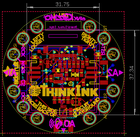
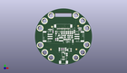
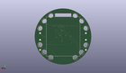
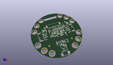

Contents
========

* [PROJ-ADAF-4428-STAN-01>Adafruit Circuit Playground Tri Color E Ink Gizmo PCB](#proj-adaf-4428-stan-01adafruit-circuit-playground-tri-color-e-ink-gizmo-pcb)
	* [Images](#images)
	* [Interactive BOM](#interactive-bom)
	* [OOMP Parts](#oomp-parts)
	* [Tags](#tags)
  
![][im]
# PROJ-ADAF-4428-STAN-01>Adafruit Circuit Playground Tri Color E Ink Gizmo PCB

- ID: PROJ-ADAF-4428-STAN-01
- Hex ID: PRA4428
- Name: Adafruit Circuit Playground Tri Color E Ink Gizmo PCB
- Description: 

## Images
  
  

|eagleImage|kicadPcb3dFront|kicadPcb3dBack|kicadPcb3d|
| :---: | :---: | :---: | :---: |
|||||

## Interactive BOM

- Interactive BOM page: [ibom.html](kicad/bom/ibom.html)

## OOMP Parts
  

|OOMP Parts|
| :---: |
|CAPC-0805-X-UNMATCHED-01, C1, 8.762999999999998, -4.3180000000000005, 270,C1, 10uF, 0805-NO, microbuilder, (0.345, -0.17), R270|
|CAPC-0805-X-UNMATCHED-01, C2, -5.460999999999999, -2.667, 90,C2, 10uF, 0805-NO, microbuilder, (-0.215, -0.105), R90|
|UNMATCHED-0805-X-UNMATCHED-01, C3, 2.688400008, 3.6965999219999994, 90,C3, 10uF/10V+, 0805-NO, microbuilder, (0.10584252, 0.14553543), R90|
|UNMATCHED-0805-X-UNMATCHED-01, C5, 4.571999999999999, 3.6829999999999994, 90,C5, 1uF/10V, 0805-NO, microbuilder, (0.18, 0.145), R90|
|UNMATCHED-0805-X-UNMATCHED-01, C6, 1.3589, -0.0127, 270,C6, 1uF/25V, 0805-NO, microbuilder, (0.0535, -0.0005), R270|
|UNMATCHED-0805-X-UNMATCHED-01, C7, 8.026399999999999, -0.1524, 270,C7, 1uF/25V, 0805-NO, microbuilder, (0.316, -0.006), R270|
|UNMATCHED-0805-X-UNMATCHED-01, C8, 1.651, -2.8194, 0,C8, 10uF/25V, 0805-NO, microbuilder, (0.065, -0.111), R0|
|CAPC-0805-X-UNMATCHED-01, C9, -3.8099999999999996, -12.065, 270,C9, 1uF, 0805-NO, microbuilder, (-0.15, -0.475), R270|
|UNMATCHED-0805-X-UNMATCHED-01, C10, -1.4986, 3.6575999999999995, 90,C10, 1uF/10V, 0805-NO, microbuilder, (-0.059, 0.144), R90|
|CAPC-0805-X-UNMATCHED-01, C13, 2.032, -12.065, 270,C13, 1uF, 0805-NO, microbuilder, (0.08, -0.475), R270|
|CAPC-0805-X-UNMATCHED-01, C15, 3.175, -17.145, 270,C15, 10uF, 0805-NO, microbuilder, (0.125, -0.675), R270|
|CAPC-0805-X-UNMATCHED-01, C16, 0.5947999279999999, 3.6694000779999993, 90,C16, 1uF, 0805-NO, microbuilder, (0.02341732, 0.14446457), R90|
|UNMATCHED-0805-X-UNMATCHED-01, C22, 6.476999999999999, 3.6829999999999994, 90,C22, 1uF/25V, 0805-NO, microbuilder, (0.255, 0.145), R90|
|UNMATCHED-0805-X-UNMATCHED-01, C23, 8.382, 3.6829999999999994, 90,C23, 1uF/25V, 0805-NO, microbuilder, (0.33, 0.145), R90|
|CAPC-0805-X-UNMATCHED-01, C24, 10.287, 4.699, 90,C24, 1uF, 0805-NO, microbuilder, (0.405, 0.185), R90|
|UNMATCHED-UNMATCHED-X-UNMATCHED-01, D1, 15.239999999999998, 8.001, 180,D1, 3.6V, SOD-323, microbuilder, (0.6, 0.315), R180|
|UNMATCHED-UNMATCHED-X-UNMATCHED-01, D2, -12.572999999999999, 6.604, 180,D2, 3.6V, SOD-323, microbuilder, (-0.495, 0.26), R180|
|UNMATCHED-UNMATCHED-X-UNMATCHED-01, D3, 4.2926, -1.0413999999999999, 270,D3, MBR0530, SOD-123, microbuilder, (0.169, -0.041), R270|
|UNMATCHED-UNMATCHED-X-UNMATCHED-01, D4, 6.0706, -1.0413999999999999, 90,D4, MBR0530, SOD-123, microbuilder, (0.239, -0.041), R90|
|UNMATCHED-UNMATCHED-X-UNMATCHED-01, D5, -2.4003, 0.8636, 180,D5, MBR0530, SOD-123, microbuilder, (-0.0945, 0.034), R180|
|UNMATCHED-UNMATCHED-X-UNMATCHED-01, EINK2, -13.97, 11.049, M270,EINK2, EINK_24PIN_154IN, EINK_154IN, adafruit_display, (-0.55, 0.435), MR270|
|UNMATCHED-UNMATCHED-X-UNMATCHED-01, L1, -2.2605999999999997, -2.6416, 270,L1, 10uH, INDUCTOR_4X4MM_NR401, microbuilder, (-0.089, -0.104), R270|
|ERROR, LEFT JST PH, 0, 0, 0,LEFT, JST, PH, 3, JSTPH3, microbuilder, (-0.6, 0), R90|
|UNMATCHED-UNMATCHED-X-UNMATCHED-01, Q5, -4.2545, 3.6829999999999994, 180,Q5, IRLML0100, SOT23-3, Parts, (-0.1675, 0.145), R180|
|RESE-0603-X-UNMATCHED-01, R2, -9.906, 4.571999999999999, 90,R2, 1K, 0603-NO, microbuilder, (-0.39, 0.18), R90|
|RESE-0603-X-UNMATCHED-01, R5, 15.366999999999999, 6.35, 0,R5, 1K, 0603-NO, microbuilder, (0.605, 0.25), R0|
|RESE-UNMATCHED-X-UNMATCHED-01, R6, -6.985, 3.6829999999999994, 270,R6, .47ohm, 0805_10MGAP, microbuilder, (-0.275, 0.145), R270|
|<table><tr><td></td><td> R7</td><td>[RESE-0603-X-O104-01 SMD (0603) 100k Ohm Resistor](https://github.com/oomlout/oomlout_OOMP_parts/tree/main/RESE-0603-X-O104-01/)</td><td>[R6104](https://github.com/oomlout/oomlout_OOMP_parts/tree/main/RESE-0603-X-O104-01/)</td></tr></table>|
|RESE-0603-X-UNMATCHED-01, R12, -1.651, -12.065, 270,R12, 100, 0603-NO, microbuilder, (-0.065, -0.475), R270|
|RESE-0603-X-UNMATCHED-01, R13, 0.127, -12.065, 270,R13, 100, 0603-NO, microbuilder, (0.005, -0.475), R270|
|ERROR, RIGHT JST PH, 0, 0, 0,RIGHT, JST, PH, 3, JSTPH3, microbuilder, (0.6, 0), R270|
|UNMATCHED-UNMATCHED-X-UNMATCHED-01, U$1, 0.0, -22.987, 180,U$1, CON_MOLEX_2P, 53398-0271, microbuilder, (0, -0.905), R180|
|UNMATCHED-UNMATCHED-X-UNMATCHED-01, U5, 0.0, -17.272000000000002, 180,U5, PAM8302AASCR, MSOP8_0.65MM, microbuilder, (0, -0.68), R180|
|ERROR, VR2 10K trim, 0, 0, 0,VR2, 10K, trim, TRIMPOT_BOURNS_3303W, microbuilder, (0.215, -0.505), R90|

## Tags

- hexID: PRA4428
- oompType: PROJ
- oompSize: ADAF
- oompColor: 4428
- oompDesc: STAN
- oompIndex: 01
- oompName: Adafruit Circuit Playground Tri Color E Ink Gizmo PCB
- sources: All source files from https://github.com/adafruit/Adafruit-Circuit-Playground-Tri-Color-E-Ink-Gizmo-PCB (source licence details in srcLicense.md)
- linkBuyPage: http://www.adafruit.com/products/4428
- oompID: PROJ-ADAF-4428-STAN-01
- oompPart: SKIP-UNMATCHED-X-UNMATCHED-01, BUSY, -10.731499999999999, 9.270999999999999, 270
- oompPart: CAPC-0805-X-UNMATCHED-01, C1, 8.762999999999998, -4.3180000000000005, 270
- oompPart: CAPC-0805-X-UNMATCHED-01, C2, -5.460999999999999, -2.667, 90
- oompPart: UNMATCHED-0805-X-UNMATCHED-01, C3, 2.688400008, 3.6965999219999994, 90
- oompPart: UNMATCHED-0805-X-UNMATCHED-01, C5, 4.571999999999999, 3.6829999999999994, 90
- oompPart: UNMATCHED-0805-X-UNMATCHED-01, C6, 1.3589, -0.0127, 270
- oompPart: UNMATCHED-0805-X-UNMATCHED-01, C7, 8.026399999999999, -0.1524, 270
- oompPart: UNMATCHED-0805-X-UNMATCHED-01, C8, 1.651, -2.8194, 0
- oompPart: CAPC-0805-X-UNMATCHED-01, C9, -3.8099999999999996, -12.065, 270
- oompPart: UNMATCHED-0805-X-UNMATCHED-01, C10, -1.4986, 3.6575999999999995, 90
- oompPart: CAPC-0805-X-UNMATCHED-01, C13, 2.032, -12.065, 270
- oompPart: CAPC-0805-X-UNMATCHED-01, C15, 3.175, -17.145, 270
- oompPart: CAPC-0805-X-UNMATCHED-01, C16, 0.5947999279999999, 3.6694000779999993, 90
- oompPart: UNMATCHED-0805-X-UNMATCHED-01, C22, 6.476999999999999, 3.6829999999999994, 90
- oompPart: UNMATCHED-0805-X-UNMATCHED-01, C23, 8.382, 3.6829999999999994, 90
- oompPart: CAPC-0805-X-UNMATCHED-01, C24, 10.287, 4.699, 90
- oompPart: UNMATCHED-UNMATCHED-X-UNMATCHED-01, D1, 15.239999999999998, 8.001, 180
- oompPart: UNMATCHED-UNMATCHED-X-UNMATCHED-01, D2, -12.572999999999999, 6.604, 180
- oompPart: UNMATCHED-UNMATCHED-X-UNMATCHED-01, D3, 4.2926, -1.0413999999999999, 270
- oompPart: UNMATCHED-UNMATCHED-X-UNMATCHED-01, D4, 6.0706, -1.0413999999999999, 90
- oompPart: UNMATCHED-UNMATCHED-X-UNMATCHED-01, D5, -2.4003, 0.8636, 180
- oompPart: UNMATCHED-UNMATCHED-X-UNMATCHED-01, EINK2, -13.97, 11.049, M270
- oompPart: UNMATCHED-UNMATCHED-X-UNMATCHED-01, L1, -2.2605999999999997, -2.6416, 270
- oompPart: ERROR, LEFT JST PH, 0, 0, 0
- oompPart: UNMATCHED-UNMATCHED-X-UNMATCHED-01, Q5, -4.2545, 3.6829999999999994, 180
- oompPart: RESE-0603-X-UNMATCHED-01, R2, -9.906, 4.571999999999999, 90
- oompPart: RESE-0603-X-UNMATCHED-01, R5, 15.366999999999999, 6.35, 0
- oompPart: RESE-UNMATCHED-X-UNMATCHED-01, R6, -6.985, 3.6829999999999994, 270
- oompPart: RESE-0603-X-O104-01, R7, -7.238999999999999, -2.794, 270
- oompPart: RESE-0603-X-UNMATCHED-01, R12, -1.651, -12.065, 270
- oompPart: RESE-0603-X-UNMATCHED-01, R13, 0.127, -12.065, 270
- oompPart: ERROR, RIGHT JST PH, 0, 0, 0
- oompPart: SKIP-UNMATCHED-X-UNMATCHED-01, TP1, -21.59, 3.175, M0
- oompPart: SKIP-UNMATCHED-X-UNMATCHED-01, TP2, 11.557, 20.1168, 90
- oompPart: SKIP-UNMATCHED-X-UNMATCHED-01, TP3, 11.557, -20.1168, 90
- oompPart: SKIP-UNMATCHED-X-UNMATCHED-01, TP4, -11.6078, 20.066, 90
- oompPart: SKIP-UNMATCHED-X-UNMATCHED-01, TP5, -11.557, -20.1168, 90
- oompPart: SKIP-UNMATCHED-X-UNMATCHED-01, TP6, 17.779999999999998, 14.935199999999998, 90
- oompPart: SKIP-UNMATCHED-X-UNMATCHED-01, TP7, 21.8186, 7.924799999999999, 90
- oompPart: SKIP-UNMATCHED-X-UNMATCHED-01, TP8, 21.8186, -7.924799999999999, 90
- oompPart: SKIP-UNMATCHED-X-UNMATCHED-01, TP9, 17.779999999999998, -14.935199999999998, 90
- oompPart: SKIP-UNMATCHED-X-UNMATCHED-01, TP10, -17.779999999999998, 14.858999999999998, 90
- oompPart: SKIP-UNMATCHED-X-UNMATCHED-01, TP11, -21.8186, 7.924799999999999, 90
- oompPart: SKIP-UNMATCHED-X-UNMATCHED-01, TP12, -21.7424, -8.178799999999999, 90
- oompPart: SKIP-UNMATCHED-X-UNMATCHED-01, TP13, -17.525999999999996, -15.189199999999998, 90
- oompPart: SKIP-UNMATCHED-X-UNMATCHED-01, TP14, 21.59, -3.175, M0
- oompPart: SKIP-UNMATCHED-X-UNMATCHED-01, TP15, -21.59, -12.7, M0
- oompPart: SKIP-UNMATCHED-X-UNMATCHED-01, TP16, 21.59, -12.7, M0
- oompPart: SKIP-UNMATCHED-X-UNMATCHED-01, TP17, 21.59, 3.175, M0
- oompPart: SKIP-UNMATCHED-X-UNMATCHED-01, TP18, -21.59, -3.175, M0
- oompPart: UNMATCHED-UNMATCHED-X-UNMATCHED-01, U$1, 0.0, -22.987, 180
- oompPart: SKIP-UNMATCHED-X-UNMATCHED-01, U$2, 13.716, 10.033, 0
- oompPart: SKIP-UNMATCHED-X-UNMATCHED-01, U$3, -11.811, -12.318999999999999, 0
- oompPart: SKIP-UNMATCHED-X-UNMATCHED-01, U$6, 12.065, -12.191999999999998, 0
- oompPart: UNMATCHED-UNMATCHED-X-UNMATCHED-01, U5, 0.0, -17.272000000000002, 180
- oompPart: ERROR, VR2 10K trim, 0, 0, 0
- rawPart: BUSY, TPTP15SQ, TP15SQ, testpad, (-0.4225, 0.365), R270
- rawPart: C1, 10uF, 0805-NO, microbuilder, (0.345, -0.17), R270
- rawPart: C2, 10uF, 0805-NO, microbuilder, (-0.215, -0.105), R90
- rawPart: C3, 10uF/10V+, 0805-NO, microbuilder, (0.10584252, 0.14553543), R90
- rawPart: C5, 1uF/10V, 0805-NO, microbuilder, (0.18, 0.145), R90
- rawPart: C6, 1uF/25V, 0805-NO, microbuilder, (0.0535, -0.0005), R270
- rawPart: C7, 1uF/25V, 0805-NO, microbuilder, (0.316, -0.006), R270
- rawPart: C8, 10uF/25V, 0805-NO, microbuilder, (0.065, -0.111), R0
- rawPart: C9, 1uF, 0805-NO, microbuilder, (-0.15, -0.475), R270
- rawPart: C10, 1uF/10V, 0805-NO, microbuilder, (-0.059, 0.144), R90
- rawPart: C13, 1uF, 0805-NO, microbuilder, (0.08, -0.475), R270
- rawPart: C15, 10uF, 0805-NO, microbuilder, (0.125, -0.675), R270
- rawPart: C16, 1uF, 0805-NO, microbuilder, (0.02341732, 0.14446457), R90
- rawPart: C22, 1uF/25V, 0805-NO, microbuilder, (0.255, 0.145), R90
- rawPart: C23, 1uF/25V, 0805-NO, microbuilder, (0.33, 0.145), R90
- rawPart: C24, 1uF, 0805-NO, microbuilder, (0.405, 0.185), R90
- rawPart: D1, 3.6V, SOD-323, microbuilder, (0.6, 0.315), R180
- rawPart: D2, 3.6V, SOD-323, microbuilder, (-0.495, 0.26), R180
- rawPart: D3, MBR0530, SOD-123, microbuilder, (0.169, -0.041), R270
- rawPart: D4, MBR0530, SOD-123, microbuilder, (0.239, -0.041), R90
- rawPart: D5, MBR0530, SOD-123, microbuilder, (-0.0945, 0.034), R180
- rawPart: EINK2, EINK_24PIN_154IN, EINK_154IN, adafruit_display, (-0.55, 0.435), MR270
- rawPart: L1, 10uH, INDUCTOR_4X4MM_NR401, microbuilder, (-0.089, -0.104), R270
- rawPart: LEFT, JST, PH, 3, JSTPH3, microbuilder, (-0.6, 0), R90
- rawPart: Q5, IRLML0100, SOT23-3, Parts, (-0.1675, 0.145), R180
- rawPart: R2, 1K, 0603-NO, microbuilder, (-0.39, 0.18), R90
- rawPart: R5, 1K, 0603-NO, microbuilder, (0.605, 0.25), R0
- rawPart: R6, .47ohm, 0805_10MGAP, microbuilder, (-0.275, 0.145), R270
- rawPart: R7, 100K, 0603-NO, microbuilder, (-0.285, -0.11), R270
- rawPart: R12, 100, 0603-NO, microbuilder, (-0.065, -0.475), R270
- rawPart: R13, 100, 0603-NO, microbuilder, (0.005, -0.475), R270
- rawPart: RIGHT, JST, PH, 3, JSTPH3, microbuilder, (0.6, 0), R270
- rawPart: TP1, TESTPOINT_ROUND_1.5MM_NO, microbuilder, (-0.85, 0.125), MR0
- rawPart: TP2, SEWTAP_SMTNUTM3, SMT_NUT_3MM, microbuilder, (0.455, 0.792), R90
- rawPart: TP3, SEWTAP_SMTNUTM3, SMT_NUT_3MM, microbuilder, (0.455, -0.792), R90
- rawPart: TP4, SEWTAP_SMTNUTM3, SMT_NUT_3MM, microbuilder, (-0.457, 0.79), R90
- rawPart: TP5, SEWTAP_SMTNUTM3, SMT_NUT_3MM, microbuilder, (-0.455, -0.792), R90
- rawPart: TP6, SEWTAP_SMTNUTM3, SMT_NUT_3MM, microbuilder, (0.7, 0.588), R90
- rawPart: TP7, SEWTAP_SMTNUTM3, SMT_NUT_3MM, microbuilder, (0.859, 0.312), R90
- rawPart: TP8, SEWTAP_SMTNUTM3, SMT_NUT_3MM, microbuilder, (0.859, -0.312), R90
- rawPart: TP9, SEWTAP_SMTNUTM3, SMT_NUT_3MM, microbuilder, (0.7, -0.588), R90
- rawPart: TP10, SEWTAP_SMTNUTM3, SMT_NUT_3MM, microbuilder, (-0.7, 0.585), R90
- rawPart: TP11, SEWTAP_SMTNUTM3, SMT_NUT_3MM, microbuilder, (-0.859, 0.312), R90
- rawPart: TP12, SEWTAP_SMTNUTM3, SMT_NUT_3MM, microbuilder, (-0.856, -0.322), R90
- rawPart: TP13, SEWTAP_SMTNUTM3, SMT_NUT_3MM, microbuilder, (-0.69, -0.598), R90
- rawPart: TP14, TESTPOINT_ROUND_1.5MM_NO, microbuilder, (0.85, -0.125), MR0
- rawPart: TP15, TESTPOINT_ROUND_1.5MM_NO, microbuilder, (-0.85, -0.5), MR0
- rawPart: TP16, TESTPOINT_ROUND_1.5MM_NO, microbuilder, (0.85, -0.5), MR0
- rawPart: TP17, TESTPOINT_ROUND_1.5MM_NO, microbuilder, (0.85, 0.125), MR0
- rawPart: TP18, TESTPOINT_ROUND_1.5MM_NO, microbuilder, (-0.85, -0.125), MR0
- rawPart: U$1, CON_MOLEX_2P, 53398-0271, microbuilder, (0, -0.905), R180
- rawPart: U$2, FIDUCIAL_1MM, FIDUCIAL_1MM, microbuilder, (0.54, 0.395), R0
- rawPart: U$3, FIDUCIAL_1MM, FIDUCIAL_1MM, microbuilder, (-0.465, -0.485), R0
- rawPart: U$6, FIDUCIAL_1MM, FIDUCIAL_1MM, microbuilder, (0.475, -0.48), R0
- rawPart: U5, PAM8302AASCR, MSOP8_0.65MM, microbuilder, (0, -0.68), R180
- rawPart: VR2, 10K, trim, TRIMPOT_BOURNS_3303W, microbuilder, (0.215, -0.505), R90

[im]: kicadPcb3d_450.png
