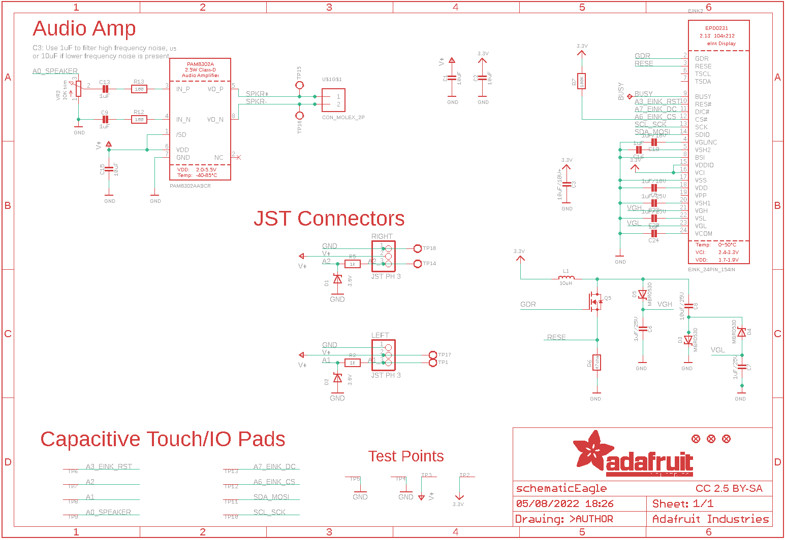
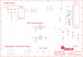

Contents
========

* [PRA4428 > Adafruit](#pra4428--adafruit)
	* [Schematic](#schematic)
	* [Interactive BOM](#interactive-bom)
	* [OOMP Parts](#oomp-parts)
	* [Images](#images)
	* [Tags](#tags)
  
![][im]
# PRA4428 > Adafruit

- ID: PROJ-ADAF-4428-STAN-01
- Hex ID: PRA4428
- Name: Adafruit
- Description: Adafruit
- Long Link: [http://oom.lt/PROJ-ADAF-4428-STAN-01](http://oom.lt/PROJ-ADAF-4428-STAN-01)
- Short Link: [http://oom.lt/PRA4428](http://oom.lt/PRA4428)

## Schematic
  

## Interactive BOM

- Interactive BOM page: [ibom.html](https://htmlpreview.github.io/?https://github.com/oomlout/oomlout_OOMP_projects/blob/main/PROJ-ADAF-4428-STAN-01/kicad/bom/ibom.html)

## OOMP Parts
  

|OOMP Parts|
| :---: |
|BUSY,UNMATCHED-UNMATCHED-UNMATCHED-UNMATCHED-UNMATCHED,BUSY,TPTP15SQ,TPTP15SQ,TP15SQ,Test pad,,0,,|
|C1,UNMATCHED-UNMATCHED-UNMATCHED-UNMATCHED-UNMATCHED,C1,10uF,CAP_CERAMIC0805-NOOUTLINE,0805-NO,Ceramic Capacitors,,,,|
|C2,UNMATCHED-UNMATCHED-UNMATCHED-UNMATCHED-UNMATCHED,C2,10uF,CAP_CERAMIC0805-NOOUTLINE,0805-NO,Ceramic Capacitors,,,,|
|C3,UNMATCHED-UNMATCHED-UNMATCHED-UNMATCHED-UNMATCHED,C3,10uF/10V+,CAP_CERAMIC0805-NOOUTLINE,0805-NO,Ceramic Capacitors,,,,|
|C5,UNMATCHED-UNMATCHED-UNMATCHED-UNMATCHED-UNMATCHED,C5,1uF/10V,CAP_CERAMIC0805-NOOUTLINE,0805-NO,Ceramic Capacitors,,,,|
|C6,UNMATCHED-UNMATCHED-UNMATCHED-UNMATCHED-UNMATCHED,C6,1uF/25V,CAP_CERAMIC0805-NOOUTLINE,0805-NO,Ceramic Capacitors,,,,|
|C7,UNMATCHED-UNMATCHED-UNMATCHED-UNMATCHED-UNMATCHED,C7,1uF/25V,CAP_CERAMIC0805-NOOUTLINE,0805-NO,Ceramic Capacitors,,,,|
|C8,UNMATCHED-UNMATCHED-UNMATCHED-UNMATCHED-UNMATCHED,C8,10uF/25V,CAP_CERAMIC0805-NOOUTLINE,0805-NO,Ceramic Capacitors,,,,|
|C9,UNMATCHED-UNMATCHED-UNMATCHED-UNMATCHED-UNMATCHED,C9,1uF,CAP_CERAMIC0805-NOOUTLINE,0805-NO,Ceramic Capacitors,,,,|
|C10,UNMATCHED-UNMATCHED-UNMATCHED-UNMATCHED-UNMATCHED,C10,1uF/10V,CAP_CERAMIC0805-NOOUTLINE,0805-NO,Ceramic Capacitors,,,,|
|C13,UNMATCHED-UNMATCHED-UNMATCHED-UNMATCHED-UNMATCHED,C13,1uF,CAP_CERAMIC0805-NOOUTLINE,0805-NO,Ceramic Capacitors,,,,|
|C15,UNMATCHED-UNMATCHED-UNMATCHED-UNMATCHED-UNMATCHED,C15,10uF,CAP_CERAMIC0805-NOOUTLINE,0805-NO,Ceramic Capacitors,,,,|
|C16,UNMATCHED-UNMATCHED-UNMATCHED-UNMATCHED-UNMATCHED,C16,1uF,CAP_CERAMIC0805-NOOUTLINE,0805-NO,Ceramic Capacitors,,,,|
|C22,UNMATCHED-UNMATCHED-UNMATCHED-UNMATCHED-UNMATCHED,C22,1uF/25V,CAP_CERAMIC0805-NOOUTLINE,0805-NO,Ceramic Capacitors,,,,|
|C23,UNMATCHED-UNMATCHED-UNMATCHED-UNMATCHED-UNMATCHED,C23,1uF/25V,CAP_CERAMIC0805-NOOUTLINE,0805-NO,Ceramic Capacitors,,,,|
|C24,UNMATCHED-UNMATCHED-UNMATCHED-UNMATCHED-UNMATCHED,C24,1uF,CAP_CERAMIC0805-NOOUTLINE,0805-NO,Ceramic Capacitors,,,,|
|D1,UNMATCHED-UNMATCHED-UNMATCHED-UNMATCHED-UNMATCHED,D1,3.6V,DIODE-ZENERSOD323,SOD-323,Zener Diode,,,,|
|D2,UNMATCHED-UNMATCHED-UNMATCHED-UNMATCHED-UNMATCHED,D2,3.6V,DIODE-ZENERSOD323,SOD-323,Zener Diode,,,,|
|D3,UNMATCHED-UNMATCHED-UNMATCHED-UNMATCHED-UNMATCHED,D3,MBR0530,DIODE-SCHOTTKYSOD-123,SOD-123,,,,,|
|D4,UNMATCHED-UNMATCHED-UNMATCHED-UNMATCHED-UNMATCHED,D4,MBR0530,DIODE-SCHOTTKYSOD-123,SOD-123,,,,,|
|D5,UNMATCHED-UNMATCHED-UNMATCHED-UNMATCHED-UNMATCHED,D5,MBR0530,DIODE-SCHOTTKYSOD-123,SOD-123,,,,,|
|EINK2,UNMATCHED-UNMATCHED-UNMATCHED-UNMATCHED-UNMATCHED,EINK2,EINK_24PIN_154IN,EINK_24PIN_154IN,EINK_154IN,,,,,|
|L1,UNMATCHED-UNMATCHED-UNMATCHED-UNMATCHED-UNMATCHED,L1,10uH,INDUCTORNR401,INDUCTOR_4X4MM_NR401,Inductors,,,,|
|LEFT,UNMATCHED-UNMATCHED-UNMATCHED-UNMATCHED-UNMATCHED,LEFT,JST PH 3,CON_JST_PH_3PIN,JSTPH3,,,,,|
|Q5,UNMATCHED-UNMATCHED-UNMATCHED-UNMATCHED-UNMATCHED,Q5,IRLML0100,IRLML2060TRPBF,SOT23-3,,,,,|
|R2,UNMATCHED-UNMATCHED-UNMATCHED-UNMATCHED-UNMATCHED,R2,1K,RESISTOR_0603_NOOUT,0603-NO,Resistors,,,,|
|R5,UNMATCHED-UNMATCHED-UNMATCHED-UNMATCHED-UNMATCHED,R5,1K,RESISTOR_0603_NOOUT,0603-NO,Resistors,,,,|
|R6,UNMATCHED-UNMATCHED-UNMATCHED-UNMATCHED-UNMATCHED,R6,.47ohm,RESISTOR0805_10MGAP,0805_10MGAP,Resistors,,,,|
|R7,UNMATCHED-UNMATCHED-UNMATCHED-UNMATCHED-UNMATCHED,R7,100K,RESISTOR_0603_NOOUT,0603-NO,Resistors,,,,|
|R12,UNMATCHED-UNMATCHED-UNMATCHED-UNMATCHED-UNMATCHED,R12,100,RESISTOR_0603_NOOUT,0603-NO,Resistors,,,,|
|R13,UNMATCHED-UNMATCHED-UNMATCHED-UNMATCHED-UNMATCHED,R13,100,RESISTOR_0603_NOOUT,0603-NO,Resistors,,,,|
|RIGHT,UNMATCHED-UNMATCHED-UNMATCHED-UNMATCHED-UNMATCHED,RIGHT,JST PH 3,CON_JST_PH_3PIN,JSTPH3,,,,,|
|TP1,UNMATCHED-UNMATCHED-UNMATCHED-UNMATCHED-UNMATCHED,TP1,,TESTPOINTROUND1.5MMNO,TESTPOINT_ROUND_1.5MM_NO,Test Point,,,,|
|TP2,UNMATCHED-UNMATCHED-UNMATCHED-UNMATCHED-UNMATCHED,TP2,SEWTAP_SMTNUTM3,SEWTAP_SMTNUTM3,SMT_NUT_3MM,,,,,|
|TP3,UNMATCHED-UNMATCHED-UNMATCHED-UNMATCHED-UNMATCHED,TP3,SEWTAP_SMTNUTM3,SEWTAP_SMTNUTM3,SMT_NUT_3MM,,,,,|
|TP4,UNMATCHED-UNMATCHED-UNMATCHED-UNMATCHED-UNMATCHED,TP4,SEWTAP_SMTNUTM3,SEWTAP_SMTNUTM3,SMT_NUT_3MM,,,,,|
|TP5,UNMATCHED-UNMATCHED-UNMATCHED-UNMATCHED-UNMATCHED,TP5,SEWTAP_SMTNUTM3,SEWTAP_SMTNUTM3,SMT_NUT_3MM,,,,,|
|TP6,UNMATCHED-UNMATCHED-UNMATCHED-UNMATCHED-UNMATCHED,TP6,SEWTAP_SMTNUTM3,SEWTAP_SMTNUTM3,SMT_NUT_3MM,,,,,|
|TP7,UNMATCHED-UNMATCHED-UNMATCHED-UNMATCHED-UNMATCHED,TP7,SEWTAP_SMTNUTM3,SEWTAP_SMTNUTM3,SMT_NUT_3MM,,,,,|
|TP8,UNMATCHED-UNMATCHED-UNMATCHED-UNMATCHED-UNMATCHED,TP8,SEWTAP_SMTNUTM3,SEWTAP_SMTNUTM3,SMT_NUT_3MM,,,,,|
|TP9,UNMATCHED-UNMATCHED-UNMATCHED-UNMATCHED-UNMATCHED,TP9,SEWTAP_SMTNUTM3,SEWTAP_SMTNUTM3,SMT_NUT_3MM,,,,,|
|TP10,UNMATCHED-UNMATCHED-UNMATCHED-UNMATCHED-UNMATCHED,TP10,SEWTAP_SMTNUTM3,SEWTAP_SMTNUTM3,SMT_NUT_3MM,,,,,|
|TP11,UNMATCHED-UNMATCHED-UNMATCHED-UNMATCHED-UNMATCHED,TP11,SEWTAP_SMTNUTM3,SEWTAP_SMTNUTM3,SMT_NUT_3MM,,,,,|
|TP12,UNMATCHED-UNMATCHED-UNMATCHED-UNMATCHED-UNMATCHED,TP12,SEWTAP_SMTNUTM3,SEWTAP_SMTNUTM3,SMT_NUT_3MM,,,,,|
|TP13,UNMATCHED-UNMATCHED-UNMATCHED-UNMATCHED-UNMATCHED,TP13,SEWTAP_SMTNUTM3,SEWTAP_SMTNUTM3,SMT_NUT_3MM,,,,,|
|TP14,UNMATCHED-UNMATCHED-UNMATCHED-UNMATCHED-UNMATCHED,TP14,,TESTPOINTROUND1.5MMNO,TESTPOINT_ROUND_1.5MM_NO,Test Point,,,,|
|TP15,UNMATCHED-UNMATCHED-UNMATCHED-UNMATCHED-UNMATCHED,TP15,,TESTPOINTROUND1.5MMNO,TESTPOINT_ROUND_1.5MM_NO,Test Point,,,,|
|TP16,UNMATCHED-UNMATCHED-UNMATCHED-UNMATCHED-UNMATCHED,TP16,,TESTPOINTROUND1.5MMNO,TESTPOINT_ROUND_1.5MM_NO,Test Point,,,,|
|TP17,UNMATCHED-UNMATCHED-UNMATCHED-UNMATCHED-UNMATCHED,TP17,,TESTPOINTROUND1.5MMNO,TESTPOINT_ROUND_1.5MM_NO,Test Point,,,,|
|TP18,UNMATCHED-UNMATCHED-UNMATCHED-UNMATCHED-UNMATCHED,TP18,,TESTPOINTROUND1.5MMNO,TESTPOINT_ROUND_1.5MM_NO,Test Point,,,,|
|U$1,UNMATCHED-UNMATCHED-UNMATCHED-UNMATCHED-UNMATCHED,U$1,CON_MOLEX_2P,CON_MOLEX_2P,53398-0271,,,,,|
|U5,UNMATCHED-UNMATCHED-UNMATCHED-UNMATCHED-UNMATCHED,U$2,FIDUCIAL_1MM,FIDUCIAL_1MM,FIDUCIAL_1MM,Fiducial Alignment Points,EXCLUDE,,,|
|VR2,UNMATCHED-UNMATCHED-UNMATCHED-UNMATCHED-UNMATCHED,U$3,FIDUCIAL_1MM,FIDUCIAL_1MM,FIDUCIAL_1MM,Fiducial Alignment Points,EXCLUDE,,,|

## Images
  
  

|kicadPcb3d|kicadPcb3dFront|kicadPcb3dBack|eagleImage|eagleSchemImage|
| :---: | :---: | :---: | :---: | :---: |
||||||

## Tags

- hexID: PRA4428
- oompType: PROJ
- oompSize: ADAF
- oompColor: 4428
- oompDesc: STAN
- oompIndex: 01
- oompName: Adafruit Circuit Playground Tri Color E Ink Gizmo PCB
- sources: All source files from https://github.com/adafruit/Adafruit-Circuit-Playground-Tri-Color-E-Ink-Gizmo-PCB (source licence details in srcLicense.md)
- linkBuyPage: http://www.adafruit.com/products/4428
- oompID: PROJ-ADAF-4428-STAN-01
- oompParts: BUSY,UNMATCHED-UNMATCHED-UNMATCHED-UNMATCHED-UNMATCHED
- oompParts: C1,UNMATCHED-UNMATCHED-UNMATCHED-UNMATCHED-UNMATCHED
- oompParts: C2,UNMATCHED-UNMATCHED-UNMATCHED-UNMATCHED-UNMATCHED
- oompParts: C3,UNMATCHED-UNMATCHED-UNMATCHED-UNMATCHED-UNMATCHED
- oompParts: C5,UNMATCHED-UNMATCHED-UNMATCHED-UNMATCHED-UNMATCHED
- oompParts: C6,UNMATCHED-UNMATCHED-UNMATCHED-UNMATCHED-UNMATCHED
- oompParts: C7,UNMATCHED-UNMATCHED-UNMATCHED-UNMATCHED-UNMATCHED
- oompParts: C8,UNMATCHED-UNMATCHED-UNMATCHED-UNMATCHED-UNMATCHED
- oompParts: C9,UNMATCHED-UNMATCHED-UNMATCHED-UNMATCHED-UNMATCHED
- oompParts: C10,UNMATCHED-UNMATCHED-UNMATCHED-UNMATCHED-UNMATCHED
- oompParts: C13,UNMATCHED-UNMATCHED-UNMATCHED-UNMATCHED-UNMATCHED
- oompParts: C15,UNMATCHED-UNMATCHED-UNMATCHED-UNMATCHED-UNMATCHED
- oompParts: C16,UNMATCHED-UNMATCHED-UNMATCHED-UNMATCHED-UNMATCHED
- oompParts: C22,UNMATCHED-UNMATCHED-UNMATCHED-UNMATCHED-UNMATCHED
- oompParts: C23,UNMATCHED-UNMATCHED-UNMATCHED-UNMATCHED-UNMATCHED
- oompParts: C24,UNMATCHED-UNMATCHED-UNMATCHED-UNMATCHED-UNMATCHED
- oompParts: D1,UNMATCHED-UNMATCHED-UNMATCHED-UNMATCHED-UNMATCHED
- oompParts: D2,UNMATCHED-UNMATCHED-UNMATCHED-UNMATCHED-UNMATCHED
- oompParts: D3,UNMATCHED-UNMATCHED-UNMATCHED-UNMATCHED-UNMATCHED
- oompParts: D4,UNMATCHED-UNMATCHED-UNMATCHED-UNMATCHED-UNMATCHED
- oompParts: D5,UNMATCHED-UNMATCHED-UNMATCHED-UNMATCHED-UNMATCHED
- oompParts: EINK2,UNMATCHED-UNMATCHED-UNMATCHED-UNMATCHED-UNMATCHED
- oompParts: L1,UNMATCHED-UNMATCHED-UNMATCHED-UNMATCHED-UNMATCHED
- oompParts: LEFT,UNMATCHED-UNMATCHED-UNMATCHED-UNMATCHED-UNMATCHED
- oompParts: Q5,UNMATCHED-UNMATCHED-UNMATCHED-UNMATCHED-UNMATCHED
- oompParts: R2,UNMATCHED-UNMATCHED-UNMATCHED-UNMATCHED-UNMATCHED
- oompParts: R5,UNMATCHED-UNMATCHED-UNMATCHED-UNMATCHED-UNMATCHED
- oompParts: R6,UNMATCHED-UNMATCHED-UNMATCHED-UNMATCHED-UNMATCHED
- oompParts: R7,UNMATCHED-UNMATCHED-UNMATCHED-UNMATCHED-UNMATCHED
- oompParts: R12,UNMATCHED-UNMATCHED-UNMATCHED-UNMATCHED-UNMATCHED
- oompParts: R13,UNMATCHED-UNMATCHED-UNMATCHED-UNMATCHED-UNMATCHED
- oompParts: RIGHT,UNMATCHED-UNMATCHED-UNMATCHED-UNMATCHED-UNMATCHED
- oompParts: TP1,UNMATCHED-UNMATCHED-UNMATCHED-UNMATCHED-UNMATCHED
- oompParts: TP2,UNMATCHED-UNMATCHED-UNMATCHED-UNMATCHED-UNMATCHED
- oompParts: TP3,UNMATCHED-UNMATCHED-UNMATCHED-UNMATCHED-UNMATCHED
- oompParts: TP4,UNMATCHED-UNMATCHED-UNMATCHED-UNMATCHED-UNMATCHED
- oompParts: TP5,UNMATCHED-UNMATCHED-UNMATCHED-UNMATCHED-UNMATCHED
- oompParts: TP6,UNMATCHED-UNMATCHED-UNMATCHED-UNMATCHED-UNMATCHED
- oompParts: TP7,UNMATCHED-UNMATCHED-UNMATCHED-UNMATCHED-UNMATCHED
- oompParts: TP8,UNMATCHED-UNMATCHED-UNMATCHED-UNMATCHED-UNMATCHED
- oompParts: TP9,UNMATCHED-UNMATCHED-UNMATCHED-UNMATCHED-UNMATCHED
- oompParts: TP10,UNMATCHED-UNMATCHED-UNMATCHED-UNMATCHED-UNMATCHED
- oompParts: TP11,UNMATCHED-UNMATCHED-UNMATCHED-UNMATCHED-UNMATCHED
- oompParts: TP12,UNMATCHED-UNMATCHED-UNMATCHED-UNMATCHED-UNMATCHED
- oompParts: TP13,UNMATCHED-UNMATCHED-UNMATCHED-UNMATCHED-UNMATCHED
- oompParts: TP14,UNMATCHED-UNMATCHED-UNMATCHED-UNMATCHED-UNMATCHED
- oompParts: TP15,UNMATCHED-UNMATCHED-UNMATCHED-UNMATCHED-UNMATCHED
- oompParts: TP16,UNMATCHED-UNMATCHED-UNMATCHED-UNMATCHED-UNMATCHED
- oompParts: TP17,UNMATCHED-UNMATCHED-UNMATCHED-UNMATCHED-UNMATCHED
- oompParts: TP18,UNMATCHED-UNMATCHED-UNMATCHED-UNMATCHED-UNMATCHED
- oompParts: U$1,UNMATCHED-UNMATCHED-UNMATCHED-UNMATCHED-UNMATCHED
- oompParts: U5,UNMATCHED-UNMATCHED-UNMATCHED-UNMATCHED-UNMATCHED
- oompParts: VR2,UNMATCHED-UNMATCHED-UNMATCHED-UNMATCHED-UNMATCHED
- rawParts: BUSY,TPTP15SQ,TPTP15SQ,TP15SQ,Test pad,,0,,
- rawParts: C1,10uF,CAP_CERAMIC0805-NOOUTLINE,0805-NO,Ceramic Capacitors,,,,
- rawParts: C2,10uF,CAP_CERAMIC0805-NOOUTLINE,0805-NO,Ceramic Capacitors,,,,
- rawParts: C3,10uF/10V+,CAP_CERAMIC0805-NOOUTLINE,0805-NO,Ceramic Capacitors,,,,
- rawParts: C5,1uF/10V,CAP_CERAMIC0805-NOOUTLINE,0805-NO,Ceramic Capacitors,,,,
- rawParts: C6,1uF/25V,CAP_CERAMIC0805-NOOUTLINE,0805-NO,Ceramic Capacitors,,,,
- rawParts: C7,1uF/25V,CAP_CERAMIC0805-NOOUTLINE,0805-NO,Ceramic Capacitors,,,,
- rawParts: C8,10uF/25V,CAP_CERAMIC0805-NOOUTLINE,0805-NO,Ceramic Capacitors,,,,
- rawParts: C9,1uF,CAP_CERAMIC0805-NOOUTLINE,0805-NO,Ceramic Capacitors,,,,
- rawParts: C10,1uF/10V,CAP_CERAMIC0805-NOOUTLINE,0805-NO,Ceramic Capacitors,,,,
- rawParts: C13,1uF,CAP_CERAMIC0805-NOOUTLINE,0805-NO,Ceramic Capacitors,,,,
- rawParts: C15,10uF,CAP_CERAMIC0805-NOOUTLINE,0805-NO,Ceramic Capacitors,,,,
- rawParts: C16,1uF,CAP_CERAMIC0805-NOOUTLINE,0805-NO,Ceramic Capacitors,,,,
- rawParts: C22,1uF/25V,CAP_CERAMIC0805-NOOUTLINE,0805-NO,Ceramic Capacitors,,,,
- rawParts: C23,1uF/25V,CAP_CERAMIC0805-NOOUTLINE,0805-NO,Ceramic Capacitors,,,,
- rawParts: C24,1uF,CAP_CERAMIC0805-NOOUTLINE,0805-NO,Ceramic Capacitors,,,,
- rawParts: D1,3.6V,DIODE-ZENERSOD323,SOD-323,Zener Diode,,,,
- rawParts: D2,3.6V,DIODE-ZENERSOD323,SOD-323,Zener Diode,,,,
- rawParts: D3,MBR0530,DIODE-SCHOTTKYSOD-123,SOD-123,,,,,
- rawParts: D4,MBR0530,DIODE-SCHOTTKYSOD-123,SOD-123,,,,,
- rawParts: D5,MBR0530,DIODE-SCHOTTKYSOD-123,SOD-123,,,,,
- rawParts: EINK2,EINK_24PIN_154IN,EINK_24PIN_154IN,EINK_154IN,,,,,
- rawParts: L1,10uH,INDUCTORNR401,INDUCTOR_4X4MM_NR401,Inductors,,,,
- rawParts: LEFT,JST PH 3,CON_JST_PH_3PIN,JSTPH3,,,,,
- rawParts: Q5,IRLML0100,IRLML2060TRPBF,SOT23-3,,,,,
- rawParts: R2,1K,RESISTOR_0603_NOOUT,0603-NO,Resistors,,,,
- rawParts: R5,1K,RESISTOR_0603_NOOUT,0603-NO,Resistors,,,,
- rawParts: R6,.47ohm,RESISTOR0805_10MGAP,0805_10MGAP,Resistors,,,,
- rawParts: R7,100K,RESISTOR_0603_NOOUT,0603-NO,Resistors,,,,
- rawParts: R12,100,RESISTOR_0603_NOOUT,0603-NO,Resistors,,,,
- rawParts: R13,100,RESISTOR_0603_NOOUT,0603-NO,Resistors,,,,
- rawParts: RIGHT,JST PH 3,CON_JST_PH_3PIN,JSTPH3,,,,,
- rawParts: TP1,,TESTPOINTROUND1.5MMNO,TESTPOINT_ROUND_1.5MM_NO,Test Point,,,,
- rawParts: TP2,SEWTAP_SMTNUTM3,SEWTAP_SMTNUTM3,SMT_NUT_3MM,,,,,
- rawParts: TP3,SEWTAP_SMTNUTM3,SEWTAP_SMTNUTM3,SMT_NUT_3MM,,,,,
- rawParts: TP4,SEWTAP_SMTNUTM3,SEWTAP_SMTNUTM3,SMT_NUT_3MM,,,,,
- rawParts: TP5,SEWTAP_SMTNUTM3,SEWTAP_SMTNUTM3,SMT_NUT_3MM,,,,,
- rawParts: TP6,SEWTAP_SMTNUTM3,SEWTAP_SMTNUTM3,SMT_NUT_3MM,,,,,
- rawParts: TP7,SEWTAP_SMTNUTM3,SEWTAP_SMTNUTM3,SMT_NUT_3MM,,,,,
- rawParts: TP8,SEWTAP_SMTNUTM3,SEWTAP_SMTNUTM3,SMT_NUT_3MM,,,,,
- rawParts: TP9,SEWTAP_SMTNUTM3,SEWTAP_SMTNUTM3,SMT_NUT_3MM,,,,,
- rawParts: TP10,SEWTAP_SMTNUTM3,SEWTAP_SMTNUTM3,SMT_NUT_3MM,,,,,
- rawParts: TP11,SEWTAP_SMTNUTM3,SEWTAP_SMTNUTM3,SMT_NUT_3MM,,,,,
- rawParts: TP12,SEWTAP_SMTNUTM3,SEWTAP_SMTNUTM3,SMT_NUT_3MM,,,,,
- rawParts: TP13,SEWTAP_SMTNUTM3,SEWTAP_SMTNUTM3,SMT_NUT_3MM,,,,,
- rawParts: TP14,,TESTPOINTROUND1.5MMNO,TESTPOINT_ROUND_1.5MM_NO,Test Point,,,,
- rawParts: TP15,,TESTPOINTROUND1.5MMNO,TESTPOINT_ROUND_1.5MM_NO,Test Point,,,,
- rawParts: TP16,,TESTPOINTROUND1.5MMNO,TESTPOINT_ROUND_1.5MM_NO,Test Point,,,,
- rawParts: TP17,,TESTPOINTROUND1.5MMNO,TESTPOINT_ROUND_1.5MM_NO,Test Point,,,,
- rawParts: TP18,,TESTPOINTROUND1.5MMNO,TESTPOINT_ROUND_1.5MM_NO,Test Point,,,,
- rawParts: U$1,CON_MOLEX_2P,CON_MOLEX_2P,53398-0271,,,,,
- rawParts: U$2,FIDUCIAL_1MM,FIDUCIAL_1MM,FIDUCIAL_1MM,Fiducial Alignment Points,EXCLUDE,,,
- rawParts: U$3,FIDUCIAL_1MM,FIDUCIAL_1MM,FIDUCIAL_1MM,Fiducial Alignment Points,EXCLUDE,,,
- rawParts: U$6,FIDUCIAL_1MM,FIDUCIAL_1MM,FIDUCIAL_1MM,Fiducial Alignment Points,EXCLUDE,,,
- rawParts: U5,PAM8302AASCR,AUDIOAMP_PAM8302A,MSOP8_0.65MM,PAM8302A - 2.5W Class-D Mono Audio Amplifier,,,,
- rawParts: VR2,10K trim,TRIMPOT3303W/X,TRIMPOT_BOURNS_3303W,3-Pin SMT Trimpots,,,,

[im]: kicadPcb3d_450.png
