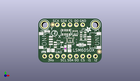
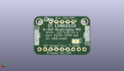
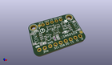

Contents
========

* [PROJ-ADAF-4438-STAN-01>Adafruit LSM6DSOX PCB](#proj-adaf-4438-stan-01adafruit-lsm6dsox-pcb)
	* [Images](#images)
	* [Interactive BOM](#interactive-bom)
	* [OOMP Parts](#oomp-parts)
	* [Tags](#tags)
  
![][im]
# PROJ-ADAF-4438-STAN-01>Adafruit LSM6DSOX PCB

- ID: PROJ-ADAF-4438-STAN-01
- Hex ID: PRA4438
- Name: Adafruit LSM6DSOX PCB
- Description: 

## Images
  
  

|eagleImage|kicadPcb3dFront|kicadPcb3dBack|kicadPcb3d|
| :---: | :---: | :---: | :---: |
|||||

## Interactive BOM

- Interactive BOM page: [ibom.html](kicad/bom/ibom.html)

## OOMP Parts
  

|OOMP Parts|
| :---: |
|CAPE-0603-X-NF100-01, C1, 427.5, 221.5, 270,C1, 0.1uF, 0603-NO, microbuilder, (427.5, 221.5), R270|
|CAPE-0805-X-UNMATCHED-01, C2, 197.5, 192.5, 180,C2, 10uF, 0805-NO, microbuilder, (197.5, 192.5), R180|
|CAPE-0805-X-UNMATCHED-01, C3, 493.0, 224.5, 270,C3, 10uF, 0805-NO, microbuilder, (493, 224.5), R270|
|UNMATCHED-UNMATCHED-X-UNMATCHED-01, CONN3, 900.0, 350.0, 90,CONN3, STEMMA_I2C_QT, JST_SH4, microbuilder, (900, 350), R90|
|UNMATCHED-UNMATCHED-X-UNMATCHED-01, CONN4, 100.0, 350.0, 270,CONN4, STEMMA_I2C_QT, JST_SH4, microbuilder, (100, 350), R270|
|UNMATCHED-UNMATCHED-X-UNMATCHED-01, D1, 140.0, 495.0, 90,D1, GREEN, CHIPLED_0603_NOOUTLINE, microbuilder, (140, 495), R90|
|UNMATCHED-UNMATCHED-X-UNMATCHED-01, D2, 677.0, 279.0, 180,D2, 1N4148, SOD-323, microbuilder, (677, 279), R180|
|UNMATCHED-UNMATCHED-X-UNMATCHED-01, JP1, 500.0, 100.0, 0,JP1, 1X09_ROUND_70, microbuilder, (500, 100), R0|
|UNMATCHED-UNMATCHED-X-UNMATCHED-01, JP2, 500.0, 600.0, 180,JP2, 1X05_ROUND_70, microbuilder, (500, 600), R180|
|UNMATCHED-UNMATCHED-X-UNMATCHED-01, Q2, 580.0, 465.0, 0,Q2, BSS138, SOT363, microbuilder, (580, 465), R0|
|RESE-UNMATCHED-X-O103-01, R2, 437.5, 480.0, 180,R2, 10K, RESPACK_4X0603, microbuilder, (437.5, 480), R180|
|RESE-UNMATCHED-X-O103-01, R3, 708.0, 424.0, 90,R3, 10K, RESPACK_4X0603, microbuilder, (708, 424), R90|
|UNMATCHED-UNMATCHED-X-UNMATCHED-01, SJ1, 257.5, 244.0, M0,SJ1, SOLDERJUMPER_ARROW_NOPASTE, microbuilder, (257.5, 244), MR0|
|UNMATCHED-UNMATCHED-X-UNMATCHED-01, U2, 320.0, 282.5, 270,U2, AP2112K-3.3, SOT23-5, microbuilder, (320, 282.5), R270|

## Tags

- hexID: PRA4438
- oompType: PROJ
- oompSize: ADAF
- oompColor: 4438
- oompDesc: STAN
- oompIndex: 01
- oompName: Adafruit LSM6DSOX PCB
- sources: All source files from https://github.com/adafruit/Adafruit-LSM6DSOX-PCB (source licence details in srcLicense.md)
- linkBuyPage: http://www.adafruit.com/products/4438
- oompPart: CAPE-0603-X-NF100-01, C1, 427.5, 221.5, 270
- oompPart: CAPE-0805-X-UNMATCHED-01, C2, 197.5, 192.5, 180
- oompPart: CAPE-0805-X-UNMATCHED-01, C3, 493.0, 224.5, 270
- oompPart: UNMATCHED-UNMATCHED-X-UNMATCHED-01, CONN3, 900.0, 350.0, 90
- oompPart: UNMATCHED-UNMATCHED-X-UNMATCHED-01, CONN4, 100.0, 350.0, 270
- oompPart: UNMATCHED-UNMATCHED-X-UNMATCHED-01, D1, 140.0, 495.0, 90
- oompPart: UNMATCHED-UNMATCHED-X-UNMATCHED-01, D2, 677.0, 279.0, 180
- oompPart: SKIP-UNMATCHED-X-UNMATCHED-01, FID3, 228.0, 603.0, 0
- oompPart: SKIP-UNMATCHED-X-UNMATCHED-01, FID4, 962.0, 172.0, 0
- oompPart: UNMATCHED-UNMATCHED-X-UNMATCHED-01, JP1, 500.0, 100.0, 0
- oompPart: UNMATCHED-UNMATCHED-X-UNMATCHED-01, JP2, 500.0, 600.0, 180
- oompPart: UNMATCHED-UNMATCHED-X-UNMATCHED-01, Q2, 580.0, 465.0, 0
- oompPart: RESE-UNMATCHED-X-O103-01, R2, 437.5, 480.0, 180
- oompPart: RESE-UNMATCHED-X-O103-01, R3, 708.0, 424.0, 90
- oompPart: UNMATCHED-UNMATCHED-X-UNMATCHED-01, SJ1, 257.5, 244.0, M0
- oompPart: SKIP-UNMATCHED-X-UNMATCHED-01, U$1, 100.0, 600.0, 0
- oompPart: SKIP-UNMATCHED-X-UNMATCHED-01, U$2, 500.0, 350.0, 0
- oompPart: SKIP-UNMATCHED-X-UNMATCHED-01, U$17, 900.0, 600.0, 0
- oompPart: UNMATCHED-UNMATCHED-X-UNMATCHED-01, U2, 320.0, 282.5, 270
- rawPart: C1, 0.1uF, 0603-NO, microbuilder, (427.5, 221.5), R270
- rawPart: C2, 10uF, 0805-NO, microbuilder, (197.5, 192.5), R180
- rawPart: C3, 10uF, 0805-NO, microbuilder, (493, 224.5), R270
- rawPart: CONN3, STEMMA_I2C_QT, JST_SH4, microbuilder, (900, 350), R90
- rawPart: CONN4, STEMMA_I2C_QT, JST_SH4, microbuilder, (100, 350), R270
- rawPart: D1, GREEN, CHIPLED_0603_NOOUTLINE, microbuilder, (140, 495), R90
- rawPart: D2, 1N4148, SOD-323, microbuilder, (677, 279), R180
- rawPart: FID3, FIDUCIAL_1MM, FIDUCIAL_1MM, microbuilder, (228, 603), R0
- rawPart: FID4, FIDUCIAL_1MM, FIDUCIAL_1MM, microbuilder, (962, 172), R0
- rawPart: JP1, 1X09_ROUND_70, microbuilder, (500, 100), R0
- rawPart: JP2, 1X05_ROUND_70, microbuilder, (500, 600), R180
- rawPart: Q2, BSS138, SOT363, microbuilder, (580, 465), R0
- rawPart: R2, 10K, RESPACK_4X0603, microbuilder, (437.5, 480), R180
- rawPart: R3, 10K, RESPACK_4X0603, microbuilder, (708, 424), R90
- rawPart: SJ1, SOLDERJUMPER_ARROW_NOPASTE, microbuilder, (257.5, 244), MR0
- rawPart: U$1, MOUNTINGHOLE2.5, MOUNTINGHOLE_2.5_PLATED, microbuilder, (100, 600), R0
- rawPart: U$2, LSM6DSOX, LGA-14L, microbuilder, (500, 350), R0
- rawPart: U$17, MOUNTINGHOLE2.5, MOUNTINGHOLE_2.5_PLATED, microbuilder, (900, 600), R0
- rawPart: U2, AP2112K-3.3, SOT23-5, microbuilder, (320, 282.5), R270

[im]: kicadPcb3d_450.png
