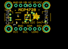
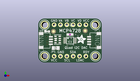
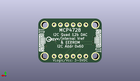
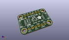

Contents
========

* [PROJ-ADAF-4470-STAN-01>Adafruit MCP4728 PCB](#proj-adaf-4470-stan-01adafruit-mcp4728-pcb)
	* [Images](#images)
	* [Interactive BOM](#interactive-bom)
	* [OOMP Parts](#oomp-parts)
	* [Tags](#tags)
  
![][im]
# PROJ-ADAF-4470-STAN-01>Adafruit MCP4728 PCB

- ID: PROJ-ADAF-4470-STAN-01
- Hex ID: PRA4470
- Name: Adafruit MCP4728 PCB
- Description: 

## Images
  
  

|eagleImage|kicadPcb3dFront|kicadPcb3dBack|kicadPcb3d|
| :---: | :---: | :---: | :---: |
|||||

## Interactive BOM

- Interactive BOM page: [ibom.html](kicad/bom/ibom.html)

## OOMP Parts
  

|OOMP Parts|
| :---: |
|CAPE-0603-X-NF100-01, C1, 12.7, 11.302999999999999, 0,C1, 0.1uF, 0603-NO, microbuilder, (0.5, 0.445), R0|
|CAPE-0805-X-UNMATCHED-01, C2, 6.985, 5.842, 180,C2, 10uF, 0805-NO, microbuilder, (0.275, 0.23), R180|
|UNMATCHED-UNMATCHED-X-UNMATCHED-01, CONN3, 22.86, 8.889999999999999, 90,CONN3, STEMMA_I2C_QT, JST_SH4, microbuilder, (0.9, 0.35), R90|
|UNMATCHED-UNMATCHED-X-UNMATCHED-01, CONN4, 2.54, 8.889999999999999, 270,CONN4, STEMMA_I2C_QT, JST_SH4, microbuilder, (0.1, 0.35), R270|
|UNMATCHED-UNMATCHED-X-UNMATCHED-01, D1, 3.556, 12.572999999999999, 90,D1, GREEN, CHIPLED_0603_NOOUTLINE, microbuilder, (0.14, 0.495), R90|
|UNMATCHED-UNMATCHED-X-UNMATCHED-01, IC1, 12.7, 8.889999999999999, 270,IC1, MCP4728, MSOP10, microbuilder, (0.5, 0.35), R270|
|UNMATCHED-UNMATCHED-X-UNMATCHED-01, JP1, 12.7, 2.54, 0,JP1, 1X06_ROUND_70, microbuilder, (0.5, 0.1), R0|
|UNMATCHED-UNMATCHED-X-UNMATCHED-01, JP2, 12.7, 15.239999999999998, 0,JP2, 1X06_ROUND_70, microbuilder, (0.5, 0.6), R0|
|RESE-UNMATCHED-X-UNMATCHED-01, R3, 7.746999999999999, 9.270999999999999, 270,R3, 4.7K, RESPACK_4X0603, microbuilder, (0.305, 0.365), R270|

## Tags

- hexID: PRA4470
- oompType: PROJ
- oompSize: ADAF
- oompColor: 4470
- oompDesc: STAN
- oompIndex: 01
- oompName: Adafruit MCP4728 PCB
- sources: All source files from https://github.com/adafruit/Adafruit-MCP4728-PCB (source licence details in srcLicense.md)
- linkBuyPage: http://www.adafruit.com/products/4470
- oompPart: CAPE-0603-X-NF100-01, C1, 12.7, 11.302999999999999, 0
- oompPart: CAPE-0805-X-UNMATCHED-01, C2, 6.985, 5.842, 180
- oompPart: UNMATCHED-UNMATCHED-X-UNMATCHED-01, CONN3, 22.86, 8.889999999999999, 90
- oompPart: UNMATCHED-UNMATCHED-X-UNMATCHED-01, CONN4, 2.54, 8.889999999999999, 270
- oompPart: UNMATCHED-UNMATCHED-X-UNMATCHED-01, D1, 3.556, 12.572999999999999, 90
- oompPart: SKIP-UNMATCHED-X-UNMATCHED-01, FID3, 6.095999999999999, 12.572999999999999, 0
- oompPart: SKIP-UNMATCHED-X-UNMATCHED-01, FID4, 18.796, 12.827, 0
- oompPart: UNMATCHED-UNMATCHED-X-UNMATCHED-01, IC1, 12.7, 8.889999999999999, 270
- oompPart: UNMATCHED-UNMATCHED-X-UNMATCHED-01, JP1, 12.7, 2.54, 0
- oompPart: UNMATCHED-UNMATCHED-X-UNMATCHED-01, JP2, 12.7, 15.239999999999998, 0
- oompPart: RESE-UNMATCHED-X-UNMATCHED-01, R3, 7.746999999999999, 9.270999999999999, 270
- oompPart: SKIP-UNMATCHED-X-UNMATCHED-01, U$1, 2.54, 15.239999999999998, 0
- oompPart: SKIP-UNMATCHED-X-UNMATCHED-01, U$17, 22.86, 15.239999999999998, 0
- oompPart: SKIP-UNMATCHED-X-UNMATCHED-01, U$19, 2.54, 2.54, 0
- oompPart: SKIP-UNMATCHED-X-UNMATCHED-01, U$21, 22.86, 2.54, 0
- rawPart: C1, 0.1uF, 0603-NO, microbuilder, (0.5, 0.445), R0
- rawPart: C2, 10uF, 0805-NO, microbuilder, (0.275, 0.23), R180
- rawPart: CONN3, STEMMA_I2C_QT, JST_SH4, microbuilder, (0.9, 0.35), R90
- rawPart: CONN4, STEMMA_I2C_QT, JST_SH4, microbuilder, (0.1, 0.35), R270
- rawPart: D1, GREEN, CHIPLED_0603_NOOUTLINE, microbuilder, (0.14, 0.495), R90
- rawPart: FID3, FIDUCIAL_1MM, FIDUCIAL_1MM, microbuilder, (0.24, 0.495), R0
- rawPart: FID4, FIDUCIAL_1MM, FIDUCIAL_1MM, microbuilder, (0.74, 0.505), R0
- rawPart: IC1, MCP4728, MSOP10, microbuilder, (0.5, 0.35), R270
- rawPart: JP1, 1X06_ROUND_70, microbuilder, (0.5, 0.1), R0
- rawPart: JP2, 1X06_ROUND_70, microbuilder, (0.5, 0.6), R0
- rawPart: R3, 4.7K, RESPACK_4X0603, microbuilder, (0.305, 0.365), R270
- rawPart: U$1, MOUNTINGHOLE2.5, MOUNTINGHOLE_2.5_PLATED, microbuilder, (0.1, 0.6), R0
- rawPart: U$17, MOUNTINGHOLE2.5, MOUNTINGHOLE_2.5_PLATED, microbuilder, (0.9, 0.6), R0
- rawPart: U$19, MOUNTINGHOLE2.5, MOUNTINGHOLE_2.5_PLATED, microbuilder, (0.1, 0.1), R0
- rawPart: U$21, MOUNTINGHOLE2.5, MOUNTINGHOLE_2.5_PLATED, microbuilder, (0.9, 0.1), R0

[im]: kicadPcb3d_450.png
