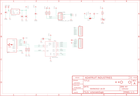

Contents
========

* [PRA4471 > Adafruit MCP2221 PCB](#pra4471--adafruit-mcp2221-pcb)
	* [Schematic](#schematic)
	* [PCB](#pcb)
	* [Interactive BOM](#interactive-bom)
	* [OOMP Parts](#oomp-parts)
	* [Images](#images)
	* [Tags](#tags)
  
![][im]
# PRA4471 > Adafruit MCP2221 PCB

- ID: PROJ-ADAF-4471-STAN-01
- Hex ID: PRA4471
- Name: Adafruit
- Description: Adafruit
- Long Link: [http://oom.lt/PROJ-ADAF-4471-STAN-01](http://oom.lt/PROJ-ADAF-4471-STAN-01)
- Short Link: [http://oom.lt/PRA4471](http://oom.lt/PRA4471)

## Schematic
  

## PCB
  

## Interactive BOM

- Interactive BOM page: [ibom.html](https://htmlpreview.github.io/?https://github.com/oomlout/oomlout_OOMP_projects/blob/main/PROJ-ADAF-4471-STAN-01/kicad/bom/ibom.html)

## OOMP Parts
  

|OOMP Parts|
| :---: |
|[C1 CAPC-0805-X-UF10-V10 SMD (0805) 10 uF Capacitor (Ceramic) 10v](https://github.com/oomlout/oomlout_OOMP_parts/tree/main/CAPC-0805-X-UF10-V10/)|
|C2 C2,CAPC-0603-X-UF1-01|
|C6 C6,CAPC-0603-X-UF1-01|
|C9 C9,CAPC-0603-X-UF1D-01|
|[C10 CAPC-0805-X-UF10-V10 SMD (0805) 10 uF Capacitor (Ceramic) 10v](https://github.com/oomlout/oomlout_OOMP_parts/tree/main/CAPC-0805-X-UF10-V10/)|
|[CONN1 HEAD-I01-X-PI04-01 2.54 mm 4 Pin Header](https://github.com/oomlout/oomlout_OOMP_parts/tree/main/HEAD-I01-X-PI04-01/)|
|D+ D+,UNMATCHED-UNMATCHED-X-UNMATCHED-01|
|D- D-,UNMATCHED-UNMATCHED-X-UNMATCHED-01|
|IC1 IC1,UNMATCHED-UNMATCHED-X-UNMATCHED-01|
|[JP1 HEAD-I01-X-PI06-01 2.54 mm 6 Pin Header](https://github.com/oomlout/oomlout_OOMP_parts/tree/main/HEAD-I01-X-PI06-01/)|
|[JP2 HEAD-I01-X-PI06-01 2.54 mm 6 Pin Header](https://github.com/oomlout/oomlout_OOMP_parts/tree/main/HEAD-I01-X-PI06-01/)|
|[LED1 LEDS-0603-G-STAN-01 SMD (0603) Green LED](https://github.com/oomlout/oomlout_OOMP_parts/tree/main/LEDS-0603-G-STAN-01/)|
|R1 R1,RESA-06038-X-O472X4-01|
|[R3 RESE-0603-X-O103-01 SMD (0603) 10k Ohm Resistor](https://github.com/oomlout/oomlout_OOMP_parts/tree/main/RESE-0603-X-O103-01/)|
|U2 U2,UNMATCHED-SO235-X-UNMATCHED-01|
|X6 X6,UNMATCHED-UNMATCHED-X-UNMATCHED-01|

## Images
  
  

|kicadPcb3d|kicadPcb3dFront|kicadPcb3dBack|eagleImage|eagleSchemImage|
| :---: | :---: | :---: | :---: | :---: |
||||||

## Tags

- hexID: PRA4471
- oompType: PROJ
- oompSize: ADAF
- oompColor: 4471
- oompDesc: STAN
- oompIndex: 01
- oompName: Adafruit MCP2221 PCB
- sources: All source files from https://github.com/adafruit/Adafruit-MCP2221-PCB (source licence details in srcLicense.md)
- linkBuyPage: http://www.adafruit.com/products/4471
- oompID: PROJ-ADAF-4471-STAN-01
- oompParts: C1,CAPC-0805-X-UF10-V10
- oompParts: C2,CAPC-0603-X-UF1-01
- oompParts: C6,CAPC-0603-X-UF1-01
- oompParts: C9,CAPC-0603-X-UF1D-01
- oompParts: C10,CAPC-0805-X-UF10-V10
- oompParts: CONN1,HEAD-I01-X-PI04-01
- oompParts: D+,UNMATCHED-UNMATCHED-X-UNMATCHED-01
- oompParts: D-,UNMATCHED-UNMATCHED-X-UNMATCHED-01
- oompParts: IC1,UNMATCHED-UNMATCHED-X-UNMATCHED-01
- oompParts: JP1,HEAD-I01-X-PI06-01
- oompParts: JP2,HEAD-I01-X-PI06-01
- oompParts: LED1,LEDS-0603-G-STAN-01
- oompParts: R1,RESA-06038-X-O472X4-01
- oompParts: R3,RESE-0603-X-O103-01
- oompParts: U2,UNMATCHED-SO235-X-UNMATCHED-01
- oompParts: X6,UNMATCHED-UNMATCHED-X-UNMATCHED-01
- rawParts: C1,10uF,CAP_CERAMIC0805-NOOUTLINE,0805-NO,Ceramic Capacitors,,,,,
- rawParts: C2,1uF,CAP_CERAMIC0603_NO,0603-NO,Ceramic Capacitors,,,,,
- rawParts: C6,1uF,CAP_CERAMIC0603_NO,0603-NO,Ceramic Capacitors,,,,,
- rawParts: C9,0.1uF,CAP_CERAMIC0603_NO,0603-NO,Ceramic Capacitors,,,,,
- rawParts: C10,10uF,CAP_CERAMIC0805-NOOUTLINE,0805-NO,Ceramic Capacitors,,,A,,
- rawParts: CONN1,STEMMA_I2C_QT,STEMMA_I2C_QT,JST_SH4,,,,,,
- rawParts: D+,TPTP17R,TPTP17R,TP17R,Test pad,,0,,,
- rawParts: D-,TPTP17R,TPTP17R,TP17R,Test pad,,0,,,
- rawParts: FID1,FIDUCIAL_1MM,FIDUCIAL_1MM,FIDUCIAL_1MM,Fiducial Alignment Points,EXCLUDE,,,,
- rawParts: FID2,FIDUCIAL_1MM,FIDUCIAL_1MM,FIDUCIAL_1MM,Fiducial Alignment Points,EXCLUDE,,,,
- rawParts: IC1,MCP2221_ML,MCP2221_ML,QFN16_4MM,,,,,,
- rawParts: JP1,,HEADER-1X670MIL,1X06_ROUND_70,PIN HEADER,,,,,
- rawParts: JP2,,HEADER-1X670MIL,1X06_ROUND_70,PIN HEADER,,,,,
- rawParts: LED1,green,LED0603_NOOUTLINE,CHIPLED_0603_NOOUTLINE,LED,,,,,
- rawParts: R1,5.1K,RESISTOR_4PACK,RESPACK_4X0603,Resistor Packs (4 resistors),,,,,
- rawParts: R3,10k,RESISTOR_0603_NOOUT,0603-NO,Resistors,,,,,
- rawParts: SJ1,,SOLDERJUMPER_2WAY,SOLDERJUMPER_2WAY_OPEN_NOPASTE,2-Way Solder Jumper,,,,,
- rawParts: U$6,MOUNTINGHOLE2.5,MOUNTINGHOLE2.5,MOUNTINGHOLE_2.5_PLATED,Mounting Hole,EXCLUDE,,D,,
- rawParts: U$7,MOUNTINGHOLE2.5,MOUNTINGHOLE2.5,MOUNTINGHOLE_2.5_PLATED,Mounting Hole,EXCLUDE,,,,
- rawParts: U2,AP2112-3.3,VREG_SOT23-5,SOT23-5,SOT23-5 Fixed Voltage Regulators,,,,,
- rawParts: X6,USBC,USB_C,USB_C_CUSB31-CFM2AX-01-X,USB Type-C USB 2.0 Connector,,,,,

[im]: kicadPcb3d_450.png
