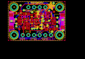

Contents
========

* [PROJ-ADAF-4479-STAN-01>Adafruit LIS3MDL PCB](#proj-adaf-4479-stan-01adafruit-lis3mdl-pcb)
	* [Images](#images)
	* [Interactive BOM](#interactive-bom)
	* [OOMP Parts](#oomp-parts)
	* [Tags](#tags)
  
![][im]
# PROJ-ADAF-4479-STAN-01>Adafruit LIS3MDL PCB

- ID: PROJ-ADAF-4479-STAN-01
- Hex ID: PRA4479
- Name: Adafruit LIS3MDL PCB
- Description: 

## Images
  
  

|eagleImage|
| :---: |
||

## Interactive BOM

- Interactive BOM page: [ibom.html](kicad/bom/ibom.html)

## OOMP Parts
  

|OOMP Parts|
| :---: |
|<table><tr><td></td><td> C1</td><td>[CAPC-0603-X-NF100-V50 SMD (0603) 100 nF Capacitor (Ceramic) 50v](https://github.com/oomlout/oomlout_OOMP_parts/tree/main/CAPC-0603-X-NF100-V50/)</td><td>[C6N100](https://github.com/oomlout/oomlout_OOMP_parts/tree/main/CAPC-0603-X-NF100-V50/)</td></tr></table>|
|<table><tr><td></td><td> C2</td><td>[CAPC-0805-X-UF10-V25 SMD (0805) 10 uF Capacitor (Ceramic) 25v](https://github.com/oomlout/oomlout_OOMP_parts/tree/main/CAPC-0805-X-UF10-V25/)</td><td>[C85U010](https://github.com/oomlout/oomlout_OOMP_parts/tree/main/CAPC-0805-X-UF10-V25/)</td></tr></table>|
|<table><tr><td></td><td> C3</td><td>[CAPC-0805-X-UF10-V25 SMD (0805) 10 uF Capacitor (Ceramic) 25v](https://github.com/oomlout/oomlout_OOMP_parts/tree/main/CAPC-0805-X-UF10-V25/)</td><td>[C85U010](https://github.com/oomlout/oomlout_OOMP_parts/tree/main/CAPC-0805-X-UF10-V25/)</td></tr></table>|
|<table><tr><td></td><td> C4</td><td>[CAPC-0603-X-NF100-V50 SMD (0603) 100 nF Capacitor (Ceramic) 50v](https://github.com/oomlout/oomlout_OOMP_parts/tree/main/CAPC-0603-X-NF100-V50/)</td><td>[C6N100](https://github.com/oomlout/oomlout_OOMP_parts/tree/main/CAPC-0603-X-NF100-V50/)</td></tr></table>|
|CAPC-0603-X-UNMATCHED-01, C5, 700.0, 207.5, 0,C5, 1uF, 0603-NO, microbuilder, (700, 207.5), R0|
|UNMATCHED-UNMATCHED-X-UNMATCHED-01, CONN3, 900.0, 350.0, 90,CONN3, STEMMA_I2C_QT, JST_SH4, microbuilder, (900, 350), R90|
|UNMATCHED-UNMATCHED-X-UNMATCHED-01, CONN4, 100.0, 350.0, 270,CONN4, STEMMA_I2C_QT, JST_SH4, microbuilder, (100, 350), R270|
|UNMATCHED-UNMATCHED-X-UNMATCHED-01, D1, 140.0, 495.0, 90,D1, GREEN, CHIPLED_0603_NOOUTLINE, microbuilder, (140, 495), R90|
|UNMATCHED-UNMATCHED-X-UNMATCHED-01, D2, 520.0, 485.0, 180,D2, 1N4148, SOD-323, microbuilder, (520, 485), R180|
|UNMATCHED-UNMATCHED-X-UNMATCHED-01, IC1, 500.0, 350.0, 270,IC1, LIS3MDL, LGA12_2X2MM, adafruit_sensor, (500, 350), R270|
|UNMATCHED-UNMATCHED-X-UNMATCHED-01, JP1, 500.0, 600.0, 0,JP1, 1X04_ROUND, microbuilder, (500, 600), R0|
|UNMATCHED-UNMATCHED-X-UNMATCHED-01, JP4, 500.0, 100.0, 0,JP4, 1X06_ROUND_70, microbuilder, (500, 100), R0|
|UNMATCHED-UNMATCHED-X-UNMATCHED-01, Q2, 688.0, 297.0, 90,Q2, BSS138, SOT363, microbuilder, (688, 297), R90|
|<table><tr><td></td><td> R1</td><td>[RESE-0603-X-O103-01 SMD (0603) 10k Ohm Resistor](https://github.com/oomlout/oomlout_OOMP_parts/tree/main/RESE-0603-X-O103-01/)</td><td>[R6103](https://github.com/oomlout/oomlout_OOMP_parts/tree/main/RESE-0603-X-O103-01/)</td></tr></table>|
|<table><tr><td></td><td> R2</td><td>[RESE-0603-X-O103-01 SMD (0603) 10k Ohm Resistor](https://github.com/oomlout/oomlout_OOMP_parts/tree/main/RESE-0603-X-O103-01/)</td><td>[R6103](https://github.com/oomlout/oomlout_OOMP_parts/tree/main/RESE-0603-X-O103-01/)</td></tr></table>|
|RESE-UNMATCHED-X-O103-01, R3, 690.0, 440.0, 180,R3, 10K, RESPACK_4X0603, microbuilder, (690, 440), R180|
|<table><tr><td></td><td> R4</td><td>[RESE-0603-X-O103-01 SMD (0603) 10k Ohm Resistor](https://github.com/oomlout/oomlout_OOMP_parts/tree/main/RESE-0603-X-O103-01/)</td><td>[R6103](https://github.com/oomlout/oomlout_OOMP_parts/tree/main/RESE-0603-X-O103-01/)</td></tr></table>|
|UNMATCHED-UNMATCHED-X-UNMATCHED-01, SJ1, 600.0, 515.0, M180,SJ1, SOLDERJUMPER_ARROW_NOPASTE, microbuilder, (600, 515), MR180|
|UNMATCHED-UNMATCHED-X-UNMATCHED-01, U2, 317.0, 345.0, 0,U2, AP2112K-3.3, SOT23-5, microbuilder, (317, 345), R0|

## Tags

- hexID: PRA4479
- oompType: PROJ
- oompSize: ADAF
- oompColor: 4479
- oompDesc: STAN
- oompIndex: 01
- oompName: Adafruit LIS3MDL PCB
- sources: All source files from https://github.com/adafruit/Adafruit-LIS3MDL-PCB (source licence details in srcLicense.md)
- linkBuyPage: http://www.adafruit.com/products/4479
- oompPart: CAPC-0603-X-NF100-V50, C1, 415.0, 305.0, 270
- oompPart: CAPC-0805-X-UF10-V25, C2, 302.0, 224.0, 0
- oompPart: CAPC-0805-X-UF10-V25, C3, 315.0, 480.0, 0
- oompPart: CAPC-0603-X-NF100-V50, C4, 414.0, 429.0, 90
- oompPart: CAPC-0603-X-UNMATCHED-01, C5, 700.0, 207.5, 0
- oompPart: UNMATCHED-UNMATCHED-X-UNMATCHED-01, CONN3, 900.0, 350.0, 90
- oompPart: UNMATCHED-UNMATCHED-X-UNMATCHED-01, CONN4, 100.0, 350.0, 270
- oompPart: UNMATCHED-UNMATCHED-X-UNMATCHED-01, D1, 140.0, 495.0, 90
- oompPart: UNMATCHED-UNMATCHED-X-UNMATCHED-01, D2, 520.0, 485.0, 180
- oompPart: SKIP-UNMATCHED-X-UNMATCHED-01, FID3, 195.0, 205.0, 0
- oompPart: SKIP-UNMATCHED-X-UNMATCHED-01, FID4, 805.0, 516.5, 0
- oompPart: UNMATCHED-UNMATCHED-X-UNMATCHED-01, IC1, 500.0, 350.0, 270
- oompPart: UNMATCHED-UNMATCHED-X-UNMATCHED-01, JP1, 500.0, 600.0, 0
- oompPart: UNMATCHED-UNMATCHED-X-UNMATCHED-01, JP4, 500.0, 100.0, 0
- oompPart: UNMATCHED-UNMATCHED-X-UNMATCHED-01, Q2, 688.0, 297.0, 90
- oompPart: RESE-0603-X-O103-01, R1, 220.0, 490.0, 270
- oompPart: RESE-0603-X-O103-01, R2, 825.0, 207.5, 0
- oompPart: RESE-UNMATCHED-X-O103-01, R3, 690.0, 440.0, 180
- oompPart: RESE-0603-X-O103-01, R4, 512.0, 431.0, 0
- oompPart: UNMATCHED-UNMATCHED-X-UNMATCHED-01, SJ1, 600.0, 515.0, M180
- oompPart: SKIP-UNMATCHED-X-UNMATCHED-01, U$1, 100.0, 600.0, 0
- oompPart: SKIP-UNMATCHED-X-UNMATCHED-01, U$17, 900.0, 600.0, 0
- oompPart: SKIP-UNMATCHED-X-UNMATCHED-01, U$19, 100.0, 100.0, 0
- oompPart: SKIP-UNMATCHED-X-UNMATCHED-01, U$21, 900.0, 100.0, 0
- oompPart: UNMATCHED-UNMATCHED-X-UNMATCHED-01, U2, 317.0, 345.0, 0
- rawPart: C1, 0.1uF, 0603-NO, microbuilder, (415, 305), R270
- rawPart: C2, 10uF, 0805-NO, microbuilder, (302, 224), R0
- rawPart: C3, 10uF, 0805-NO, microbuilder, (315, 480), R0
- rawPart: C4, 0.1uF, 0603-NO, microbuilder, (414, 429), R90
- rawPart: C5, 1uF, 0603-NO, microbuilder, (700, 207.5), R0
- rawPart: CONN3, STEMMA_I2C_QT, JST_SH4, microbuilder, (900, 350), R90
- rawPart: CONN4, STEMMA_I2C_QT, JST_SH4, microbuilder, (100, 350), R270
- rawPart: D1, GREEN, CHIPLED_0603_NOOUTLINE, microbuilder, (140, 495), R90
- rawPart: D2, 1N4148, SOD-323, microbuilder, (520, 485), R180
- rawPart: FID3, FIDUCIAL_1MM, FIDUCIAL_1MM, microbuilder, (195, 205), R0
- rawPart: FID4, FIDUCIAL_1MM, FIDUCIAL_1MM, microbuilder, (805, 516.5), R0
- rawPart: IC1, LIS3MDL, LGA12_2X2MM, adafruit_sensor, (500, 350), R270
- rawPart: JP1, 1X04_ROUND, microbuilder, (500, 600), R0
- rawPart: JP4, 1X06_ROUND_70, microbuilder, (500, 100), R0
- rawPart: Q2, BSS138, SOT363, microbuilder, (688, 297), R90
- rawPart: R1, 10K, 0603-NO, microbuilder, (220, 490), R270
- rawPart: R2, 10K, 0603-NO, microbuilder, (825, 207.5), R0
- rawPart: R3, 10K, RESPACK_4X0603, microbuilder, (690, 440), R180
- rawPart: R4, 10K, 0603-NO, microbuilder, (512, 431), R0
- rawPart: SJ1, SOLDERJUMPER_ARROW_NOPASTE, microbuilder, (600, 515), MR180
- rawPart: U$1, MOUNTINGHOLE2.5, MOUNTINGHOLE_2.5_PLATED, microbuilder, (100, 600), R0
- rawPart: U$17, MOUNTINGHOLE2.5, MOUNTINGHOLE_2.5_PLATED, microbuilder, (900, 600), R0
- rawPart: U$19, MOUNTINGHOLE2.5, MOUNTINGHOLE_2.5_PLATED, microbuilder, (100, 100), R0
- rawPart: U$21, MOUNTINGHOLE2.5, MOUNTINGHOLE_2.5_PLATED, microbuilder, (900, 100), R0
- rawPart: U2, AP2112K-3.3, SOT23-5, microbuilder, (317, 345), R0

[im]: eagleImage_450.png
