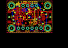
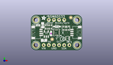
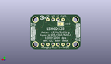
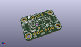

Contents
========

* [PROJ-ADAF-4480-STAN-01>Adafruit LSM6DS33 PCB](#proj-adaf-4480-stan-01adafruit-lsm6ds33-pcb)
	* [Images](#images)
	* [Interactive BOM](#interactive-bom)
	* [OOMP Parts](#oomp-parts)
	* [Tags](#tags)
  
![][im]
# PROJ-ADAF-4480-STAN-01>Adafruit LSM6DS33 PCB

- ID: PROJ-ADAF-4480-STAN-01
- Hex ID: PRA4480
- Name: Adafruit LSM6DS33 PCB
- Description: 

## Images
  
  

|eagleImage|kicadPcb3dFront|kicadPcb3dBack|kicadPcb3d|
| :---: | :---: | :---: | :---: |
|||||

## Interactive BOM

- Interactive BOM page: [ibom.html](kicad/bom/ibom.html)

## OOMP Parts
  

|OOMP Parts|
| :---: |
|<table><tr><td></td><td> C1</td><td>[CAPC-0603-X-NF100-V50 SMD (0603) 100 nF Capacitor (Ceramic) 50v](https://github.com/oomlout/oomlout_OOMP_parts/tree/main/CAPC-0603-X-NF100-V50/)</td><td>[C6N100](https://github.com/oomlout/oomlout_OOMP_parts/tree/main/CAPC-0603-X-NF100-V50/)</td></tr></table>|
|CAPC-0805-X-UNMATCHED-01, C2, 257.0, 196.5, 0,C2, 10uF, 0805-NO, microbuilder, (257, 196.5), R0|
|CAPC-0805-X-UNMATCHED-01, C3, 230.0, 495.0, 90,C3, 10uF, 0805-NO, microbuilder, (230, 495), R90|
|UNMATCHED-UNMATCHED-X-UNMATCHED-01, CONN3, 900.0, 350.0, 90,CONN3, STEMMA_I2C_QT, JST_SH4, microbuilder, (900, 350), R90|
|UNMATCHED-UNMATCHED-X-UNMATCHED-01, CONN4, 100.0, 350.0, 270,CONN4, STEMMA_I2C_QT, JST_SH4, microbuilder, (100, 350), R270|
|UNMATCHED-UNMATCHED-X-UNMATCHED-01, D1, 140.0, 495.0, 90,D1, GREEN, CHIPLED_0603_NOOUTLINE, microbuilder, (140, 495), R90|
|UNMATCHED-UNMATCHED-X-UNMATCHED-01, D2, 510.0, 467.5, 0,D2, 1N4148, SOD-323, microbuilder, (510, 467.5), R0|
|UNMATCHED-UNMATCHED-X-UNMATCHED-01, IC2, 500.0, 350.0, 180,IC2, LSM6DS33, LGA16_3X3MM, adafruit_sensor, (500, 350), R180|
|<table><tr><td></td><td> JP1</td><td>[HEAD-I01-X-PI04-01 2.54 mm 4 Pin Header](https://github.com/oomlout/oomlout_OOMP_parts/tree/main/HEAD-I01-X-PI04-01/)</td><td>[H04](https://github.com/oomlout/oomlout_OOMP_parts/tree/main/HEAD-I01-X-PI04-01/)</td></tr></table>|
|<table><tr><td></td><td> JP4</td><td>[HEAD-I01-X-PI06-01 2.54 mm 6 Pin Header](https://github.com/oomlout/oomlout_OOMP_parts/tree/main/HEAD-I01-X-PI06-01/)</td><td>[H06](https://github.com/oomlout/oomlout_OOMP_parts/tree/main/HEAD-I01-X-PI06-01/)</td></tr></table>|
|UNMATCHED-UNMATCHED-X-UNMATCHED-01, Q2, 718.0, 232.0, 90,Q2, BSS138, SOT363, microbuilder, (718, 232), R90|
|RESE-UNMATCHED-X-O103-01, R2, 345.0, 460.0, 0,R2, 10K, RESPACK_4X0603, microbuilder, (345, 460), R0|
|RESE-UNMATCHED-X-O103-01, R3, 685.0, 435.0, 180,R3, 10K, RESPACK_4X0603, microbuilder, (685, 435), R180|
|UNMATCHED-UNMATCHED-X-UNMATCHED-01, U2, 302.0, 320.0, 0,U2, AP2112K-3.3, SOT23-5, microbuilder, (302, 320), R0|

## Tags

- hexID: PRA4480
- oompType: PROJ
- oompSize: ADAF
- oompColor: 4480
- oompDesc: STAN
- oompIndex: 01
- oompName: Adafruit LSM6DS33 PCB
- sources: All source files from https://github.com/adafruit/Adafruit-LSM6DS33-PCB (source licence details in srcLicense.md)
- linkBuyPage: http://www.adafruit.com/products/4480
- oompID: PROJ-ADAF-4480-STAN-01
- oompPart: SKIP-UNMATCHED-X-UNMATCHED-01, AD0, 395.0, 510.0, M0
- oompPart: CAPC-0603-X-NF100-V50, C1, 395.0, 330.0, 270
- oompPart: CAPC-0805-X-UNMATCHED-01, C2, 257.0, 196.5, 0
- oompPart: CAPC-0805-X-UNMATCHED-01, C3, 230.0, 495.0, 90
- oompPart: UNMATCHED-UNMATCHED-X-UNMATCHED-01, CONN3, 900.0, 350.0, 90
- oompPart: UNMATCHED-UNMATCHED-X-UNMATCHED-01, CONN4, 100.0, 350.0, 270
- oompPart: UNMATCHED-UNMATCHED-X-UNMATCHED-01, D1, 140.0, 495.0, 90
- oompPart: UNMATCHED-UNMATCHED-X-UNMATCHED-01, D2, 510.0, 467.5, 0
- oompPart: SKIP-UNMATCHED-X-UNMATCHED-01, FID3, 415.0, 215.0, 0
- oompPart: SKIP-UNMATCHED-X-UNMATCHED-01, FID4, 780.0, 646.5, 0
- oompPart: UNMATCHED-UNMATCHED-X-UNMATCHED-01, IC2, 500.0, 350.0, 180
- oompPart: HEAD-I01-X-PI04-01, JP1, 500.0, 600.0, 0
- oompPart: HEAD-I01-X-PI06-01, JP4, 500.0, 100.0, 0
- oompPart: UNMATCHED-UNMATCHED-X-UNMATCHED-01, Q2, 718.0, 232.0, 90
- oompPart: RESE-UNMATCHED-X-O103-01, R2, 345.0, 460.0, 0
- oompPart: RESE-UNMATCHED-X-O103-01, R3, 685.0, 435.0, 180
- oompPart: SKIP-UNMATCHED-X-UNMATCHED-01, U$1, 100.0, 600.0, 0
- oompPart: SKIP-UNMATCHED-X-UNMATCHED-01, U$17, 900.0, 600.0, 0
- oompPart: SKIP-UNMATCHED-X-UNMATCHED-01, U$19, 100.0, 100.0, 0
- oompPart: SKIP-UNMATCHED-X-UNMATCHED-01, U$21, 900.0, 100.0, 0
- oompPart: UNMATCHED-UNMATCHED-X-UNMATCHED-01, U2, 302.0, 320.0, 0
- rawPart: AD0, SOLDERJUMPER_ARROW_NOPASTE, microbuilder, (395, 510), MR0
- rawPart: C1, 0.1uF, 0603-NO, microbuilder, (395, 330), R270
- rawPart: C2, 10uF, 0805-NO, microbuilder, (257, 196.5), R0
- rawPart: C3, 10uF, 0805-NO, microbuilder, (230, 495), R90
- rawPart: CONN3, STEMMA_I2C_QT, JST_SH4, microbuilder, (900, 350), R90
- rawPart: CONN4, STEMMA_I2C_QT, JST_SH4, microbuilder, (100, 350), R270
- rawPart: D1, GREEN, CHIPLED_0603_NOOUTLINE, microbuilder, (140, 495), R90
- rawPart: D2, 1N4148, SOD-323, microbuilder, (510, 467.5), R0
- rawPart: FID3, FIDUCIAL_1MM, FIDUCIAL_1MM, microbuilder, (415, 215), R0
- rawPart: FID4, FIDUCIAL_1MM, FIDUCIAL_1MM, microbuilder, (780, 646.5), R0
- rawPart: IC2, LSM6DS33, LGA16_3X3MM, adafruit_sensor, (500, 350), R180
- rawPart: JP1, 1X04_ROUND, microbuilder, (500, 600), R0
- rawPart: JP4, 1X06_ROUND_70, microbuilder, (500, 100), R0
- rawPart: Q2, BSS138, SOT363, microbuilder, (718, 232), R90
- rawPart: R2, 10K, RESPACK_4X0603, microbuilder, (345, 460), R0
- rawPart: R3, 10K, RESPACK_4X0603, microbuilder, (685, 435), R180
- rawPart: U$1, MOUNTINGHOLE2.5, MOUNTINGHOLE_2.5_PLATED, microbuilder, (100, 600), R0
- rawPart: U$17, MOUNTINGHOLE2.5, MOUNTINGHOLE_2.5_PLATED, microbuilder, (900, 600), R0
- rawPart: U$19, MOUNTINGHOLE2.5, MOUNTINGHOLE_2.5_PLATED, microbuilder, (100, 100), R0
- rawPart: U$21, MOUNTINGHOLE2.5, MOUNTINGHOLE_2.5_PLATED, microbuilder, (900, 100), R0
- rawPart: U2, AP2112K-3.3, SOT23-5, microbuilder, (302, 320), R0

[im]: kicadPcb3d_450.png
