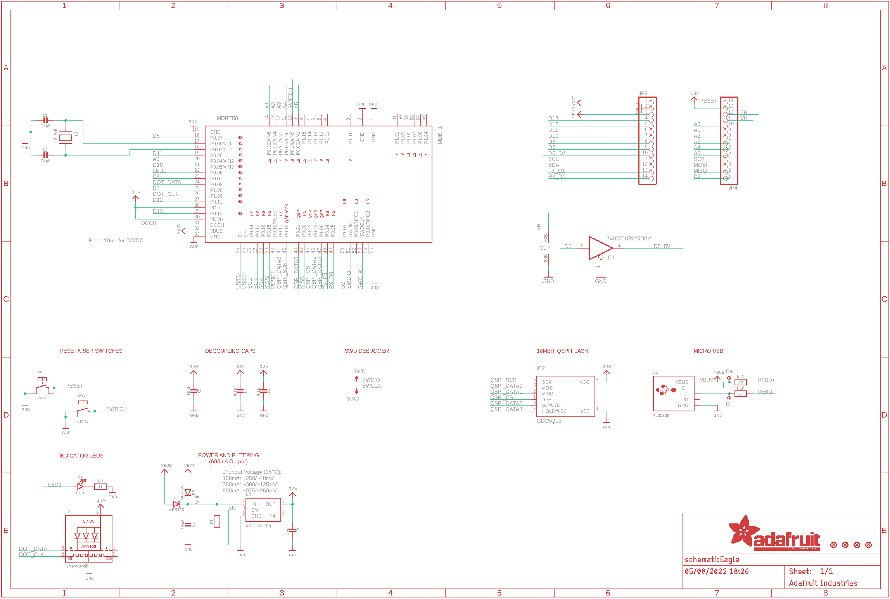
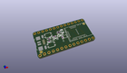
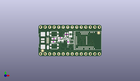
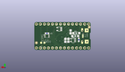
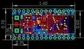
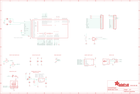

Contents
========

* [PRA4481 > Adafruit](#pra4481--adafruit)
	* [Schematic](#schematic)
	* [Interactive BOM](#interactive-bom)
	* [OOMP Parts](#oomp-parts)
	* [Images](#images)
	* [Tags](#tags)
  
![][im]
# PRA4481 > Adafruit

- ID: PROJ-ADAF-4481-STAN-01
- Hex ID: PRA4481
- Name: Adafruit
- Description: Adafruit
- Long Link: [http://oom.lt/PROJ-ADAF-4481-STAN-01](http://oom.lt/PROJ-ADAF-4481-STAN-01)
- Short Link: [http://oom.lt/PRA4481](http://oom.lt/PRA4481)

## Schematic
  

## Interactive BOM

- Interactive BOM page: [ibom.html](https://htmlpreview.github.io/?https://github.com/oomlout/oomlout_OOMP_projects/blob/main/PROJ-ADAF-4481-STAN-01/kicad/bom/ibom.html)

## OOMP Parts
  

|OOMP Parts|
| :---: |
|C1,CAPC-0603-X-UNMATCHED-01,C1,22pF,CAP_CERAMIC_0603MP,_0603MP,Ceramic Capacitors,,,,|
|C2,CAPC-0603-X-UNMATCHED-01,C2,22pF,CAP_CERAMIC_0603MP,_0603MP,Ceramic Capacitors,,,,|
|C3,CAPC-0603-X-NF100-V50,C3,0.1uF,CAP_CERAMIC0603_NO,0603-NO,Ceramic Capacitors,,,,|
|C4,CAPC-0603-X-NF100-V50,C4,0.1uF,CAP_CERAMIC0603_NO,0603-NO,Ceramic Capacitors,,,,|
|C5,CAPC-0805-X-UF10-V10,C5,10uF,CAP_CERAMIC0805-NOOUTLINE,0805-NO,Ceramic Capacitors,,,,|
|C7,CAPC-0805-X-UF10-V10,C7,10uF,CAP_CERAMIC0805-NOOUTLINE,0805-NO,Ceramic Capacitors,,,,|
|C8,CAPC-0805-X-UF10-V10,C8,10uF,CAP_CERAMIC0805-NOOUTLINE,0805-NO,Ceramic Capacitors,,,,|
|D+,UNMATCHED-UNMATCHED-X-UNMATCHED-01,D+,TPTP10R,TPTP10R,TP10R,Test pad,,3,,|
|D-,UNMATCHED-UNMATCHED-X-UNMATCHED-01,D-,TPTP10R,TPTP10R,TP10R,Test pad,,3,,|
|D1,DIOD-UNMATCHED-X-UNMATCHED-01,D1,MBR120,DIODE-SCHOTTKYSOD-123,SOD-123,,,,,|
|D2,LEDS-0805-G-STAN-01,D2,RED,LED0805_NOOUTLINE,CHIPLED_0805_NOOUTLINE,LED,,,,|
|D3,DIOD-UNMATCHED-X-UNMATCHED-01,D3,MBR120,DIODE-SCHOTTKYSOD-123,SOD-123,,,,,|
|IC1,UNMATCHED-SO235-X-UNMATCHED-01,FID1,FIDUCIAL_1MM,FIDUCIAL_1MM,FIDUCIAL_1MM,Fiducial Alignment Points,EXCLUDE,,,|
|IC2,UNMATCHED-UNMATCHED-X-UNMATCHED-01,FID2,FIDUCIAL_1MM,FIDUCIAL_1MM,FIDUCIAL_1MM,Fiducial Alignment Points,EXCLUDE,,,|
|JP2,HEAD-I01-X-PI14-01,FID3,FIDUCIAL_1MM,FIDUCIAL_1MM,FIDUCIAL_1MM,Fiducial Alignment Points,EXCLUDE,,,|
|JP4,HEAD-I01-X-PI14-01,FID4,FIDUCIAL_1MM,FIDUCIAL_1MM,FIDUCIAL_1MM,Fiducial Alignment Points,EXCLUDE,,,|
|L2,UNMATCHED-UNMATCHED-X-UNMATCHED-01,IC1,74HCT1G125DBV,74AHC1G125DBV,SOT23-5,Single Bus Buffer Gate with 3-State Output,,0,,|
|MDBT1,UNMATCHED-UNMATCHED-X-UNMATCHED-01,IC2,GD25Q16,SPIFLASH_8PINUX,USON8,SOIC8 SPI Flash,,,,|
|R1,RESE-0603-X-O103-01,JP2,,HEADER-1X14,1X14_ROUND70,,,,,|
|R2,RESE-0603-X-O102-01,JP4,,HEADER-1X14,1X14_ROUND70,,,,,|
|R10,RESE-0603-X-O21-01,L2,AP102-2020,APA1022020,APA102_2020,APA102/DotStar Pixels,,,,|
|R11,RESE-0603-X-O21-01,MDBT1,MDBT50,MDBT50,MDBT50,Raytac Corporation,,,,|
|SW1,UNMATCHED-UNMATCHED-X-UNMATCHED-01,R1,10K,RESISTOR_0603_NOOUT,0603-NO,Resistors,,,,|
|SW2,UNMATCHED-UNMATCHED-X-UNMATCHED-01,R2,1K,RESISTOR_0603_NOOUT,0603-NO,Resistors,,,,|
|SWC,UNMATCHED-UNMATCHED-X-UNMATCHED-01,R10,22,RESISTOR_0603_NOOUT,0603-NO,Resistors,,,,|
|SWD,UNMATCHED-UNMATCHED-X-UNMATCHED-01,R11,22,RESISTOR_0603_NOOUT,0603-NO,Resistors,,,,|
|U2,UNMATCHED-SO235-X-UNMATCHED-01,SW1,KMR2,SWITCH_TACT_SMT4.6X2.8,BTN_KMR2_4.6X2.8,SMT Tact Switches,,,,|
|X1,UNMATCHED-UNMATCHED-X-UNMATCHED-01,SW2,KMR2,SWITCH_TACT_SMT4.6X2.8,BTN_KMR2_4.6X2.8,SMT Tact Switches,,,,|
|Y2,UNMATCHED-UNMATCHED-X-UNMATCHED-01,SWC,TPTP13R,TPTP13R,TP13R,Test pad,,0,,|

## Images
  
  

|kicadPcb3d|kicadPcb3dFront|kicadPcb3dBack|eagleImage|eagleSchemImage|
| :---: | :---: | :---: | :---: | :---: |
||||||

## Tags

- hexID: PRA4481
- oompType: PROJ
- oompSize: ADAF
- oompColor: 4481
- oompDesc: STAN
- oompIndex: 01
- oompName: Adafruit ItsyBitsy nRF52840 Express PCB
- sources: All source files from https://github.com/adafruit/Adafruit-ItsyBitsy-nRF52840-Express-PCB (source licence details in srcLicense.md)
- linkBuyPage: http://www.adafruit.com/products/4481
- oompID: PROJ-ADAF-4481-STAN-01
- oompParts: C1,CAPC-0603-X-UNMATCHED-01
- oompParts: C2,CAPC-0603-X-UNMATCHED-01
- oompParts: C3,CAPC-0603-X-NF100-V50
- oompParts: C4,CAPC-0603-X-NF100-V50
- oompParts: C5,CAPC-0805-X-UF10-V10
- oompParts: C7,CAPC-0805-X-UF10-V10
- oompParts: C8,CAPC-0805-X-UF10-V10
- oompParts: D+,UNMATCHED-UNMATCHED-X-UNMATCHED-01
- oompParts: D-,UNMATCHED-UNMATCHED-X-UNMATCHED-01
- oompParts: D1,DIOD-UNMATCHED-X-UNMATCHED-01
- oompParts: D2,LEDS-0805-G-STAN-01
- oompParts: D3,DIOD-UNMATCHED-X-UNMATCHED-01
- oompParts: IC1,UNMATCHED-SO235-X-UNMATCHED-01
- oompParts: IC2,UNMATCHED-UNMATCHED-X-UNMATCHED-01
- oompParts: JP2,HEAD-I01-X-PI14-01
- oompParts: JP4,HEAD-I01-X-PI14-01
- oompParts: L2,UNMATCHED-UNMATCHED-X-UNMATCHED-01
- oompParts: MDBT1,UNMATCHED-UNMATCHED-X-UNMATCHED-01
- oompParts: R1,RESE-0603-X-O103-01
- oompParts: R2,RESE-0603-X-O102-01
- oompParts: R10,RESE-0603-X-O21-01
- oompParts: R11,RESE-0603-X-O21-01
- oompParts: SW1,UNMATCHED-UNMATCHED-X-UNMATCHED-01
- oompParts: SW2,UNMATCHED-UNMATCHED-X-UNMATCHED-01
- oompParts: SWC,UNMATCHED-UNMATCHED-X-UNMATCHED-01
- oompParts: SWD,UNMATCHED-UNMATCHED-X-UNMATCHED-01
- oompParts: U2,UNMATCHED-SO235-X-UNMATCHED-01
- oompParts: X1,UNMATCHED-UNMATCHED-X-UNMATCHED-01
- oompParts: Y2,UNMATCHED-UNMATCHED-X-UNMATCHED-01
- rawParts: C1,22pF,CAP_CERAMIC_0603MP,_0603MP,Ceramic Capacitors,,,,
- rawParts: C2,22pF,CAP_CERAMIC_0603MP,_0603MP,Ceramic Capacitors,,,,
- rawParts: C3,0.1uF,CAP_CERAMIC0603_NO,0603-NO,Ceramic Capacitors,,,,
- rawParts: C4,0.1uF,CAP_CERAMIC0603_NO,0603-NO,Ceramic Capacitors,,,,
- rawParts: C5,10uF,CAP_CERAMIC0805-NOOUTLINE,0805-NO,Ceramic Capacitors,,,,
- rawParts: C7,10uF,CAP_CERAMIC0805-NOOUTLINE,0805-NO,Ceramic Capacitors,,,,
- rawParts: C8,10uF,CAP_CERAMIC0805-NOOUTLINE,0805-NO,Ceramic Capacitors,,,,
- rawParts: D+,TPTP10R,TPTP10R,TP10R,Test pad,,3,,
- rawParts: D-,TPTP10R,TPTP10R,TP10R,Test pad,,3,,
- rawParts: D1,MBR120,DIODE-SCHOTTKYSOD-123,SOD-123,,,,,
- rawParts: D2,RED,LED0805_NOOUTLINE,CHIPLED_0805_NOOUTLINE,LED,,,,
- rawParts: D3,MBR120,DIODE-SCHOTTKYSOD-123,SOD-123,,,,,
- rawParts: FID1,FIDUCIAL_1MM,FIDUCIAL_1MM,FIDUCIAL_1MM,Fiducial Alignment Points,EXCLUDE,,,
- rawParts: FID2,FIDUCIAL_1MM,FIDUCIAL_1MM,FIDUCIAL_1MM,Fiducial Alignment Points,EXCLUDE,,,
- rawParts: FID3,FIDUCIAL_1MM,FIDUCIAL_1MM,FIDUCIAL_1MM,Fiducial Alignment Points,EXCLUDE,,,
- rawParts: FID4,FIDUCIAL_1MM,FIDUCIAL_1MM,FIDUCIAL_1MM,Fiducial Alignment Points,EXCLUDE,,,
- rawParts: IC1,74HCT1G125DBV,74AHC1G125DBV,SOT23-5,Single Bus Buffer Gate with 3-State Output,,0,,
- rawParts: IC2,GD25Q16,SPIFLASH_8PINUX,USON8,SOIC8 SPI Flash,,,,
- rawParts: JP2,,HEADER-1X14,1X14_ROUND70,,,,,
- rawParts: JP4,,HEADER-1X14,1X14_ROUND70,,,,,
- rawParts: L2,AP102-2020,APA1022020,APA102_2020,APA102/DotStar Pixels,,,,
- rawParts: MDBT1,MDBT50,MDBT50,MDBT50,Raytac Corporation,,,,
- rawParts: R1,10K,RESISTOR_0603_NOOUT,0603-NO,Resistors,,,,
- rawParts: R2,1K,RESISTOR_0603_NOOUT,0603-NO,Resistors,,,,
- rawParts: R10,22,RESISTOR_0603_NOOUT,0603-NO,Resistors,,,,
- rawParts: R11,22,RESISTOR_0603_NOOUT,0603-NO,Resistors,,,,
- rawParts: SW1,KMR2,SWITCH_TACT_SMT4.6X2.8,BTN_KMR2_4.6X2.8,SMT Tact Switches,,,,
- rawParts: SW2,KMR2,SWITCH_TACT_SMT4.6X2.8,BTN_KMR2_4.6X2.8,SMT Tact Switches,,,,
- rawParts: SWC,TPTP13R,TPTP13R,TP13R,Test pad,,0,,
- rawParts: SWD,TPTP13R,TPTP13R,TP13R,Test pad,,0,,
- rawParts: U2,AP2112(3.3V),VREG_SOT23-5,SOT23-5,SOT23-5 Fixed Voltage Regulators,,,,
- rawParts: X1,4u20329,USB_MICRO_20329_V2,4UCONN_20329_V2,USB Connectors,,,,
- rawParts: Y2,32.768,XTAL-3.2X1.5,XTAL3215,Low cost SMT crystals, no capacitors included,,,,

[im]: kicadPcb3d_450.png
