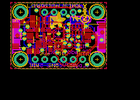
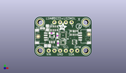
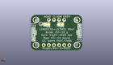
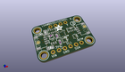

Contents
========

* [PROJ-ADAF-4485-STAN-01>Adafruit LSM6DS33 LIS3MDL PCB](#proj-adaf-4485-stan-01adafruit-lsm6ds33-lis3mdl-pcb)
	* [Images](#images)
	* [Interactive BOM](#interactive-bom)
	* [OOMP Parts](#oomp-parts)
	* [Tags](#tags)
  
![][im]
# PROJ-ADAF-4485-STAN-01>Adafruit LSM6DS33 LIS3MDL PCB

- ID: PROJ-ADAF-4485-STAN-01
- Hex ID: PRA4485
- Name: Adafruit LSM6DS33 LIS3MDL PCB
- Description: 

## Images
  
  

|eagleImage|kicadPcb3dFront|kicadPcb3dBack|kicadPcb3d|
| :---: | :---: | :---: | :---: |
|||||

## Interactive BOM

- Interactive BOM page: [ibom.html](kicad/bom/ibom.html)

## OOMP Parts
  

|OOMP Parts|
| :---: |
|CAPE-0603-X-NF100-01, C1, 300.0, 410.0, 0,C1, 0.1uF, 0603-NO, microbuilder, (300, 410), R0|
|CAPE-0805-X-UNMATCHED-01, C2, 230.5, 186.0, 180,C2, 10uF, 0805-NO, microbuilder, (230.5, 186), R180|
|CAPE-0805-X-UNMATCHED-01, C3, 227.5, 502.5, 90,C3, 10uF, 0805-NO, microbuilder, (227.5, 502.5), R90|
|CAPE-0603-X-NF100-01, C4, 401.5, 364.0, 90,C4, 0.1uF, 0603-NO, microbuilder, (401.5, 364), R90|
|CAPE-0603-X-UNMATCHED-01, C5, 412.5, 230.0, 270,C5, 1uF, 0603-NO, microbuilder, (412.5, 230), R270|
|UNMATCHED-UNMATCHED-X-UNMATCHED-01, CONN3, 900.0, 350.0, 90,CONN3, STEMMA_I2C_QT, JST_SH4, microbuilder, (900, 350), R90|
|UNMATCHED-UNMATCHED-X-UNMATCHED-01, CONN4, 100.0, 350.0, 270,CONN4, STEMMA_I2C_QT, JST_SH4, microbuilder, (100, 350), R270|
|UNMATCHED-UNMATCHED-X-UNMATCHED-01, D1, 140.0, 495.0, 90,D1, GREEN, CHIPLED_0603_NOOUTLINE, microbuilder, (140, 495), R90|
|UNMATCHED-UNMATCHED-X-UNMATCHED-01, IC1, 500.0, 242.5, 270,IC1, LIS3MDL, LGA12_2X2MM, adafruit_sensor, (500, 242.5), R270|
|UNMATCHED-UNMATCHED-X-UNMATCHED-01, IC2, 500.0, 370.0, 180,IC2, LSM6DS33, LGA16_3X3MM, adafruit_sensor, (500, 370), R180|
|UNMATCHED-UNMATCHED-X-UNMATCHED-01, JP1, 500.0, 600.0, 0,JP1, 1X04_ROUND, microbuilder, (500, 600), R0|
|UNMATCHED-UNMATCHED-X-UNMATCHED-01, JP4, 500.0, 100.0, 0,JP4, 1X06_ROUND_70, microbuilder, (500, 100), R0|
|UNMATCHED-UNMATCHED-X-UNMATCHED-01, Q2, 703.0, 252.0, 90,Q2, BSS138, SOT363, microbuilder, (703, 252), R90|
|RESE-UNMATCHED-X-O103-01, R1, 345.0, 495.0, 0,R1, 10K, RESPACK_4X0603, microbuilder, (345, 495), R0|
|RESE-UNMATCHED-X-O103-01, R3, 692.5, 415.0, 180,R3, 10K, RESPACK_4X0603, microbuilder, (692.5, 415), R180|
|UNMATCHED-UNMATCHED-X-UNMATCHED-01, SJ1, 420.0, 510.0, M180,SJ1, SOLDERJUMPER_ARROW_NOPASTE, microbuilder, (420, 510), MR180|
|UNMATCHED-UNMATCHED-X-UNMATCHED-01, SJ2, 690.0, 510.0, M180,SJ2, SOLDERJUMPER_ARROW_NOPASTE, microbuilder, (690, 510), MR180|
|UNMATCHED-UNMATCHED-X-UNMATCHED-01, U2, 307.0, 302.5, 0,U2, AP2112K-3.3, SOT23-5, microbuilder, (307, 302.5), R0|

## Tags

- hexID: PRA4485
- oompType: PROJ
- oompSize: ADAF
- oompColor: 4485
- oompDesc: STAN
- oompIndex: 01
- oompName: Adafruit LSM6DS33 LIS3MDL PCB
- sources: All source files from https://github.com/adafruit/Adafruit-LSM6DS33-LIS3MDL-PCB (source licence details in srcLicense.md)
- linkBuyPage: http://www.adafruit.com/products/4485
- oompPart: CAPE-0603-X-NF100-01, C1, 300.0, 410.0, 0
- oompPart: CAPE-0805-X-UNMATCHED-01, C2, 230.5, 186.0, 180
- oompPart: CAPE-0805-X-UNMATCHED-01, C3, 227.5, 502.5, 90
- oompPart: CAPE-0603-X-NF100-01, C4, 401.5, 364.0, 90
- oompPart: CAPE-0603-X-UNMATCHED-01, C5, 412.5, 230.0, 270
- oompPart: UNMATCHED-UNMATCHED-X-UNMATCHED-01, CONN3, 900.0, 350.0, 90
- oompPart: UNMATCHED-UNMATCHED-X-UNMATCHED-01, CONN4, 100.0, 350.0, 270
- oompPart: UNMATCHED-UNMATCHED-X-UNMATCHED-01, D1, 140.0, 495.0, 90
- oompPart: SKIP-UNMATCHED-X-UNMATCHED-01, FID3, 65.0, 350.0, 0
- oompPart: SKIP-UNMATCHED-X-UNMATCHED-01, FID4, 955.0, 389.0, 0
- oompPart: UNMATCHED-UNMATCHED-X-UNMATCHED-01, IC1, 500.0, 242.5, 270
- oompPart: UNMATCHED-UNMATCHED-X-UNMATCHED-01, IC2, 500.0, 370.0, 180
- oompPart: UNMATCHED-UNMATCHED-X-UNMATCHED-01, JP1, 500.0, 600.0, 0
- oompPart: UNMATCHED-UNMATCHED-X-UNMATCHED-01, JP4, 500.0, 100.0, 0
- oompPart: UNMATCHED-UNMATCHED-X-UNMATCHED-01, Q2, 703.0, 252.0, 90
- oompPart: RESE-UNMATCHED-X-O103-01, R1, 345.0, 495.0, 0
- oompPart: RESE-UNMATCHED-X-O103-01, R3, 692.5, 415.0, 180
- oompPart: UNMATCHED-UNMATCHED-X-UNMATCHED-01, SJ1, 420.0, 510.0, M180
- oompPart: UNMATCHED-UNMATCHED-X-UNMATCHED-01, SJ2, 690.0, 510.0, M180
- oompPart: SKIP-UNMATCHED-X-UNMATCHED-01, U$1, 100.0, 600.0, 0
- oompPart: SKIP-UNMATCHED-X-UNMATCHED-01, U$17, 900.0, 600.0, 0
- oompPart: SKIP-UNMATCHED-X-UNMATCHED-01, U$19, 100.0, 100.0, 0
- oompPart: SKIP-UNMATCHED-X-UNMATCHED-01, U$21, 900.0, 100.0, 0
- oompPart: UNMATCHED-UNMATCHED-X-UNMATCHED-01, U2, 307.0, 302.5, 0
- rawPart: C1, 0.1uF, 0603-NO, microbuilder, (300, 410), R0
- rawPart: C2, 10uF, 0805-NO, microbuilder, (230.5, 186), R180
- rawPart: C3, 10uF, 0805-NO, microbuilder, (227.5, 502.5), R90
- rawPart: C4, 0.1uF, 0603-NO, microbuilder, (401.5, 364), R90
- rawPart: C5, 1uF, 0603-NO, microbuilder, (412.5, 230), R270
- rawPart: CONN3, STEMMA_I2C_QT, JST_SH4, microbuilder, (900, 350), R90
- rawPart: CONN4, STEMMA_I2C_QT, JST_SH4, microbuilder, (100, 350), R270
- rawPart: D1, GREEN, CHIPLED_0603_NOOUTLINE, microbuilder, (140, 495), R90
- rawPart: FID3, FIDUCIAL_1MM, FIDUCIAL_1MM, microbuilder, (65, 350), R0
- rawPart: FID4, FIDUCIAL_1MM, FIDUCIAL_1MM, microbuilder, (955, 389), R0
- rawPart: IC1, LIS3MDL, LGA12_2X2MM, adafruit_sensor, (500, 242.5), R270
- rawPart: IC2, LSM6DS33, LGA16_3X3MM, adafruit_sensor, (500, 370), R180
- rawPart: JP1, 1X04_ROUND, microbuilder, (500, 600), R0
- rawPart: JP4, 1X06_ROUND_70, microbuilder, (500, 100), R0
- rawPart: Q2, BSS138, SOT363, microbuilder, (703, 252), R90
- rawPart: R1, 10K, RESPACK_4X0603, microbuilder, (345, 495), R0
- rawPart: R3, 10K, RESPACK_4X0603, microbuilder, (692.5, 415), R180
- rawPart: SJ1, SOLDERJUMPER_ARROW_NOPASTE, microbuilder, (420, 510), MR180
- rawPart: SJ2, SOLDERJUMPER_ARROW_NOPASTE, microbuilder, (690, 510), MR180
- rawPart: U$1, MOUNTINGHOLE2.5, MOUNTINGHOLE_2.5_PLATED, microbuilder, (100, 600), R0
- rawPart: U$17, MOUNTINGHOLE2.5, MOUNTINGHOLE_2.5_PLATED, microbuilder, (900, 600), R0
- rawPart: U$19, MOUNTINGHOLE2.5, MOUNTINGHOLE_2.5_PLATED, microbuilder, (100, 100), R0
- rawPart: U$21, MOUNTINGHOLE2.5, MOUNTINGHOLE_2.5_PLATED, microbuilder, (900, 100), R0
- rawPart: U2, AP2112K-3.3, SOT23-5, microbuilder, (307, 302.5), R0

[im]: kicadPcb3d_450.png
