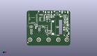
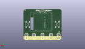
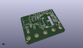

Contents
========

* [PROJ-ADAF-4500-STAN-01>Adafruit CLUE PCB](#proj-adaf-4500-stan-01adafruit-clue-pcb)
	* [Images](#images)
	* [Interactive BOM](#interactive-bom)
	* [OOMP Parts](#oomp-parts)
	* [Tags](#tags)
  
![][im]
# PROJ-ADAF-4500-STAN-01>Adafruit CLUE PCB

- ID: PROJ-ADAF-4500-STAN-01
- Hex ID: PRA4500
- Name: Adafruit CLUE PCB
- Description: 

## Images
  
  

|eagleImage|kicadPcb3dFront|kicadPcb3dBack|kicadPcb3d|
| :---: | :---: | :---: | :---: |
|||||

## Interactive BOM

- Interactive BOM page: [ibom.html](kicad/bom/ibom.html)

## OOMP Parts
  

|OOMP Parts|
| :---: |
|UNMATCHED-UNMATCHED-X-UNMATCHED-01, BTNA, 45.70000004, 20.99999991, M270,BTNA, 6mm, 6MMX6MM_TACTILE_SMT, microbuilder, (1.7992126, 0.82677165), MR270|
|UNMATCHED-UNMATCHED-X-UNMATCHED-01, BTNB, 6.099999992, 20.99999991, M270,BTNB, 6mm, 6MMX6MM_TACTILE_SMT, microbuilder, (0.24015748, 0.82677165), MR270|
|<table><tr><td></td><td> C3</td><td>[CAPC-0603-X-NF100-V50 SMD (0603) 100 nF Capacitor (Ceramic) 50v](https://github.com/oomlout/oomlout_OOMP_parts/tree/main/CAPC-0603-X-NF100-V50/)</td><td>[C6N100](https://github.com/oomlout/oomlout_OOMP_parts/tree/main/CAPC-0603-X-NF100-V50/)</td></tr></table>|
|<table><tr><td></td><td> C4</td><td>[CAPC-0603-X-NF100-V50 SMD (0603) 100 nF Capacitor (Ceramic) 50v](https://github.com/oomlout/oomlout_OOMP_parts/tree/main/CAPC-0603-X-NF100-V50/)</td><td>[C6N100](https://github.com/oomlout/oomlout_OOMP_parts/tree/main/CAPC-0603-X-NF100-V50/)</td></tr></table>|
|CAPC-0805-X-UNMATCHED-01, C5, 48.198900046, 24.612000052, 270,C5, 10uF, 0805-NO, microbuilder, (1.89759449, 0.96897638), R270|
|CAPC-0805-X-UNMATCHED-01, C6, 28.991500056, 34.571999944, 90,C6, 10uF, 0805-NO, microbuilder, (1.14139764, 1.36110236), R90|
|CAPC-0805-X-UNMATCHED-01, C7, 48.556399966, 28.144799946, 270,C7, 10uF, 0805-NO, microbuilder, (1.91166929, 1.10806299), R270|
|CAPC-0805-X-UNMATCHED-01, C8, 10.881300056, 21.654699896, 90,C8, 10uF, 0805-NO, microbuilder, (0.42839764, 0.85254724), R90|
|CAPC-0805-X-UNMATCHED-01, C9, 48.555500044, 31.983799888, 90,C9, 10uF, 0805-NO, microbuilder, (1.91163386, 1.25920472), R90|
|<table><tr><td></td><td> C10</td><td>[CAPC-0603-X-NF100-V50 SMD (0603) 100 nF Capacitor (Ceramic) 50v](https://github.com/oomlout/oomlout_OOMP_parts/tree/main/CAPC-0603-X-NF100-V50/)</td><td>[C6N100](https://github.com/oomlout/oomlout_OOMP_parts/tree/main/CAPC-0603-X-NF100-V50/)</td></tr></table>|
|<table><tr><td></td><td> C11</td><td>[CAPC-0603-X-NF100-V50 SMD (0603) 100 nF Capacitor (Ceramic) 50v](https://github.com/oomlout/oomlout_OOMP_parts/tree/main/CAPC-0603-X-NF100-V50/)</td><td>[C6N100](https://github.com/oomlout/oomlout_OOMP_parts/tree/main/CAPC-0603-X-NF100-V50/)</td></tr></table>|
|<table><tr><td></td><td> C12</td><td>[CAPC-0603-X-NF100-V50 SMD (0603) 100 nF Capacitor (Ceramic) 50v](https://github.com/oomlout/oomlout_OOMP_parts/tree/main/CAPC-0603-X-NF100-V50/)</td><td>[C6N100](https://github.com/oomlout/oomlout_OOMP_parts/tree/main/CAPC-0603-X-NF100-V50/)</td></tr></table>|
|CAPC-0805-X-UNMATCHED-01, C13, 23.747000003999997, 34.135000055999996, 270,C13, 10uF, 0805-NO, microbuilder, (0.93492126, 1.34389764), R270|
|<table><tr><td></td><td> C14</td><td>[CAPC-0603-X-NF100-V50 SMD (0603) 100 nF Capacitor (Ceramic) 50v](https://github.com/oomlout/oomlout_OOMP_parts/tree/main/CAPC-0603-X-NF100-V50/)</td><td>[C6N100](https://github.com/oomlout/oomlout_OOMP_parts/tree/main/CAPC-0603-X-NF100-V50/)</td></tr></table>|
|UNMATCHED-UNMATCHED-X-UNMATCHED-01, CONN1, 17.145, 39.37, 180,CONN1, STEMMA_I2C_QT, JST_SH4, microbuilder, (0.675, 1.55), R180|
|UNMATCHED-UNMATCHED-X-UNMATCHED-01, D1, 44.822199916, 29.622599885999996, 90,D1, MBR120, SOD-123, microbuilder, (1.76465354, 1.16624409), R90|
|UNMATCHED-UNMATCHED-X-UNMATCHED-01, D2, 31.42750001, 35.385499968, 270,D2, RED, CHIPLED_0603_NOOUTLINE, microbuilder, (1.23730315, 1.39312992), R270|
|UNMATCHED-UNMATCHED-X-UNMATCHED-01, D3, 19.304, 40.132, M180,D3, L130-5780001400001, EVERLIGHT_45-21, microbuilder, (0.76, 1.58), MR180|
|UNMATCHED-UNMATCHED-X-UNMATCHED-01, D4, 32.766, 40.132, M0,D4, L130-5780001400001, EVERLIGHT_45-21, microbuilder, (1.29, 1.58), MR0|
|UNMATCHED-UNMATCHED-X-UNMATCHED-01, D5, 46.700000071999995, 29.634999911999998, 90,D5, MBR120, SOD-123, microbuilder, (1.83858268, 1.16673228), R90|
|UNMATCHED-UNMATCHED-X-UNMATCHED-01, D6, 49.8602, 14.528799999999999, 90,D6, 1N4148, SOD-323, microbuilder, (1.963, 0.572), R90|
|UNMATCHED-UNMATCHED-X-UNMATCHED-01, DISPLAY2, 42.672, 11.176, 90,DISPLAY2, DISP_LCD_ST7789_1.3IN, TFT_1.3IN_240X240_24P, adafruit_display, (1.68, 0.44), R90|
|UNMATCHED-UNMATCHED-X-UNMATCHED-01, IC1, 23.273500061999997, 22.6559999, 90,IC1, LSM6DS33, LGA16_3X3MM, adafruit_sensor, (0.91627953, 0.8919685), R90|
|UNMATCHED-UNMATCHED-X-UNMATCHED-01, IC2, 18.446999935999997, 31.666999911999998, 270,IC2, GD25Q16, SOIC8_150MIL, microbuilder, (0.72625984, 1.24673228), R270|
|UNMATCHED-UNMATCHED-X-UNMATCHED-01, IC3, 5.665000099999999, 14.874999968, 180,IC3, LIS3MDL, LGA12_2X2MM, adafruit_sensor, (0.2230315, 0.58562992), R180|
|UNMATCHED-UNMATCHED-X-UNMATCHED-01, IC4, 5.429499936, 22.434000089999998, 270,IC4, MIC_PDM, SPK0415HM4H, microbuilder, (0.21375984, 0.88322835), R270|
|UNMATCHED-0805-X-UNMATCHED-01, L1, 12.543400109999999, 23.644899877999997, 90,L1, DNP, _0805MP, microbuilder, (0.49383465, 0.93090157), R90|
|UNMATCHED-UNMATCHED-X-UNMATCHED-01, LED1, 25.90219991, 29.952799886, 0,LED1, WS2812B3535, LED3535, microbuilder, (1.01977165, 1.17924409), R0|
|UNMATCHED-UNMATCHED-X-UNMATCHED-01, MB1, 26.00000007, 0.0, M0,MB1, MICRO:BIT_EDGE, MICROBIT_EDGE, adafruit_connector, (1.02362205, 0), MR0|
|UNMATCHED-UNMATCHED-X-UNMATCHED-01, MDBT1, 7.700000094, 34.000000072, 0,MDBT1, MDBT50, MDBT50, microbuilder, (0.30314961, 1.33858268), R0|
|UNMATCHED-UNMATCHED-X-UNMATCHED-01, Q1, 48.8696, 20.0406, 270,Q1, BSS138, SOT23-WIDE, microbuilder, (1.924, 0.789), R270|
|UNMATCHED-UNMATCHED-X-UNMATCHED-01, Q3, 25.0825, 14.604999999999999, 270,Q3, BSS138, SOT23-WIDE, microbuilder, (0.9875, 0.575), R270|
|RESE-0603-X-UNMATCHED-01, R1, 14.323000055999998, 19.135499956, 270,R1, 4.7K, 0603-NO, microbuilder, (0.56389764, 0.75336614), R270|
|RESE-0603-X-UNMATCHED-01, R2, 31.429799979999995, 34.021899952, 180,R2, 1K, 0603-NO, microbuilder, (1.2373937, 1.33944488), R180|
|RESE-0603-X-UNMATCHED-01, R3, 15.871000007999998, 19.135499956, 270,R3, 4.7K, 0603-NO, microbuilder, (0.62484252, 0.75336614), R270|
|<table><tr><td></td><td> R4</td><td>[RESE-0603-X-O103-01 SMD (0603) 10k Ohm Resistor](https://github.com/oomlout/oomlout_OOMP_parts/tree/main/RESE-0603-X-O103-01/)</td><td>[R6103](https://github.com/oomlout/oomlout_OOMP_parts/tree/main/RESE-0603-X-O103-01/)</td></tr></table>|
|RESE-0603-X-UNMATCHED-01, R5, 27.813, 14.9225, 90,R5, 10, 0603-NO, microbuilder, (1.095, 0.5875), R90|
|RESE-0603-X-UNMATCHED-01, R6, 15.493999999999998, 40.132, M0,R6, 10, 0603-NO, microbuilder, (0.61, 1.58), MR0|
|RESE-0603-X-UNMATCHED-01, R7, 48.4759, 10.693399999999999, 180,R7, 1Mohm, 0603-NO, microbuilder, (1.9085, 0.421), R180|
|RESE-0603-X-UNMATCHED-01, R8, 37.299899999999994, 12.357099999999999, 180,R8, 1Mohm, 0603-NO, microbuilder, (1.4685, 0.4865), R180|
|RESE-0603-X-UNMATCHED-01, R9, 22.313899999999997, 17.678399999999996, 270,R9, 1Mohm, 0603-NO, microbuilder, (0.8785, 0.696), R270|
|RESE-0603-X-UNMATCHED-01, R10, 26.891000066, 34.510000068, 270,R10, 22, 0603-NO, microbuilder, (1.05870079, 1.35866142), R270|
|RESE-0603-X-UNMATCHED-01, R11, 25.370499931999998, 34.498499964, 270,R11, 22, 0603-NO, microbuilder, (0.99883858, 1.35820866), R270|
|<table><tr><td></td><td> R12</td><td>[RESE-0603-X-O103-01 SMD (0603) 10k Ohm Resistor](https://github.com/oomlout/oomlout_OOMP_parts/tree/main/RESE-0603-X-O103-01/)</td><td>[R6103](https://github.com/oomlout/oomlout_OOMP_parts/tree/main/RESE-0603-X-O103-01/)</td></tr></table>|
|UNMATCHED-UNMATCHED-X-UNMATCHED-01, SP1, 46.342299999999994, 14.9479, 90,SP1, SPEAKER_BUZZER5MM, BUZZER_SMT_5MM, microbuilder, (1.8245, 0.5885), R90|
|UNMATCHED-UNMATCHED-X-UNMATCHED-01, SW1, 35.999999882, 38.800000124, 180,SW1, KMR2, EVQ-Q2_SMALLER, microbuilder, (1.41732283, 1.52755906), R180|
|UNMATCHED-UNMATCHED-X-UNMATCHED-01, U1, 19.517000082, 22.5560001, 0,U1, SHT30, SHT3X, microbuilder, (0.76838583, 0.8880315), R0|
|UNMATCHED-UNMATCHED-X-UNMATCHED-01, U2, 45.473800086, 24.669999936, 180,U2, AP2112(3.3V), SOT23-5, microbuilder, (1.79030709, 0.97125984), R180|
|UNMATCHED-UNMATCHED-X-UNMATCHED-01, U3, 26.00000007, 40.119000025999995, M90,U3, APDS-9960, APDS-9960, adafruit_sensor, (1.02362205, 1.57948819), MR90|
|UNMATCHED-UNMATCHED-X-UNMATCHED-01, U4, 15.600000042, 22.392999917999997, 0,U4, BMP280, BMP280, adafruit_sensor, (0.61417323, 0.88161417), R0|
|UNMATCHED-UNMATCHED-X-UNMATCHED-01, X1, 26.00000007, 37.991999961999994, 180,X1, 4u20329, 4UCONN_20329_SLIM, microbuilder, (1.02362205, 1.49574803), R180|

## Tags

- hexID: PRA4500
- oompType: PROJ
- oompSize: ADAF
- oompColor: 4500
- oompDesc: STAN
- oompIndex: 01
- oompName: Adafruit CLUE PCB
- sources: All source files from https://github.com/adafruit/Adafruit-CLUE-PCB (source licence details in srcLicense.md)
- linkBuyPage: http://www.adafruit.com/products/4500
- oompID: PROJ-ADAF-4500-STAN-01
- oompPart: UNMATCHED-UNMATCHED-X-UNMATCHED-01, BTNA, 45.70000004, 20.99999991, M270
- oompPart: UNMATCHED-UNMATCHED-X-UNMATCHED-01, BTNB, 6.099999992, 20.99999991, M270
- oompPart: CAPC-0603-X-NF100-V50, C3, 49.788400042, 24.613599997999998, 270
- oompPart: CAPC-0603-X-NF100-V50, C4, 21.122900096, 35.723100003999996, 270
- oompPart: CAPC-0805-X-UNMATCHED-01, C5, 48.198900046, 24.612000052, 270
- oompPart: CAPC-0805-X-UNMATCHED-01, C6, 28.991500056, 34.571999944, 90
- oompPart: CAPC-0805-X-UNMATCHED-01, C7, 48.556399966, 28.144799946, 270
- oompPart: CAPC-0805-X-UNMATCHED-01, C8, 10.881300056, 21.654699896, 90
- oompPart: CAPC-0805-X-UNMATCHED-01, C9, 48.555500044, 31.983799888, 90
- oompPart: CAPC-0603-X-NF100-V50, C10, 26.78200003, 17.754499924, 0
- oompPart: CAPC-0603-X-NF100-V50, C11, 10.281000012, 24.746000038, 0
- oompPart: CAPC-0603-X-NF100-V50, C12, 6.497200112, 18.16599999, 270
- oompPart: CAPC-0805-X-UNMATCHED-01, C13, 23.747000003999997, 34.135000055999996, 270
- oompPart: CAPC-0603-X-NF100-V50, C14, 4.953, 18.134000053999998, 270
- oompPart: UNMATCHED-UNMATCHED-X-UNMATCHED-01, CONN1, 17.145, 39.37, 180
- oompPart: UNMATCHED-UNMATCHED-X-UNMATCHED-01, D1, 44.822199916, 29.622599885999996, 90
- oompPart: UNMATCHED-UNMATCHED-X-UNMATCHED-01, D2, 31.42750001, 35.385499968, 270
- oompPart: UNMATCHED-UNMATCHED-X-UNMATCHED-01, D3, 19.304, 40.132, M180
- oompPart: UNMATCHED-UNMATCHED-X-UNMATCHED-01, D4, 32.766, 40.132, M0
- oompPart: UNMATCHED-UNMATCHED-X-UNMATCHED-01, D5, 46.700000071999995, 29.634999911999998, 90
- oompPart: UNMATCHED-UNMATCHED-X-UNMATCHED-01, D6, 49.8602, 14.528799999999999, 90
- oompPart: UNMATCHED-UNMATCHED-X-UNMATCHED-01, DISPLAY2, 42.672, 11.176, 90
- oompPart: SKIP-UNMATCHED-X-UNMATCHED-01, FID1, 1.5329999819999998, 3.5474998899999997, 0
- oompPart: SKIP-UNMATCHED-X-UNMATCHED-01, FID2, 45.584000018, 39.908500065999995, 0
- oompPart: SKIP-UNMATCHED-X-UNMATCHED-01, FID3, 49.339499999999994, 40.766999999999996, M0
- oompPart: SKIP-UNMATCHED-X-UNMATCHED-01, FID4, 3.429, 10.795, M0
- oompPart: UNMATCHED-UNMATCHED-X-UNMATCHED-01, IC1, 23.273500061999997, 22.6559999, 90
- oompPart: UNMATCHED-UNMATCHED-X-UNMATCHED-01, IC2, 18.446999935999997, 31.666999911999998, 270
- oompPart: UNMATCHED-UNMATCHED-X-UNMATCHED-01, IC3, 5.665000099999999, 14.874999968, 180
- oompPart: UNMATCHED-UNMATCHED-X-UNMATCHED-01, IC4, 5.429499936, 22.434000089999998, 270
- oompPart: UNMATCHED-0805-X-UNMATCHED-01, L1, 12.543400109999999, 23.644899877999997, 90
- oompPart: UNMATCHED-UNMATCHED-X-UNMATCHED-01, LED1, 25.90219991, 29.952799886, 0
- oompPart: UNMATCHED-UNMATCHED-X-UNMATCHED-01, MB1, 26.00000007, 0.0, M0
- oompPart: UNMATCHED-UNMATCHED-X-UNMATCHED-01, MDBT1, 7.700000094, 34.000000072, 0
- oompPart: UNMATCHED-UNMATCHED-X-UNMATCHED-01, Q1, 48.8696, 20.0406, 270
- oompPart: UNMATCHED-UNMATCHED-X-UNMATCHED-01, Q3, 25.0825, 14.604999999999999, 270
- oompPart: RESE-0603-X-UNMATCHED-01, R1, 14.323000055999998, 19.135499956, 270
- oompPart: RESE-0603-X-UNMATCHED-01, R2, 31.429799979999995, 34.021899952, 180
- oompPart: RESE-0603-X-UNMATCHED-01, R3, 15.871000007999998, 19.135499956, 270
- oompPart: RESE-0603-X-O103-01, R4, 24.447499999999998, 18.287999999999997, 90
- oompPart: RESE-0603-X-UNMATCHED-01, R5, 27.813, 14.9225, 90
- oompPart: RESE-0603-X-UNMATCHED-01, R6, 15.493999999999998, 40.132, M0
- oompPart: RESE-0603-X-UNMATCHED-01, R7, 48.4759, 10.693399999999999, 180
- oompPart: RESE-0603-X-UNMATCHED-01, R8, 37.299899999999994, 12.357099999999999, 180
- oompPart: RESE-0603-X-UNMATCHED-01, R9, 22.313899999999997, 17.678399999999996, 270
- oompPart: RESE-0603-X-UNMATCHED-01, R10, 26.891000066, 34.510000068, 270
- oompPart: RESE-0603-X-UNMATCHED-01, R11, 25.370499931999998, 34.498499964, 270
- oompPart: RESE-0603-X-O103-01, R12, 46.4312, 20.0152, 270
- oompPart: UNMATCHED-UNMATCHED-X-UNMATCHED-01, SP1, 46.342299999999994, 14.9479, 90
- oompPart: UNMATCHED-UNMATCHED-X-UNMATCHED-01, SW1, 35.999999882, 38.800000124, 180
- oompPart: SKIP-UNMATCHED-X-UNMATCHED-01, TP1, 44.2214, 21.539199999999997, 0
- oompPart: SKIP-UNMATCHED-X-UNMATCHED-01, TP2, 44.2214, 18.9484, 0
- oompPart: SKIP-UNMATCHED-X-UNMATCHED-01, TP3, 40.0304, 34.6456, 0
- oompPart: UNMATCHED-UNMATCHED-X-UNMATCHED-01, U1, 19.517000082, 22.5560001, 0
- oompPart: UNMATCHED-UNMATCHED-X-UNMATCHED-01, U2, 45.473800086, 24.669999936, 180
- oompPart: UNMATCHED-UNMATCHED-X-UNMATCHED-01, U3, 26.00000007, 40.119000025999995, M90
- oompPart: UNMATCHED-UNMATCHED-X-UNMATCHED-01, U4, 15.600000042, 22.392999917999997, 0
- oompPart: UNMATCHED-UNMATCHED-X-UNMATCHED-01, X1, 26.00000007, 37.991999961999994, 180
- oompPart: SKIP-UNMATCHED-X-UNMATCHED-01, X3, 45.349999978, 38.499999962, 0
- rawPart: BTNA, 6mm, 6MMX6MM_TACTILE_SMT, microbuilder, (1.7992126, 0.82677165), MR270
- rawPart: BTNB, 6mm, 6MMX6MM_TACTILE_SMT, microbuilder, (0.24015748, 0.82677165), MR270
- rawPart: C3, 0.1uF, 0603-NO, microbuilder, (1.96017323, 0.96903937), R270
- rawPart: C4, 0.1uF, 0603-NO, microbuilder, (0.83161024, 1.40642126), R270
- rawPart: C5, 10uF, 0805-NO, microbuilder, (1.89759449, 0.96897638), R270
- rawPart: C6, 10uF, 0805-NO, microbuilder, (1.14139764, 1.36110236), R90
- rawPart: C7, 10uF, 0805-NO, microbuilder, (1.91166929, 1.10806299), R270
- rawPart: C8, 10uF, 0805-NO, microbuilder, (0.42839764, 0.85254724), R90
- rawPart: C9, 10uF, 0805-NO, microbuilder, (1.91163386, 1.25920472), R90
- rawPart: C10, 0.1uF, 0603-NO, microbuilder, (1.05440945, 0.69899606), R0
- rawPart: C11, 0.1uF, 0603-NO, microbuilder, (0.40476378, 0.97425197), R0
- rawPart: C12, 0.1uF, 0603-NO, microbuilder, (0.25579528, 0.71519685), R270
- rawPart: C13, 10uF, 0805-NO, microbuilder, (0.93492126, 1.34389764), R270
- rawPart: C14, 0.1uF, 0603-NO, microbuilder, (0.195, 0.71393701), R270
- rawPart: CONN1, STEMMA_I2C_QT, JST_SH4, microbuilder, (0.675, 1.55), R180
- rawPart: D1, MBR120, SOD-123, microbuilder, (1.76465354, 1.16624409), R90
- rawPart: D2, RED, CHIPLED_0603_NOOUTLINE, microbuilder, (1.23730315, 1.39312992), R270
- rawPart: D3, L130-5780001400001, EVERLIGHT_45-21, microbuilder, (0.76, 1.58), MR180
- rawPart: D4, L130-5780001400001, EVERLIGHT_45-21, microbuilder, (1.29, 1.58), MR0
- rawPart: D5, MBR120, SOD-123, microbuilder, (1.83858268, 1.16673228), R90
- rawPart: D6, 1N4148, SOD-323, microbuilder, (1.963, 0.572), R90
- rawPart: DISPLAY2, DISP_LCD_ST7789_1.3IN, TFT_1.3IN_240X240_24P, adafruit_display, (1.68, 0.44), R90
- rawPart: FID1, FIDUCIAL_1MM, FIDUCIAL_1MM, microbuilder, (0.06035433, 0.13966535), R0
- rawPart: FID2, FIDUCIAL_1MM, FIDUCIAL_1MM, microbuilder, (1.79464567, 1.57120079), R0
- rawPart: FID3, FIDUCIAL_1MM, FIDUCIAL_1MM, microbuilder, (1.9425, 1.605), MR0
- rawPart: FID4, FIDUCIAL_1MM, FIDUCIAL_1MM, microbuilder, (0.135, 0.425), MR0
- rawPart: IC1, LSM6DS33, LGA16_3X3MM, adafruit_sensor, (0.91627953, 0.8919685), R90
- rawPart: IC2, GD25Q16, SOIC8_150MIL, microbuilder, (0.72625984, 1.24673228), R270
- rawPart: IC3, LIS3MDL, LGA12_2X2MM, adafruit_sensor, (0.2230315, 0.58562992), R180
- rawPart: IC4, MIC_PDM, SPK0415HM4H, microbuilder, (0.21375984, 0.88322835), R270
- rawPart: L1, DNP, _0805MP, microbuilder, (0.49383465, 0.93090157), R90
- rawPart: LED1, WS2812B3535, LED3535, microbuilder, (1.01977165, 1.17924409), R0
- rawPart: MB1, MICRO:BIT_EDGE, MICROBIT_EDGE, adafruit_connector, (1.02362205, 0), MR0
- rawPart: MDBT1, MDBT50, MDBT50, microbuilder, (0.30314961, 1.33858268), R0
- rawPart: Q1, BSS138, SOT23-WIDE, microbuilder, (1.924, 0.789), R270
- rawPart: Q3, BSS138, SOT23-WIDE, microbuilder, (0.9875, 0.575), R270
- rawPart: R1, 4.7K, 0603-NO, microbuilder, (0.56389764, 0.75336614), R270
- rawPart: R2, 1K, 0603-NO, microbuilder, (1.2373937, 1.33944488), R180
- rawPart: R3, 4.7K, 0603-NO, microbuilder, (0.62484252, 0.75336614), R270
- rawPart: R4, 10K, 0603-NO, microbuilder, (0.9625, 0.72), R90
- rawPart: R5, 10, 0603-NO, microbuilder, (1.095, 0.5875), R90
- rawPart: R6, 10, 0603-NO, microbuilder, (0.61, 1.58), MR0
- rawPart: R7, 1Mohm, 0603-NO, microbuilder, (1.9085, 0.421), R180
- rawPart: R8, 1Mohm, 0603-NO, microbuilder, (1.4685, 0.4865), R180
- rawPart: R9, 1Mohm, 0603-NO, microbuilder, (0.8785, 0.696), R270
- rawPart: R10, 22, 0603-NO, microbuilder, (1.05870079, 1.35866142), R270
- rawPart: R11, 22, 0603-NO, microbuilder, (0.99883858, 1.35820866), R270
- rawPart: R12, 10K, 0603-NO, microbuilder, (1.828, 0.788), R270
- rawPart: SP1, SPEAKER_BUZZER5MM, BUZZER_SMT_5MM, microbuilder, (1.8245, 0.5885), R90
- rawPart: SW1, KMR2, EVQ-Q2_SMALLER, microbuilder, (1.41732283, 1.52755906), R180
- rawPart: TP1, TESTPOINT_ROUND_1.5MM, microbuilder, (1.741, 0.848), R0
- rawPart: TP2, TESTPOINT_ROUND_1.5MM, microbuilder, (1.741, 0.746), R0
- rawPart: TP3, TESTPOINT_ROUND_1.5MM, microbuilder, (1.576, 1.364), R0
- rawPart: U1, SHT30, SHT3X, microbuilder, (0.76838583, 0.8880315), R0
- rawPart: U2, AP2112(3.3V), SOT23-5, microbuilder, (1.79030709, 0.97125984), R180
- rawPart: U3, APDS-9960, APDS-9960, adafruit_sensor, (1.02362205, 1.57948819), MR90
- rawPart: U4, BMP280, BMP280, adafruit_sensor, (0.61417323, 0.88161417), R0
- rawPart: X1, 4u20329, 4UCONN_20329_SLIM, microbuilder, (1.02362205, 1.49574803), R180
- rawPart: X3, JSTPH, JSTPH2, microbuilder, (1.78543307, 1.51574803), R0

[im]: kicadPcb3d_450.png
